# 건강보험 청구자료 신청 {#chapter2}

## 건강보험 청구자료 자료원

### 국민건강보험공단 자료원

* 국민건강보험공단 (이하, 공단) 보유 자료  
  - 국민건강 보험에서 제공될 수 있는 자료는 크게 표본연구 DB와 맞춤형 연구 DB로 분류될 수 있다. 
  
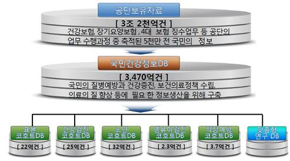

#### 표본연구 DB  {-}
* 표본을 추출하여 규격화해서 구축한 자료로, 연구목적의 연구자에게 공개(지정된 IP의 PC에서 원격 분석)하며, 종류는 다음과 같다.    

|구분|표본크기(천명)|구축기간|자료건수(천건)|내용|
|:---:|:---:|:---:|:---:|:-------------------|
|표본코호트 2.0 DB|1,011|2002~15(14개년)|2,174,397| ○ 의료급여수급권자 포함 전 국민을 대표하는 약 100만명의 표본연구DB(전 국민의 2%)|
|건강검진 코호트DB|515|2002~15(14개년)|2,554,326| ○ 2002년 기준 만40~79세의 건강검진 수검자 중심으로 의료이용, 검진결과 등을 분석할 수 있는 표본연구DB(모집단의 10%)|
|노인 코호트DB|558|2002~15(14개년)|2,749,045| ○ 2002년 기준 만60세 이상 노령층을 중심으로 구축한 표본연구DB(모집단의 10%)|
|영유아검진 코호트DB|84|2008~15(8개년)|233,688| ○ 2008~12년 출생자 중 영유아건강검진 1~2차를 한번 이상 수검한 영유아를 모집단으로 하여 각 연도별 5% 단순 무작위추출|
|직장여성 코호트DB|185|2007~15(9개년)|368,226| ○ 07.12월 말 기준 건강보험 자격 유지자 중 만 15~64세의 여성 직장가입자 약 360만명의 5% 무작위 추출|  

#### 표본코호트 2.0 DB  {-}

* 표본코호트 2.0DB는 약 100만 명에 대한 자료, 자료구성 대한 소개는 다음과 같다.

  

|||
|:---:|:-------------------|
|모집 기준|- 2006년 1년간 건강보험가입자 및 의료급여수급권자 자격을 유지한 전국민 대상|
|데이터 연도|- 2002년 ~ 2015년 (총 14년)|
|표본 추출 수|- 약 100만명|
|표본 추출 방법|- 전 국민 모집단의 2% 층화추출 (성별(2), 연령(17), 소득수준(21), 지역구분(3)을 층화변수로 층화하여 추출)|
|DB table 구성|- 전체 table      -주요 항목   |

#### 건강검진 코호트 DB  {-}

* 건강검진 코호트 DB는 약 515만 명에 대한 자료로, 자료구성 대한 소개는 다음과 같다.

|||
|:---:|:------------|
|모집 기준|- 2002~2003년 일반건강검진 수검자 중 40세-79세의 건강보험 자격유지자|
|데이터 연도|- 2002년 ~ 2015년 (총 14년)|
|표본 추출 수|- 약 51만 명|
|표본 추출 방법|- 모집단(약 515만 명)의 10% 단순무작위추출|
|자료 특징|- 전 국민이 검진 대상자가 되는 40세 이상을 대상으로 함|
|DB table 구성|- 주요 항목   |  

#### 노인 코호트 DB  {-}

노인 코호트는 60세 이상의 노인 약 56만 명에 대한 자료로, 자료구성 대한 소개는 다음과 같다.  

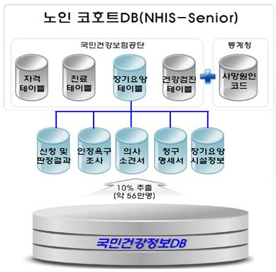

|||
|:---:|:------------|
|모집 기준|- 2002년 말에 건강보험 및 의료급여 자격을 유지하고 있는 만 60세 이상 노인|
|데이터 연도|- 2002년 ~ 2015년 (총 14년)|
|표본 추출 수|- 약 56만 명|
|표본 추출 방법|- 모집단(약 558만 명)의 10% 단순무작위추출|
|자료 특징|- 2008년부터 실시한 노인장기요양 이용정보를 포함하고 있음|
|DB table 구성||  

#### 영유아검진 코호트 DB  {-}

약 8만명의 자료가 담긴 영유아검진 코호트는 다음과 같다.  

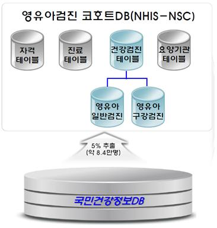

|||
|:---:|:------------|
|모집 기준|- 영유아검진 1~2차를 1회 이상 받은 전체 수검자 중 2008~2012년 출생자|
|데이터 연도|- 2008년 ~ 2015년 (총 8년)|
|표본 추출 수|- 약 8만 명|
|표본 추출 방법|- 모집단의 5% 단순무작위추출|
|자료 특징|- 영유아의 성장과 발달 상태를 단계별로 살펴볼 수 있음   - 총 10차(일반검진 7차, 구강검진 3차)에 걸친 건강검진 결과 자료   - 최초 구축된 대상자를 지속적으로 follow-up하여 출생부터 사망까지 분석 가능   - 추후 성인 건강검진 자료와 연계 예정|
|DB table 구성|- 주요 항목   |  

#### 직장여성 코호트 DB  {-}

직장여성 코호트 DB는 약 18.5만 명에 대한 자료로, 자료구성 대한 소개는 다음과 같다.

|||
|:---:|:------------|
|모집 기준|- 2007년 12월말 자격을 유지하고 있는 건강보험 15~64세 (여성)직장가입자|
|데이터 연도|- 2007년 ~ 2015년 (총 9년)|
|표본 추출 수|- 약 18.5만 명|
|표본 추출 방법|- 모집단(약 371만 명)의 5% 단순무작위추출 |
|자료 특징|- OECD에서 지정한 생산가능 인구 연령(15세~64세) 기준   - 취약계층 여성근로자가 다수 포함   - 직장여성들만이 가지는 건강행태와 질병 발생 등의 분석 가능   - 직장가입이력 제공으로 이직, 업종별 특성 등 다양한 형태로 분석 가능|
|DB table 구성|- 주요 항목   |  

#### 맞춤형연구 DB  {-}

* 연구 과제에 따라 연구자가 원하는 형태로 별도의 데이터셋을 구축하여 제공하는 연구용 DB  
* 맞춤형 건강정보자료를 열람 및 연구 분석할 수 있는 PC가 설치된 **공단 내의 장소인 “빅데이터 분석센터”**에서 통계분석 툴(Tool)을 이용하여 제공  
* 제공대상이 제한적
  - 국가기관 및 지방자치단체  
  - 「공공기관의 운영에 관한 법률」 제4조에 따른 공공기관  
  - 제1호 또는 제2호에 해당되지 않으면서 정책연구나 학술연구를 수행하는 기관 또는 사람  
  - 공단과 체결한 협약(MOU, Memorandum of understanding) 등에 따라 연구를 수행하는 기관 또는 사람  
  - 그 밖에 제1호부터 제4호에 해당하지 않으며 기타연구를 수행하는 기관 또는 사람  
* 원격 분석으로 제공되지 않는 다양한 자료 이용 가능 (사용 가능 변수목록 첨부)  
* 현재 연구실에서 진행 중인 공단 과제에서 이용 예정  

### 건강보험심사평가원(HIRA) 자료원  

#### HIRA 보유 자료  {-}
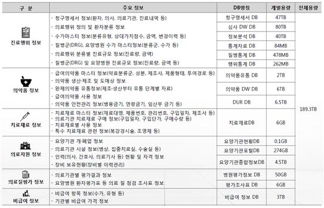  

#### 환자 표본자료 {-}
  

#### HIRA 청구 명세서 자료 구조  {-}
  

#### 제공 대상  {-}

* 국가, 지방자치단체 및 정부 산하기관  
* 연구 중심 병원 및 학술 연구 수행기관 등  
* 제공 범위  
  - **전 국민**의 건강보험 청구자료  
	- 보건의료 자료 제공 시 건강보험자료 범위 내에서 제공  
	- 맞춤형 자료 제공 시 심평원에서 제공 가능한 형태의 자료 제공  
* 제공 자료 선택  
	- 포털 사이트에서 상병, 약품, 행위에 대해 선택적으로 신청하여 이용 가능  
  - **2007년 1월 1일 ~ 2021년 6월 30일 명세서**까지 이용 가능 (2022년 1월 기준으로, 신청 전 문의하여 확인 필요)  

  

  

#### 환자 기본사항 선택  {-}
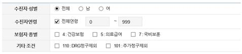  

#### DB table 구성  {-}

#### 공단과 심평원 자료 비교 {-}

|항목|공단 표본코호트 2.0 DB|심평원 표본자료| 공산, 심평원 맞춤형 자료|
|:---:|:--------|:--------|:--------|
|제공범위|- 100만 명 표본 코호트 데이터셋 (동일)   - 2002-2015년 자료 고정|- 100만 명 표본 데이터셋   - 2009년부터 2021년까지 연도별 표본 자료|- 신청하는 항목에 따라 제공받는 data가 다름 (기본적으로 전 국민 명세서)   - 환자 수가 적은 질환 등을 연구할 경우 공단 표본코호트보다 적합   - **비교적 최신자료까지 이용 가능**(현재 기준 2021년 6월 자료까지)|
|Data 구성|- **자격 및 보험료 테이블, 출생 및 사망테이블, 건강검진 테이블**이 별도로 존재   - 진료테이블을 의과, 치과, 한방, 약국을 구분하여 제공   - 원격 시스템 PC 내에서 SAS 지정 라이브러리 및 TABLE에 접근 불가 (오직 SAS 프로그램에서만 접근)|- 20, 30, 40, 53, 요양기관의 5개의 Table 제공   - 원격 시스템 PC 내에서 SAS 지정 라이브러리 및 TABLE에 접근 가능| 각 기관의 표본자료와 동일|
|이용환경|- AXGATE VPN Client 프로그램을 통하여 원격 시스템 접속   - 원격분석 시스템 접속 시 SMS 또는 OTP인증 필요   - ROOM은 하나를 배정 받았으나 각각 개별의 컴퓨터를 사용하므로 분석한 자료가 공유되지 않음   - 동시 접속 불가능 (로그오프까지 필요)   - 원격시스템 외부에서 내부로 **복사 및 붙여넣기 가능 (텍스트 및 엑셀 표 등)**   - 캡쳐 프로그램 이용 불가→ 우회적인 경로로 캡쳐 가능|- https://ras.hira.or.kr 웹사이트를 통하여 원격 시스템 접속   - 원격분석 시스템 접속 시 공인인증서 로그인 필요   - ROOM을 배정 받으면 한 컴퓨터를 최대 2인의 이용자가 **공유하여 쓰는 개념**   -  동시 접속 불가능   - 원격시스템 외부에서 내부로 복사 및 붙여넣기 불가능 → 반입 절차 필요   - **캡쳐 프로그램 이용 가능**|-공단: 센터를 직접 방문하여 분석   - 심평원: 표본자료와 마찬가지로 원격 접속으로 분석석
|비고|- SAS 확장편집기에 많은 내용을 입력하면 창이 느려지는 현상 발생   - 분석 자료의 과정 및 결과 공유가 안 되므로 고려하여 연구 계획 수립|- 원격 시스템 설치 과정이 다소 복잡함   - 접속 시 V3 개인 방화벽 OFF 필요|각 기관의 표본자료와 동일|

## IRB 신청

(1) http://www.e-irb.com/index.jsp 접속 → ‘기관 검색하기’ → ‘학교이름’ 검색→ ‘[대학] 학교이름’ 접속 후 로그인

	 
	
(2) 신청(보고) 작성 > 신규계획 
- 연구과제명 국문/영문 작성 (예시)

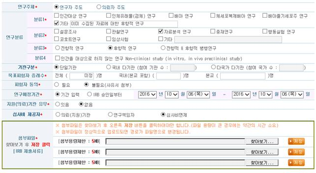

- 연구주체: 연구자 주도
- 연구분류 
  
  - 분류 1: 기타(이미 수집된 자료에 대한 후향적 연구)
  - 분류 2: 자료분석 연구        
  - 분류 3: 후향적 연구
- 기관구분: 연구별 상이 (학위논문일 경우 단일기관)
- 목표피험자 증례수: 전체 (미정) 명
- 피험자 동의: 불필요
- 연구예정기간: 연구별 상이
- 지원(의뢰)기관 유무: 연구별 상이(학위논문의 경우: 없음)
- 심사비 제공자: 심사비 면제
- 첨부파일: 제출해야하는 네 가지 파일을 압축하여 .zip파일로 업로드 후 저장
- 제출서류목록: 제출하신 서류 4가지에 대한 목록 작성
 ※ 신청서식.zip 파일의 서식 활용, 신청서식예시.zip 파일의 예시 참고하여 작성

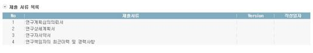

- 연구자요청사항: 
 [문의사항 발생 시 010-000-0000(제출자 휴대폰 번호), 또는 이메일(제출자 이메일)로 연락주세요.] 기재
  `-` ‘신청’ 클릭
  `-`  순수 연구 목적(학위논문)으로 건강보험심사평가원, 국민건강보험공단 데이터를 이용한 연구인 경우 대체로 신속심사로 진행되며, 업무일 기준 2주 정도 소요됩니다.

#### IRB 신청 확인 {-}
- 심사 조회> 리스트에서 본인이 신청한 ‘연구과제명’ 확인 후 ‘승인’상태인지 확인

#### 보고서 {-}
- 중간보고서는 연구승인기간 만료 2개월 전까지 작성해서 제출해야함
 : eIRB에 접속 후 신청(보고) 작성 → 중간보고에서 본인 연구과제 선택하여 작성한 보고서 첨부
-  1년 이상 연구가 진행될 경우 기간연장의 배경/목적 등 설명하는 내용을 ‘연구자요청사항’란에 약기하여 중간 보고서를 제출해야함: 승인될 경우 1년 단위로 연장이 가능함
-  종료/결과 보고서는 연구 종료 후 3개월 이내 종료/결과 보고서를 각각 구분하여 제출해야함

## 공단 및 심평원 자료신청 절차  

### 표본 코호트 2.0 DB  
- 신청 흐름도  

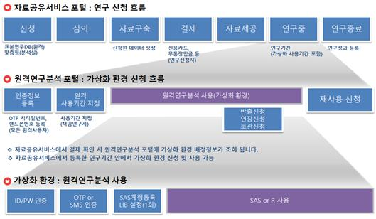

 

#### Step 1. 상세 신청 과정  {-}

* 자료원 신청은 **공단홈페이지 [https://nhiss.nhis.or.kr](https://nhiss.nhis.or.kr)에 접속**하여 회원가입 후 아래와 같은 절차를 따라 수행  

1) 상단에 데이터 신청 클릭 그 중 원하는 DB(예시로 표본연구DB) 클릭  
2) 좌측에 신청하기 클릭: (DB선택-> 신청서류작성-> 수령방법작성 -> 작성완료)  
3) 원하는 DB 선택 후 하위 내용 설정 (작성 후 하단에 신청서류작성 클릭)  
4) 신청서류작성 파트 작성  

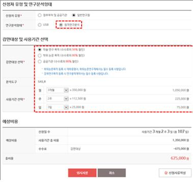  

* 신청에 필요한 준비 자료  
  - IRB 승인번호, 승인기간, 유효기간, IRB 연구계획서, IRB 결과통지서 필요  
  - 학위논문목적 등록 시 재학증명서 및 학위논문 연구계획서  
  - 정책연구목적 등록 시 연구용역계약서  
  - 연구과제요약서, 개인정보이용동의는 신청절차 중 양식을 다운받아 작성 후 업로드  

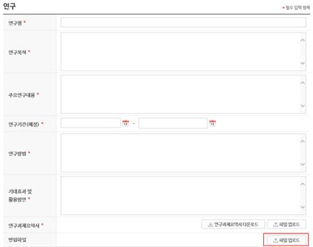  

   * 참고 사항  
      - 연구기간은 최대한 넓게 설정하는 것이 좋음(최대 IRB 승인 기간까지 가능하며, 원격 분석 사용 기간과 다름)  
      - 미리 작성해둔 코드나 더미테이블을 반입하기 위해 자료원 신청과정에서 미리 반입파일 등록이 필요. 신청과정 중 신청서류작성에 있으며 반입파일 항목에 파일업로드 (용량제한이 25MB로 있으니 가능한 압축을 통해 용량을 줄일 것)  

  5) 작성완료까지 작성 후 ‘본 내용을 충분히 검토하고 확인하였습니다’ 체크→ ‘공인인증 후 신청완료’ 클릭하여 공인인증 처리 후 신청완료  
  6) 신청 후 심의절차를 거치게 되는데 이는 우측 상단 ‘MY서비스’를 클릭하여 확인가능  
  7) ‘결제 대기 중’으로 바뀌면 상세화면으로 들어가 연구자별 서식(서약서, 보안각서, 보안서약서식) 다운로드 후 작성하여 ‘파일업로드’ → 온라인 비용 결제  

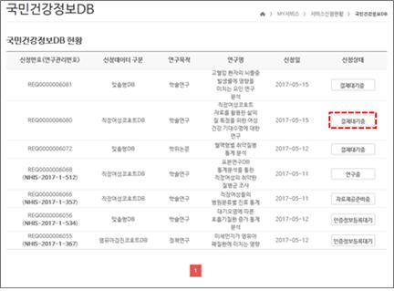  

  

  8) ‘결제 대기중’이 ‘사용기간신청대기’로 바뀌면 클릭해서 다시 ‘원격연구분석 포털 바로가기’클릭  
    → '인증정보등록’ 클릭해서 SMS인증을 통해서 등록  
    → ‘사용기간신청’을 클릭하여 원격연구 사용기간 설정  

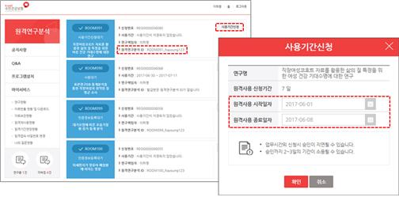  

 

#### **Step 2. 원격연구분석 프로그램** {-}  

1) 먼저 원격분석 프로그램을 다운받아야한다. 원격연구분석을 들어와 왼쪽에 있는 프로그램 설치를 클릭한다.  

[https://nhiss.nhis.or.kr/nhisr/bbs/pgm/pgmList.do](https://nhiss.nhis.or.kr/nhisr/bbs/pgm/pgmList.do)  

  

2) 2개 파일을 모두 설치했다면 SSL-VPN에 접속하기 위해 AXGATE VPN Client를 실행  
  → 원격연구 분석포털을 통해 신청한 아이디 비밀번호 입력  
  → SMS를 통해서 본인인증절차 수행  

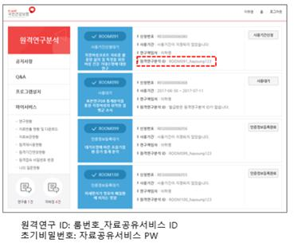  

* 공단 AXGATE VPN setup

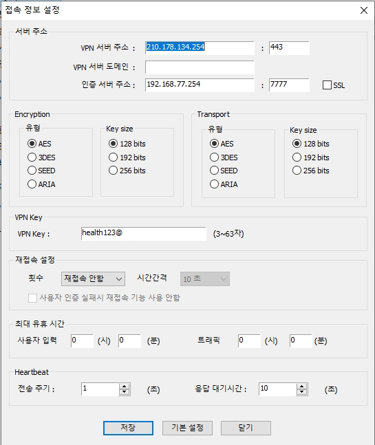

   1). 가상머신(Virtual Machine)이 실행 → SAS Enterprise Guide 7.1 선택  
   → data_source 라이브러리의 데이터셋을 활용하여 분석 수행  

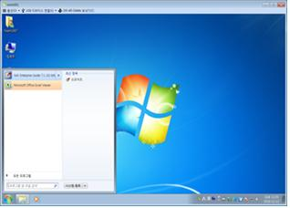  

* 공단 표본 원격 SAS EG profile setup

* 전수자료는 센터내에 비치되어 있는 메뉴얼 참조

   2). data_source의 데이터셋을 선택한 후 마우스 오른쪽 버튼클릭 → 복사 → working라이브러리에 붙여넣기 → working 라이브러리에서 분석실시     → 분석 완료 후 최종산출물에 대하여 data_out 라이브러리로 복사  

3) ※주의사항  
  1). 원격연구분석서비스 이용관련 정보는 **원격연구분석포털(https://rdata.nhis.or.kr)** 에서 확인  
  2). 인증정보등록은 원격연구를 신청한 모든 사용자(책임연구자, 공동연구자 등)가 등록해야 합니다.  
  3). 해당 연구의 책임연구자가 원격연구 사용기간을 신청 하실 수 있습니다.  
  **4). 원격연구 사용기간은 연구기간을 초과하여 신청하실 수 없습니다.**  
  5). 가상환경 사용자 초기 비밀번호는 국민건강보험 공유서비스 비밀번호와 같습니다.  

 

#### **Step 3. 반출** {-}  

1.  반출신청을 하기 전에 가상화 환경에 반출신청을 원하는 데이터를 data_out폴더에 옮겨야 함  
  ● 폴더를 임의로 생성하는 것이 아닌 SAS 프로그램 내에서 라이브러리로 지정  
  ● ex) ROOM053을 사용하는 사용자의 반출 라이브러리 지정 SAS 코드libname data_out "/userdata06/room053/data_out/data_out";  
  ● SAS 프로그램 내에서 생성된 폴더에 반출할 파일을 드래그 앤 드롭  

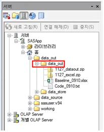  

2. 아래와 같이 반출신청을 클릭 → data_out 폴더에 옮긴 반출파일명을 입력  
  **※ 반드시 가상화 환경에 있는 파일과 동일한 파일명을 입력해야함**   
  **※ 파일명에 특수문자 및 공백이 있을 시 미승인 처리되므로 주의**  

  

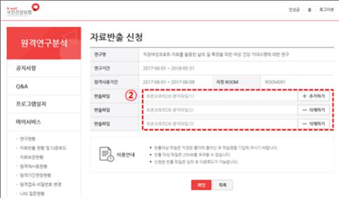  

3. 자료반출 현황 및 다운로드에서 자료반출 승인여부 확인가능  
  → 승인이 되면 반출파일 다운로드 가능  

  

 

#### **Step 4. 연장신청** {-} 

1. 해당 연구의 ‘연장신청’ 항목 클릭 → 사용기간선택 및 확인 → 결제  

  

2. 유의사항  
  ● **원격연구 사용 중일 때 연장 신청 가능**  
  ● **연장 신청 후** 고지서 발행(2~3일 소요)이 된 다음에 결제가 가능하므로, 사용 종료 시점 이전에 여유를 두고 연장 신청  
  ● 계좌이체는 확인에 시일이 다소 소요되므로 종료 10일 이전 연장 신청 권장  
  ● 카드결제는 사용기간 마지막 날에도 가능  
  ● 사용 종료 후 일정 기간 동안은 재신청을 통해 원격연구 사용이 가능하나, 새로운 ROOM을 배정 받는 방식이므로 기존의 data를 사용하지 못함  
    → ‘보관신청’을 이용하여 이어서 연구 가능  

 

#### **Step 5. 보관신청**  {-}

* 아래와 같은 절차를 통해 보관 신청 가능  

  

 

#### **Step 6. 재사용 신청**  {-}

1. 아래와 같은 절차를 통해 재사용 신청 가능  

  

2. 재사용 시 사용할 반입파일 첨부 가능  

 

### 심평원 DB

- 신청 흐름도  

1). 포털사이트 Ver.  

  

2). 사용자 매뉴얼 ver.  

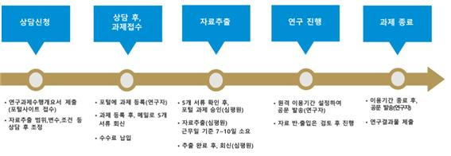  

 

#### **Step 1. 상담신청**  {-}

1. 보건의료빅데이터개방시스템 (http://opendata.hira.or.kr/) 접속  
2. ‘의료빅데이터 > 빅데이터분석 이용신청’ 클릭  

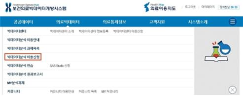  

3. 빅데이터분석 이용신청 STEP에 따라 과제 정보 및 연구자 정보 기입  

  

4. 과제 정보는 **IRB 연구계획서를 참고**하여 작성하면 수월함  

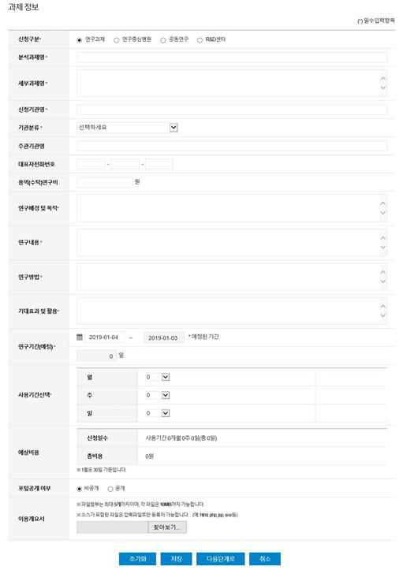  

5. 과제에 참여하는 연구원들은 모두 해당 포털의 ID 필요  
6. STEP 03 자료요청  

1). 순서에 따라 연구에 필요한 변수 항목들을 체크하며 진행  

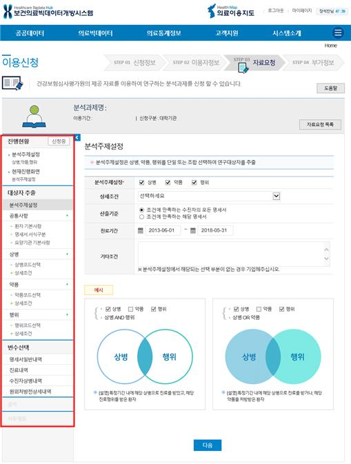 

   2). 모든 항목의 작성이 완료되면 아래와 같은 팝업 생성  
   3). ‘상담신청’버튼을 눌러야 담당자에게 상담신청이 완료  
→ ‘상담신청’버튼을 누른 뒤에는 담당자가 검토하기 전까지 **수정 불가**  

  

7. 심평원 담당자의 검토 후 수정사항 또는 문의사항이 있을 경우 유선으로 연락이 옴  
→ 검토 및 수정 완료 후 담당자가 메일로 회신  

  

8. 서류제출  

1). 상담 완료 메일 수신 후 서류제출 버튼 활성화  

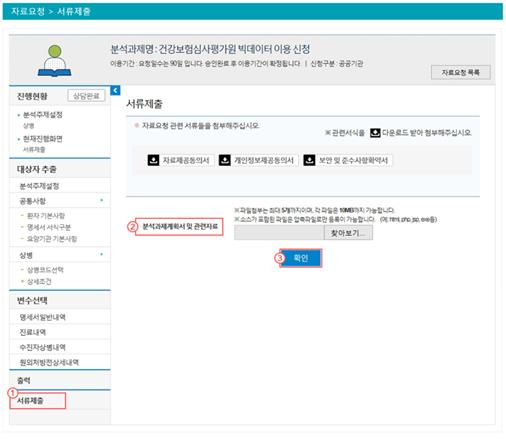  

2). 분석과제계획서 및 관련 자료 업로드  
3). **필수 서류**: 자료요청 공문, 연구과제수행개요서, IRB 승인 심의서, 보안 및 준수사항 확약서, IRB 승인된 연구계획서  
4). 관련 서류 양식은 http://opendata.hira.or.kr/or/orb/useGdInfo.do#none 에서 다운로드 가능  

9. 포털의 ‘MY분석과제’에서 진행 상황 조회 가능  

  

 

#### **Step 2. 심평원에 자료 요청 공문 발송**  {-}

1. 공문 발송 요청  

  

 

#### **Step 3. '자료요청에 대한 회신 및 수수료 납입' 메일 확인**  {-}

  

 1. 메일에 포함된 내용 및 사용자 매뉴얼 숙지 필수!  

2. 계산서 발행 요청해야 비용처리 가능 (산학협력단 사업자등록증 필요)  

 

#### **Step 4. 수수료 납입 및 이용자 현황 공문 발송**  {-}

1. ‘자료 요청에 대한 회신 및 수수료 납입 안내’ 공문 내용  

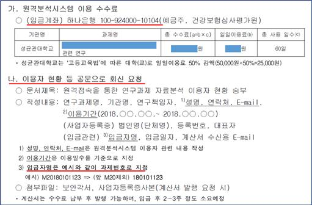  

 1). 수수료 납입은 계좌 이체만 가능  
 2). 납입 시 입금자 명은 과제번호 뒤 9자리 숫자로 변경하여 입금  
 3). 입금 후 **입금 정보에 대한 메일 발송 필요 (계산서 발행 요청 포함)**  
 4). **이용자 현황 공문과 보안각서 메일 발송**  

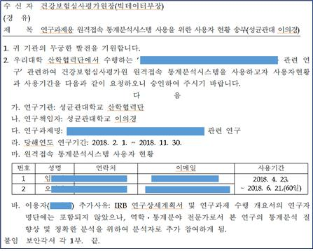  

 

#### **Step 5. 포털에 이용자 등록 및 보안각서 업로드**  {-}

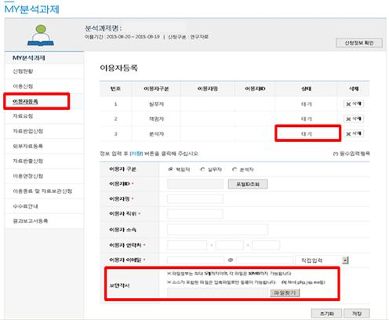  

 

#### **Step 6. 원격 접속 시스템 ID 발급**  {-}

1. 반드시 원격분석시스템을 이용하는 PC에서 신청  
2. 가상화신청까지 완료 후, 담당자(033-739-1059)에게 유선 연락하여 추가 승인 후 접속 가능  

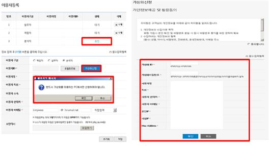  

 

#### **Step 7. 원격접속 통계분석시스템 (https://ras.hira.or.kr/)**  {-}

1. 가상화ID 신청 후, 원격접속 통계분석시스템(https:/ras.hira.or.kr)에 접속하여 인증서 발급  
2. 인증서 발급 완료 후, 가상화ID와 인증서를 통해 원격접속통계분석시스템에 접속  

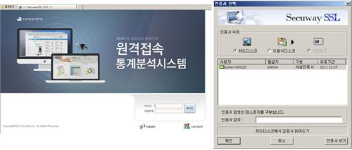  

3. 원격접속 통계분석시스템 설치→ 팝업 뜨는 항목들 모두 허용 및 설치  

4. **설치 과정에서 어려움이 있을 경우 매뉴얼 참조 및 031-290-4386 으로 문의**  

5. 가상화 PC 접속 및 이용  

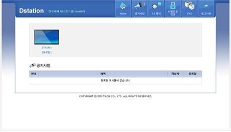  

* 심평원 표본과 전수 원격 SAS EG profile setup

 

#### **Step 8. 자료반입 신청 (http://opendata.hira.or.kr/)**  {-}

1. ‘MY분석과제’ 탭에서 반입신청 가능
2. 반려 사유가 없을 시, **만 2일 이내**에 승인

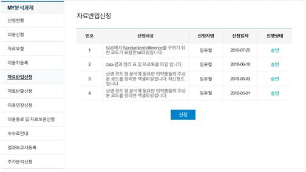  

#### **Step 9. 자료반출 신청 (http://opendata.hira.or.kr/)**  {-}

1. ‘MY분석과제’ 탭에서 반출신청 가능  
2. 원격접속 통계분석시스템의 G: dataout 폴더에 삽입한 파일들이 ‘가상PC파일목록’에 뜨므로 반출을 원하는 파일들을 체크하여 신청  
3. 공공데이터반출신청서 다운로드 후 작성하여 ‘관련자료’에 업로드  
4. 신청사유는 적당히 성의껏 작성 (너무 간단하면 반려)  
5.  환자식별코드(JID) 등이 포함된 자료일 경우 무조건 반려  
6. 반려사유가 없을 시, 반출에는 **3~5일**정도 소요  

  

 

#### **Step 10. 이용연장신청 (http://opendata.hira.or.kr/)**  {-}

1. ‘MY분석과제’ 탭에서 이용연장신청 가능  

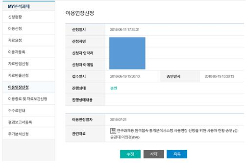  

2.  연장신청은 원격이용 종료 10일 이내에 공문으로 신청  
→ 공문 발행까지 소요되는 시간을 고려하면 연장 여부는 종료 2주전까지 결정 권장  
3. **사용연장 신청을 위한 공문** 필요  

4. 수수료 납입 안내 메일 회신 후 수수료 납입  

 

#### **Step 11. 자료이용 종료 및 보관**  {-}

1. ‘MY분석과제’ 탭에서 신청 가능  
2. **원격접속시스템 이용종료 및 자료보관 요청에 관한 공문**을 발송  
3. **10GB 이하** 파일의 자료를 보관 요청 가능  
4. **이용기간이 종료된 후 1주일 안으로 종료공문 회신**  
회신이 없을 경우는 자료를 삭제해도 되는 것으로 판단하여 삭제 처리  

 

#### **Step 13. 추가분석 신청** {-} 

1. ‘MY분석과제’ 탭에서 신청 가능  
2. **이용시작 최소 15일 전에 공문**으로 신청
3. 업무 흐름  
추가분석 공문요청(연구자) -> 수수료납입 공문 통보(심평원) -> 수수료 납입(연구자)  
-> 이용기간설정* 공문(연구자) -> 승인(심평원)  

<!------------------------->