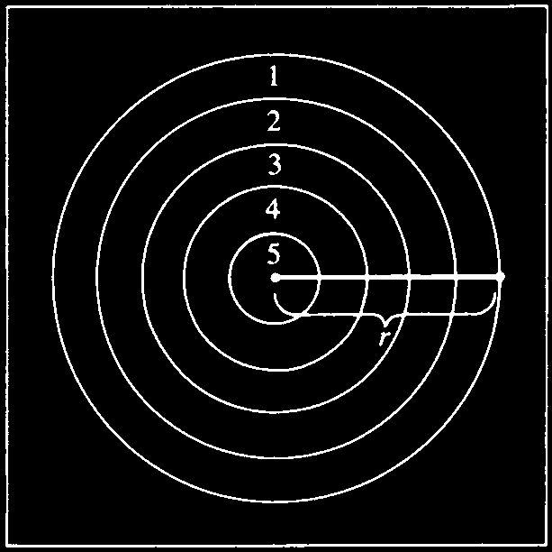
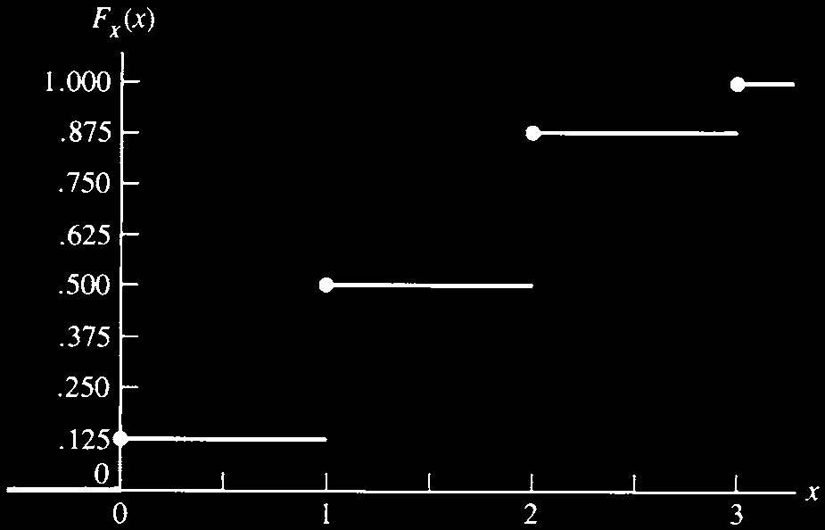
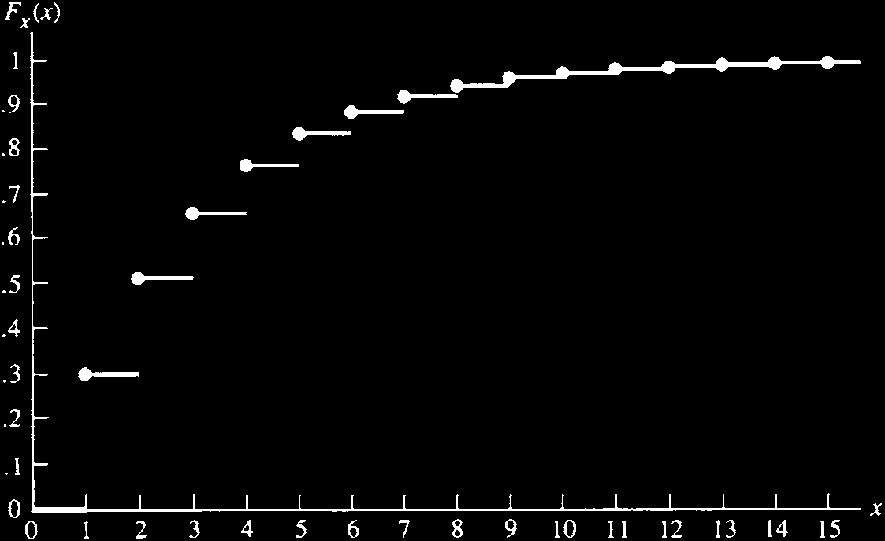
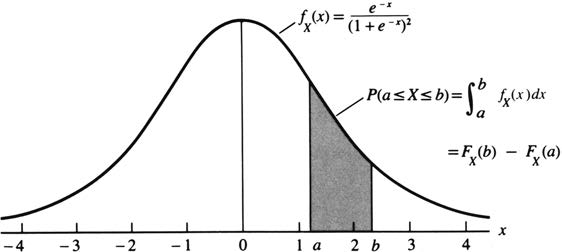

# 확률이론

> “개별 사람이 무엇을 할지는 예측할 수 없지만, 평균적인 다수가 무엇을 할지는 정확하게 말할 수 있다. 개인은 변하지만, 비율은 일정하다. 통계학자는 그렇게 말한다.”  
> — Sherlock Holmes, *The Sign of Four*

- 확률이론은 모집단, 실험, 임의 현상(random phenomenon)을 수학적으로 모형화하는 언어이다. 통계학자는 이러한 모형을 통해 전체 모집단을 모두 관찰하지 않고도 일부 관찰값으로부터 모집단에 대한 추론을 수행한다. 역사적으로 확률이론은 17세기 도박 확률 문제에서 비롯되었고, Pascal과 Fermat가 Chevalier de Méré의 질문에 답하는 과정에서 수학적 형태를 갖추기 시작했다.

- 이 장의 목적은 확률이론 전체를 완전하게 소개하는 것이 아니라, 이후 통계학을 공부하는 데 필수적인 기본 개념을 정리하는 것이다. 통계학이 확률이론 위에 세워지듯이, 확률이론은 집합론 위에 세워진다. 따라서 첫 번째 주제는 집합론이다.

## 집합론

### 표본공간

- 통계학자의 주요 목표 중 하나는 실험을 통해 대상 집단에 대한 결론을 이끌어내는 것이다. 이를 위해 가장 먼저 해야 할 일은 가능한 모든 결과를 명확히 정하는 것이다.

::: {.callout-note}
## 정의: 표본공간
- 특정 실험에서 가능한 모든 결과의 집합 $S$를 그 실험의 **표본공간(sample space)**이라고 한다.
:::

- 예를 들어 동전을 한 번 던지는 실험의 표본공간은 앞면과 뒷면 두 결과로 이루어진다.

$$
S=\{H,T\}.
$$

- 무작위로 선택된 학생의 SAT 점수를 관찰하는 실험에서 점수가 200부터 800까지 10점 단위라고 하면 표본공간은 다음과 같다.

$$
S=\{200,210,220,\ldots,780,790,800\}.
$$

- 어떤 자극에 대한 반응시간을 관찰한다면, 반응시간은 양수 전체로 볼 수 있으므로 표본공간은 다음과 같이 둘 수 있다.

$$
S=(0,\infty).
$$

- 표본공간은 원소 수에 따라 크게 **가산(countable)** 또는 **비가산(uncountable)**으로 나눌 수 있다. 표본공간의 원소들을 정수의 부분집합과 일대일 대응시킬 수 있으면 가산이다. 원소가 유한개이면 당연히 가산이다. 동전 던지기와 SAT 점수 예시는 유한한 가산 표본공간이다. 반면 양의 실수 전체인 반응시간 표본공간은 비가산이다. 다만 반응시간을 초 단위로 반올림하여 측정하면 표본공간은 $S=\{0,1,2,3,\ldots\}$가 되어 가산이 된다.

- 가산과 비가산의 구분은 확률을 부여하는 방법에 영향을 준다. 현실에서는 무한한 정확도로 측정할 수 없으므로 철학적으로는 모든 실제 표본공간이 가산이라고 주장할 수도 있다. 그러나 비가산 표본공간에 기반한 확률·통계 방법은 수학적으로 더 간결하고 실제 가산 상황을 잘 근사하기 때문에 매우 중요하다.

### 사건과 집합 연산

::: {.callout-note}
## 정의: 사건
**사건(event)**은 실험에서 가능한 결과들의 모임, 즉 표본공간 $S$의 부분집합이다. $S$ 자체도 사건이다.
:::

- 사건 $A$가 발생했다는 말은 실험 결과가 집합 $A$에 속한다는 뜻이다. 확률을 말할 때는 보통 “집합의 확률”보다는 “사건의 확률”이라고 하지만, 두 용어는 이 장에서 거의 같은 의미로 사용된다.

- 두 집합의 포함과 같음은 다음과 같이 정의한다.

$$
A\subset B \Longleftrightarrow x\in A \Rightarrow x\in B,
$$

$$
A=B \Longleftrightarrow A\subset B \text{ and } B\subset A.
$$

- 두 사건 $A$, $B$에 대해 다음의 기본 집합 연산을 사용한다.

- **합집합(union)**: $A\cup B$는 $A$ 또는 $B$ 또는 둘 모두에 속하는 원소들의 집합이다.

$$
A\cup B=\{x:x\in A \text{ or } x\in B\}.
$$

- **교집합(intersection)**: $A\cap B$는 $A$와 $B$에 동시에 속하는 원소들의 집합이다.

$$
A\cap B=\{x:x\in A \text{ and } x\in B\}.
$$

- **여집합(complement)**: $A^c$는 $A$에 속하지 않는 모든 원소들의 집합이다.

$$
A^c=\{x:x\notin A\}.
$$

::: {.callout-tip}
## 예제: 사건 연산
표준 카드 한 벌에서 카드 한 장을 무작위로 뽑고 그 무늬를 기록한다고 하자. 가능한 무늬는 클럽 $C$, 다이아몬드 $D$, 하트 $H$, 스페이드 $S$이므로

$$
S=\{C,D,H,S\}.
$$

사건을

$$
A=\{C,D\},\qquad B=\{D,H,S\}
$$

라고 하면,

$$
A\cup B=\{C,D,H,S\}=S,
$$

$$
A\cap B=\{D\},
$$

$$
A^c=\{H,S\}.
$$

또한 $(A\cup B)^c=\emptyset$이다. 여기서 $\emptyset$은 원소가 하나도 없는 공집합이다.
:::

### 집합 연산의 법칙

집합 연산은 덧셈과 곱셈처럼 결합하여 사용할 수 있다. 다음 정리는 이후 확률 계산에서 계속 쓰인다.

::: {.callout-important}
## 정리: 집합 연산의 기본 법칙
표본공간 $S$ 위에 정의된 임의의 세 사건 $A$, $B$, $C$에 대해 다음이 성립한다.

**교환법칙**

$$
A\cup B=B\cup A,\qquad A\cap B=B\cap A.
$$

**결합법칙**

$$
A\cup(B\cup C)=(A\cup B)\cup C,
$$

$$
A\cap(B\cap C)=(A\cap B)\cap C.
$$

**분배법칙**

$$
A\cap(B\cup C)=(A\cap B)\cup(A\cap C),
$$

$$
A\cup(B\cap C)=(A\cup B)\cap(A\cup C).
$$

**드모르간 법칙**

$$
(A\cup B)^c=A^c\cap B^c,
$$

$$
(A\cap B)^c=A^c\cup B^c.
$$
:::

- 정리를 증명할 때 벤 다이어그램은 직관을 제공하지만 엄밀한 증명은 아니다. 두 집합이 같음을 보이려면 한쪽이 다른 쪽에 포함되고, 반대로 다른 쪽도 한쪽에 포함됨을 보여야 한다.

- 예를 들어 분배법칙

$$
A\cap(B\cup C)=(A\cap B)\cup(A\cap C)
$$

을 증명하려면 먼저 $x\in A\cap(B\cup C)$라고 둔다. 그러면 $x\in A$이고 동시에 $x\in B$ 또는 $x\in C$이다. 따라서 $x\in A\cap B$ 또는 $x\in A\cap C$이므로 $x\in (A\cap B)\cup(A\cap C)$이다. 반대 방향도 같은 방식으로 보인다.

### 무한 합집합과 무한 교집합

- 집합 연산은 무한한 개수의 집합에도 확장된다. $A_1,A_2,A_3,\ldots$가 모두 표본공간 $S$ 위에 정의된 집합이면,

$$
\bigcup_{i=1}^{\infty}A_i=\{x\in S:x\in A_i\text{ for some }i\},
$$

$$
\bigcap_{i=1}^{\infty}A_i=\{x\in S:x\in A_i\text{ for all }i\}.
$$

- 예를 들어 $S=(0,1]$이고 $A_i=[1/i,1]$라고 하자. 그러면

$$
\bigcup_{i=1}^{\infty}A_i=(0,1],
$$

$$
\bigcap_{i=1}^{\infty}A_i=\{1\}.
$$

- 비가산 개수의 집합에 대해서도 합집합과 교집합을 정의할 수 있다. $\Gamma$가 지표집합이면,

$$
\bigcup_{a\in\Gamma}A_a=\{x\in S:x\in A_a\text{ for some }a\},
$$

$$
\bigcap_{a\in\Gamma}A_a=\{x\in S:x\in A_a\text{ for all }a\}.
$$

- 예를 들어 $\Gamma$를 모든 양의 실수의 집합으로 두고 $A_a=(0,a]$라고 하면 $\bigcup_{a\in\Gamma}A_a=(0,\infty)$이다.

### 서로소와 분할

::: {.callout-note}
## 정의: 서로소
두 사건 $A$와 $B$가

$$
A\cap B=\emptyset
$$

을 만족하면 서로소(disjoint) 또는 상호배반(mutually exclusive)이라고 한다. 사건열 $A_1,A_2,\ldots$가 모든 $i\ne j$에 대해

$$
A_i\cap A_j=\emptyset
$$

이면 쌍별 서로소(pairwise disjoint)라고 한다.
:::

- 예를 들어 $A_i=[i,i+1)$, $i=0,1,2,\ldots$는 서로 겹치지 않는 집합들의 모임이다. 또한

$$
\bigcup_{i=0}^{\infty}A_i=[0,\infty)
$$

이다.

::: {.callout-note}
## 정의: 분할
$A_1,A_2,\ldots$가 쌍별 서로소이고

$$
\bigcup_{i=1}^{\infty}A_i=S
$$

이면, $A_1,A_2,\ldots$는 $S$의 **분할(partition)**을 이룬다고 한다.
:::

- 분할은 표본공간을 서로 겹치지 않는 작은 조각으로 나누기 때문에 조건부 확률, 전체확률법칙, 베이즈 정리에서 매우 중요하다.

## 확률이론의 기초

- 실험을 수행하면 표본공간의 어떤 원소 하나가 실현된다. 같은 실험을 반복하면 어떤 결과는 자주 나타나고 어떤 결과는 드물게 나타난다. 이러한 “발생 빈도”는 확률의 직관적 해석이 될 수 있다.

- 이 절에서는 확률을 빈도로 정의하지 않고, 수학적으로 더 간단한 **공리적 접근(axiomatic approach)**을 사용한다. 공리적 접근은 확률이 실제로 무엇을 의미하는가보다, 확률함수가 어떤 규칙을 만족해야 하는가에 초점을 둔다.

### 공리적 기초

- 각 사건 $A$에 대해 $0$과 $1$ 사이의 수 $P(A)$를 대응시키고, 이를 $A$의 확률이라고 부르고 싶다. 그러나 비가산 표본공간에서는 모든 부분집합에 확률을 부여하는 데 기술적 문제가 생긴다. 그래서 확률을 정의할 사건들의 모임인 시그마 대수(sigma algebra)를 사용한다.

::: {.callout-note}
## 정의: 시그마 대수
$S$의 부분집합들의 모임 $\mathcal B$가 다음 세 조건을 만족하면 $\mathcal B$를 **시그마 대수(sigma algebra)** 또는 보렐 필드(Borel field)라고 한다.

1. $\emptyset\in\mathcal B$.
2. $A\in\mathcal B$이면 $A^c\in\mathcal B$이다.
3. $A_1,A_2,\ldots\in\mathcal B$이면 $\bigcup_{i=1}^{\infty}A_i\in\mathcal B$이다.
:::

$\emptyset\in\mathcal B$이고 $S=\emptyset^c$이므로 $S$도 항상 $\mathcal B$에 속한다. 또한 드모르간 법칙에 의해 시그마 대수는 가산 교집합에 대해서도 닫혀 있다.

$$
\left(\bigcup_{i=1}^{\infty} A_i^c\right)^c
=
\bigcap_{i=1}^{\infty} A_i.
$$

$S$가 유한 또는 가산이면 보통

$$
\mathcal B=\{S\text{의 모든 부분집합}\}
$$

으로 둔다. 예를 들어 $S=\{1,2,3\}$이면 $\mathcal B$에는 $2^3=8$개의 집합이 들어 있다.

$$
\{1\},\{2\},\{3\},\{1,2\},\{1,3\},\{2,3\},\{1,2,3\},\emptyset.
$$

- 실수 전체 $S=(-\infty,\infty)$를 표본공간으로 쓰는 경우에는 $[a,b]$, $(a,b]$, $(a,b)$, $[a,b)$ 같은 구간과 그 구간들로부터 가산 합집합과 가산 교집합을 통해 만들어지는 집합들을 포함하도록 $\mathcal B$를 선택한다.

::: {.callout-note}
## 정의: 확률함수
표본공간 $S$와 시그마 대수 $\mathcal B$가 주어졌을 때, 정의역이 $\mathcal B$인 함수 $P$가 다음을 만족하면 $P$를 **확률함수(probability function)**라고 한다.

1. 모든 $A\in\mathcal B$에 대해 $P(A)\ge 0$.
2. $P(S)=1$.
3. $A_1,A_2,\ldots\in\mathcal B$가 쌍별 서로소이면,

$$
P\left(\bigcup_{i=1}^{\infty}A_i\right)
=
\sum_{i=1}^{\infty}P(A_i).
$$
:::

- 이 세 조건을 **확률의 공리**, 또는 Kolmogorov 공리라고 한다. 이 공리는 어떤 확률함수를 선택해야 하는지 알려주지는 않는다. 다만 선택된 함수가 확률함수라고 불리려면 이 조건들을 만족해야 한다고 말한다.

::: {.callout-tip}
## 예제: 공정한 동전
공정한 동전 던지기에서 $S=\{H,T\}$이다. 공정하다는 물리적·직관적 가정으로부터

$$
P(\{H\})=P(\{T\})
$$

라고 둔다. 또한 $S=\{H\}\cup\{T\}$이고 두 사건은 서로소이므로

$$
P(\{H\})+P(\{T\})=1.
$$

따라서

$$
P(\{H\})=P(\{T\})=\frac12.
$$

중요한 점은 $P(\{H\})=P(\{T\})$가 확률 공리 자체에서 나온 것이 아니라, 동전이 공정하다는 실험에 대한 지식에서 나온다는 것이다.
:::

::: {.callout-important}
## 정리: 유한 또는 가산 표본공간에서 확률함수 만들기
$S=\{s_1,\ldots,s_n\}$가 유한집합이고 $p_1,\ldots,p_n$이 음이 아닌 수이며

$$
\sum_{i=1}^{n}p_i=1
$$

이라고 하자. $A\in\mathcal B$에 대해

$$
P(A)=\sum_{\{i:s_i\in A\}}p_i
$$

로 정의하면 $P$는 확률함수이다. 이 결과는 $S=\{s_1,s_2,\ldots\}$인 가산 표본공간에도 성립한다.
:::

- 증명의 핵심은 각 $p_i$가 음이 아니므로 $P(A)\ge 0$이고, 전체 표본공간에 대해서는 모든 $p_i$를 더하므로 $P(S)=1$이며, 서로소 사건들의 합집합에서는 같은 $p_i$가 중복 없이 정확히 한 번씩 더해진다는 점이다.

::: {.callout-tip}
## 예제: 다트 게임
다트판을 맞힌다고 가정하고, 다트가 특정 영역을 맞힐 확률이 그 영역의 넓이에 비례한다고 하자. 다트판의 반지름을 $r$이라 하고, 각 고리 사이의 간격이 $r/5$라고 하자. $i$점을 얻을 확률은

$$
P(\text{scoring }i\text{ points})
=\frac{\text{area of region }i}{\text{area of dart board}}.
$$

예를 들어 1점을 얻는 영역은 가장 바깥쪽 고리이므로

$$
P(\text{scoring }1\text{ point})
=\frac{\pi r^2-\pi(4r/5)^2}{\pi r^2}
=1-\left(\frac45\right)^2.
$$

일반적으로

$$
P(\text{scoring }i\text{ points})
=
\frac{(6-i)^2-(5-i)^2}{5^2},
\qquad i=1,\ldots,5.
$$
:::

::: {.figure}

:::

- 확률 공리 중 세 번째인 가산가법성은 모든 통계학자가 철학적으로 동의하는 것은 아니다. de Finetti 학파는 가산가법성 대신 유한가법성을 사용한다.

$$
A\cap B=\emptyset \quad\Longrightarrow\quad P(A\cup B)=P(A)+P(B).
$$

- 유한가법성은 더 단순해 보이지만, 통계이론에서는 예상치 못한 복잡성을 만들 수 있다. 이 교재에서는 표준적인 Kolmogorov 확률론을 따라 가산가법성을 가정한다.

### 확률 계산법

확률의 공리로부터 여러 유용한 성질을 도출할 수 있다.

::: {.callout-important}
## 정리: 한 사건에 대한 기본 성질
$P$가 확률함수이고 $A\in\mathcal B$이면 다음이 성립한다.

1. $P(\emptyset)=0$.
2. $P(A)\le 1$.
3. $P(A^c)=1-P(A)$.
:::

증명의 핵심은 $A$와 $A^c$가 $S$의 분할을 이룬다는 점이다.

$$
S=A\cup A^c,
\qquad A\cap A^c=\emptyset.
$$

따라서

$$
1=P(S)=P(A\cup A^c)=P(A)+P(A^c),
$$

즉 $P(A^c)=1-P(A)$이다.

::: {.callout-important}
## 정리: 두 사건에 대한 기본 성질
$P$가 확률함수이고 $A,B\in\mathcal B$이면 다음이 성립한다.

1. $P(B\cap A^c)=P(B)-P(A\cap B)$.
2. $P(A\cup B)=P(A)+P(B)-P(A\cap B)$.
3. $A\subset B$이면 $P(A)\le P(B)$.
:::

특히 두 사건의 합집합 공식은 겹치는 부분을 한 번 빼 주는 포함-배제 원리의 가장 기본 형태이다.

$$
P(A\cup B)=P(A)+P(B)-P(A\cap B).
$$

또한 $P(A\cup B)\le 1$이므로 다음의 Bonferroni 부등식을 얻는다.

$$
P(A\cap B)\ge P(A)+P(B)-1.
$$

::: {.callout-tip}
## 예제: Bonferroni 부등식
두 사건 $A$, $B$가 각각 확률 $0.95$를 갖는다고 하자. 그러면 두 사건이 동시에 발생할 확률은 적어도

$$
P(A\cap B)\ge 0.95+0.95-1=0.90
$$

이다. 개별 사건의 확률이 충분히 크지 않으면 이 하한은 음수가 되어 실제 정보는 거의 주지 못하지만, 부등식 자체는 항상 옳다.
:::

::: {.callout-important}
## 정리: 분할과 Boole 부등식
$P$가 확률함수이면 다음이 성립한다.

1. $C_1,C_2,\ldots$가 표본공간의 분할이면,

$$
P(A)=\sum_{i=1}^{\infty}P(A\cap C_i).
$$

2. 임의의 사건열 $A_1,A_2,\ldots$에 대해,

$$
P\left(\bigcup_{i=1}^{\infty}A_i\right)
\le
\sum_{i=1}^{\infty}P(A_i).
$$

이를 **Boole 부등식**이라고 한다.
:::

- Boole 부등식과 Bonferroni 부등식은 서로 밀접하다. 유한한 $n$개의 사건에 대해 다음의 더 일반적인 Bonferroni 하한을 얻을 수 있다.

$$
P\left(\bigcap_{i=1}^{n}A_i\right)
\ge
\sum_{i=1}^{n}P(A_i)-(n-1).
$$

### 세기

유한 표본공간에서 모든 결과가 같은 확률을 갖는 경우, 확률 계산은 “몇 가지 경우가 가능한가”를 세는 문제로 바뀐다.

::: {.callout-tip}
## 예제: 복권
뉴욕 주 복권에서는 $1,2,\ldots,44$ 중에서 여섯 개의 숫자를 고른다고 하자. 당첨 확률을 계산하려면 먼저 44개의 숫자 중 서로 다른 6개 숫자를 고르는 방법의 수를 세어야 한다.
:::

::: {.callout-tip}
## 예제: 토너먼트
16명이 참가하는 단판 탈락 토너먼트에서 특정 선수가 우승하기까지 만나는 상대들의 순서를 “경로”라고 하자. 이 선수가 우승할 수 있는 가능한 경로의 수를 세는 것도 세기 문제이다.
:::

::: {.callout-important}
## 정리: 세기의 기본원리
어떤 일이 $k$개의 별도 작업으로 이루어지고, $i$번째 작업을 수행하는 방법이 $n_i$가지이면, 전체 일을 수행하는 방법의 수는

$$
n_1\times n_2\times\cdots\times n_k
$$

이다.
:::

세기 문제에서는 두 가지 구분이 특히 중요하다.

1. **복원추출(with replacement)**인지 **비복원추출(without replacement)**인지.
2. **순서가 중요한지(ordered)** 또는 **순서가 중요하지 않은지(unordered)**.

::: {.callout-note}
## 정의: 팩토리얼
양의 정수 $n$에 대해

$$
n!=n(n-1)(n-2)\cdots 3\cdot2\cdot1
$$

로 정의한다. 또한

$$
0!=1
$$

로 정의한다.
:::

- 44개의 숫자 중 6개를 고르는 복권 예시를 네 가지 경우로 나누면 다음과 같다.

1. **순서 있음, 비복원**

$$
44\times43\times42\times41\times40\times39
=
\frac{44!}{38!}.
$$

2. **순서 있음, 복원**

$$
44^6.
$$

3. **순서 없음, 비복원**

$$
\frac{44\times43\times42\times41\times40\times39}{6!}
=
\frac{44!}{6!38!}.
$$

::: {.callout-note}
## 정의: 조합
음이 아닌 정수 $n,r$에 대해 $n\ge r$이면,

$$
\binom{n}{r}=\frac{n!}{r!(n-r)!}
$$

로 정의한다. 이를 “$n$ choose $r$”라고 읽는다.
:::

4. **순서 없음, 복원**

- 여섯 개의 표시자를 44개의 칸에 넣는 문제로 생각하면 된다. 44개의 칸은 내부 칸막이 43개로 표현되고, 표시자 6개와 칸막이 43개의 배열을 세면 된다. 따라서 경우의 수는

$$
\frac{49!}{6!43!}=\binom{49}{6}.
$$

- 일반적으로 $n$개 대상에서 크기 $r$의 배열을 만들 때 경우의 수는 다음 표로 정리된다.

| 구분 | 비복원 | 복원 |
|---|---:|---:|
| 순서 있음 | $\dfrac{n!}{(n-r)!}$ | $n^r$ |
| 순서 없음 | $\binom{n}{r}$ | $\binom{n+r-1}{r}$ |

### 결과의 열거

- 모든 결과가 같은 확률을 갖는 유한 표본공간 $S=\{s_1,\ldots,s_N\}$에서는 각 결과의 확률이 $1/N$이다. 따라서 사건 $A$의 확률은

$$
P(A)=\frac{\#\{A\text{의 원소 수}\}}{\#\{S\text{의 원소 수}\}}
$$

로 계산된다.

::: {.callout-tip}
## 예제: 포커
- 표준 카드 52장 중 5장을 뽑는 포커 패를 생각하자. 순서가 중요하지 않다면 가능한 패의 수는

$$
\binom{52}{5}=2,598,960
$$

이다.

- 네 장의 에이스를 받을 확률을 구하려면, 네 장의 에이스가 이미 정해져 있고 나머지 한 장은 48가지가 가능하므로

$$
P(\text{four aces})=
\frac{48}{2,598,960}.
$$

- 포카드(four of a kind)의 확률은 네 장을 이룰 숫자 종류가 13가지이고, 다섯 번째 카드는 48가지이므로

$$
P(\text{four of a kind})=
\frac{13\cdot48}{2,598,960}.
$$

- 정확히 한 쌍(one pair)만 있는 패의 수는

$$
13\binom{4}{2}\binom{12}{3}4^3=1,098,240
$$

이다. 따라서

$$
P(\text{exactly one pair})
=
\frac{1,098,240}{2,598,960}.
$$
:::

- 복원추출에서는 순서 없는 표본공간의 결과들이 반드시 같은 확률을 갖지 않는다. 예를 들어 $\{1,2,3\}$에서 두 번 복원추출하면 순서 있는 표본공간은 9개 결과가 모두 같은 확률을 갖지만, 순서 없는 결과 $\{1,2\}$는 $(1,2),(2,1)$ 두 순서에 대응하므로 확률이 $2/9$이고, $\{1,1\}$은 $(1,1)$ 하나에만 대응하므로 확률이 $1/9$이다.

::: {.callout-tip}
## 예제: 평균 계산
$2,4,9,12$에서 복원추출로 네 개의 수를 뽑아 평균을 계산한다고 하자. 순서 없는 표본 $\{2,4,4,9\}$의 평균은 $4.75$이다. 하지만 그 확률을 구하려면 순서 있는 표본 개수를 세어야 한다.

$\{2,4,4,9\}$는 네 자리 배열 $4!$개 중 두 개의 4가 구별되지 않으므로

$$
\frac{4!}{2!}=12
$$

개의 순서 있는 표본에 대응한다. 전체 순서 있는 표본 수는 $4^4=256$이므로 이 표본이 나올 확률은

$$
\frac{12}{256}
$$

이다.

일반적으로 $k$개의 위치에 $m$개의 서로 다른 값이 있고, 각 값이 $k_1,k_2,\ldots,k_m$번 반복된다면 가능한 순서 배열 수는

$$
\frac{k!}{k_1!k_2!\cdots k_m!}
$$

이다. 이 세기는 이후 다항분포와 연결된다.
:::

## 조건부 확률과 독립성

지금까지는 표본공간 전체를 기준으로 한 무조건부 확률만 다루었다. 그러나 새로운 정보가 주어지면 표본공간을 갱신해야 한다. 이때 사용하는 개념이 조건부 확률이다.

::: {.callout-tip}
## 예제: 네 장의 에이스
잘 섞인 카드 한 벌에서 위에서부터 네 장을 받는다고 하자. 네 장이 모두 에이스일 확률은

$$
\frac{1}{\binom{52}{4}}=\frac{1}{270,725}
$$

이다.

같은 확률은 순차적 갱신으로도 계산할 수 있다.

$$
\frac{4}{52}\times\frac{3}{51}\times\frac{2}{50}\times\frac{1}{49}
=
\frac{1}{270,725}.
$$
:::

::: {.callout-note}
## 정의: 조건부 확률
$A$와 $B$가 사건이고 $P(B)>0$이면, $B$가 주어졌을 때 $A$의 조건부 확률은

$$
P(A\mid B)=\frac{P(A\cap B)}{P(B)}
$$

로 정의한다.
:::

조건부 확률에서는 $B$가 새로운 표본공간이 된다. 실제로

$$
P(B\mid B)=1.
$$

또한 $A$와 $B$가 서로소이면 $P(A\cap B)=0$이므로

$$
P(A\mid B)=P(B\mid A)=0.
$$

::: {.callout-tip}
## 예제: 이미 에이스가 나온 경우
네 장이 모두 에이스일 사건은 “처음 $i$장 중 $i$장이 모두 에이스”라는 사건의 부분집합이다. 따라서

$$
P(\text{4 aces in 4 cards}\mid \text{i aces in i cards})
=
\frac{P(\text{4 aces in 4 cards})}{P(\text{i aces in i cards})}.
$$

계산하면

$$
P(\text{4 aces in 4 cards}\mid \text{i aces in i cards})
=
\frac{1}{\binom{52-i}{4-i}}.
$$

$i=1,2,3$일 때 이 확률은 각각 약 $0.00005$, $0.00082$, $0.02041$이다.
:::

::: {.callout-tip}
## 예제: 세 명의 죄수
사형수 $A,B,C$ 중 한 명이 무작위로 사면된다. 간수는 누가 사면되는지 알고 있지만 이름을 말하지 않는다. $A$가 “$B$와 $C$ 중 누가 처형됩니까?”라고 묻자, 간수는 “$B$가 처형된다”고 말한다.

$A$는 “이제 $A$와 $C$ 중 한 명이 사면되므로 내 사면 확률은 $1/2$”라고 생각할 수 있다. 하지만 올바른 계산은 간수가 어떤 규칙으로 말했는지까지 고려해야 한다.

간수가 $A$가 사면될 경우 $B$와 $C$ 중 누구를 말할지 동일한 확률로 선택한다고 하자. $W$를 “간수가 $B$가 죽는다고 말한 사건”이라고 하면

$$
P(W)=\frac16+\frac13+0=\frac12.
$$

따라서

$$
P(A\mid W)=\frac{P(A\cap W)}{P(W)}
=\frac{1/6}{1/2}
=\frac13.
$$

즉 간수의 말은 $A$ 자신의 사면 확률을 바꾸지 않는다. 조건부 확률 문제에서는 조건으로 주어진 정보가 정확히 어떤 사건인지 해석하는 것이 매우 중요하다.
:::

조건부 확률의 정의를 다시 쓰면 교집합 확률을 계산하는 유용한 공식이 된다.

$$
P(A\cap B)=P(A\mid B)P(B).
$$

또한 대칭적으로

$$
P(A\cap B)=P(B\mid A)P(A).
$$

따라서

$$
P(A\mid B)=P(B\mid A)\frac{P(A)}{P(B)}.
$$

이를 Bayes 규칙의 기본 형태라고 한다.

::: {.callout-important}
## 정리: Bayes 규칙
$A_1,A_2,\ldots$가 표본공간의 분할이고 $B$가 사건이면, 각 $i$에 대해

$$
P(A_i\mid B)
=
\frac{P(B\mid A_i)P(A_i)}{\sum_{j=1}^{\infty}P(B\mid A_j)P(A_j)}.
$$
:::

::: {.callout-tip}
## 예제: 모스 부호 전송
모스 부호에서 점(dot)과 대시(dash)가 $3:4$ 비율로 나타난다고 하자.

$$
P(\text{dot sent})=\frac37,
\qquad
P(\text{dash sent})=\frac47.
$$

전송 중 오류로 점이 대시로, 대시가 점으로 잘못 수신될 확률이 각각 $1/8$이라고 하자. 점을 수신했을 때 실제로 점이 전송되었을 확률은

$$
P(\text{dot sent}\mid \text{dot received})
=
\frac{P(\text{dot received}\mid \text{dot sent})P(\text{dot sent})}{P(\text{dot received})}.
$$

분모는 전체확률법칙으로

$$
P(\text{dot received})
=\frac78\cdot\frac37+\frac18\cdot\frac47
=\frac{25}{56}.
$$

따라서

$$
P(\text{dot sent}\mid \text{dot received})
=
\frac{(7/8)(3/7)}{25/56}
=\frac{21}{25}.
$$
:::

### 독립성

- 어떤 사건 $B$가 발생했다는 정보가 사건 $A$의 확률을 바꾸지 않는다면

$$
P(A\mid B)=P(A)
$$

라고 쓸 수 있다. 이 관계는 대칭적으로 $P(B\mid A)=P(B)$도 의미하고, 결국 다음과 같은 곱셈 형태로 표현된다.

::: {.callout-note}
## 정의: 독립 사건
두 사건 $A$와 $B$가

$$
P(A\cap B)=P(A)P(B)
$$

을 만족하면 통계적으로 독립(statistically independent)이라고 한다.
:::

::: {.callout-tip}
## 예제: Chevalier de Méré의 주사위 문제
주사위를 네 번 던져 적어도 한 번 6이 나올 확률은

$$
P(\text{at least 1 six in 4 rolls})
=1-P(\text{no six in 4 rolls}).
$$

각 시행이 독립이고 한 번에 6이 나오지 않을 확률은 $5/6$이므로

$$
P(\text{at least 1 six in 4 rolls})
=1-\left(\frac56\right)^4
=0.518.
$$
:::

::: {.callout-important}
## 정리: 여사건과 독립성
$A$와 $B$가 독립이면 다음 쌍도 독립이다.

1. $A$와 $B^c$.
2. $A^c$와 $B$.
3. $A^c$와 $B^c$.
:::

예를 들어 $A$와 $B^c$에 대해서는

$$
P(A\cap B^c)=P(A)-P(A\cap B)
=P(A)-P(A)P(B)
=P(A)P(B^c).
$$

세 개 이상의 사건의 독립성은 조심해서 정의해야 한다. 단지

$$
P(A\cap B\cap C)=P(A)P(B)P(C)
$$

만으로는 충분하지 않다. 또한 모든 쌍이 독립인 것도 전체 독립을 보장하지 않는다.

::: {.callout-note}
## 정의: 상호독립
사건 $A_1,\ldots,A_n$이 임의의 부분모임 $A_{i_1},\ldots,A_{i_k}$에 대해

$$
P\left(\bigcap_{j=1}^{k}A_{i_j}\right)
=
\prod_{j=1}^{k}P(A_{i_j})
$$

을 만족하면 서로 상호독립(mutually independent)이라고 한다.
:::

::: {.callout-tip}
## 예제: 동전 세 번 던지기
동전을 세 번 던지는 실험의 표본공간은

$$
\{HHH,HHT,HTH,THH,TTH,THT,HTT,TTT\}
$$

이다. $H_i$를 $i$번째 던짐에서 앞면이 나오는 사건이라고 하자. 모든 표본점의 확률이 $1/8$이면

$$
P(H_1)=P(H_2)=P(H_3)=\frac12.
$$

또한

$$
P(H_1\cap H_2\cap H_3)=P(\{HHH\})=\frac18
=\frac12\cdot\frac12\cdot\frac12.
$$

쌍별 교집합에 대해서도 같은 곱셈 조건이 성립하므로 $H_1,H_2,H_3$는 상호독립이다.
:::

## 확률변수

- 많은 실험에서는 원래의 표본공간 자체보다 그 결과를 요약한 값이 더 중요하다. 예를 들어 50명에게 어떤 이슈에 동의하는지 묻고 동의하면 1, 반대하면 0으로 기록한다면 원래 표본공간은 길이 50의 0-1 문자열 전체로 매우 크다. 그러나 관심이 “동의한 사람 수”라면

$$
X=\text{50명 중 1로 기록된 사람 수}
$$

라는 변수 하나로 충분할 수 있다. 이때 $X$의 가능한 값은

$$
\{0,1,2,\ldots,50\}
$$

이다.

::: {.callout-note}
## 정의: 확률변수
**확률변수(random variable)**는 표본공간 $S$에서 실수 전체로 가는 함수이다.
:::

| 실험 | 확률변수 |
|---|---|
| 주사위 두 개 던지기 | $X=$ 나온 눈의 합 |
| 동전 25번 던지기 | $X=$ 25번 중 앞면의 수 |
| 옥수수에 서로 다른 양의 비료 처리 | $X=$ 에이커당 수확량 |

확률변수는 원래 표본공간으로부터 새로운 표본공간, 즉 확률변수의 치역을 만든다. 원래 표본공간이

$$
S=\{s_1,\ldots,s_n\}
$$

이고 확률변수 $X$의 가능한 값이 $\mathcal X=\{x_1,\ldots,x_m\}$이면, $X$에 의해 유도된 확률함수는

$$
P_X(X=x_i)
=
P\left(\{s_j\in S:X(s_j)=x_i\}\right)
$$

로 정의된다. 보통 표기는 간단히 $P(X=x_i)$라고 쓴다.

::: {.callout-tip}
## 예제: 동전 세 번 던지기
동전을 세 번 던지고 $X=$ 앞면의 개수라고 하자.

| $s$ | HHH | HHT | HTH | THH | TTH | THT | HTT | TTT |
|---|---:|---:|---:|---:|---:|---:|---:|---:|
| $X(s)$ | 3 | 2 | 2 | 2 | 1 | 1 | 1 | 0 |

모든 표본점의 확률이 $1/8$이면 $X$의 확률분포는 다음과 같다.

| $x$ | 0 | 1 | 2 | 3 |
|---|---:|---:|---:|---:|
| $P(X=x)$ | $1/8$ | $3/8$ | $3/8$ | $1/8$ |
:::

::: {.callout-tip}
## 예제: 확률변수의 분포
50개의 0-1 문자열 중 1의 개수를 $X$라고 하자. 모든 문자열이 동일하게 가능하면 $X=27$일 확률은 50개 위치 중 27개 위치에 1이 들어가는 경우의 수를 세어

$$
P(X=27)=\frac{\binom{50}{27}}{2^{50}}
$$

이다. 일반적으로

$$
P(X=i)=\frac{\binom{50}{i}}{2^{50}},
\qquad i=0,1,\ldots,50.
$$
:::

## 분포함수

::: {.callout-note}
## 정의: 누적분포함수
확률변수 $X$의 **누적분포함수(cumulative distribution function, cdf)** $F_X(x)$는

$$
F_X(x)=P_X(X\le x)
$$

로 정의된다.
:::

::: {.callout-tip}
## 예제: 동전 세 번 던지기의 cdf
동전 세 번 던지기에서 $X=$ 앞면의 개수라고 하자. 그러면

$$
F_X(x)=
\begin{cases}
0, & -\infty<x<0,\\
\frac18, & 0\le x<1,\\
\frac12, & 1\le x<2,\\
\frac78, & 2\le x<3,\\
1, & 3\le x<\infty.
\end{cases}
$$

예를 들어

$$
F_X(2.5)=P(X\le2.5)=P(X=0,1,2)=\frac78.
$$

$cdf$는 $X$가 실제로 가질 수 있는 값에서 점프하고, 그 점프의 크기가 $P(X=x)$와 같다.
:::

::: {.figure}

:::

$cdf$는 점프가 있을 수 있지만, 정의상 오른쪽 연속(right-continuous)이다. 즉 점프가 있는 지점에서는 점프의 위쪽 값을 갖는다.

::: {.callout-important}
## 정리: cdf의 필요충분조건
함수 $F(x)$가 어떤 확률변수의 cdf이기 위한 필요충분조건은 다음 세 가지이다.

1. $\lim_{x\to-\infty}F(x)=0$이고 $\lim_{x\to\infty}F(x)=1$.
2. $F(x)$는 $x$에 대한 비감소 함수이다.
3. $F(x)$는 오른쪽 연속이다. 즉 모든 $x_0$에 대해

$$
\lim_{x\downarrow x_0}F(x)=F(x_0).
$$
:::

::: {.callout-tip}
## 예제: 처음 앞면이 나올 때까지 던지기
동전을 앞면이 나올 때까지 던진다. 한 번 던질 때 앞면이 나올 확률을 $p$라 하고, $X=$ 처음 앞면이 나오기까지 필요한 던짐 수라고 하자. 그러면

$$
P(X=x)=(1-p)^{x-1}p,
\qquad x=1,2,\ldots.
$$

따라서 양의 정수 $x$에 대해

$$
P(X\le x)=\sum_{i=1}^{x}(1-p)^{i-1}p.
$$

등비급수의 부분합 공식

$$
\sum_{k=1}^{n}t^{k-1}=\frac{1-t^n}{1-t},
\qquad t\ne1
$$

을 적용하면

$$
F_X(x)=1-(1-p)^x,
\qquad x=1,2,\ldots.
$$

이 분포를 기하분포(geometric distribution)라고 한다.
:::

::: {.figure}

:::

::: {.callout-tip}
## 예제: 연속 cdf
다음 함수는 연속 cdf의 예이다.

$$
F_X(x)=\frac{1}{1+e^{-x}}.
$$

실제로

$$
\lim_{x\to-\infty}F_X(x)=0,
\qquad
\lim_{x\to\infty}F_X(x)=1.
$$

또한 미분하면

$$
\frac{d}{dx}F_X(x)
=
\frac{e^{-x}}{(1+e^{-x})^2}>0
$$

이므로 증가함수이다. 이는 로지스틱 분포(logistic distribution)의 특수한 경우이다.
:::

::: {.callout-tip}
## 예제: 점프가 있는 cdf
연속 부분과 점프를 함께 갖는 cdf도 가능하다. 예를 들어 $0<\epsilon<1$에 대해

$$
F_Y(y)=
\begin{cases}
\dfrac{1-\epsilon}{1+e^{-y}}, & y<0,\\[6pt]
\epsilon+\dfrac{1-\epsilon}{1+e^{-y}}, & y\ge0
\end{cases}
$$

는 $y=0$에서 높이 $\epsilon$의 점프를 갖고, 그 외에는 연속이다. 이는 어떤 계측기가 이론상 연속적인 값을 낼 수 있지만 때때로 0에 고정되는 상황을 모형화할 수 있다.
:::

::: {.callout-note}
## 정의: 연속형과 이산형 확률변수
확률변수 $X$의 cdf $F_X(x)$가 연속함수이면 $X$를 연속형 확률변수라고 한다. $F_X(x)$가 계단함수이면 $X$를 이산형 확률변수라고 한다.
:::

::: {.callout-note}
## 정의: 동일분포
확률변수 $X$와 $Y$가 모든 적절한 집합 $A$에 대해

$$
P(X\in A)=P(Y\in A)
$$

을 만족하면 $X$와 $Y$는 동일분포(identically distributed)라고 한다.
:::

::: {.callout-important}
## 정리: cdf는 분포를 결정한다
다음 두 명제는 서로 동치이다.

1. $X$와 $Y$는 동일분포이다.
2. 모든 $x$에 대해 $F_X(x)=F_Y(x)$이다.
:::

## 밀도함수와 질량함수

- cdf와 함께 확률변수의 분포를 표현하는 또 다른 함수가 확률질량함수(pmf) 또는 확률밀도함수(pdf)이다. pmf는 이산형 확률변수에, pdf는 연속형 확률변수에 사용한다.

::: {.callout-note}
## 정의: 확률질량함수
이산형 확률변수 $X$의 확률질량함수(pmf)는

$$
f_X(x)=P(X=x)
$$

로 정의된다.
:::

::: {.callout-tip}
## 예제: 기하분포의 pmf
기하분포에서는

$$
f_X(x)=P(X=x)=
\begin{cases}
(1-p)^{x-1}p, & x=1,2,\ldots,\\
0, & \text{otherwise}.
\end{cases}
$$

따라서 양의 정수 $a\le b$에 대해

$$
P(a\le X\le b)
=
\sum_{k=a}^{b}f_X(k)
=
\sum_{k=a}^{b}(1-p)^{k-1}p.
$$

특히

$$
P(X\le b)=\sum_{k=1}^{b}f_X(k)=F_X(b).
$$
:::

연속형 확률변수에서는 한 점의 확률이 0이다. $X$가 연속형이면 임의의 $\epsilon>0$에 대해

$$
P(X=x)\le P(x-\epsilon<X\le x)
=F_X(x)-F_X(x-\epsilon).
$$

$\epsilon\downarrow0$을 보내면 $F_X$의 연속성 때문에 $P(X=x)=0$이 된다.

연속형에서는 합 대신 적분을 사용한다.

$$
P(X\le x)=F_X(x)=\int_{-\infty}^{x}f_X(t)\,dt.
$$

만약 $f_X$가 연속이면 미적분학의 기본정리에 의해

$$
\frac{d}{dx}F_X(x)=f_X(x).
$$

::: {.callout-note}
## 정의: 확률밀도함수
연속형 확률변수 $X$의 확률밀도함수(pdf) $f_X(x)$는 모든 $x$에 대해

$$
F_X(x)=\int_{-\infty}^{x}f_X(t)\,dt
$$

를 만족하는 함수이다.
:::

연속형 확률변수에서는 단일점의 확률이 0이므로 구간 끝점의 포함 여부는 확률에 영향을 주지 않는다.

$$
P(a<X<b)=P(a<X\le b)=P(a\le X<b)=P(a\le X\le b).
$$

::: {.callout-tip}
## 예제: 로지스틱 분포의 확률
로지스틱 분포의 cdf가

$$
F_X(x)=\frac{1}{1+e^{-x}}
$$

이면 pdf는

$$
f_X(x)=\frac{d}{dx}F_X(x)
=\frac{e^{-x}}{(1+e^{-x})^2}
$$

이다. 곡선 아래 면적이 구간확률을 나타낸다.

$$
P(a<X<b)=F_X(b)-F_X(a)
=\int_a^b f_X(x)\,dx.
$$
:::

::: {.figure}

:::

::: {.callout-important}
## 정리: pdf 또는 pmf가 되기 위한 조건
함수 $f_X(x)$가 확률변수 $X$의 pdf 또는 pmf이기 위한 필요충분조건은 다음과 같다.

1. 모든 $x$에 대해 $f_X(x)\ge0$.
2. 이산형이면

$$
\sum_x f_X(x)=1,
$$

연속형이면

$$
\int_{-\infty}^{\infty}f_X(x)\,dx=1.
$$
:::

순수 수학적으로는 음이 아니고 전체 적분값 또는 합이 유한한 함수는 정규화하여 pdf 또는 pmf로 만들 수 있다. 예를 들어 $h(x)$가 집합 $A$ 위에서 양수이고 그 외에서는 0이며

$$
\int_{\{x\in A\}}h(x)\,dx=K<\infty
$$

이면

$$
f_X(x)=\frac{h(x)}{K}
$$

는 $A$ 위의 확률밀도함수가 된다.

실제로는 $F_X(x)$가 연속이지만 미분 가능하지 않아 pdf가 존재하지 않는 병적인 경우도 있다. 이 교재에서는 그러한 경우를 다루지 않고, 연속형 확률변수에 대해 위 적분 관계가 성립한다고 가정한다. 고급 확률론에서는 이러한 성질을 만족하는 확률변수를 절대연속(absolutely continuous)이라고 부른다.

