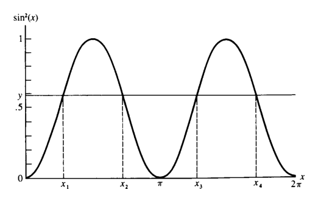
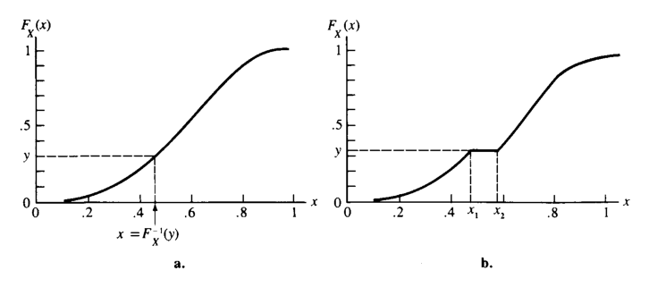
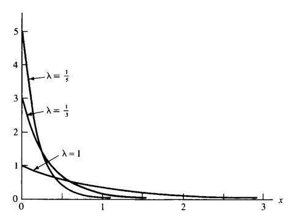
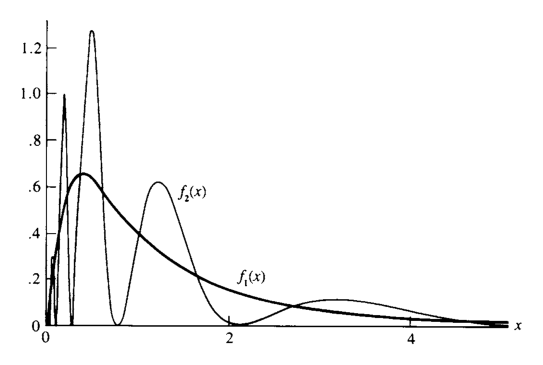
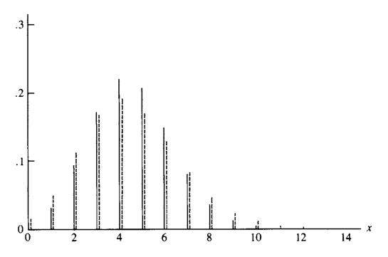

# 변환과 기댓값 {#chapter2}

> “We want something more than mere theory and preaching now, though.”  
> — Sherlock Holmes, *A Study in Scarlet*

- 이 장의 핵심 주제는 **확률변수의 함수**, **기댓값**, **모멘트**, **적률생성함수**, 그리고 **적분기호 아래에서의 미분**이다.
- 어떤 현상을 확률변수 $X$와 그 누적분포함수 $F_X(x)$로 모형화할 수 있다면, 실제 분석에서는 $X$ 자체뿐 아니라 $X$의 함수 $g(X)$에 관심을 갖는 경우가 많다.
- 예를 들어 다음과 같은 질문이 자연스럽다.
  - $X$를 변환한 $Y=g(X)$의 분포는 무엇인가?
  - $g(X)$의 평균적 행동, 즉 $E[g(X)]$는 얼마인가?
  - 분포의 퍼짐 정도는 어떻게 측정하는가?
  - 모멘트나 적률생성함수로 분포를 어떻게 특징지을 수 있는가?
- 이 장에서는 이러한 질문에 답하기 위한 기본 도구를 다룬다.

## 확률변수의 함수의 분포 {#sec-2-1}

- $X$가 누적분포함수 $F_X(x)$를 갖는 확률변수라고 하자.
- $X$의 함수 $g(X)$도 확률변수이다.
- 새 확률변수를 다음과 같이 둔다.

$$
Y = g(X)
$$

- $Y$의 확률적 행동은 $X$의 확률적 행동과 함수 $g$에 의해 결정된다.
- 임의의 집합 $A$에 대해 다음이 성립한다.

$$
P(Y \in A)=P(g(X)\in A)
$$

- 즉, $Y$의 분포는 $F_X$와 $g$에 의해 결정된다.

### 변환과 역상

- $y=g(x)$라고 쓰면, $g$는 $X$의 표본공간 $\mathcal X$에서 $Y$의 표본공간 $\mathcal Y$로 가는 사상이다.

$$
g(x): \mathcal X \rightarrow \mathcal Y
$$

- $g$에 대응하는 역상 사상 $g^{-1}$은 $\mathcal Y$의 부분집합을 $\mathcal X$의 부분집합으로 보낸다.
- 임의의 $A \subset \mathcal Y$에 대해

$$
g^{-1}(A)=\{x\in \mathcal X: g(x)\in A\}
\tag{2.1.1}
$$

- 여기서 중요한 점은 다음과 같다.
  - $g^{-1}$는 일반적인 의미의 역함수와 다를 수 있다.
  - $g^{-1}(A)$는 하나의 점이 아니라 **집합**일 수 있다.
  - 특히 $A=\{y\}$이면

$$
g^{-1}(\{y\})=\{x\in \mathcal X:g(x)=y\}
$$

- 관례적으로 $g^{-1}(\{y\})$ 대신 $g^{-1}(y)$라고 쓰기도 한다.
- 그러나 $g^{-1}(y)$가 반드시 하나의 값이라는 뜻은 아니다.
- 만약 $g(x)=y$를 만족하는 $x$가 여러 개이면 $g^{-1}(y)$는 여러 점으로 이루어진 집합이다.

### $Y=g(X)$의 분포 정의

- $Y=g(X)$라고 정의하면, 임의의 $A\subset\mathcal Y$에 대해

$$
\begin{aligned}
P(Y\in A)
&=P(g(X)\in A)\\
&=P(\{x\in\mathcal X:g(x)\in A\})\\
&=P\{X\in g^{-1}(A)\}.
\end{aligned}
\tag{2.1.2}
$$

- 이 식은 $Y$의 확률분포를 정의한다.
- 이 분포는 콜모고로프 확률공리를 만족한다.

### 이산형 확률변수의 변환

- $X$가 이산형이면 $\mathcal X$는 가산집합이다.
- $Y=g(X)$의 표본공간은

$$
\mathcal Y=\{y:y=g(x),\;x\in\mathcal X\}
$$

이다.

- 따라서 $Y$ 역시 이산형 확률변수이다.
- $Y$의 확률질량함수는 다음과 같다.

$$
f_Y(y)
=
P(Y=y)
=
\sum_{x\in g^{-1}(y)}P(X=x)
=
\sum_{x\in g^{-1}(y)}f_X(x),
\qquad y\in\mathcal Y.
$$

- $y\notin\mathcal Y$이면

$$
f_Y(y)=0
$$

이다.

- 이산형 변환 문제의 핵심은 다음 두 단계이다.
  - 각 $y$에 대해 $g^{-1}(y)$를 찾는다.
  - 그 역상에 속하는 모든 $x$의 확률을 더한다.

### 예제: 이항분포의 변환

- $X$가 다음의 이항분포를 따른다고 하자.

$$
f_X(x)=P(X=x)
=
\binom{n}{x}p^x(1-p)^{n-x},
\qquad x=0,1,\ldots,n.
\tag{2.1.3}
$$

- 여기서
  - $n$은 양의 정수,
  - $0\le p\le 1$,
  - $n$과 $p$는 분포를 결정하는 **모수(parameter)**이다.

- 새 확률변수를 다음과 같이 정의한다.

$$
Y=g(X)=n-X
$$

- 이때

$$
\mathcal X=\{0,1,\ldots,n\},\qquad
\mathcal Y=\{0,1,\ldots,n\}.
$$

- $y\in\mathcal Y$에 대해

$$
n-x=y
\quad\Longleftrightarrow\quad
x=n-y
$$

이므로 $g^{-1}(y)=n-y$이다.

- 따라서

$$
\begin{aligned}
f_Y(y)
&=\sum_{x\in g^{-1}(y)}f_X(x)\\
&=f_X(n-y)\\
&=\binom{n}{n-y}p^{\,n-y}(1-p)^y\\
&=\binom{n}{y}(1-p)^y p^{\,n-y}.
\end{aligned}
$$

- 결론:
  - $Y=n-X$도 이항분포를 따른다.
  - 단, 성공확률은 $p$가 아니라 $1-p$가 된다.
  - 즉, $X\sim Bin(n,p)$이면

$$
n-X \sim Bin(n,1-p).
$$

### 연속형 확률변수의 변환: cdf 접근

- $X$와 $Y$가 연속형 확률변수인 경우, $Y=g(X)$의 분포를 구하기 위해 먼저 cdf를 계산할 수 있다.
- $Y$의 cdf는

$$
\begin{aligned}
F_Y(y)
&=P(Y\le y)\\
&=P(g(X)\le y)\\
&=P(\{x\in\mathcal X:g(x)\le y\})\\
&=\int_{\{x\in\mathcal X:g(x)\le y\}} f_X(x)\,dx.
\end{aligned}
\tag{2.1.4}
$$

- 이 방법은 원칙적으로 항상 사용할 수 있다.
- 그러나 실제 계산에서는 집합

$$
\{x\in\mathcal X:g(x)\le y\}
$$

을 정확히 찾고 그 영역에서 적분해야 하므로 계산이 복잡해질 수 있다.

### 예제: 균등분포의 사인 제곱 변환

- $X$가 $(0,2\pi)$에서 균등분포를 따른다고 하자.

$$
f_X(x)=
\begin{cases}
\dfrac{1}{2\pi}, & 0<x<2\pi,\\
0, & \text{otherwise}.
\end{cases}
$$

- 변환을 다음과 같이 둔다.

$$
Y=\sin^2(X)
$$

- 이 변환은 단조함수가 아니므로 단순한 역함수를 사용할 수 없다.
- 아래 그림은 $y=\sin^2(x)$의 그래프와 $Y\le y$가 되는 구간들을 보여준다.

- 그림에서 $Y\le y$는 다음 영역들의 합으로 표현된다.

$$
P(Y\le y)
=
P(X\le x_1)+P(x_2\le X\le x_3)+P(X\ge x_4).
\tag{2.1.5}
$$

- $\sin^2(x)$의 대칭성과 $X$의 균등분포를 이용하면

$$
P(X\le x_1)=P(X\ge x_4)
$$

이고,

$$
P(x_2\le X\le x_3)=2P(x_2\le X\le \pi)
$$

이다.

- 따라서

$$
P(Y\le y)
=
2P(X\le x_1)+2P(x_2\le X\le \pi),
\tag{2.1.6}
$$

여기서 $x_1$과 $x_2$는

$$
\sin^2(x)=y,
\qquad 0<x<\pi
$$

의 두 해이다.

- 이 예제의 교훈:
  - $X$가 단순한 균등분포이고 $g(x)=\sin^2(x)$처럼 익숙한 함수여도,
  - $Y=g(X)$의 cdf는 단순하지 않을 수 있다.
  - 변환함수가 단조가 아니면 역상을 여러 구간으로 나누어 다루어야 한다.

### 지지집합과 변환 후 표본공간

- 변환을 다룰 때는 확률변수의 표본공간 또는 지지집합을 정확히 추적해야 한다.
- $X$의 pdf가 양수인 집합을 다음과 같이 둔다.

$$
\mathcal X=\{x:f_X(x)>0\}
$$

- 변환 후 $Y=g(X)$의 표본공간은

$$
\mathcal Y=\{y:y=g(x)\text{ for some }x\in\mathcal X\}.
\tag{2.1.7}
$$

- $\mathcal X$는 분포의 **지지집합(support set)** 또는 **지지(support)**라고 부른다.
- 이 용어는 pdf뿐 아니라 pmf 또는 일반적인 비음수 함수에도 사용할 수 있다.

### 단조변환

- 변환 문제에서 가장 다루기 쉬운 경우는 $g(x)$가 단조함수인 경우이다.
- $g$가 증가함수이면

$$
u>v\Rightarrow g(u)>g(v)
$$

이다.

- $g$가 감소함수이면

$$
u<v\Rightarrow g(u)>g(v)
$$

이다.

- $g$가 단조이면 다음이 성립한다.
  - $x\mapsto g(x)$는 $\mathcal X$에서 $\mathcal Y$로 일대일 대응을 이룬다.
  - 각 $y\in\mathcal Y$는 유일한 $x\in\mathcal X$에서 온다.
  - 따라서 $g^{-1}(y)$는 단일값으로 정의된다.

### 증가함수인 경우

- $g$가 증가함수이면

$$
\{x\in\mathcal X:g(x)\le y\}
=
\{x\in\mathcal X:x\le g^{-1}(y)\}.
\tag{2.1.8}
$$

- 따라서

$$
F_Y(y)
=
\int_{-\infty}^{g^{-1}(y)} f_X(x)\,dx
=
F_X(g^{-1}(y)).
$$

### 감소함수인 경우

- $g$가 감소함수이면 부등호 방향이 바뀐다.

$$
\{x\in\mathcal X:g(x)\le y\}
=
\{x\in\mathcal X:x\ge g^{-1}(y)\}.
\tag{2.1.9}
$$

- $X$가 연속형이면

$$
F_Y(y)
=
\int_{g^{-1}(y)}^\infty f_X(x)\,dx
=
1-F_X(g^{-1}(y)).
$$

### 정리: 단조변환의 cdf

- $X$의 cdf를 $F_X(x)$라 하고 $Y=g(X)$라고 하자.
- $\mathcal X$와 $\mathcal Y$는 식 (2.1.7)처럼 정의한다.

- $g$가 $\mathcal X$에서 증가함수이면,

$$
F_Y(y)=F_X(g^{-1}(y)),
\qquad y\in\mathcal Y.
$$

- $g$가 $\mathcal X$에서 감소함수이고 $X$가 연속형이면,

$$
F_Y(y)=1-F_X(g^{-1}(y)),
\qquad y\in\mathcal Y.
$$

### 예제: 균등분포와 지수분포의 관계 I

- $X$가 $(0,1)$에서 균등분포를 따른다고 하자.

$$
f_X(x)=
\begin{cases}
1, & 0<x<1,\\
0, & \text{otherwise}.
\end{cases}
$$

- 이때

$$
F_X(x)=x,\qquad 0<x<1.
$$

- 변환을 다음과 같이 둔다.

$$
Y=g(X)=-\log X.
$$

- $g$의 도함수는

$$
\frac{d}{dx}g(x)
=
\frac{d}{dx}(-\log x)
=
-\frac{1}{x}<0,
\qquad 0<x<1.
$$

- 따라서 $g$는 $(0,1)$에서 감소함수이다.
- $x$가 $0$에서 $1$ 사이를 움직이면 $-\log x$는 $0$에서 $\infty$ 사이를 움직인다.
- 즉,

$$
\mathcal Y=(0,\infty).
$$

- $y=-\log x$이면

$$
x=e^{-y},
$$

따라서

$$
g^{-1}(y)=e^{-y}.
$$

- 감소변환 공식에 의해 $y>0$에서

$$
\begin{aligned}
F_Y(y)
&=1-F_X(g^{-1}(y))\\
&=1-F_X(e^{-y})\\
&=1-e^{-y}.
\end{aligned}
$$

- $y\le 0$이면 $F_Y(y)=0$이다.
- 결론:
  - $Y=-\log X$는 cdf $F_Y(y)=1-e^{-y}$를 갖는다.
  - 이는 평균 모수가 $1$인 지수분포의 cdf이다.

### 정리: 단조변환의 pdf

- $X$가 pdf $f_X(x)$를 갖고, $Y=g(X)$라고 하자.
- $g$는 단조함수라고 가정한다.
- $\mathcal X$와 $\mathcal Y$는 식 (2.1.7)처럼 정의한다.
- $f_X(x)$가 $\mathcal X$에서 연속이고, $g^{-1}(y)$가 $\mathcal Y$에서 연속인 도함수를 가지면, $Y$의 pdf는 다음과 같다.

$$
f_Y(y)=
\begin{cases}
f_X(g^{-1}(y))
\left|
\dfrac{d}{dy}g^{-1}(y)
\right|,
& y\in\mathcal Y,\\
0, & \text{otherwise}.
\end{cases}
\tag{2.1.10}
$$

- 이 공식에서 절댓값 항

$$
\left|
\dfrac{d}{dy}g^{-1}(y)
\right|
$$

은 변환에 의해 길이 또는 밀도가 얼마나 늘어나거나 줄어드는지를 보정한다.
- 이 항은 흔히 **야코비안(Jacobian)** 역할을 한다고 이해할 수 있다.

### 예제: 역감마형 pdf

- $X$의 pdf가 다음과 같은 감마 pdf의 특수한 형태라고 하자.

$$
f_X(x)
=
\frac{1}{(n-1)!\beta^n}
x^{n-1}e^{-x/\beta},
\qquad 0<x<\infty,
$$

여기서 $\beta>0$, $n$은 양의 정수이다.

- 변환을 다음과 같이 둔다.

$$
Y=g(X)=\frac{1}{X}.
$$

- 여기서

$$
\mathcal X=(0,\infty),
\qquad
\mathcal Y=(0,\infty).
$$

- $y=g(x)=1/x$이면

$$
g^{-1}(y)=\frac{1}{y}.
$$

- 그리고

$$
\frac{d}{dy}g^{-1}(y)
=
-\frac{1}{y^2}.
$$

- 따라서

$$
\left|
\frac{d}{dy}g^{-1}(y)
\right|
=
\frac{1}{y^2}.
$$

- 정리를 적용하면 $y>0$에서

$$
\begin{aligned}
f_Y(y)
&=
f_X\left(\frac{1}{y}\right)\frac{1}{y^2}\\
&=
\frac{1}{(n-1)!\beta^n}
\left(\frac{1}{y}\right)^{n-1}
e^{-1/(\beta y)}
\frac{1}{y^2}\\
&=
\frac{1}{(n-1)!\beta^n}
\left(\frac{1}{y}\right)^{n+1}
e^{-1/(\beta y)}.
\end{aligned}
$$

- 이는 **역감마(inverted gamma)** pdf의 한 특수한 경우이다.

### 단조가 아닌 변환

- 실제 문제에서 $g$가 전체 지지집합에서 증가 또는 감소하지 않는 경우가 많다.
- 이때는 $g$가 단조가 되는 여러 구간으로 $\mathcal X$를 나누어야 한다.
- 각 구간에서 단조변환 공식을 적용한 뒤 결과를 더한다.

### 예제: 제곱변환

- $X$가 연속형 확률변수라고 하자.
- 변환을 다음과 같이 둔다.

$$
Y=X^2.
$$

- $y>0$에 대해

$$
\begin{aligned}
F_Y(y)
&=P(Y\le y)\\
&=P(X^2\le y)\\
&=P(-\sqrt y\le X\le \sqrt y).
\end{aligned}
$$

- $X$가 연속형이므로 한 점의 확률은 0이다.
- 따라서 왼쪽 끝점의 등호를 제거해도 된다.

$$
F_Y(y)
=
P(-\sqrt y<X\le \sqrt y).
$$

- 그러므로

$$
F_Y(y)
=
F_X(\sqrt y)-F_X(-\sqrt y).
$$

- 이를 미분하면

$$
\begin{aligned}
f_Y(y)
&=
\frac{d}{dy}
\left[
F_X(\sqrt y)-F_X(-\sqrt y)
\right]\\
&=
\frac{1}{2\sqrt y}f_X(\sqrt y)
+
\frac{1}{2\sqrt y}f_X(-\sqrt y).
\end{aligned}
$$

- 따라서

$$
f_Y(y)
=
\frac{1}{2\sqrt y}
\left[
f_X(\sqrt y)+f_X(-\sqrt y)
\right],
\qquad y>0.
\tag{2.1.11}
$$

- 이 식은 $x^2$가 두 구간에서 단조라는 사실을 반영한다.
  - $(-\infty,0)$에서는 감소
  - $(0,\infty)$에서는 증가

### 정리: 구간별 단조변환

- $X$가 pdf $f_X(x)$를 갖고, $Y=g(X)$라고 하자.
- $\mathcal X$를 식 (2.1.7)처럼 정의한다.
- $\mathcal X$의 분할 $A_0,A_1,\ldots,A_k$가 존재한다고 하자.
- 조건은 다음과 같다.
  - $P(X\in A_0)=0$이다.
  - $f_X(x)$는 각 $A_i$에서 연속이다.
  - 각 $A_i$에서 함수 $g_i(x)$가 존재하여 $g(x)=g_i(x)$이다.
  - 각 $g_i(x)$는 $A_i$에서 단조이다.
  - 각 $g_i$가 만드는 $\mathcal Y$가 모든 $i=1,\ldots,k$에 대해 동일하다.
  - 각 $g_i^{-1}(y)$는 $\mathcal Y$에서 연속인 도함수를 갖는다.

- 그러면 $Y$의 pdf는 다음과 같다.

$$
f_Y(y)=
\begin{cases}
\displaystyle
\sum_{i=1}^k
f_X(g_i^{-1}(y))
\left|
\frac{d}{dy}g_i^{-1}(y)
\right|,
& y\in\mathcal Y,\\[10pt]
0, & \text{otherwise}.
\end{cases}
$$

- 핵심은 다음과 같다.
  - $\mathcal X$를 $g$가 단조가 되는 부분집합들로 나눈다.
  - 각 조각에서 단조변환 공식을 쓴다.
  - 조각별 결과를 더한다.
  - 확률이 0인 예외집합 $A_0$는 무시할 수 있다.

### 예제: 표준정규분포와 카이제곱분포의 관계

- $X$가 표준정규분포를 따른다고 하자.

$$
f_X(x)
=
\frac{1}{\sqrt{2\pi}}e^{-x^2/2},
\qquad -\infty<x<\infty.
$$

- 변환을 다음과 같이 둔다.

$$
Y=X^2.
$$

- $g(x)=x^2$는 다음 두 구간에서 단조이다.
  - $(-\infty,0)$
  - $(0,\infty)$

- 이때

$$
\mathcal Y=(0,\infty).
$$

- 정리를 적용하기 위해 다음과 같이 둔다.

$$
A_0=\{0\},
$$

$$
A_1=(-\infty,0),
\qquad
g_1(x)=x^2,
\qquad
g_1^{-1}(y)=-\sqrt y,
$$

$$
A_2=(0,\infty),
\qquad
g_2(x)=x^2,
\qquad
g_2^{-1}(y)=\sqrt y.
$$

- 따라서 $Y$의 pdf는 $y>0$에서

$$
\begin{aligned}
f_Y(y)
&=
\frac{1}{\sqrt{2\pi}}
e^{-(-\sqrt y)^2/2}
\left|
-\frac{1}{2\sqrt y}
\right|
+
\frac{1}{\sqrt{2\pi}}
e^{-(\sqrt y)^2/2}
\left|
\frac{1}{2\sqrt y}
\right|\\
&=
\frac{1}{\sqrt{2\pi}}
\frac{1}{\sqrt y}
e^{-y/2}.
\end{aligned}
$$

- 이 pdf는 자유도 1인 카이제곱분포의 pdf이다.
- 즉,

$$
X\sim N(0,1)
\quad\Longrightarrow\quad
X^2\sim \chi^2_1.
$$

### 확률적분변환

- 이제 매우 중요하고 자주 쓰이는 변환을 다룬다.

### 정리: 확률적분변환

- $X$가 연속 cdf $F_X(x)$를 갖는다고 하자.
- 새 확률변수를 다음과 같이 정의한다.

$$
Y=F_X(X).
$$

- 그러면 $Y$는 $(0,1)$에서 균등분포를 따른다.
- 즉,

$$
P(Y\le y)=y,
\qquad 0<y<1.
$$

### cdf의 역함수 문제

- $F_X$가 엄격히 증가하면 역함수는 다음과 같이 잘 정의된다.

$$
F_X^{-1}(y)=x
\quad\Longleftrightarrow\quad
F_X(x)=y.
\tag{2.1.12}
$$

- 그러나 $F_X$가 어떤 구간에서 상수이면, 위 정의만으로는 역함수가 잘 정의되지 않는다.
- 예를 들어 $F_X(x)=y$를 만족하는 $x$가 여러 개일 수 있다.
- 이를 피하기 위해 다음과 같이 일반화된 역함수를 정의한다.

$$
F_X^{-1}(y)
=
\inf\{x:F_X(x)\ge y\},
\qquad 0<y<1.
\tag{2.1.13}
$$

- 이 정의는 다음 장점을 갖는다.
  - $F_X$가 엄격히 증가할 때는 일반 역함수와 일치한다.
  - $F_X$가 평평한 구간을 가져도 단일값을 갖는다.
  - 확률적분변환과 난수생성에서 중요하게 사용된다.

### 정리의 증명 개요

- $Y=F_X(X)$라 하자.
- $0<y<1$에서

$$
\begin{aligned}
P(Y\le y)
&=P(F_X(X)\le y)\\
&=P(F_X^{-1}(F_X(X))\le F_X^{-1}(y))\\
&=P(X\le F_X^{-1}(y))\\
&=F_X(F_X^{-1}(y))\\
&=y.
\end{aligned}
$$

- 끝점에서는
  - $y\le 0$이면 $P(Y\le y)=0$,
  - $y\ge 1$이면 $P(Y\le y)=1$이다.

- 따라서 $Y$는 $(0,1)$에서 균등분포를 따른다.

### 확률적분변환의 해석과 활용

- $F_X$가 엄격히 증가하면

$$
F_X^{-1}(F_X(x))=x
$$

가 성립한다.

- $F_X$가 평평한 구간을 가지면 이 등식이 점별로는 항상 성립하지 않을 수 있다.
- 그러나 평평한 구간은 확률이 0인 영역을 의미하므로 확률 계산에는 문제가 없다.
- 확률적분변환은 난수 생성에 활용된다.
  - $U\sim Uniform(0,1)$을 생성한다.
  - 방정식 $F_X(x)=u$를 푼다.
  - 그러면 얻어진 $x=F_X^{-1}(u)$는 cdf $F_X$를 갖는 분포에서 나온 관측값이 된다.
- 이 방법은 일반적으로 적용 가능하다는 장점이 있다.

## 기댓값 {#sec-2-2}

- 기댓값(expected value) 또는 평균(mean)은 확률변수의 평균적 값을 나타낸다.
- 단순한 산술평균이 아니라, 각 값에 그 값이 나타날 확률을 가중치로 주어 계산한 평균이다.
- 기댓값은 분포의 중심을 나타내는 대표값으로 해석할 수 있다.

### 정의: 기댓값

- 확률변수 $g(X)$의 기댓값 또는 평균을 $E[g(X)]$라고 쓴다.
- $X$가 연속형이면

$$
E[g(X)]
=
\int_{-\infty}^{\infty} g(x)f_X(x)\,dx
$$

이다.

- $X$가 이산형이면

$$
E[g(X)]
=
\sum_{x\in\mathcal X}g(x)f_X(x)
=
\sum_{x\in\mathcal X}g(x)P(X=x)
$$

이다.

- 단, 적분 또는 합이 존재해야 한다.
- 만약

$$
E|g(X)|=\infty
$$

이면 $E[g(X)]$는 존재하지 않는다고 한다.

### 예제: 지수분포의 평균

- $X$가 exponential$(\lambda)$ 분포를 따른다고 하자.
- pdf는

$$
f_X(x)=\frac{1}{\lambda}e^{-x/\lambda},
\qquad 0\le x<\infty,\quad \lambda>0.
$$

- 평균은

$$
\begin{aligned}
EX
&=
\int_0^\infty x\frac{1}{\lambda}e^{-x/\lambda}\,dx\\
&=
-xe^{-x/\lambda}\Big|_0^\infty
+
\int_0^\infty e^{-x/\lambda}\,dx\\
&=
\int_0^\infty e^{-x/\lambda}\,dx\\
&=\lambda.
\end{aligned}
$$

- 결론:

$$
X\sim Exponential(\lambda)
\quad\Longrightarrow\quad
EX=\lambda.
$$

### 예제: 이항분포의 평균

- $X\sim Bin(n,p)$라고 하자.

$$
P(X=x)=\binom{n}{x}p^x(1-p)^{n-x},
\qquad x=0,1,\ldots,n.
$$

- 평균은

$$
EX
=
\sum_{x=0}^{n}
x\binom{n}{x}p^x(1-p)^{n-x}.
$$

- $x=0$ 항은 0이므로

$$
EX
=
\sum_{x=1}^{n}
x\binom{n}{x}p^x(1-p)^{n-x}.
$$

- 다음 항등식을 이용한다.

$$
x\binom{n}{x}
=
n\binom{n-1}{x-1}.
$$

- 그러면

$$
\begin{aligned}
EX
&=
\sum_{x=1}^{n}
n\binom{n-1}{x-1}p^x(1-p)^{n-x}\\
&=
\sum_{y=0}^{n-1}
n\binom{n-1}{y}p^{y+1}(1-p)^{n-1-y}\\
&=
np
\sum_{y=0}^{n-1}
\binom{n-1}{y}p^y(1-p)^{n-1-y}\\
&=np.
\end{aligned}
$$

- 마지막 합은 $Bin(n-1,p)$ pmf 전체의 합이므로 1이다.
- 결론:

$$
X\sim Bin(n,p)
\quad\Longrightarrow\quad
EX=np.
$$

### 예제: 코시분포의 평균은 존재하지 않는다

- 코시분포의 pdf는 다음과 같다.

$$
f_X(x)=
\frac{1}{\pi}
\frac{1}{1+x^2},
\qquad -\infty<x<\infty.
$$

- 이 함수는 pdf이다.

$$
\int_{-\infty}^{\infty}f_X(x)\,dx=1
$$

- 그러나 평균이 존재하려면 $E|X|<\infty$이어야 한다.
- 실제로

$$
E|X|
=
\int_{-\infty}^{\infty}
\frac{|x|}{\pi(1+x^2)}\,dx
=
\frac{2}{\pi}\int_0^\infty\frac{x}{1+x^2}\,dx.
$$

- 임의의 $M>0$에 대해

$$
\int_0^M\frac{x}{1+x^2}\,dx
=
\frac{\log(1+M^2)}{2}.
$$

- 따라서

$$
E|X|
=
\lim_{M\to\infty}
\frac{1}{\pi}\log(1+M^2)
=
\infty.
$$

- 결론:
  - 코시분포는 평균이 존재하지 않는다.
  - 대칭적 모양을 가진다고 해서 평균이 항상 존재하는 것은 아니다.

### 기댓값의 선형성

- 기댓값은 선형 연산이다.
- 상수 $a,b$에 대해

$$
E(aX+b)=aEX+b.
\tag{2.2.1}
$$

- 예를 들어 $X\sim Bin(n,p)$이면 $EX=np$이므로

$$
E(X-np)=EX-np=np-np=0.
$$

### 정리: 기댓값의 기본 성질

- $X$를 확률변수라 하고 $a,b,c$를 상수라 하자.
- $g_1(x),g_2(x)$의 기댓값이 존재한다고 하자.

1. 선형성:

$$
E[ag_1(X)+bg_2(X)+c]
=
aE[g_1(X)]+bE[g_2(X)]+c.
$$

2. 비음수성:

$$
g_1(x)\ge 0\;\text{for all }x
\quad\Longrightarrow\quad
E[g_1(X)]\ge 0.
$$

3. 단조성:

$$
g_1(x)\ge g_2(x)\;\text{for all }x
\quad\Longrightarrow\quad
E[g_1(X)]\ge E[g_2(X)].
$$

4. 범위 보존:

$$
a\le g_1(x)\le b\;\text{for all }x
\quad\Longrightarrow\quad
a\le E[g_1(X)]\le b.
$$

### 예제: 평균은 제곱거리의 최적 예측값이다

- 확률변수 $X$와 상수 $b$ 사이의 거리를 다음으로 측정한다고 하자.

$$
(X-b)^2
$$

- 평균적으로 이 거리를 최소화하는 $b$를 찾고자 한다.
- 즉,

$$
E(X-b)^2
$$

를 최소화하는 $b$를 찾는다.

- 다음과 같이 $EX$를 더하고 뺀다.

$$
X-b=(X-EX)+(EX-b).
$$

- 따라서

$$
\begin{aligned}
E(X-b)^2
&=
E[(X-EX)+(EX-b)]^2\\
&=
E(X-EX)^2
+
(EX-b)^2
+
2E[(X-EX)(EX-b)].
\end{aligned}
$$

- 여기서 $(EX-b)$는 상수이므로

$$
E[(X-EX)(EX-b)]
=
(EX-b)E(X-EX)=0.
$$

- 따라서

$$
E(X-b)^2
=
E(X-EX)^2+(EX-b)^2.
\tag{2.2.2}
$$

- 오른쪽 첫 번째 항은 $b$와 무관하다.
- 두 번째 항은 $b=EX$일 때 0이 된다.
- 따라서

$$
\min_b E(X-b)^2
=
E(X-EX)^2.
\tag{2.2.3}
$$

- 결론:
  - 평균 $EX$는 제곱오차 기준에서 $X$의 최적 상수 예측값이다.

### $E[g(X)]$ 계산의 두 가지 방법

- 비선형 함수 $g(X)$의 기댓값을 구할 때 두 가지 방법이 있다.

#### 방법 1: 직접 계산

$$
E[g(X)]
=
\int_{-\infty}^{\infty}g(x)f_X(x)\,dx.
\tag{2.2.4}
$$

#### 방법 2: $Y=g(X)$의 분포를 먼저 구한 뒤 계산

- $Y=g(X)$의 pdf를 $f_Y(y)$라고 하면

$$
E[g(X)]
=
EY
=
\int_{-\infty}^{\infty}y f_Y(y)\,dy.
\tag{2.2.5}
$$

- 두 방법은 같은 값을 준다.
- 실전에서는 계산이 더 쉬운 방법을 선택한다.

### 예제: 균등분포와 지수분포의 관계 II

- $X\sim Uniform(0,1)$라 하자.

$$
f_X(x)=
\begin{cases}
1, & 0\le x\le 1,\\
0, & \text{otherwise}.
\end{cases}
$$

- $g(X)=-\log X$라고 하자.
- 직접 계산하면

$$
\begin{aligned}
E[-\log X]
&=
\int_0^1 -\log x\,dx\\
&=
x-x\log x\Big|_0^1\\
&=1.
\end{aligned}
$$

- 한편 예제에서 $Y=-\log X$는 cdf

$$
F_Y(y)=1-e^{-y},\qquad y>0
$$

를 가진다.

- 따라서 pdf는

$$
f_Y(y)=e^{-y},\qquad y>0
$$

이다.

- 이는 $\lambda=1$인 지수분포이므로

$$
EY=1.
$$

- 두 방법이 같은 결과를 준다.

## 모멘트와 적률생성함수 {#sec-2-3}

- 분포의 여러 특성을 요약하는 중요한 기댓값들이 있다.
- 이를 **모멘트(moment)**라고 한다.

### 정의: 모멘트와 중심모멘트

- $X$의 $n$차 모멘트는

$$
\mu_n' = E[X^n]
$$

이다.

- $X$의 $n$차 중심모멘트는

$$
\mu_n=E[(X-\mu)^n],
$$

여기서

$$
\mu=\mu_1'=EX
$$

이다.

### 정의: 분산

- 확률변수 $X$의 분산은 두 번째 중심모멘트이다.

$$
Var(X)=E[(X-EX)^2].
$$

- 분산의 양의 제곱근을 표준편차라고 한다.

$$
SD(X)=\sqrt{Var(X)}.
$$

- 분산의 해석:
  - $X$가 평균 주변에서 얼마나 퍼져 있는지 측정한다.
  - 분산이 작으면 $X$는 평균 근처에 있을 가능성이 높다.
  - 분산이 크면 $X$의 값이 평균 주변에서 많이 흩어진다.
- 표준편차는 원래 변수 $X$와 같은 단위를 가지므로 해석이 더 직관적이다.

### 예제: 지수분포의 분산

- $X$가 exponential$(\lambda)$ 분포를 따른다고 하자.
- 예제 2.2.2에서

$$
EX=\lambda
$$

임을 보았다.

- 분산은

$$
\begin{aligned}
Var(X)
&=
E[(X-\lambda)^2]\\
&=
\int_0^\infty
(x-\lambda)^2
\frac{1}{\lambda}e^{-x/\lambda}\,dx\\
&=
\int_0^\infty
(x^2-2x\lambda+\lambda^2)
\frac{1}{\lambda}e^{-x/\lambda}\,dx.
\end{aligned}
$$

- 각 항을 부분적분으로 계산하면

$$
Var(X)=\lambda^2.
$$

- 지수분포의 분산은 모수 $\lambda$와 직접적으로 관련된다.
- 아래 그림은 $\lambda=1,1/3,1/5$일 때의 지수분포 밀도를 보여준다.
- $\lambda$가 작을수록 분포는 평균 주변에 더 집중된다.

### 정리: 선형변환의 분산

- $X$가 유한한 분산을 갖는 확률변수이고 $a,b$가 상수이면

$$
Var(aX+b)=a^2Var(X).
$$

- 증명:

$$
\begin{aligned}
Var(aX+b)
&=
E[(aX+b)-E(aX+b)]^2\\
&=
E[aX-aEX]^2\\
&=
a^2E(X-EX)^2\\
&=
a^2Var(X).
\end{aligned}
$$

- 중요한 해석:
  - 상수 $b$를 더하는 것은 분산을 바꾸지 않는다.
  - $a$를 곱하면 분산은 $a^2$배가 된다.

### 분산의 계산 공식

- 분산은 다음의 등가 공식으로도 계산할 수 있다.

$$
Var(X)=E[X^2]-(EX)^2.
\tag{2.3.1}
$$

- 증명:

$$
\begin{aligned}
Var(X)
&=E[(X-EX)^2]\\
&=E[X^2-2XEX+(EX)^2]\\
&=EX^2-2(EX)^2+(EX)^2\\
&=EX^2-(EX)^2.
\end{aligned}
$$

### 예제: 이항분포의 분산

- $X\sim Bin(n,p)$라고 하자.

$$
P(X=x)=\binom{n}{x}p^x(1-p)^{n-x},
\qquad x=0,1,\ldots,n.
$$

- 이미

$$
EX=np
$$

임을 알고 있다.

- 분산을 구하기 위해 먼저 $EX^2$를 계산한다.

$$
EX^2
=
\sum_{x=0}^{n}
x^2\binom{n}{x}p^x(1-p)^{n-x}.
\tag{2.3.2}
$$

- 다음 항등식을 사용한다.

$$
x^2\binom{n}{x}
=
xn\binom{n-1}{x-1}.
\tag{2.3.3}
$$

- $x=0$ 항은 0이므로

$$
\begin{aligned}
EX^2
&=
n\sum_{x=1}^{n}
x\binom{n-1}{x-1}p^x(1-p)^{n-x}\\
&=
n\sum_{y=0}^{n-1}
(y+1)\binom{n-1}{y}p^{y+1}(1-p)^{n-1-y}\\
&=
np\sum_{y=0}^{n-1}
y\binom{n-1}{y}p^y(1-p)^{n-1-y}\\
&\quad+
np\sum_{y=0}^{n-1}
\binom{n-1}{y}p^y(1-p)^{n-1-y}.
\end{aligned}
$$

- 첫 번째 합은 $Bin(n-1,p)$의 평균이므로 $(n-1)p$이다.
- 두 번째 합은 $Bin(n-1,p)$ pmf의 전체 합이므로 1이다.
- 따라서

$$
EX^2=n(n-1)p^2+np.
\tag{2.3.4}
$$

- 분산 공식에 의해

$$
\begin{aligned}
Var(X)
&=
EX^2-(EX)^2\\
&=
n(n-1)p^2+np-(np)^2\\
&=
np(1-p).
\end{aligned}
$$

- 결론:

$$
X\sim Bin(n,p)
\quad\Longrightarrow\quad
Var(X)=np(1-p).
$$

### 적률생성함수

- 적률생성함수(moment generating function, mgf)는 분포와 관련된 중요한 함수이다.
- 이름처럼 모멘트를 생성할 수 있다.
- 그러나 실제로는 모멘트 계산보다 **분포를 특징짓는 도구**로 더 중요하다.

### 정의: 적률생성함수

- 확률변수 $X$의 적률생성함수는 다음과 같이 정의된다.

$$
M_X(t)=E[e^{tX}].
$$

- 단, 이 기댓값은 $0$의 어떤 근방에서 존재해야 한다.
- 즉, 어떤 $h>0$가 존재하여

$$
-h<t<h
$$

인 모든 $t$에 대해 $E[e^{tX}]$가 존재해야 한다.

- 연속형이면

$$
M_X(t)
=
\int_{-\infty}^{\infty}e^{tx}f_X(x)\,dx.
$$

- 이산형이면

$$
M_X(t)
=
\sum_x e^{tx}P(X=x).
$$

### 정리: mgf와 모멘트

- $X$가 mgf $M_X(t)$를 가지면

$$
EX^n=M_X^{(n)}(0),
$$

여기서

$$
M_X^{(n)}(0)
=
\left.
\frac{d^n}{dt^n}M_X(t)
\right|_{t=0}.
$$

- 즉, $n$차 모멘트는 mgf를 $n$번 미분한 뒤 $t=0$을 대입하여 얻는다.

- 증명 아이디어:
  - 적분기호 아래에서 미분할 수 있다고 가정하면

$$
\frac{d}{dt}M_X(t)
=
\frac{d}{dt}
\int_{-\infty}^{\infty}e^{tx}f_X(x)\,dx
=
\int_{-\infty}^{\infty}xe^{tx}f_X(x)\,dx
=
E[Xe^{tX}].
$$

  - $t=0$을 대입하면

$$
M_X'(0)=EX.
$$

  - 같은 방식으로 반복하면

$$
M_X^{(n)}(0)=EX^n.
$$

### 예제: 감마분포의 mgf

- 감마분포의 pdf는 다음과 같다.

$$
f(x)=
\frac{1}{\Gamma(\alpha)\beta^\alpha}
x^{\alpha-1}e^{-x/\beta},
\qquad 0<x<\infty,
\quad \alpha>0,\;\beta>0.
$$

- mgf는

$$
\begin{aligned}
M_X(t)
&=
\frac{1}{\Gamma(\alpha)\beta^\alpha}
\int_0^\infty
e^{tx}x^{\alpha-1}e^{-x/\beta}\,dx\\
&=
\frac{1}{\Gamma(\alpha)\beta^\alpha}
\int_0^\infty
x^{\alpha-1}e^{-(1/\beta-t)x}\,dx\\
&=
\frac{1}{\Gamma(\alpha)\beta^\alpha}
\int_0^\infty
x^{\alpha-1}e^{-x/(\beta/(1-\beta t))}\,dx.
\end{aligned}
\tag{2.3.5}
$$

- 다음 감마 적분 공식을 사용한다.

$$
\int_0^\infty x^{a-1}e^{-x/b}\,dx
=
\Gamma(a)b^a.
\tag{2.3.6}
$$

- 그러면

$$
M_X(t)
=
\frac{1}{\Gamma(\alpha)\beta^\alpha}
\Gamma(\alpha)
\left(\frac{\beta}{1-\beta t}\right)^\alpha
=
\left(\frac{1}{1-\beta t}\right)^\alpha.
$$

- 단, 존재 조건은

$$
t<\frac{1}{\beta}
$$

이다.

- 평균은 mgf를 미분하여 얻는다.

$$
EX
=
\left.
\frac{d}{dt}M_X(t)
\right|_{t=0}
=
\left.
\frac{\alpha\beta}{(1-\beta t)^{\alpha+1}}
\right|_{t=0}
=
\alpha\beta.
$$

### 예제: 이항분포의 mgf

- $X\sim Bin(n,p)$이면

$$
P(X=x)=\binom{n}{x}p^x(1-p)^{n-x}.
$$

- mgf는

$$
\begin{aligned}
M_X(t)
&=
\sum_{x=0}^{n}
e^{tx}
\binom{n}{x}p^x(1-p)^{n-x}\\
&=
\sum_{x=0}^{n}
\binom{n}{x}(pe^t)^x(1-p)^{n-x}.
\end{aligned}
$$

- 이항정리

$$
\sum_{x=0}^{n}\binom{n}{x}u^xv^{n-x}
=
(u+v)^n
\tag{2.3.7}
$$

을 적용하면

$$
M_X(t)
=
[pe^t+(1-p)]^n.
$$

### 모멘트와 분포의 유일성 문제

- mgf가 존재하면 무한히 많은 모멘트를 생성한다.
- 자연스러운 질문:
  - 모든 모멘트를 알면 분포를 유일하게 알 수 있는가?
- 답은 항상 그렇지는 않다.
- 서로 다른 분포가 모든 모멘트를 공유할 수 있다.

### 예제: 같은 모멘트를 갖지만 서로 다른 pdf

- 다음 두 pdf를 생각하자.

$$
f_1(x)
=
\frac{1}{\sqrt{2\pi}x}
e^{-(\log x)^2/2},
\qquad 0\le x<\infty,
$$

$$
f_2(x)
=
f_1(x)[1+\sin(2\pi\log x)],
\qquad 0\le x<\infty.
$$

- $f_1$은 로그정규분포의 특수한 경우이다.
- $X_1\sim f_1$이면

$$
EX_1^r=e^{r^2/2},
\qquad r=0,1,\ldots
$$

이다.

- $X_2\sim f_2$라 하면

$$
\begin{aligned}
EX_2^r
&=
\int_0^\infty x^r f_1(x)[1+\sin(2\pi\log x)]\,dx\\
&=
EX_1^r
+
\int_0^\infty x^r f_1(x)\sin(2\pi\log x)\,dx.
\end{aligned}
$$

- 마지막 적분은 적절한 변수변환을 하면 홀함수의 적분이 되어 0이 된다.
- 따라서 $X_1$과 $X_2$는 서로 다른 pdf를 갖지만 모든 모멘트가 같다.
- 아래 그림은 두 pdf가 실제로 다르게 생겼음을 보여준다.

### 정리: 모멘트와 mgf가 분포를 특징짓는 경우

- $F_X(x)$와 $F_Y(y)$가 모든 모멘트를 갖는 두 cdf라고 하자.

1. $X$와 $Y$의 지지집합이 유계이면,

$$
F_X(u)=F_Y(u)\text{ for all }u
$$

일 필요충분조건은

$$
EX^r=EY^r,
\qquad r=0,1,2,\ldots
$$

이다.

2. mgf가 존재하고, $0$의 어떤 근방에서

$$
M_X(t)=M_Y(t)
$$

이면,

$$
F_X(u)=F_Y(u)\text{ for all }u.
$$

- 요점:
  - 모멘트열만으로는 분포가 유일하지 않을 수 있다.
  - 그러나 mgf가 $0$ 근방에서 존재하고 같으면 분포는 유일하게 결정된다.

### 정리: mgf의 수렴

- 확률변수열 $X_1,X_2,\ldots$가 있고 각 $X_i$의 mgf를 $M_{X_i}(t)$라 하자.
- 어떤 $0$ 근방에서

$$
\lim_{i\to\infty}M_{X_i}(t)=M_X(t)
$$

이고, $M_X(t)$가 어떤 확률변수의 mgf라고 하자.
- 그러면 $M_X(t)$가 결정하는 유일한 cdf $F_X$가 존재하며, $F_X$의 연속점 $x$에서

$$
\lim_{i\to\infty}F_{X_i}(x)=F_X(x)
$$

이다.

- 즉, mgf가 mgf로 수렴하면 cdf도 수렴한다.

### 라플라스 변환과 mgf

- mgf의 정의식

$$
M_X(t)
=
\int_{-\infty}^{\infty}e^{tx}f_X(x)\,dx
\tag{2.3.8}
$$

은 라플라스 변환의 형태이다.
- 라플라스 변환의 중요한 성질은 유일성이다.
- 일정한 범위의 $t$에서 같은 라플라스 변환을 가지면 같은 함수 $f_X$를 갖는다.
- 이것이 mgf가 분포를 특징지을 수 있는 이유이다.

### 예제: 이항분포의 포아송 근사

- 초급 통계학에서 자주 배우는 근사:
  - $X\sim Bin(n,p)$이고
  - $Y\sim Poisson(\lambda)$,
  - $\lambda=np$일 때,
  - $n$이 크고 $p$가 작으면

$$
P(X=x)\approx P(Y=x).
\tag{2.3.9}
$$

- 포아송분포의 pmf는

$$
P(Y=x)=
\frac{e^{-\lambda}\lambda^x}{x!},
\qquad x=0,1,2,\ldots.
$$

- 이항분포의 mgf는

$$
M_X(t)=[pe^t+(1-p)]^n.
\tag{2.3.10}
$$

- 포아송분포의 mgf는

$$
M_Y(t)=e^{\lambda(e^t-1)}.
$$

- $p=\lambda/n$으로 두면

$$
\begin{aligned}
M_X(t)
&=
\left[
\frac{\lambda}{n}e^t+
\left(1-\frac{\lambda}{n}\right)
\right]^n\\
&=
\left[
1+\frac{1}{n}(e^t-1)\lambda
\right]^n.
\end{aligned}
$$

- 다음 극한을 사용한다.

$$
\lim_{n\to\infty}
\left(1+\frac{a_n}{n}\right)^n
=
e^a
\quad\text{if }a_n\to a.
$$

- 여기서 $a=(e^t-1)\lambda$이므로

$$
\lim_{n\to\infty}M_X(t)
=
e^{\lambda(e^t-1)}
=
M_Y(t).
$$

- 따라서 mgf 수렴 정리에 의해 이항분포는 포아송분포로 근사된다.

### 정리: 선형변환의 mgf

- 상수 $a,b$에 대해 $aX+b$의 mgf는

$$
M_{aX+b}(t)=e^{bt}M_X(at).
$$

- 증명:

$$
\begin{aligned}
M_{aX+b}(t)
&=E[e^{(aX+b)t}]\\
&=E[e^{aXt}e^{bt}]\\
&=e^{bt}E[e^{(at)X}]\\
&=e^{bt}M_X(at).
\end{aligned}
$$

## 2.4 적분기호 아래에서의 미분 {#sec-2-4}

- 앞 절에서 mgf를 미분하여 모멘트를 구할 때, 적분기호 아래로 미분을 옮겼다.
- 이 조작은 이론통계에서 자주 등장한다.
- 그러나 항상 정당화되는 것은 아니다.
- 이 절의 목적은 다음과 같다.
  - 언제 미분과 적분의 순서를 바꿀 수 있는가?
  - 언제 미분과 무한합의 순서를 바꿀 수 있는가?

### 라이프니츠 법칙

- 다음 형태의 적분을 생각하자.

$$
\frac{d}{d\theta}
\int_{a(\theta)}^{b(\theta)}
f(x,\theta)\,dx.
\tag{2.4.1}
$$

- 여기서 적분구간의 양 끝점도 $\theta$에 의존할 수 있다.
- 이때 사용하는 규칙이 **Leibnitz's Rule**이다.

### 정리: Leibnitz's Rule

- $f(x,\theta)$, $a(\theta)$, $b(\theta)$가 $\theta$에 대해 미분가능하면

$$
\frac{d}{d\theta}
\int_{a(\theta)}^{b(\theta)}
f(x,\theta)\,dx
=
f(b(\theta),\theta)\frac{d}{d\theta}b(\theta)
-
f(a(\theta),\theta)\frac{d}{d\theta}a(\theta)
+
\int_{a(\theta)}^{b(\theta)}
\frac{\partial}{\partial\theta}f(x,\theta)\,dx.
$$

- 특히 $a(\theta)$와 $b(\theta)$가 상수이면

$$
\frac{d}{d\theta}
\int_a^b f(x,\theta)\,dx
=
\int_a^b
\frac{\partial}{\partial\theta}f(x,\theta)\,dx.
$$

- 유한구간에서는 보통 문제가 적다.
- 그러나 적분구간이 무한이면 추가 조건이 필요하다.

### 미분과 적분 순서 교환의 본질

- 미분은 극한이다.

$$
\frac{\partial}{\partial\theta}f(x,\theta)
=
\lim_{\delta\to0}
\frac{f(x,\theta+\delta)-f(x,\theta)}{\delta}.
$$

- 따라서 적분기호 아래에서 미분한다는 것은 사실상 다음 두 연산을 바꾸는 것이다.
  - 극한
  - 적분

- 즉, 다음 두 표현이 같은지 묻는 문제이다.

$$
\int_{-\infty}^{\infty}
\lim_{\delta\to0}
\left[
\frac{f(x,\theta+\delta)-f(x,\theta)}{\delta}
\right]dx
$$

와

$$
\lim_{\delta\to0}
\int_{-\infty}^{\infty}
\left[
\frac{f(x,\theta+\delta)-f(x,\theta)}{\delta}
\right]dx.
$$

### 정리: 지배수렴정리의 한 형태

- $h(x,y)$가 각 $x$에 대해 $y_0$에서 연속이라고 하자.
- 어떤 함수 $g(x)$가 존재하여 다음을 만족한다고 하자.

1. 모든 $x,y$에 대해

$$
|h(x,y)|\le g(x)
$$

2. 그리고

$$
\int_{-\infty}^{\infty}g(x)\,dx<\infty.
$$

- 그러면

$$
\lim_{y\to y_0}
\int_{-\infty}^{\infty}h(x,y)\,dx
=
\int_{-\infty}^{\infty}
\lim_{y\to y_0}h(x,y)\,dx.
$$

- 핵심 조건은 적분가능한 지배함수 $g(x)$의 존재이다.

### 정리: 적분기호 아래에서의 미분 조건

- $f(x,\theta)$가 $\theta=\theta_0$에서 미분가능하다고 하자.
- 즉,

$$
\lim_{\delta\to0}
\frac{f(x,\theta_0+\delta)-f(x,\theta_0)}{\delta}
=
\left.
\frac{\partial}{\partial\theta}f(x,\theta)
\right|_{\theta=\theta_0}
$$

가 모든 $x$에서 존재한다고 하자.

- 어떤 함수 $g(x,\theta_0)$와 상수 $\delta_0>0$가 존재하여 다음을 만족한다고 하자.

1. 모든 $x$와 $|\delta|\le\delta_0$에 대해

$$
\left|
\frac{f(x,\theta_0+\delta)-f(x,\theta_0)}{\delta}
\right|
\le
g(x,\theta_0)
$$

2. 그리고

$$
\int_{-\infty}^{\infty}g(x,\theta_0)\,dx<\infty.
$$

- 그러면

$$
\left.
\frac{d}{d\theta}
\int_{-\infty}^{\infty}
f(x,\theta)\,dx
\right|_{\theta=\theta_0}
=
\int_{-\infty}^{\infty}
\left.
\frac{\partial}{\partial\theta}f(x,\theta)
\right|_{\theta=\theta_0}
dx.
\tag{2.4.2}
$$

### 더 실용적인 조건

- $f(x,\theta)$가 모든 $\theta$에서 미분가능한 경우, 평균값정리를 이용해 다음 조건으로 충분하다.
- 어떤 $g(x,\theta)$가 존재하여

$$
\left|
\left.
\frac{\partial}{\partial\theta}f(x,\theta)
\right|_{\theta=\theta'}
\right|
\le
g(x,\theta)
\quad
\text{for all }\theta'\text{ such that }|\theta'-\theta|\le\delta_0
\tag{2.4.4}
$$

이고,

$$
\int_{-\infty}^{\infty}g(x,\theta)\,dx<\infty
$$

이면

$$
\frac{d}{d\theta}
\int_{-\infty}^{\infty}
f(x,\theta)\,dx
=
\int_{-\infty}^{\infty}
\frac{\partial}{\partial\theta}f(x,\theta)\,dx.
\tag{2.4.3}
$$

### 따름정리 

- $f(x,\theta)$가 $\theta$에 대해 미분가능하고, 식 (2.4.4)를 만족하는 적분가능한 지배함수 $g(x,\theta)$가 존재하면 식 (2.4.3)이 성립한다.

### 예제: 적분과 미분의 교환 I

- $X$가 exponential$(\lambda)$ pdf를 갖는다고 하자.

$$
f(x)=\frac{1}{\lambda}e^{-x/\lambda},
\qquad 0<x<\infty.
$$

- 다음 미분을 계산하고자 한다.

$$
\frac{d}{d\lambda}EX^n
=
\frac{d}{d\lambda}
\int_0^\infty
x^n
\left(\frac{1}{\lambda}\right)
e^{-x/\lambda}\,dx.
\tag{2.4.5}
$$

- 미분을 적분 안으로 옮길 수 있다면

$$
\begin{aligned}
\frac{d}{d\lambda}EX^n
&=
\int_0^\infty
\frac{\partial}{\partial\lambda}
\left[
x^n
\left(\frac{1}{\lambda}\right)
e^{-x/\lambda}
\right]dx\\
&=
\int_0^\infty
\frac{x^n}{\lambda^2}
\left(\frac{x}{\lambda}-1\right)
e^{-x/\lambda}\,dx\\
&=
\frac{1}{\lambda^2}EX^{n+1}
-
\frac{1}{\lambda}EX^n.
\end{aligned}
\tag{2.4.6}
$$

- 이를 정리하면 지수분포 모멘트의 재귀식이 나온다.

$$
EX^{n+1}
=
\lambda EX^n
+
\lambda^2\frac{d}{d\lambda}EX^n.
\tag{2.4.7}
$$

- 이 관계는 모멘트 계산을 쉽게 해준다.

### 예제: mgf에서 적분과 미분의 교환

- $X\sim N(\mu,1)$라고 하자.
- mgf는

$$
M_X(t)
=
E[e^{tX}]
=
\frac{1}{\sqrt{2\pi}}
\int_{-\infty}^{\infty}
e^{tx}e^{-(x-\mu)^2/2}\,dx.
$$

- 모멘트를 얻기 위해

$$
\frac{d}{dt}M_X(t)
=
\frac{d}{dt}E[e^{tX}]
=
E\left[\frac{\partial}{\partial t}e^{tX}\right]
=
E[Xe^{tX}]
\tag{2.4.8}
$$

를 사용한다.

- 이때 $t$가 정리 2.4.3에서의 $\theta$ 역할을 한다.
- $\mu$는 상수로 취급한다.
- 적절한 지배함수 $g(x,t)$를 구성하면 미분과 적분의 교환이 정당화된다.

### 미분과 무한합의 교환

- 유한합에서는 미분을 합 안으로 넣어도 문제가 없다.
- 그러나 무한합에서는 조건이 필요하다.

### 예제: 기하분포에서 미분과 합의 교환

- $X$가 다음 기하분포를 따른다고 하자.

$$
P(X=x)=\theta(1-\theta)^x,
\qquad x=0,1,\ldots,\quad 0<\theta<1.
$$

- 전체 확률의 합은

$$
\sum_{x=0}^{\infty}\theta(1-\theta)^x=1.
$$

- 양변을 $\theta$로 미분하면

$$
\frac{d}{d\theta}
\sum_{x=0}^{\infty}
\theta(1-\theta)^x
=
\sum_{x=0}^{\infty}
\frac{d}{d\theta}
\theta(1-\theta)^x.
$$

- 미분하면

$$
\sum_{x=0}^{\infty}
\left[
(1-\theta)^x
-
\theta x(1-\theta)^{x-1}
\right]=0.
$$

- 이를 정리하면

$$
\frac{1}{\theta}
\sum_{x=0}^{\infty}
\theta(1-\theta)^x
-
\frac{1}{1-\theta}
\sum_{x=0}^{\infty}
x\theta(1-\theta)^x
=
0.
\tag{2.4.10}
$$

- 첫 번째 합은 1이고, 두 번째 합은 $EX$이므로

$$
\frac{1}{\theta}
-
\frac{1}{1-\theta}EX
=
0.
$$

- 따라서

$$
EX=\frac{1-\theta}{\theta}.
$$

### 정리 2.4.8: 미분과 무한합의 교환

- 급수

$$
\sum_{x=0}^{\infty}h(\theta,x)
$$

가 모든 $\theta\in(a,b)$에서 수렴한다고 하자.
- 다음 조건을 만족한다고 하자.
  - $\partial h(\theta,x)/\partial\theta$가 각 $x$에 대해 $\theta$의 연속함수이다.
  - 급수

$$
\sum_{x=0}^{\infty}
\frac{\partial}{\partial\theta}h(\theta,x)
$$

가 $(a,b)$의 모든 닫히고 유계인 부분구간에서 균등수렴한다.

- 그러면

$$
\frac{d}{d\theta}
\sum_{x=0}^{\infty}h(\theta,x)
=
\sum_{x=0}^{\infty}
\frac{\partial}{\partial\theta}h(\theta,x).
\tag{2.4.11}
$$

### 예제: 이전 예제의 정당화

- 여기서

$$
h(\theta,x)=\theta(1-\theta)^x
$$

이고,

$$
\frac{\partial}{\partial\theta}h(\theta,x)
=
(1-\theta)^x-\theta x(1-\theta)^{x-1}.
$$

- 부분합을

$$
S_n(\theta)
=
\sum_{x=0}^{n}
\left[
(1-\theta)^x-\theta x(1-\theta)^{x-1}
\right]
$$

라고 하자.

- 기하급수의 부분합

$$
\sum_{k=0}^{n}y^k
=
\frac{1-y^{n+1}}{1-y}
$$

을 이용하면

$$
S_n(\theta)=(n+1)(1-\theta)^n.
$$

- $0<\theta<1$에서

$$
S_\infty(\theta)=\lim_{n\to\infty}S_n(\theta)=0.
$$

- 닫힌 유계구간 $[c,d]\subset(0,1)$에서 이 수렴은 균등수렴한다.
- 따라서 미분과 무한합의 교환이 정당화된다.

### 정리: 적분과 무한합의 교환

- 급수

$$
\sum_{x=0}^{\infty}h(\theta,x)
$$

가 $[a,b]$에서 균등수렴하고, 각 $x$에 대해 $h(\theta,x)$가 $\theta$의 연속함수라 하자.
- 그러면

$$
\int_a^b
\sum_{x=0}^{\infty}h(\theta,x)\,d\theta
=
\sum_{x=0}^{\infty}
\int_a^b h(\theta,x)\,d\theta.
$$

