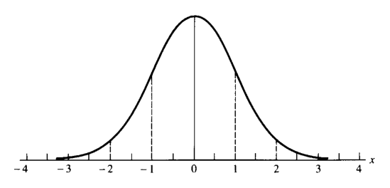
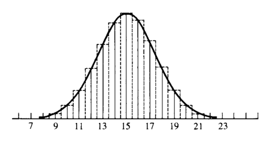
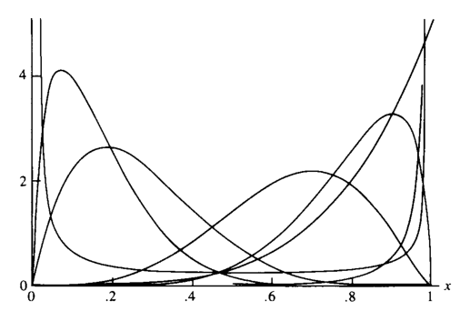
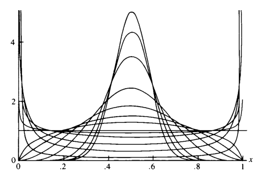
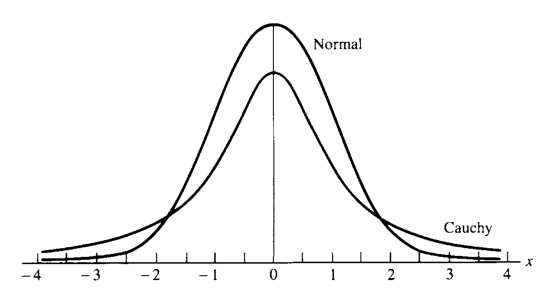
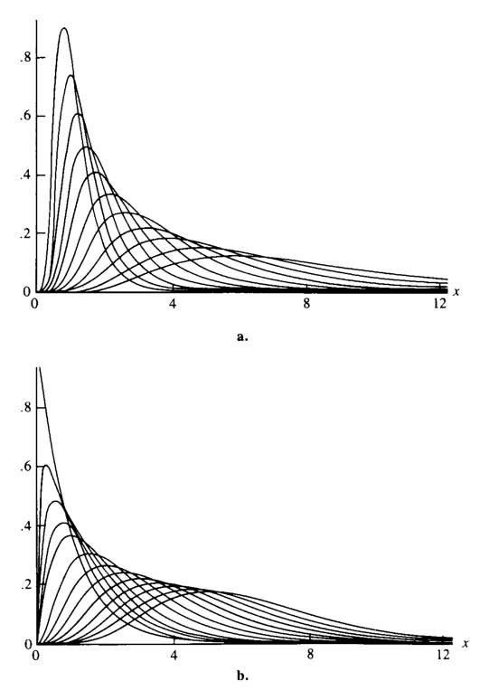
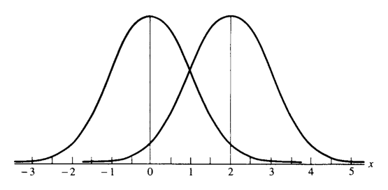
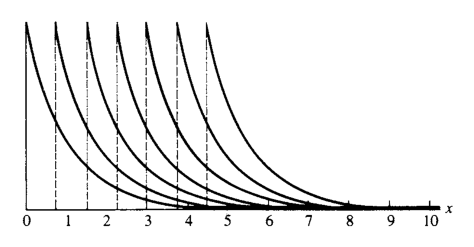
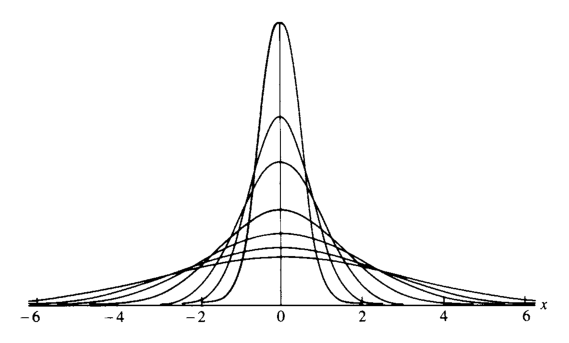
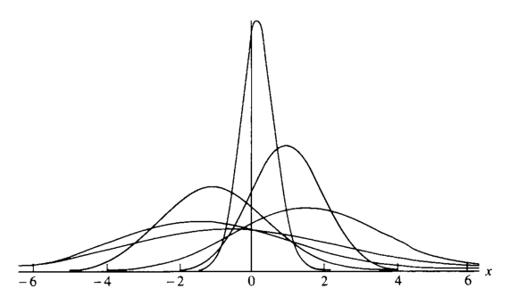

# 자주 쓰이는 분포족 {#chapter3}

> “How do all these unusuals strike you, Watson?”  
> “Their cumulative effect is certainly considerable, and yet each of them is quite possible in itself.”  
> — Sherlock Holmes and Dr. Watson, *The Adventure of the Abbey Grange*

- 이 장은 통계학에서 자주 쓰이는 대표적인 **분포족(family of distributions)**을 정리한다.
- 통계분포는 모집단을 모형화하는 데 사용된다.
- 실제 통계분석에서는 하나의 고정된 분포보다, 하나 이상의 모수에 의해 색인화된 분포족을 다루는 경우가 많다.
- 예를 들어 어떤 모집단을 정규분포로 모형화할 수 있다고 생각하더라도 평균 $\mu$를 정확히 알지 못할 수 있다.
- 이 경우에는 하나의 정규분포가 아니라 평균 $\mu$를 모수로 갖는 정규분포족을 다룬다.

$$
-\infty<\mu<\infty
$$

- 이 장에서 다루는 내용은 다음과 같다.
  - 이산형 분포
  - 연속형 분포
  - 지수족
  - 위치·척도 분포족
  - 확률부등식과 항등식
  - 관련 기타 주제

- 각 분포에 대해 가능한 한 다음을 함께 정리한다.
  - 확률질량함수 또는 확률밀도함수
  - 모수의 의미
  - 평균과 분산
  - 적률생성함수
  - 대표적 사용 상황
  - 다른 분포와의 관계

## 도입 {#sec-3-1}

- 통계분포는 모집단의 확률적 구조를 나타내는 모형이다.
- 분포족은 하나의 함수형태를 유지하면서 모수 값에 따라 모양, 위치, 퍼짐 등을 변화시킨다.
- 예를 들어 정규분포족은 평균과 분산에 따라 다른 분포를 만들지만, 기본적인 종 모양 구조는 유지한다.
- 이 장의 목적은 다음과 같다.
  - 통계학에서 자주 등장하는 분포족들을 목록화한다.
  - 각 분포의 평균, 분산, mgf, 특징을 정리한다.
  - 분포들 사이의 유용한 관계를 보여준다.
  - 이후 장에서 사용할 추론 이론의 기반을 마련한다.

## 이산형 분포 {#sec-3-2}

- 확률변수 $X$의 가능한 값들의 집합이 가산집합이면 $X$는 이산형 분포를 갖는다고 한다.
- 대부분의 이산형 확률변수는 정수값을 가진다.

### 이산균등분포

- 확률변수 $X$가 $1,2,\ldots,N$ 중 하나의 값을 동일한 확률로 가진다면 이산균등분포를 따른다고 한다.

$$
P(X=x\mid N)=\frac{1}{N},
\qquad x=1,2,\ldots,N.
\tag{3.2.1}
$$

- 여기서 $N$은 주어진 양의 정수이다.
- 모든 결과가 같은 확률을 갖는다.

#### 모수 표기법

- 이 책에서는 모수에 대한 의존성을 강조하기 위해 조건부 기호 $|$를 사용한다.
- 예를 들어

$$
P(X=x\mid N)
$$

은 확률이 모수 $N$에 의존한다는 뜻이다.
- 같은 표기법은 pmf, pdf, cdf, 기댓값 등에서도 사용된다.
- 문맥상 혼동이 없으면 모수 표기를 생략하기도 한다.

#### 평균과 분산

- 다음 합 공식들을 사용한다.

$$
\sum_{i=1}^{k}i=\frac{k(k+1)}{2},
\qquad
\sum_{i=1}^{k}i^2=\frac{k(k+1)(2k+1)}{6}.
$$

- 평균은

$$
EX
=
\sum_{x=1}^{N}xP(X=x\mid N)
=
\sum_{x=1}^{N}x\frac1N
=
\frac{N+1}{2}.
$$

- 두 번째 모멘트는

$$
EX^2
=
\sum_{x=1}^{N}x^2\frac1N
=
\frac{(N+1)(2N+1)}{6}.
$$

- 따라서 분산은

$$
\begin{aligned}
Var(X)
&=EX^2-(EX)^2\\
&=
\frac{(N+1)(2N+1)}{6}
-
\left(\frac{N+1}{2}\right)^2\\
&=
\frac{(N+1)(N-1)}{12}.
\end{aligned}
$$

- 이산균등분포는 구간 $N_0,N_0+1,\ldots,N_1$으로도 일반화할 수 있다.

$$
P(X=x\mid N_0,N_1)
=
\frac{1}{N_1-N_0+1}.
$$

### 초기하분포

- 초기하분포는 유한 모집단에서 **비복원추출**을 할 때 자연스럽게 등장한다.
- 대표적인 설명은 항아리 모형이다.

#### 항아리 모형

- 항아리에 총 $N$개의 공이 있다고 하자.
- 이 중 $M$개는 빨간 공이고, $N-M$개는 초록 공이다.
- 여기서 $K$개의 공을 한 번에 무작위로 뽑는다.
- $X$를 표본 속 빨간 공의 개수라고 하자.
- 그러면 $X$는 초기하분포를 따른다.

$$
P(X=x\mid N,M,K)
=
\frac{
\binom{M}{x}\binom{N-M}{K-x}
}{
\binom{N}{K}
},
\qquad x=0,1,\ldots,K.
\tag{3.2.2}
$$

- 각 항의 의미는 다음과 같다.
  - $\binom{N}{K}$: 전체 $N$개 중 $K$개를 고르는 모든 방법 수
  - $\binom{M}{x}$: 빨간 공 $M$개 중 $x$개를 고르는 방법 수
  - $\binom{N-M}{K-x}$: 초록 공 $N-M$개 중 $K-x$개를 고르는 방법 수

#### 가능한 $x$의 범위

- 이항계수 $\binom{n}{r}$는 보통 $n\ge r$일 때 정의된다.
- 따라서 $x$는 다음 조건을 만족해야 한다.

$$
M\ge x,
\qquad
N-M\ge K-x.
$$

- 이를 정리하면

$$
M-(N-K)\le x\le M.
$$

- 많은 경우 $K$가 $M$과 $N$에 비해 작으면 단순히 $0\le x\le K$를 사용해도 문제가 없다.

#### 평균과 분산

- 초기하분포의 평균은

$$
EX=\frac{KM}{N}.
$$

- 직관적으로는 표본 크기 $K$에 모집단의 빨간 공 비율 $M/N$을 곱한 값이다.
- 분산은

$$
Var(X)
=
\frac{KM}{N}
\frac{(N-M)(N-K)}{N(N-1)}.
$$

- 이 분산에는 비복원추출의 효과가 반영되어 있다.
- $N-K$ 항은 표본을 많이 뽑을수록 남는 불확실성이 줄어든다는 것을 보여준다.

### 예제: 합격판정 표본추출

- 초기하분포는 품질관리의 **acceptance sampling**에 사용된다.
- 어떤 소매상이 부품을 lot 단위로 구매한다고 하자.
- 각 부품은 정상 또는 불량이다.
- 다음과 같이 둔다.

$$
N=\text{lot 안의 전체 부품 수},
\qquad
M=\text{lot 안의 불량품 수}.
$$

- lot 안의 부품이 25개이고 이 중 6개가 불량이라고 하자.
- 10개를 표본추출했을 때 불량품이 하나도 없을 확률은

$$
P(X=0)
=
\frac{\binom{6}{0}\binom{19}{10}}{\binom{25}{10}}
=
0.028.
$$

- 해석:
  - 실제로 불량품이 6개라면 10개를 뽑아 모두 정상일 확률은 매우 작다.
  - 관찰된 결과는 lot 안에 6개 이상의 불량품이 있다는 가설과 잘 맞지 않는다.

### 베르누이분포와 이항분포

- 이항분포는 가장 유용한 이산분포 중 하나이다.
- 이항분포의 기반은 **베르누이 시행(Bernoulli trial)**이다.
- 베르누이 시행은 가능한 결과가 오직 두 개인 실험이다.
  - 성공
  - 실패

#### 베르누이분포

- 확률변수 $X$가 다음과 같으면 $X$는 Bernoulli$(p)$ 분포를 따른다.

$$
X=
\begin{cases}
1, & \text{with probability }p,\\
0, & \text{with probability }1-p.
\end{cases}
\tag{3.2.3}
$$

- 여기서 $0\le p\le1$이다.
- $X=1$은 성공, $X=0$은 실패라고 부른다.
- $p$는 성공확률이다.

- 평균은

$$
EX=1\cdot p+0\cdot(1-p)=p.
$$

- 분산은

$$
Var(X)
=
(1-p)^2p+(0-p)^2(1-p)
=
p(1-p).
$$

#### 이항분포의 유도

- 동일하고 독립인 베르누이 시행을 $n$번 반복한다고 하자.
- 각 시행의 성공확률은 $p$이다.
- $Y$를 $n$번 시행 중 성공 횟수라고 하자.
- 그러면 $Y$는 이항분포를 따른다.

$$
P(Y=y\mid n,p)
=
\binom{n}{y}p^y(1-p)^{n-y},
\qquad y=0,1,\ldots,n.
$$

- 다른 표현으로는 $X_1,\ldots,X_n$이 iid Bernoulli$(p)$일 때

$$
Y=\sum_{i=1}^{n}X_i
$$

이면

$$
Y\sim Binomial(n,p).
$$

#### 이항정리

- 이항확률들의 합이 1임은 이항정리에서 바로 나온다.

$$
(x+y)^n
=
\sum_{i=0}^{n}\binom{n}{i}x^iy^{n-i}.
\tag{3.2.4}
$$

- $x=p$, $y=1-p$를 대입하면

$$
1
=
[p+(1-p)]^n
=
\sum_{i=0}^{n}
\binom{n}{i}p^i(1-p)^{n-i}.
$$

#### 이항분포의 평균, 분산, mgf

- $X\sim Binomial(n,p)$이면

$$
EX=np,
\qquad
Var(X)=np(1-p).
$$

- mgf는

$$
M_X(t)=[pe^t+(1-p)]^n.
$$

### 예제: 주사위 확률

- 공정한 주사위를 네 번 던져 적어도 한 번 6이 나올 확률을 구하자.
- 한 번의 시행에서 성공확률은

$$
p=P(\text{6이 나옴})=\frac16.
$$

- $X$를 네 번 중 6이 나온 횟수라고 하면

$$
X\sim Binomial\left(4,\frac16\right).
$$

- 따라서

$$
\begin{aligned}
P(\text{적어도 한 번 6})
&=P(X>0)\\
&=1-P(X=0)\\
&=
1-\binom40\left(\frac16\right)^0\left(\frac56\right)^4\\
&=
1-\left(\frac56\right)^4\\
&=0.518.
\end{aligned}
$$

- 이제 주사위 두 개를 24번 던져 적어도 한 번 double 6이 나올 확률을 구하자.
- 한 번의 시행에서 double 6의 확률은

$$
p=\frac{1}{36}.
$$

- $Y$를 24번 중 double 6의 횟수라고 하면

$$
Y\sim Binomial\left(24,\frac1{36}\right).
$$

- 따라서

$$
P(Y>0)
=
1-P(Y=0)
=
1-\left(\frac{35}{36}\right)^{24}
=
0.491.
$$

- 두 확률은 비슷해 보이지만 같지 않다.
- 이 계산은 도박사 de Méré의 문제와 관련되어 있다.

### 포아송분포

- 포아송분포는 널리 쓰이는 이산분포이다.
- 주어진 시간 또는 공간 구간에서 발생하는 사건 수를 모형화할 때 사용된다.
- 예:
  - 일정 시간 동안 은행에 도착하는 고객 수
  - 일정 시간 동안 전화가 걸려오는 횟수
  - 일정 지역에 떨어지는 폭탄 수
  - 호수의 특정 구역에 있는 물고기 수

#### 정의

- $X$가 음이 아닌 정수값을 가지며 다음 pmf를 가지면 $X$는 Poisson$(\lambda)$ 분포를 따른다.

$$
P(X=x\mid\lambda)
=
\frac{e^{-\lambda}\lambda^x}{x!},
\qquad x=0,1,2,\ldots.
\tag{3.2.5}
$$

- $\lambda>0$는 강도(intensity) 모수라고도 부른다.

#### 전체확률이 1임의 확인

- 지수함수의 테일러 전개는

$$
e^y=\sum_{i=0}^{\infty}\frac{y^i}{i!}
$$

이다.

- 따라서

$$
\sum_{x=0}^{\infty}P(X=x\mid\lambda)
=
e^{-\lambda}
\sum_{x=0}^{\infty}\frac{\lambda^x}{x!}
=
e^{-\lambda}e^\lambda
=
1.
$$

#### 평균, 분산, mgf

- 평균은

$$
\begin{aligned}
EX
&=
\sum_{x=0}^{\infty}
x\frac{e^{-\lambda}\lambda^x}{x!}\\
&=
\lambda e^{-\lambda}
\sum_{y=0}^{\infty}\frac{\lambda^y}{y!}\\
&=\lambda.
\end{aligned}
$$

- 분산도

$$
Var(X)=\lambda
$$

이다.

- mgf는

$$
M_X(t)=e^{\lambda(e^t-1)}.
$$

- 포아송분포에서는 평균과 분산이 모두 $\lambda$이다.

### 예제: 대기시간과 전화교환원

- 한 전화교환원이 평균적으로 3분에 5통의 전화를 처리한다고 하자.
- 1분당 평균 전화 수는

$$
\lambda=\frac53.
$$

- $X$를 다음 1분 동안 걸려오는 전화 수라고 하면

$$
X\sim Poisson\left(\frac53\right).
$$

- 다음 1분 동안 전화가 한 통도 없을 확률은

$$
P(X=0)
=
e^{-5/3}
=
0.189.
$$

- 적어도 두 통 이상 걸려올 확률은

$$
\begin{aligned}
P(X\ge2)
&=
1-P(X=0)-P(X=1)\\
&=
1-0.189-e^{-5/3}\frac{5/3}{1!}\\
&=0.496.
\end{aligned}
$$

#### 포아송 확률의 재귀관계

- 포아송 확률은 다음 재귀식으로 빠르게 계산할 수 있다.

$$
P(X=x)
=
\frac{\lambda}{x}P(X=x-1),
\qquad x=1,2,\ldots.
\tag{3.2.6}
$$

- 이항분포에도 유사한 재귀관계가 있다.

$$
P(Y=y)
=
\frac{n-y+1}{y}
\frac{p}{1-p}
P(Y=y-1).
\tag{3.2.7}
$$

#### 포아송 근사

- 이항분포에서 $n$이 크고 $p$가 작으며 $\lambda=np$가 일정하면 이항분포는 포아송분포로 근사된다.
- 재귀식 관점에서 보면

$$
\frac{n-y+1}{y}\frac{p}{1-p}
=
\frac{np-p(y-1)}{y-py}
\approx
\frac{\lambda}{y}.
$$

- 따라서 이항분포의 재귀식은 포아송분포의 재귀식과 거의 같아진다.
- 또한

$$
P(Y=0)=(1-p)^n
=
\left(1-\frac{\lambda}{n}\right)^n
\approx e^{-\lambda}.
$$

### 예제: 포아송 근사

- 식자공이 평균적으로 500단어당 1개의 오류를 낸다고 하자.
- 한 페이지는 300단어이고, 다섯 페이지는 1500단어이다.
- 각 단어에서 오류가 날 확률을 $p=1/500$으로 보면

$$
X\sim Binomial\left(1500,\frac1{500}\right).
$$

- 두 개 이하의 오류가 날 확률은 정확히 계산하면

$$
P(X\le2)
=
\sum_{x=0}^{2}
\binom{1500}{x}
\left(\frac1{500}\right)^x
\left(\frac{499}{500}\right)^{1500-x}
=
0.4230.
$$

- 포아송 근사에서는

$$
\lambda=1500\left(\frac1{500}\right)=3.
$$

- 따라서

$$
P(X\le2)
\approx
e^{-3}\left(1+3+\frac{3^2}{2}\right)
=
0.4232.
$$

- 근사값이 매우 정확하다.

### 음이항분포

- 이항분포는 고정된 시행 횟수 안에서 성공 횟수를 센다.
- 반대로 음이항분포는 고정된 성공 횟수에 도달하기까지 필요한 시행 횟수 또는 실패 횟수를 센다.

#### $r$번째 성공이 나오는 시행 번호

- 독립 Bernoulli$(p)$ 시행열에서 $X$를 $r$번째 성공이 발생하는 시행 번호라고 하자.
- 그러면

$$
P(X=x\mid r,p)
=
\binom{x-1}{r-1}
p^r(1-p)^{x-r},
\qquad x=r,r+1,\ldots.
\tag{3.2.9}
$$

- 이유:
  - 처음 $x-1$번 시행에서 성공이 정확히 $r-1$번 있어야 한다.
  - $x$번째 시행은 성공이어야 한다.

#### $r$번째 성공 전 실패 횟수

- 음이항분포는 종종 $Y=$ $r$번째 성공 전 실패 횟수로 정의된다.
- 이때 $Y=X-r$이고,

$$
P(Y=y)
=
\binom{r+y-1}{y}
p^r(1-p)^y,
\qquad y=0,1,\ldots.
\tag{3.2.10}
$$

- 이 책에서 특별한 언급이 없으면 negative binomial$(r,p)$는 위 pmf를 사용한다.

#### 평균과 분산

- $Y$가 식 (3.2.10)의 음이항분포를 따르면

$$
EY=\frac{r(1-p)}{p},
\qquad
Var(Y)=\frac{r(1-p)}{p^2}.
$$

- 평균을 $\mu$로 재매개화하면

$$
\mu=\frac{r(1-p)}{p}.
$$

- 그러면 분산은

$$
Var(Y)=\mu+\frac{1}{r}\mu^2.
$$

- 즉, 분산은 평균의 이차함수이다.
- 이 성질은 자료분석에서 과산포(overdispersion)를 다룰 때 유용하다.

#### 포아송분포와의 관계

- $r\to\infty$, $p\to1$이면서

$$
r(1-p)\to\lambda
$$

이면 음이항분포는 Poisson$(\lambda)$로 수렴한다.
- 이때 평균과 분산도 모두 $\lambda$로 수렴한다.

### 예제: 역이항표본추출

- 생물학적 모집단에서 특정 특징을 가진 개체를 찾을 때 음이항분포가 사용된다.
- 예를 들어 초파리 모집단에서 vestigial wings를 가진 초파리를 100마리 찾을 때까지 표본추출한다고 하자.
- 해당 특징을 가질 확률을 $p$라 하면, 필요한 표본 수는 음이항분포를 따른다.
- 적어도 $N$마리를 조사해야 할 확률은

$$
P(X\ge N)
=
\sum_{x=N}^{\infty}
\binom{x-1}{99}
p^{100}(1-p)^{x-100}.
$$

- 또는

$$
P(X\ge N)
=
1-
\sum_{x=100}^{N-1}
\binom{x-1}{99}
p^{100}(1-p)^{x-100}.
$$

### 기하분포

- 기하분포는 가장 단순한 대기시간 분포이다.
- 음이항분포에서 $r=1$인 특수한 경우이다.

$$
P(X=x\mid p)=p(1-p)^{x-1},
\qquad x=1,2,\ldots.
$$

- $X$는 첫 번째 성공이 나오는 시행 번호로 해석된다.
- 즉, 성공이 나올 때까지 기다리는 시간이다.

#### 평균과 분산

- 음이항분포 공식에서 $r=1$을 사용하면

$$
EX=\frac1p,
\qquad
Var(X)=\frac{1-p}{p^2}.
$$

#### 무기억성

- 기하분포의 중요한 성질은 무기억성이다.
- 정수 $s>t$에 대해

$$
P(X>s\mid X>t)=P(X>s-t).
\tag{3.2.11}
$$

- 먼저

$$
P(X>n)=P(\text{처음 }n\text{번 시행에서 성공 없음})=(1-p)^n.
\tag{3.2.12}
$$

- 따라서

$$
\begin{aligned}
P(X>s\mid X>t)
&=
\frac{P(X>s)}{P(X>t)}\\
&=
\frac{(1-p)^s}{(1-p)^t}\\
&=(1-p)^{s-t}\\
&=P(X>s-t).
\end{aligned}
$$

- 해석:
  - 이미 $t$번 실패했다는 사실은 이후 추가로 얼마나 더 기다려야 하는지에 영향을 주지 않는다.
  - 기하분포는 시간이 지나도 실패확률이 증가하지 않는 상황에 적합하다.

### 예제: 고장시간

- 전구가 하루에 고장날 확률이 0.001이라고 하자.
- 전구가 적어도 30일 이상 지속될 확률은

$$
P(X>30)
=
(0.999)^{30}
=
0.970.
$$

## 연속형 분포 {#sec-3-3}

- 이 절은 통계학에서 자주 사용되는 대표적인 연속분포들을 정리한다.
- 1장에서 본 것처럼, 비음수이고 적분 가능한 함수는 적절히 정규화하여 pdf로 만들 수 있다.
- 따라서 여기서 다루는 분포들이 모든 연속분포를 포괄하는 것은 아니다.

### 연속균등분포

- 구간 $[a,b]$ 위에 확률질량이 균일하게 퍼진 분포이다.

$$
f(x\mid a,b)
=
\begin{cases}
\dfrac{1}{b-a}, & x\in[a,b],\\
0, & \text{otherwise}.
\end{cases}
\tag{3.3.1}
$$

- 평균은

$$
EX
=
\int_a^b\frac{x}{b-a}\,dx
=
\frac{a+b}{2}.
$$

- 분산은

$$
Var(X)
=
\int_a^b
\left(x-\frac{a+b}{2}\right)^2
\frac{1}{b-a}\,dx
=
\frac{(b-a)^2}{12}.
$$

### 감마분포

- 감마분포는 $[0,\infty)$ 위의 유연한 연속분포족이다.
- 먼저 감마함수를 정의한다.

$$
\Gamma(\alpha)
=
\int_0^\infty t^{\alpha-1}e^{-t}\,dt,
\qquad \alpha>0.
\tag{3.3.2}
$$

#### 감마함수의 기본 성질

- 적분 by parts를 이용하면

$$
\Gamma(\alpha+1)=\alpha\Gamma(\alpha),
\qquad \alpha>0.
\tag{3.3.3}
$$

- 또한

$$
\Gamma(1)=1.
$$

- 따라서 양의 정수 $n$에 대해

$$
\Gamma(n)=(n-1)!.
\tag{3.3.4}
$$

- 또 중요한 특수값은

$$
\Gamma\left(\frac12\right)=\sqrt\pi.
\tag{3.3.15}
$$

#### 감마 pdf

- 먼저 다음 함수는 pdf이다.

$$
f(t)=\frac{t^{\alpha-1}e^{-t}}{\Gamma(\alpha)},
\qquad 0<t<\infty.
\tag{3.3.5}
$$

- 척도 모수 $\beta>0$를 도입하면 감마분포족은 다음과 같다.

$$
f(x\mid\alpha,\beta)
=
\frac{1}{\Gamma(\alpha)\beta^\alpha}
x^{\alpha-1}e^{-x/\beta},
\qquad 0<x<\infty.
\tag{3.3.6}
$$

- 여기서
  - $\alpha$는 shape parameter이다.
  - $\beta$는 scale parameter이다.

#### 평균과 분산

- 평균은

$$
EX=\alpha\beta.
$$

- 계산 핵심은 적분 안의 항을 gamma$(\alpha+1,\beta)$의 kernel로 인식하는 것이다.

$$
\int_0^\infty x^{\alpha-1}e^{-x/\beta}\,dx
=
\Gamma(\alpha)\beta^\alpha.
\tag{3.3.8}
$$

- 분산은

$$
Var(X)=\alpha\beta^2.
$$

- mgf는

$$
M_X(t)=
\left(\frac{1}{1-\beta t}\right)^\alpha,
\qquad t<\frac1\beta.
$$

### 예제: 감마-포아송 관계

- $X\sim Gamma(\alpha,\beta)$이고 $\alpha$가 정수라고 하자.
- 그러면

$$
P(X\le x)=P(Y\ge\alpha),
\tag{3.3.9}
$$

여기서

$$
Y\sim Poisson\left(\frac{x}{\beta}\right).
$$

- 이 관계는 감마 cdf 계산과 포아송 꼬리확률 계산을 연결한다.
- 반복적인 부분적분으로 증명할 수 있다.
- 감마분포와 포아송분포가 대기시간과 사건 수라는 관점에서 연결되어 있음을 보여준다.

### 카이제곱분포

- 감마분포에서

$$
\alpha=\frac{p}{2},
\qquad
\beta=2
$$

로 두면 자유도 $p$인 카이제곱분포가 된다.

$$
f(x\mid p)
=
\frac{1}{\Gamma(p/2)2^{p/2}}
x^{p/2-1}e^{-x/2},
\qquad 0<x<\infty.
\tag{3.3.10}
$$

- 카이제곱분포는 정규분포 표본에서 매우 중요하다.
- 평균과 분산은 감마분포 공식에서 바로 얻는다.

$$
EX=p,
\qquad
Var(X)=2p.
$$

### 지수분포

- 감마분포에서 $\alpha=1$로 두면 지수분포가 된다.

$$
f(x\mid\beta)
=
\frac1\beta e^{-x/\beta},
\qquad 0<x<\infty.
\tag{3.3.11}
$$

- 평균과 분산은

$$
EX=\beta,
\qquad
Var(X)=\beta^2.
$$

#### 지수분포의 무기억성

- $X\sim Exponential(\beta)$이면 $s>t\ge0$에 대해

$$
P(X>s\mid X>t)=P(X>s-t).
$$

- 증명:

$$
\begin{aligned}
P(X>s\mid X>t)
&=
\frac{P(X>s)}{P(X>t)}\\
&=
\frac{e^{-s/\beta}}{e^{-t/\beta}}\\
&=
e^{-(s-t)/\beta}\\
&=
P(X>s-t).
\end{aligned}
$$

- 지수분포는 기하분포의 연속형 대응물처럼 볼 수 있다.

### 와이블분포

- $X\sim Exponential(\beta)$이고

$$
Y=X^{1/\gamma}
$$

라 하면 $Y$는 Weibull$(\gamma,\beta)$ 분포를 따른다.

$$
f_Y(y\mid\gamma,\beta)
=
\frac{\gamma}{\beta}
y^{\gamma-1}e^{-y^\gamma/\beta},
\qquad 0<y<\infty.
\tag{3.3.12}
$$

- $\gamma=1$이면 지수분포가 된다.
- 와이블분포는 고장시간 자료와 생존자료 분석에서 매우 중요하다.
- 특히 hazard function 모형화에 유용하다.

### 정규분포

- 정규분포 또는 가우스분포는 통계학에서 중심적인 역할을 한다.
- 중요한 이유는 다음과 같다.
  - 해석적으로 다루기 좋다.
  - 대칭적인 종 모양을 가진다.
  - 중심극한정리에 의해 많은 분포의 근사분포로 등장한다.

#### pdf

- 평균 $\mu$, 분산 $\sigma^2$를 갖는 정규분포의 pdf는

$$
f(x\mid\mu,\sigma^2)
=
\frac{1}{\sqrt{2\pi}\sigma}
e^{-(x-\mu)^2/(2\sigma^2)},
\qquad -\infty<x<\infty.
\tag{3.3.13}
$$

- 보통

$$
X\sim N(\mu,\sigma^2)
$$

로 쓴다.

#### 표준화

- $X\sim N(\mu,\sigma^2)$이면

$$
Z=\frac{X-\mu}{\sigma}
$$

는 표준정규분포를 따른다.

$$
Z\sim N(0,1).
$$

- 따라서 모든 정규분포 확률은 표준정규분포 확률로 바꾸어 계산할 수 있다.

#### 평균과 분산

- $Z\sim N(0,1)$이면

$$
EZ=0,
\qquad
Var(Z)=1.
$$

- $X=\mu+\sigma Z$이므로

$$
EX=\mu,
\qquad
Var(X)=\sigma^2.
$$

#### 정규 pdf의 적분

- 표준정규 pdf가 실제로 1로 적분됨을 보이려면 다음을 증명하면 된다.

$$
\frac{1}{\sqrt{2\pi}}
\int_{-\infty}^{\infty}e^{-z^2/2}\,dz
=
1.
$$

- 대칭성을 이용하면

$$
\int_0^\infty e^{-z^2/2}\,dz
=
\sqrt{\frac{\pi}{2}}.
\tag{3.3.14}
$$

- 이 적분은 극좌표 변환을 이용해 계산한다.
- 또한 감마함수의 특수값

$$
\Gamma\left(\frac12\right)=\sqrt\pi
$$

와 연결된다.

#### 정규분포의 형태

- 정규 pdf는 $x=\mu$에서 최대값을 가진다.
- 변곡점은

$$
\mu-\sigma,
\qquad
\mu+\sigma
$$

에 있다.

- 평균으로부터 표준편차 단위의 확률은 다음과 같다.

$$
P(|X-\mu|\le\sigma)=0.6826,
$$

$$
P(|X-\mu|\le2\sigma)=0.9544,
$$

$$
P(|X-\mu|\le3\sigma)=0.9974.
$$

### 정규근사

- 이항분포는 조건이 적절할 때 정규분포로 근사할 수 있다.
- $X\sim Binomial(n,p)$이면

$$
EX=np,
\qquad
Var(X)=np(1-p).
$$

- 따라서 근사 정규분포는

$$
Y\sim N(np,\;np(1-p)).
$$

- 보수적 기준으로

$$
\min(np,n(1-p))\ge5
$$

이면 근사가 괜찮다고 본다.

### 예제: 정규근사와 연속성 보정

- $X\sim Binomial(25,0.6)$라고 하자.
- 평균과 표준편차는

$$
\mu=25(0.6)=15,
\qquad
\sigma=\sqrt{25(0.6)(0.4)}=2.45.
$$

- 보정 없이 계산하면

$$
P(X\le13)
\approx
P(Y\le13)
=
P\left(Z\le\frac{13-15}{2.45}\right)
=
P(Z\le-0.82)
=
0.206.
$$

- 정확한 이항계산은

$$
P(X\le13)
=
\sum_{x=0}^{13}
\binom{25}{x}(0.6)^x(0.4)^{25-x}
=
0.267.
$$

- 차이가 꽤 크다.
- 이산분포를 연속분포로 근사할 때는 **연속성 보정(continuity correction)**을 사용하면 개선된다.
- $P(X\le13)$ 대신 같은 사건을 연속적으로

$$
P(X\le13.5)
$$

로 근사한다.

$$
P(X\le13)
\approx
P(Y\le13.5)
=
P(Z\le-0.61)
=
0.271.
$$

- 정확값 0.267에 훨씬 가까워진다.

- 일반적으로

$$
P(X\le x)\approx P(Y\le x+1/2),
$$

$$
P(X\ge x)\approx P(Y\ge x-1/2).
$$

### 베타분포

- 베타분포는 $(0,1)$ 위의 연속분포족이다.
- 두 모수 $\alpha,\beta$를 가진다.

$$
f(x\mid\alpha,\beta)
=
\frac{1}{B(\alpha,\beta)}
x^{\alpha-1}(1-x)^{\beta-1},
\qquad 0<x<1.
\tag{3.3.16}
$$

- 베타함수는

$$
B(\alpha,\beta)
=
\int_0^1 x^{\alpha-1}(1-x)^{\beta-1}\,dx.
$$

- 베타함수와 감마함수의 관계는

$$
B(\alpha,\beta)
=
\frac{\Gamma(\alpha)\Gamma(\beta)}
{\Gamma(\alpha+\beta)}.
\tag{3.3.17}
$$

- 베타분포는 확률, 비율, proportion처럼 0과 1 사이의 값을 모형화하는 데 자주 쓰인다.

#### 모멘트

- $n>-\alpha$에 대해

$$
EX^n
=
\frac{B(\alpha+n,\beta)}{B(\alpha,\beta)}
=
\frac{\Gamma(\alpha+n)\Gamma(\alpha+\beta)}
{\Gamma(\alpha+\beta+n)\Gamma(\alpha)}.
\tag{3.3.18}
$$

- 평균과 분산은

$$
EX=
\frac{\alpha}{\alpha+\beta},
$$

$$
Var(X)
=
\frac{\alpha\beta}
{(\alpha+\beta)^2(\alpha+\beta+1)}.
$$

#### 베타분포의 모양

- 베타분포는 모수에 따라 매우 다양한 모양을 가진다.
  - $\alpha>1,\beta=1$: 증가형
  - $\alpha=1,\beta>1$: 감소형
  - $\alpha<1,\beta<1$: U자형
  - $\alpha>1,\beta>1$: 단봉형
  - $\alpha=\beta$: $1/2$를 중심으로 대칭
  - $\alpha=\beta=1$: uniform$(0,1)$

### 코시분포

- 코시분포는 $(-\infty,\infty)$ 위의 대칭적이고 종 모양인 분포이다.

$$
f(x\mid\theta)
=
\frac1\pi
\frac{1}{1+(x-\theta)^2},
\qquad -\infty<x<\infty.
\tag{3.3.19}
$$

- 정규분포와 비슷해 보이지만 성질은 매우 다르다.
- 코시분포는 평균이 존재하지 않는다.

$$
E|X|
=
\int_{-\infty}^{\infty}
\frac1\pi
\frac{|x|}{1+(x-\theta)^2}
\,dx
=
\infty.
\tag{3.3.20}
$$

- 따라서 어떤 절대모멘트도 유한하지 않다.
- mgf도 존재하지 않는다.

#### pdf임의 확인

- 다음 도함수를 이용한다.

$$
\frac{d}{dt}\arctan(t)=\frac{1}{1+t^2}.
$$

- 따라서

$$
\int_{-\infty}^{\infty}
\frac1\pi
\frac{1}{1+(x-\theta)^2}
\,dx
=
\frac1\pi
\arctan(x-\theta)\Big|_{-\infty}^{\infty}
=
1.
$$

#### 모수의 의미

- $\theta$는 평균이 아니라 중앙값이다.
- $X$가 Cauchy$(\theta)$를 따르면

$$
P(X\ge\theta)=P(X\le\theta)=\frac12.
$$

- 코시분포는 꼬리가 매우 두껍다.
- 두 독립 표준정규확률변수의 비율은 코시분포를 따른다.

### 로그정규분포

- 확률변수 $X$의 로그가 정규분포를 따르면 $X$는 로그정규분포를 따른다.

$$
\log X\sim N(\mu,\sigma^2).
$$

- 그러면 $X$의 pdf는

$$
f(x\mid\mu,\sigma^2)
=
\frac{1}{\sqrt{2\pi}\sigma}
\frac1x
e^{-(\log x-\mu)^2/(2\sigma^2)},
\qquad 0<x<\infty.
\tag{3.3.21}
$$

- 평균은 정규분포의 mgf를 이용해 계산할 수 있다.

$$
EX
=
E[e^{\log X}]
=
E[e^Y],
\qquad Y=\log X\sim N(\mu,\sigma^2).
$$

- 따라서

$$
EX=e^{\mu+\sigma^2/2}.
$$

- 분산은

$$
Var(X)
=
e^{2(\mu+\sigma^2)}
-
e^{2\mu+\sigma^2}.
$$

- 로그정규분포는 오른쪽으로 치우친 자료를 모형화할 때 자주 쓰인다.
- 예:
  - 소득
  - 생물학적 크기
  - 양의 값을 가지며 오른쪽 꼬리가 긴 변수

### 이중지수분포

- 이중지수분포는 지수분포를 평균 주변으로 반사하여 만든 대칭분포이다.
- Laplace distribution이라고도 한다.

$$
f(x\mid\mu,\sigma)
=
\frac{1}{2\sigma}
e^{-|x-\mu|/\sigma},
\qquad -\infty<x<\infty.
\tag{3.3.22}
$$

- 평균과 분산은

$$
EX=\mu,
\qquad
Var(X)=2\sigma^2.
$$

- 정규분포보다 꼬리가 두껍지만 모든 모멘트는 존재한다.
- $x=\mu$에서 뾰족한 peak가 있으며 미분가능하지 않다.
- 절댓값이 포함된 적분은 보통 $\mu$를 기준으로 구간을 나누어 계산한다.

$$
EX
=
\int_{-\infty}^{\mu}
\frac{x}{2\sigma}e^{(x-\mu)/\sigma}\,dx
+
\int_{\mu}^{\infty}
\frac{x}{2\sigma}e^{-(x-\mu)/\sigma}\,dx.
\tag{3.3.23}
$$

## 지수족 {#sec-3-4}

- pdf 또는 pmf의 한 분포족이 다음 형태로 쓸 수 있으면 지수족이라고 한다.

$$
f(x\mid\theta)
=
h(x)c(\theta)
\exp\left\{
\sum_{i=1}^{k}w_i(\theta)t_i(x)
\right\}.
\tag{3.4.1}
$$

- 여기서
  - $h(x)\ge0$와 $t_i(x)$는 관측값 $x$의 함수이다.
  - $c(\theta)\ge0$와 $w_i(\theta)$는 모수 $\theta$의 함수이다.
  - $t_i(x)$는 $\theta$에 의존하면 안 된다.
  - $w_i(\theta)$는 $x$에 의존하면 안 된다.

- 많은 대표 분포가 지수족에 속한다.
  - 정규분포
  - 감마분포
  - 베타분포
  - 이항분포
  - 포아송분포
  - 음이항분포

### 예제: 이항분포는 지수족이다

- $X\sim Binomial(n,p)$이고 $0<p<1$이라 하자.

$$
f(x\mid p)=
\binom{n}{x}p^x(1-p)^{n-x}.
$$

- 이를 다시 쓰면

$$
\begin{aligned}
f(x\mid p)
&=
\binom{n}{x}(1-p)^n
\left(\frac{p}{1-p}\right)^x\\
&=
\binom{n}{x}(1-p)^n
\exp\left[
x\log\left(\frac{p}{1-p}\right)
\right].
\end{aligned}
\tag{3.4.2}
$$

- 따라서 다음처럼 둘 수 있다.

$$
h(x)=
\begin{cases}
\binom{n}{x}, & x=0,\ldots,n,\\
0, & \text{otherwise},
\end{cases}
$$

$$
c(p)=(1-p)^n,
$$

$$
w_1(p)=\log\left(\frac{p}{1-p}\right),
\qquad
t_1(x)=x.
$$

- 그러면

$$
f(x\mid p)
=
h(x)c(p)\exp[w_1(p)t_1(x)].
\tag{3.4.3}
$$

- 이것은 $k=1$인 지수족이다.
- 단, $p=0$ 또는 $p=1$에서는 지지집합이 달라지므로 여기서는 제외한다.

### 정리: 지수족에서 모멘트 계산

- $X$의 pdf 또는 pmf가 식 (3.4.1)의 형태라고 하자.
- 그러면 다음 항등식이 성립한다.

$$
E\left[
\sum_{i=1}^{k}
\frac{\partial w_i(\theta)}{\partial\theta_j}
t_i(X)
\right]
=
-
\frac{\partial}{\partial\theta_j}
\log c(\theta).
\tag{3.4.4}
$$

- 또한

$$
Var\left[
\sum_{i=1}^{k}
\frac{\partial w_i(\theta)}{\partial\theta_j}
t_i(X)
\right]
=
-
\frac{\partial^2}{\partial\theta_j^2}
\log c(\theta)
-
E\left[
\sum_{i=1}^{k}
\frac{\partial^2 w_i(\theta)}{\partial\theta_j^2}
t_i(X)
\right].
\tag{3.4.5}
$$

- 이 공식의 장점은 적분이나 합 대신 미분으로 평균과 분산을 계산할 수 있다는 점이다.

### 예제: 이항분포의 평균과 분산

- 예제에서

$$
w_1(p)=\log\left(\frac{p}{1-p}\right),
\qquad
c(p)=(1-p)^n.
$$

- 따라서

$$
\frac{d}{dp}w_1(p)=\frac{1}{p(1-p)}.
$$

- 또한

$$
\frac{d}{dp}\log c(p)
=
\frac{d}{dp}n\log(1-p)
=
-\frac{n}{1-p}.
$$

- 정리를 적용하면

$$
E\left[\frac{X}{p(1-p)}\right]
=
\frac{n}{1-p}.
$$

- 따라서

$$
EX=np.
$$

### 예제: 정규분포는 지수족이다

- 정규분포의 pdf는

$$
f(x\mid\mu,\sigma^2)
=
\frac{1}{\sqrt{2\pi}\sigma}
\exp\left[
-\frac{(x-\mu)^2}{2\sigma^2}
\right].
\tag{3.4.6}
$$

- 이를 전개하면

$$
f(x\mid\mu,\sigma^2)
=
\frac{1}{\sqrt{2\pi}\sigma}
\exp\left[-\frac{\mu^2}{2\sigma^2}\right]
\exp\left[
-\frac{x^2}{2\sigma^2}
+
\frac{\mu x}{\sigma^2}
\right].
$$

- 따라서

$$
h(x)=1,
$$

$$
c(\mu,\sigma)=
\frac{1}{\sqrt{2\pi}\sigma}
\exp\left[-\frac{\mu^2}{2\sigma^2}\right],
$$

$$
w_1(\mu,\sigma)=\frac{1}{\sigma^2},
\qquad
t_1(x)=-\frac{x^2}{2},
$$

$$
w_2(\mu,\sigma)=\frac{\mu}{\sigma^2},
\qquad
t_2(x)=x.
$$

- 따라서 정규분포족은 $k=2$인 지수족이다.

### 지시함수

- 지수족을 다룰 때 지지집합이 모수에 의존하지 않는지가 중요하다.
- 지시함수는 다음과 같이 정의한다.

$$
I_A(x)=
\begin{cases}
1, & x\in A,\\
0, & x\notin A.
\end{cases}
$$

- 또는 $I(x\in A)$라고 쓴다.
- 지지집합이 $x$에만 의존하면 $h(x)$에 포함할 수 있다.
- 그러나 지지집합이 $\theta$에 의존하면 보통 지수족으로 보기 어렵다.

### 자연매개화와 자연모수공간

- 지수족은 종종 다음 형태로 재매개화된다.

$$
f(x\mid\eta)
=
h(x)c^*(\eta)
\exp\left\{
\sum_{i=1}^{k}\eta_i t_i(x)
\right\}.
\tag{3.4.7}
$$

- 여기서 $\eta=(\eta_1,\ldots,\eta_k)$를 자연모수라고 한다.
- 자연모수공간은 적분 또는 합이 유한하게 되는 모든 $\eta$의 집합이다.
- 자연모수공간은 많은 수학적 성질을 가지며, 특히 볼록집합이다.

### 예제: 정규분포의 자연모수공간

- 정규분포에서 자연모수로

$$
\eta_1=\frac1{\sigma^2},
\qquad
\eta_2=\frac{\mu}{\sigma^2}
$$

를 사용할 수 있다.

- 자연모수 표현은

$$
f(x\mid\eta_1,\eta_2)
=
\frac{\sqrt{\eta_1}}{\sqrt{2\pi}}
\exp\left[-\frac{\eta_2^2}{2\eta_1}\right]
\exp\left[-\frac{\eta_1x^2}{2}+\eta_2x\right].
\tag{3.4.8}
$$

- 적분이 유한하려면 $x^2$의 계수가 음수여야 한다.
- 따라서

$$
\eta_1>0,
\qquad
-\infty<\eta_2<\infty.
$$

- 자연모수는 수학적으로 편리하지만 평균과 분산처럼 직관적 해석이 항상 쉽지는 않다.

### 곡선 지수족

- 지수족에서 모수벡터의 차원이 $k$와 같으면 full exponential family라고 한다.
- 모수벡터의 차원이 $d<k$이면 curved exponential family라고 한다.

#### 정의

- 식 (3.4.1)의 형태를 가지면서 모수벡터 $\theta$의 차원이 $d<k$인 경우 곡선 지수족이라고 한다.
- $d=k$이면 full exponential family이다.

### 예제: 곡선 지수족

- 정규분포족은 원래 full exponential family이다.
- 그러나

$$
\sigma^2=\mu^2
$$

라는 제약을 두면 모수는 $\mu$ 하나만 남는다.
- pdf는

$$
f(x\mid\mu)
=
\frac{1}{\sqrt{2\pi\mu^2}}
\exp\left[
-\frac{(x-\mu)^2}{2\mu^2}
\right].
\tag{3.4.9}
$$

- 이 경우 full parameter space는 $(\mu,\sigma^2)$ 평면이지만, 제약된 모수공간은 포물선

$$
(\mu,\sigma^2)=(\mu,\mu^2)
$$

이다.
- 따라서 곡선 지수족이다.

### 예제: 정규근사와 곡선 지수족

- $X_1,\ldots,X_n$이 Poisson$(\lambda)$ 표본이면 중심극한정리에 의해

$$
\bar X\approx N\left(\lambda,\frac{\lambda}{n}\right).
$$

- 평균과 분산이 모두 $\lambda$에 의해 결정되므로 이는 곡선 정규 지수족이다.
- Bernoulli$(p)$ 표본에 대해서도

$$
\bar X\approx N\left(p,\frac{p(1-p)}{n}\right)
$$

가 되어 곡선 지수족 구조가 나타난다.

## 위치 및 척도 분포족 {#sec-3-5}

- 이 절은 분포족을 만드는 세 가지 방법을 다룬다.
  - 위치분포족
  - 척도분포족
  - 위치-척도분포족

- 기본 아이디어는 하나의 표준 pdf $f(x)$를 정한 뒤, 이를 이동하거나 늘이거나 줄여서 새로운 분포족을 만드는 것이다.

### 정리

- $f(x)$가 임의의 pdf이고 $\mu$가 실수, $\sigma>0$이면

$$
g(x\mid\mu,\sigma)
=
\frac1\sigma
f\left(\frac{x-\mu}{\sigma}\right)
$$

도 pdf이다.

- 비음수성은 $f(x)\ge0$에서 바로 나온다.
- 적분값은 변수변환

$$
y=\frac{x-\mu}{\sigma}
$$

를 통해 1임을 확인할 수 있다.

### 위치분포족

#### 정의

- $f(x)$가 pdf일 때

$$
f(x-\mu),
\qquad -\infty<\mu<\infty
$$

로 주어지는 분포족을 위치분포족이라고 한다.
- $\mu$를 위치모수라고 부른다.
- $\mu$는 그래프의 모양을 바꾸지 않고 좌우로 이동시킨다.

#### 위치분포족의 해석

- $X$가 pdf $f(x-\mu)$를 가지면

$$
X=Z+\mu
$$

로 표현할 수 있다.
- 여기서 $Z$는 표준 pdf $f(z)$를 갖는 확률변수이다.
- 예:
  - 물리적 상수 $\mu$를 측정하되 관측오차 $Z$가 더해지는 경우
  - 어떤 처치 전 반응시간 $Z$에 처치효과 $\mu$가 더해지는 경우

### 예제: 지수 위치분포족

- 표준 pdf를

$$
f(x)=e^{-x},
\qquad x\ge0
$$

로 두자.
- 위치모수 $\mu$를 도입하면

$$
f(x\mid\mu)
=
\begin{cases}
e^{-(x-\mu)}, & x\ge\mu,\\
0, & x<\mu.
\end{cases}
$$

- $\mu$는 지지집합의 하한을 결정한다.
- 이런 경우 $\mu$를 threshold parameter라고 부르기도 한다.

### 척도분포족

#### 정의

- $f(x)$가 pdf일 때

$$
\frac1\sigma f\left(\frac{x}{\sigma}\right),
\qquad \sigma>0
$$

로 주어지는 분포족을 척도분포족이라고 한다.
- $\sigma$는 척도모수이다.
- $\sigma>1$이면 그래프가 늘어나고, $\sigma<1$이면 그래프가 수축된다.

- 감마분포에서 $\alpha$를 고정하고 $\beta$만 변화시키면 척도분포족이다.
- 정규분포에서 $\mu=0$으로 고정하고 $\sigma$를 변화시키면 척도분포족이다.
- 지수분포와 이중지수분포의 일부도 척도분포족으로 볼 수 있다.

### 위치-척도분포족

#### 정의

- $f(x)$가 pdf일 때

$$
\frac1\sigma
f\left(\frac{x-\mu}{\sigma}\right),
\qquad -\infty<\mu<\infty,\quad \sigma>0
$$

로 주어지는 분포족을 위치-척도분포족이라고 한다.
- $\mu$는 위치모수, $\sigma$는 척도모수이다.
- 정규분포와 이중지수분포는 대표적인 위치-척도분포족이다.

### 정리

- $f$가 pdf이고 $\mu\in\mathbb R$, $\sigma>0$라고 하자.
- $X$가 pdf

$$
\frac1\sigma f\left(\frac{x-\mu}{\sigma}\right)
$$

를 갖는다는 것은 다음과 동치이다.
- 어떤 확률변수 $Z$가 pdf $f(z)$를 갖고

$$
X=\sigma Z+\mu
$$

라고 쓸 수 있다.

### 정리

- $Z$가 pdf $f(z)$를 갖고 $EZ$, $Var(Z)$가 존재한다고 하자.
- $X$가 pdf

$$
\frac1\sigma f\left(\frac{x-\mu}{\sigma}\right)
$$

를 가지면

$$
EX=\sigma EZ+\mu,
\qquad
Var(X)=\sigma^2Var(Z).
$$

- 특히 표준분포를 $EZ=0$, $Var(Z)=1$이 되도록 잡으면

$$
EX=\mu,
\qquad
Var(X)=\sigma^2.
$$

### 위치-척도분포족에서 확률 계산

- $X=\sigma Z+\mu$이면

$$
P(X\le x)
=
P\left(
Z\le\frac{x-\mu}{\sigma}
\right).
$$

- 따라서 표준변수 $Z$에 대한 표가 있으면 모든 위치-척도분포족 구성원의 확률을 계산할 수 있다.
- 표준정규표를 이용한 정규확률 계산이 대표적인 예이다.

## 부등식과 항등식 {#sec-3-6}

- 통계이론에는 많은 부등식과 항등식이 등장한다.
- 이 절에서는 확률적 관점에서 자연스럽게 나오는 대표적인 결과들을 다룬다.

### 확률부등식

### 정리: 체비셰프 부등식

- $X$를 확률변수라 하고, $g(x)$를 비음수 함수라 하자.
- 그러면 임의의 $r>0$에 대해

$$
P(g(X)\ge r)
\le
\frac{E[g(X)]}{r}.
$$

#### 증명

$$
\begin{aligned}
E[g(X)]
&=
\int_{-\infty}^{\infty}g(x)f_X(x)\,dx\\
&\ge
\int_{\{x:g(x)\ge r\}}g(x)f_X(x)\,dx\\
&\ge
r\int_{\{x:g(x)\ge r\}}f_X(x)\,dx\\
&=
rP(g(X)\ge r).
\end{aligned}
$$

- 양변을 $r$로 나누면 결과가 나온다.

### 예제: 평균과 분산에 대한 체비셰프 부등식

- $\mu=EX$, $\sigma^2=Var(X)$라고 하자.
- 다음 함수를 사용한다.

$$
g(x)=\frac{(x-\mu)^2}{\sigma^2}.
$$

- $r=t^2$로 두면

$$
P\left(
\frac{(X-\mu)^2}{\sigma^2}
\ge t^2
\right)
\le
\frac1{t^2}.
$$

- 따라서

$$
P(|X-\mu|\ge t\sigma)
\le
\frac1{t^2}.
$$

- 동치로

$$
P(|X-\mu|<t\sigma)
\ge
1-\frac1{t^2}.
$$

- 예를 들어 $t=2$이면

$$
P(|X-\mu|\ge2\sigma)\le\frac14=0.25.
$$

- 따라서 어떤 분포이든 평균으로부터 $2\sigma$ 이내에 있을 확률은 적어도 75%이다.
- 체비셰프 부등식은 매우 일반적이지만 보수적이다.

### 예제: 정규분포 꼬리확률 부등식

- $Z\sim N(0,1)$이면 모든 $t>0$에 대해

$$
P(|Z|\ge t)
\le
\sqrt{\frac2\pi}
\frac{e^{-t^2/2}}{t}.
\tag{3.6.1}
$$

- 체비셰프 부등식보다 훨씬 강한 경계를 준다.
- 예를 들어 $t=2$이면 체비셰프는 0.25를 주지만, 위 부등식은 약 0.054를 준다.

### Chernoff형 부등식

- mgf가 존재하면 다음과 같은 경계도 얻을 수 있다.

$$
P(X\ge a)\le e^{-at}M_X(t).
$$

- 이런 부등식은 더 강한 꼬리확률 경계를 제공하지만 mgf의 존재를 필요로 한다.

### 항등식

- 많은 분포에는 계산을 쉽게 하는 재귀관계가 존재한다.
- 포아송분포의 대표적인 재귀식은

$$
P(X=x+1)=\frac{\lambda}{x+1}P(X=x).
\tag{3.6.2}
$$

### 정리: 감마확률 재귀항등식

- $X_{\alpha,\beta}\sim Gamma(\alpha,\beta)$이고 $\alpha>1$이라고 하자.
- 임의의 상수 $a,b$에 대해

$$
P(a<X_{\alpha,\beta}<b)
=
\beta[f(a\mid\alpha,\beta)-f(b\mid\alpha,\beta)]
+
P(a<X_{\alpha-1,\beta}<b).
\tag{3.6.3}
$$

- 이 항등식은 부분적분으로 얻어진다.
- $\alpha$가 정수이면 반복 적용하여 감마확률을 지수분포 적분까지 줄일 수 있다.

### 보조정리: Stein의 보조정리

- $X\sim N(\theta,\sigma^2)$이고 $g$가 미분가능하며 적절한 적분가능 조건을 만족한다고 하자.
- 그러면

$$
E[g(X)(X-\theta)]
=
\sigma^2E[g'(X)].
$$

- 이 결과는 정규분포의 부분적분 항등식이다.
- 다변량 정규평균 추정 문제에서 중요한 역할을 한다.
