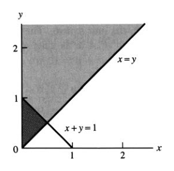
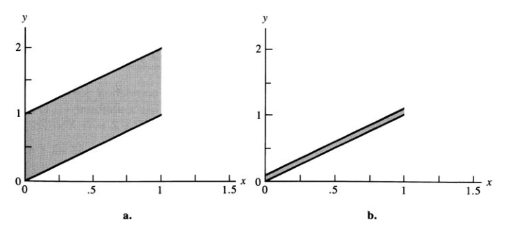
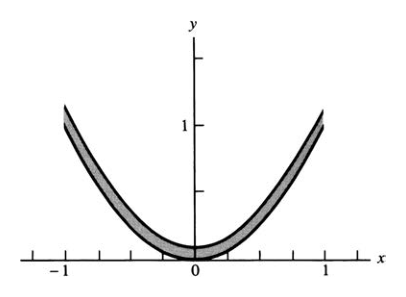
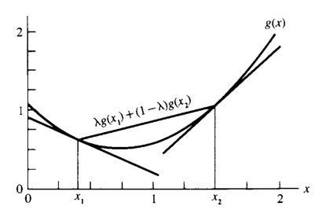
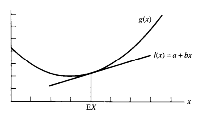

# 여러 확률변수 {#chapter4}

> “I confess that I have been blind as a mole, but it is better to learn wisdom late than never to learn it at all.”  
> — Sherlock Holmes, *The Man with the Twisted Lip*

- 앞 장들에서는 하나의 확률변수만 포함하는 확률모형을 주로 다루었다.
- 이런 모형을 **일변량 모형(univariate model)**이라고 한다.
- 실제 자료에서는 하나의 숫자만 관측되는 경우가 드물다.
- 보통은 여러 사람의 체중, 한 사람의 키·체중·혈압·체온, 여러 시점의 측정값처럼 여러 확률변수를 동시에 관측한다.
- 이 장에서는 둘 이상의 확률변수를 동시에 다루는 **다변량 모형(multivariate model)**을 공부한다.
- 초반부는 특히 두 확률변수 $(X,Y)$를 다루는 **이변량 모형(bivariate model)**에 집중한다.

## 결합분포와 주변분포 {#sec-4-1}

### 확률벡터

- 일변량 확률변수는 표본공간 $S$에서 실수집합으로 가는 함수이다.
- 여러 확률변수를 동시에 다루면 확률벡터가 된다.

#### 정의

- $n$차원 확률벡터는 표본공간 $S$에서 $n$차원 유클리드 공간 $\mathbb R^n$으로 가는 함수이다.
- 예를 들어 표본공간의 각 점에 순서쌍 $(x,y)\in\mathbb R^2$를 대응시키면 이변량 확률벡터 $(X,Y)$가 정의된다.

### 예제: 주사위 표본공간

- 공정한 주사위 두 개를 던지는 실험을 생각하자.
- 표본공간에는 36개의 동일가능한 점이 있다.
- 예:
  - $(3,3)$: 두 주사위가 모두 3
  - $(4,1)$: 첫 번째 주사위가 4, 두 번째 주사위가 1

- 각 표본점에 두 값을 대응시킨다.

$$
X=\text{두 주사위 눈의 합},
\qquad
Y=|\text{두 주사위 눈의 차}|.
$$

- 예를 들어
  - 표본점 $(3,3)$에서는 $X=6$, $Y=0$
  - 표본점 $(4,1)$에서는 $X=5$, $Y=3$
  - 표본점 $(1,4)$에서도 $X=5$, $Y=3$

- 따라서

$$
P(X=5,Y=3)=\frac{2}{36}=\frac{1}{18}.
$$

- 또한 $(3,3)$ 하나만 $X=6,Y=0$을 만들므로

$$
P(X=6,Y=0)=\frac{1}{36}.
$$

- 더 복잡한 사건도 같은 방식으로 계산한다.
- 예를 들어 $X=7$이고 $Y\le4$인 표본점은 $(4,3),(3,4),(5,2),(2,5)$이므로

$$
P(X=7,Y\le4)=\frac{4}{36}=\frac19.
$$

### 결합확률질량함수

#### 정의

- $(X,Y)$가 이산형 이변량 확률벡터일 때

$$
f(x,y)=P(X=x,Y=y)
$$

를 $(X,Y)$의 **결합확률질량함수(joint pmf)**라고 한다.
- 필요하면

$$
f_{X,Y}(x,y)
$$

라고 써서 어떤 확률벡터의 결합 pmf인지 명시한다.

- 결합 pmf는 확률벡터 $(X,Y)$의 분포를 완전히 정의한다.
- 임의의 집합 $A\subset\mathbb R^2$에 대해

$$
P((X,Y)\in A)
=
\sum_{(x,y)\in A}f(x,y).
$$

- 이산형 확률벡터에서는 $A$가 무한하거나 비가산집합처럼 보이더라도 실제로는 $f(x,y)>0$인 점들만 합하면 된다.

### 결합 pmf와 기댓값

- $g(x,y)$가 $(X,Y)$의 가능한 값들에서 정의된 실수값 함수라면 $g(X,Y)$는 확률변수이다.
- 기댓값은

$$
E[g(X,Y)]
=
\sum_{(x,y)\in\mathbb R^2}
g(x,y)f(x,y).
$$

### 예제: $EXY$ 계산

- 주사위 예제에서 $g(x,y)=xy$라고 두면

$$
EXY
=
\sum_{(x,y)}xyf(x,y).
$$

- 가능한 $(x,y)$ 값 21개에 대해 $xyf(x,y)$를 모두 더하면 된다.
- 이 방식은 표본공간을 직접 추적하는 것보다 결합 pmf를 이용하는 계산이 더 간단함을 보여준다.

### 결합 pmf의 조건

- 어떤 함수 $f(x,y)$가 이산형 확률벡터의 결합 pmf가 되려면 다음을 만족해야 한다.

$$
f(x,y)\ge0
\quad\text{for all }(x,y),
$$

$$
\sum_{(x,y)\in\mathbb R^2}f(x,y)=1.
$$

- 이 조건을 만족하면 실제 표본공간을 명시하지 않아도 $(X,Y)$의 확률모형을 정의할 수 있다.

### 예제: 결합 pmf 정의

- 다음처럼 정의하자.

$$
f(0,0)=f(0,1)=\frac16,
$$

$$
f(1,0)=f(1,1)=\frac13,
$$

- 그 외의 $(x,y)$에서는 $f(x,y)=0$이다.
- 전체 합은

$$
\frac16+\frac16+\frac13+\frac13=1
$$

이므로 이는 어떤 이변량 확률벡터의 결합 pmf이다.
- 예를 들어

$$
P(X=Y)=f(0,0)+f(1,1)=\frac12.
$$

### 주변분포

- 결합분포가 있더라도 때로는 $X$만 또는 $Y$만의 분포가 필요하다.
- $X$의 pmf를 결합모형의 맥락에서 **주변 pmf(marginal pmf)**라고 부른다.

#### 정리

- $(X,Y)$가 결합 pmf $f_{X,Y}(x,y)$를 갖는 이산형 확률벡터라면 주변 pmf는

$$
f_X(x)=\sum_{y\in\mathbb R}f_{X,Y}(x,y),
$$

$$
f_Y(y)=\sum_{x\in\mathbb R}f_{X,Y}(x,y).
$$

- 즉, 관심 없는 변수를 모두 더해 제거한다.

### 예제: 주사위의 주변 pmf

- 주사위 예제에서 $Y=0$이 되는 경우는 두 주사위가 같은 경우이다.
- 따라서

$$
f_Y(0)=\frac16.
$$

- 마찬가지로

$$
f_Y(1)=\frac{5}{18},\quad
f_Y(2)=\frac29,\quad
f_Y(3)=\frac16,\quad
f_Y(4)=\frac19,\quad
f_Y(5)=\frac1{18}.
$$

- 이 값들의 합은 1이다.
- 주변 pmf는 $Y$만 포함하는 확률이나 기댓값을 계산할 때 사용한다.

### 예제: 주변 pmf로 확률과 기댓값 계산

- 위 주변분포에서

$$
P(Y<3)
=
f_Y(0)+f_Y(1)+f_Y(2)
=
\frac16+\frac5{18}+\frac29
=
\frac23.
$$

- 또한

$$
EY^3
=
\sum_y y^3f_Y(y).
$$

**주변분포만으로는 결합분포를 알 수 없다.**

- 결합분포는 주변분포보다 더 많은 정보를 담고 있다.
- 같은 주변분포를 가지는 서로 다른 결합분포가 많다.
- 따라서 $f_X(x)$와 $f_Y(y)$만 알아서는 일반적으로 $f_{X,Y}(x,y)$를 복원할 수 없다.
- 두 변수 사이의 관계 또는 의존구조는 결합분포에 포함된다.

### 연속형 결합 pdf

#### 정의

- 함수 $f(x,y)$가 연속형 이변량 확률벡터 $(X,Y)$의 결합확률밀도함수(joint pdf)라는 것은 모든 $A\subset\mathbb R^2$에 대해

$$
P((X,Y)\in A)
=
\iint_A f(x,y)\,dx\,dy
$$

가 성립한다는 뜻이다.

- 결합 pdf는 다음 조건을 만족한다.

$$
f(x,y)\ge0
\quad\text{for all }(x,y),
$$

$$
\int_{-\infty}^{\infty}
\int_{-\infty}^{\infty}
f(x,y)\,dx\,dy
=
1.
$$

### 연속형에서 기댓값과 주변 pdf

- $g(X,Y)$의 기댓값은

$$
E[g(X,Y)]
=
\int_{-\infty}^{\infty}
\int_{-\infty}^{\infty}
g(x,y)f(x,y)\,dx\,dy.
\tag{4.1.2}
$$

- 주변 pdf는

$$
f_X(x)=
\int_{-\infty}^{\infty}f(x,y)\,dy,
\qquad -\infty<x<\infty,
\tag{4.1.3}
$$

$$
f_Y(y)=
\int_{-\infty}^{\infty}f(x,y)\,dx,
\qquad -\infty<y<\infty.
$$

### 예제: 결합확률 계산 I

- 다음 결합 pdf를 생각하자.

$$
f(x,y)=
\begin{cases}
6xy^2, & 0<x<1,\;0<y<1,\\
0, & \text{otherwise}.
\end{cases}
$$

- 전체 적분은

$$
\int_0^1\int_0^1 6xy^2\,dx\,dy=1
$$

이므로 올바른 결합 pdf이다.

- $P(X+Y\ge1)$을 구하려면 단위정사각형 안에서 $x+y\ge1$인 영역에 대해 적분한다.

$$
P(X+Y\ge1)
=
\int_0^1\int_{1-y}^{1}6xy^2\,dx\,dy
=
\frac9{10}.
$$

- $X$의 주변 pdf는

$$
f_X(x)=\int_0^1 6xy^2\,dy=2x,
\qquad 0<x<1.
$$

- 따라서

$$
P\left(\frac12<X<\frac34\right)
=
\int_{1/2}^{3/4}2x\,dx
=
\frac5{16}.
$$

### 예제: 결합확률 계산 II

- 다음 결합 pdf를 생각하자.

$$
f(x,y)=e^{-y},
\qquad 0<x<y<\infty.
$$

- 지지집합은 $0<x<y<\infty$이다.
- $P(X+Y\ge1)$을 직접 적분할 수도 있지만, 여집합 $X+Y<1$을 사용하는 것이 더 쉽다.
- 아래 그림은 관련 영역을 보여준다.

- 계산은

$$
\begin{aligned}
P(X+Y\ge1)
&=
1-P(X+Y<1)\\
&=
1-\int_0^{1/2}\int_x^{1-x}e^{-y}\,dy\,dx\\
&=
2e^{-1/2}-e^{-1}.
\end{aligned}
$$

- 이 예제의 핵심:
  - 이변량 적분에서는 영역 그림을 그리는 것이 매우 중요하다.
  - 지지집합과 사건 영역의 교집합을 정확히 파악해야 한다.

### 결합 cdf

- 결합누적분포함수는

$$
F(x,y)=P(X\le x,Y\le y)
$$

로 정의된다.

- 연속형 이변량 확률벡터에서는

$$
F(x,y)=
\int_{-\infty}^{x}
\int_{-\infty}^{y}
f(s,t)\,dt\,ds.
$$

- 이변량 미적분의 기본정리에 의해 pdf의 연속점에서

$$
\frac{\partial^2 F(x,y)}{\partial x\,\partial y}
=
f(x,y).
\tag{4.1.4}
$$

## 조건부분포와 독립성 {#sec-4-2}

- 두 확률변수 $(X,Y)$가 관측될 때 두 변수의 값은 서로 관련될 수 있다.
- 예:
  - 사람의 키 $X$와 체중 $Y$
  - 키가 73인치라는 정보는 체중이 200파운드 이상일 가능성에 영향을 준다.
- 이런 관계를 다루기 위해 조건부분포가 필요하다.
- 반대로 $X$를 알아도 $Y$에 대한 정보가 전혀 늘지 않는 경우를 독립이라고 한다.

### 이산형 조건부 pmf

#### 정의

- $(X,Y)$가 결합 pmf $f(x,y)$와 주변 pmf $f_X(x)$, $f_Y(y)$를 갖는다고 하자.
- $f_X(x)>0$인 $x$에 대해 $Y$의 조건부 pmf는

$$
f(y\mid x)
=
P(Y=y\mid X=x)
=
\frac{f(x,y)}{f_X(x)}.
$$

- $f_Y(y)>0$인 $y$에 대해 $X$의 조건부 pmf는

$$
f(x\mid y)
=
P(X=x\mid Y=y)
=
\frac{f(x,y)}{f_Y(y)}.
$$

### 예제: 조건부확률 계산

- 결합 pmf가 다음과 같다고 하자.

$$
f(0,10)=f(0,20)=\frac2{18},
$$

$$
f(1,10)=f(1,30)=\frac3{18},
$$

$$
f(1,20)=\frac4{18},
\qquad
f(2,30)=\frac4{18}.
$$

- 주변 pmf는

$$
f_X(0)=\frac4{18},
\qquad
f_X(1)=\frac{10}{18},
\qquad
f_X(2)=\frac4{18}.
$$

- $X=0$일 때

$$
f(10\mid0)=\frac{2/18}{4/18}=\frac12,
\qquad
f(20\mid0)=\frac12.
$$

- $X=1$일 때

$$
f(10\mid1)=\frac3{10},
\qquad
f(20\mid1)=\frac4{10},
\qquad
f(30\mid1)=\frac3{10}.
$$

- $X=2$일 때는

$$
f(30\mid2)=1.
$$

- 따라서

$$
P(Y>10\mid X=1)=\frac7{10},
\qquad
P(Y>10\mid X=0)=\frac12.
$$

### 연속형 조건부 pdf

- 연속형에서는 $P(X=x)=0$이므로 사건 $X=x$로 조건부확률을 직접 정의할 수 없다.
- 그러나 pdf를 이용하면 이산형과 유사한 형태로 조건부 pdf를 정의할 수 있다.

#### 정의

- $(X,Y)$가 결합 pdf $f(x,y)$와 주변 pdf $f_X(x),f_Y(y)$를 갖는다고 하자.
- $f_X(x)>0$인 $x$에 대해

$$
f(y\mid x)
=
\frac{f(x,y)}{f_X(x)}
$$

를 $X=x$가 주어졌을 때 $Y$의 조건부 pdf라고 한다.

- $f_Y(y)>0$인 $y$에 대해

$$
f(x\mid y)
=
\frac{f(x,y)}{f_Y(y)}
$$

를 $Y=y$가 주어졌을 때 $X$의 조건부 pdf라고 한다.

### 조건부기댓값과 조건부분산

- $g(Y)$의 조건부기댓값은 이산형에서

$$
E[g(Y)\mid x]
=
\sum_y g(y)f(y\mid x)
$$

이고, 연속형에서

$$
E[g(Y)\mid x]
=
\int_{-\infty}^{\infty}g(y)f(y\mid x)\,dy
$$

이다.

- $E[g(Y)\mid X]$는 $X$의 값에 따라 달라지는 확률변수이다.
- 조건부기댓값은 $X$를 알고 있을 때 $Y$에 대한 최적 예측값 역할을 한다.

### 예제: 조건부 pdf 계산

- 예제 4.1.12처럼

$$
f(x,y)=e^{-y},
\qquad 0<x<y<\infty
$$

라고 하자.

- $X$의 주변 pdf는 $x>0$에서

$$
f_X(x)=\int_x^\infty e^{-y}\,dy=e^{-x}.
$$

- 따라서 $x>0$에서

$$
f(y\mid x)
=
\frac{e^{-y}}{e^{-x}}
=
e^{-(y-x)},
\qquad y>x.
$$

- 이는 위치모수가 $x$이고 척도모수가 1인 지수분포이다.
- 조건부 평균은

$$
E(Y\mid X=x)=
\int_x^\infty y e^{-(y-x)}\,dy
=
1+x.
$$

- 조건부분산은

$$
Var(Y\mid x)=1.
$$

- 주변적으로는 $Y\sim Gamma(2,1)$이라서 $Var(Y)=2$이다.
- $X=x$를 알면 $Y$의 변동성이 줄어든다.

### 조건부분포의 가족

- $Y\mid X$라는 표현은 $X=x$의 각 값마다 달라지는 조건부분포의 전체 가족을 의미한다.
- 예를 들어

$$
Y\mid X\sim Binomial(X,p)
$$

라고 쓰면, $X=x$일 때

$$
Y\mid X=x\sim Binomial(x,p)
$$

라는 뜻이다.

- 결합분포는 조건부분포와 주변분포를 곱해 정의할 수도 있다.

$$
f(x,y)=f(y\mid x)f_X(x).
$$

### 독립성

#### 정의

- $(X,Y)$가 결합 pdf 또는 pmf $f(x,y)$와 주변 pdf 또는 pmf $f_X(x)$, $f_Y(y)$를 갖는다고 하자.
- 모든 $x,y$에 대해

$$
f(x,y)=f_X(x)f_Y(y)
\tag{4.2.1}
$$

가 성립하면 $X$와 $Y$는 독립이다.

- 독립이면

$$
f(y\mid x)=f_Y(y)
$$

가 되어 $X=x$를 알아도 $Y$의 분포가 바뀌지 않는다.

### 예제: 독립성 확인 I

- 어떤 결합 pmf에서 주변분포를 구한 뒤 식 (4.2.1)을 모든 $(x,y)$에 대해 확인해야 한다.
- 일부 점에서만 성립한다고 독립이 되는 것은 아니다.
- 예를 들어

$$
f(10,3)\ne f_X(10)f_Y(3)
$$

이면 독립이 아니다.

### 보조정리: 인수분해 기준

- $(X,Y)$가 결합 pdf 또는 pmf $f(x,y)$를 가질 때 다음은 동치이다.
  - $X$와 $Y$가 독립이다.
  - 어떤 함수 $g(x)$와 $h(y)$가 존재하여 모든 $x,y$에 대해

$$
f(x,y)=g(x)h(y)
$$

로 쓸 수 있다.

- 이 기준은 주변분포를 직접 계산하지 않고 독립성을 확인할 때 유용하다.

### 예제: 독립성 확인 II

- 결합 pdf가

$$
f(x,y)=\frac{1}{384}x^2y^4e^{-y-x/2},
\qquad x>0,\;y>0
$$

라고 하자.
- 이를

$$
g(x)=x^2e^{-x/2}I(x>0),
$$

$$
h(y)=\frac{y^4e^{-y}}{384}I(y>0)
$$

로 쓸 수 있으므로

$$
f(x,y)=g(x)h(y).
$$

- 따라서 $X$와 $Y$는 독립이다.

### 지지집합과 독립성

- 독립이면 $f(x,y)>0$인 영역은 보통 $A\times B$ 형태의 cross-product가 된다.
- 즉 $x$의 가능범위와 $y$의 가능범위를 따로 판단할 수 있어야 한다.
- 예제 4.2.4의 지지집합

$$
0<x<y<\infty
$$

는 cross-product가 아니다.
- 따라서 그 경우 $X$와 $Y$는 독립이 아니다.

### 정리: 독립확률변수의 확률과 기댓값

- $X$와 $Y$가 독립이면 다음이 성립한다.

1. 임의의 $A,B\subset\mathbb R$에 대해

$$
P(X\in A,Y\in B)=P(X\in A)P(Y\in B).
$$

2. $g(x)$가 $x$만의 함수이고 $h(y)$가 $y$만의 함수이면

$$
E[g(X)h(Y)]
=
E[g(X)]E[h(Y)].
$$

### 예제: 독립변수의 기댓값

- $X,Y$가 독립 exponential$(1)$ 확률변수라고 하자.
- 그러면

$$
P(X\ge4,Y<3)=P(X\ge4)P(Y<3)=e^{-4}(1-e^{-3}).
$$

- 또한

$$
E(X^2Y)=E(X^2)E(Y).
$$

- exponential$(1)$에서 $EX=1$, $Var(X)=1$이므로

$$
EX^2=Var(X)+(EX)^2=2.
$$

- 따라서

$$
E(X^2Y)=2.
$$

### 정리: 독립합의 mgf

- $X$와 $Y$가 독립이고 mgf가 각각 $M_X(t)$, $M_Y(t)$이면 $Z=X+Y$의 mgf는

$$
M_Z(t)=M_X(t)M_Y(t).
$$

### 예제: 정규합의 mgf

- $X\sim N(\mu,\sigma^2)$, $Y\sim N(\gamma,\tau^2)$가 독립이면

$$
M_X(t)=\exp\left(\mu t+\frac{\sigma^2t^2}{2}\right),
$$

$$
M_Y(t)=\exp\left(\gamma t+\frac{\tau^2t^2}{2}\right).
$$

- 따라서 $Z=X+Y$의 mgf는

$$
M_Z(t)=
\exp\left((\mu+\gamma)t+\frac{(\sigma^2+\tau^2)t^2}{2}\right).
$$

- 이는

$$
Z\sim N(\mu+\gamma,\sigma^2+\tau^2)
$$

임을 의미한다.

#### 정리

- $X\sim N(\mu,\sigma^2)$, $Y\sim N(\gamma,\tau^2)$가 독립이면

$$
X+Y\sim N(\mu+\gamma,\sigma^2+\tau^2).
$$

## 이변량 변환 {#sec-4-3}

- 2장에서는 하나의 확률변수의 함수 $Y=g(X)$의 분포를 구했다.
- 여기서는 이변량 확률벡터 $(X,Y)$를 새로운 벡터 $(U,V)$로 변환하는 방법을 다룬다.

$$
U=g_1(X,Y),
\qquad
V=g_2(X,Y).
$$

### 이산형 변환

- $(X,Y)$가 이산형이고 결합 pmf가 $f_{X,Y}(x,y)$라고 하자.
- 가능한 $(x,y)$의 집합을 $A$라고 하자.
- 가능한 $(u,v)$의 집합은

$$
B=\{(u,v):u=g_1(x,y),\;v=g_2(x,y)\text{ for some }(x,y)\in A\}.
$$

- 특정 $(u,v)\in B$에 대해

$$
A_{uv}=
\{(x,y)\in A:g_1(x,y)=u,\;g_2(x,y)=v\}
$$

라고 하면

$$
f_{U,V}(u,v)
=
\sum_{(x,y)\in A_{uv}}f_{X,Y}(x,y).
\tag{4.3.1}
$$

### 예제: 독립 포아송합의 분포

- $X\sim Poisson(\theta)$, $Y\sim Poisson(\lambda)$가 독립이라고 하자.
- 그러면

$$
f_{X,Y}(x,y)
=
\frac{\theta^xe^{-\theta}}{x!}
\frac{\lambda^ye^{-\lambda}}{y!}.
$$

- 변환을

$$
U=X+Y,
\qquad
V=Y
$$

로 둔다.

- 역변환은

$$
x=u-v,
\qquad
y=v.
$$

- 가능한 값은

$$
v=0,1,2,\ldots,
\qquad
u=v,v+1,v+2,\ldots.
$$

- 따라서

$$
f_{U,V}(u,v)
=
\frac{\theta^{u-v}e^{-\theta}}{(u-v)!}
\frac{\lambda^ve^{-\lambda}}{v!}.
$$

- $U$의 주변 pmf는

$$
\begin{aligned}
f_U(u)
&=
\sum_{v=0}^{u}
\frac{\theta^{u-v}e^{-\theta}}{(u-v)!}
\frac{\lambda^ve^{-\lambda}}{v!}\\
&=
\frac{e^{-(\theta+\lambda)}}{u!}
\sum_{v=0}^{u}
\binom{u}{v}\lambda^v\theta^{u-v}\\
&=
\frac{e^{-(\theta+\lambda)}(\theta+\lambda)^u}{u!}.
\end{aligned}
$$

- 따라서

$$
X+Y\sim Poisson(\theta+\lambda).
$$

#### 정리

- $X\sim Poisson(\theta)$, $Y\sim Poisson(\lambda)$가 독립이면

$$
X+Y\sim Poisson(\theta+\lambda).
$$

### 연속형 일대일 변환과 야코비안

- $(X,Y)$가 결합 pdf $f_{X,Y}(x,y)$를 갖는다고 하자.
- 변환

$$
u=g_1(x,y),
\qquad
v=g_2(x,y)
$$

가 지지집합 $A$에서 $B$로 일대일 대응이라고 하자.
- 역변환을

$$
x=h_1(u,v),
\qquad
y=h_2(u,v)
$$

라고 한다.

- 야코비안은

$$
J=
\begin{vmatrix}
\dfrac{\partial x}{\partial u} & \dfrac{\partial x}{\partial v}\\[6pt]
\dfrac{\partial y}{\partial u} & \dfrac{\partial y}{\partial v}
\end{vmatrix}
=
\frac{\partial x}{\partial u}
\frac{\partial y}{\partial v}
-
\frac{\partial y}{\partial u}
\frac{\partial x}{\partial v}.
$$

- 그러면 $(U,V)$의 결합 pdf는

$$
f_{U,V}(u,v)
=
f_{X,Y}(h_1(u,v),h_2(u,v))|J|,
\qquad (u,v)\in B.
\tag{4.3.2}
$$

### 예제: 베타 확률변수 곱의 분포

- $X\sim Beta(\alpha,\beta)$, $Y\sim Beta(\alpha+\beta,\gamma)$가 독립이라고 하자.
- 변환을

$$
U=XY,
\qquad
V=X
$$

로 둔다.

- 역변환은

$$
x=v,
\qquad
y=\frac{u}{v}.
$$

- 가능한 영역은

$$
0<u<v<1.
$$

- 야코비안은

$$
J=-\frac1v,
\qquad |J|=\frac1v.
$$

- 변환공식을 사용하면 $(U,V)$의 결합 pdf를 얻고, $V$를 적분해 제거하면

$$
U\sim Beta(\alpha,\beta+\gamma).
$$

- 이 예제는 독립 베타변수의 곱이 다시 베타분포와 연결될 수 있음을 보여준다.

### 예제: 독립 표준정규의 합과 차

- $X,Y$가 독립 표준정규라고 하자.
- 변환을

$$
U=X+Y,
\qquad
V=X-Y
$$

로 둔다.

- 역변환은

$$
x=\frac{u+v}{2},
\qquad
y=\frac{u-v}{2}.
\tag{4.3.5}
$$

- 야코비안은

$$
J=-\frac12,
\qquad |J|=\frac12.
$$

- 변환공식을 적용하면 결합 pdf가

$$
f_{U,V}(u,v)
=
\left[
\frac{1}{\sqrt{2\pi}\sqrt2}e^{-u^2/4}
\right]
\left[
\frac{1}{\sqrt{2\pi}\sqrt2}e^{-v^2/4}
\right]
$$

처럼 $u$의 함수와 $v$의 함수의 곱으로 분해된다.
- 따라서 $U$와 $V$는 독립이다.
- 또한

$$
U\sim N(0,2),
\qquad
V\sim N(0,2).
$$

### 정리: 독립변수의 각각의 함수도 독립

- $X$와 $Y$가 독립이라고 하자.
- $g(x)$는 $x$만의 함수이고 $h(y)$는 $y$만의 함수라면

$$
U=g(X),
\qquad
V=h(Y)
$$

는 독립이다.

### 다대일 변환

- 변환이 전체 지지집합에서 일대일이 아니면, 지지집합을 여러 부분으로 나눈다.
- 각 부분 $A_i$에서 변환이 일대일이면 각 역변환의 기여를 더한다.

$$
f_{U,V}(u,v)
=
\sum_{i=1}^{k}
f_{X,Y}(h_{1i}(u,v),h_{2i}(u,v))|J_i|.
\tag{4.3.6}
$$

### 예제: 독립 표준정규 비율의 분포

- $X,Y$가 독립 $N(0,1)$이라고 하자.
- 변환을

$$
U=\frac{X}{Y},
\qquad
V=|Y|
$$

로 둔다.
- $Y=0$은 확률 0이므로 무시할 수 있다.
- 변환은 $y>0$과 $y<0$에서 각각 일대일이다.

- 두 역변환은
  - $y>0$: $x=uv,\;y=v$
  - $y<0$: $x=-uv,\;y=-v$

- 두 경우 모두 야코비안은 $v$이다.
- 따라서

$$
f_{U,V}(u,v)
=
\frac{v}{\pi}e^{-(u^2+1)v^2/2},
\qquad -\infty<u<\infty,\;v>0.
$$

- $v$를 적분하면

$$
f_U(u)=
\frac{1}{\pi(1+u^2)},
\qquad -\infty<u<\infty.
$$

- 즉, 독립 표준정규의 비율은 표준 코시분포를 따른다.

$$
\frac{X}{Y}\sim Cauchy(0).
$$

## 계층모형과 혼합분포 {#sec-4-4}

- 어떤 확률변수는 하나의 분포로 바로 표현할 수 있지만, 실제 현상은 여러 단계의 조건부 구조로 이해하는 것이 더 자연스러울 수 있다.
- 이런 모형을 **계층모형(hierarchical model)**이라고 한다.
- 계층모형은 복잡한 과정을 단순한 조건부 모형들의 조합으로 표현한다.

### 예제: 이항-포아송 계층

- 곤충이 많은 수의 알을 낳고, 각 알은 확률 $p$로 생존한다고 하자.
- 알의 개수 자체도 랜덤이며 평균 $\lambda$인 포아송분포를 따른다고 하자.
- 다음과 같이 둔다.
  - $Y$: 낳은 알의 수
  - $X$: 생존한 알의 수

- 계층모형은

$$
X\mid Y\sim Binomial(Y,p),
$$

$$
Y\sim Poisson(\lambda).
$$

### 예제: 생존 알 수의 주변분포

- 관심변수는 $X$이다.
- 주변 pmf는

$$
P(X=x)
=
\sum_{y=0}^{\infty}
P(X=x\mid Y=y)P(Y=y).
$$

- $X=x$가 되려면 $y\ge x$이어야 한다.

$$
P(X=x)
=
\sum_{y=x}^{\infty}
\binom{y}{x}
p^x(1-p)^{y-x}
\frac{e^{-\lambda}\lambda^y}{y!}.
$$

- 정리하면

$$
P(X=x)
=
\frac{(\lambda p)^x}{x!}e^{-\lambda p}.
$$

- 따라서

$$
X\sim Poisson(\lambda p).
$$

- 평균은

$$
EX=\lambda p.
$$

### 반복기대값 법칙

#### 정리

- 임의의 두 확률변수 $X,Y$에 대해 기댓값이 존재하면

$$
EX=E[E(X\mid Y)].
\tag{4.4.1}
$$

- 이를 반복기대값 법칙, 전체기대값 법칙이라고 한다.
- 계층모형에서 평균을 계산할 때 매우 유용하다.

- 예제 4.4.1에서는

$$
EX=E[E(X\mid Y)]
=
E[pY]
=
p\lambda.
$$

### 혼합분포

#### 정의

- $X$의 분포가 또 다른 분포를 가진 양에 의존할 때 $X$는 혼합분포(mixture distribution)를 갖는다고 한다.
- 계층모형은 일반적으로 혼합분포를 만든다.
- 예제 4.4.1에서 $Poisson(\lambda p)$는 $Binomial(Y,p)$와 $Y\sim Poisson(\lambda)$의 혼합 결과이다.

### 예제: 세 단계 계층모형

- 여러 어미 곤충이 있고, 어미마다 알 낳는 능력이 다를 수 있다고 하자.
- 다음 계층모형을 생각한다.

$$
X\mid Y\sim Binomial(Y,p),
$$

$$
Y\mid \Lambda\sim Poisson(\Lambda),
$$

$$
\Lambda\sim Exponential(\beta).
$$

- 평균은 반복기대값으로 쉽게 계산된다.

$$
\begin{aligned}
EX
&=E[E(X\mid Y)]\\
&=E[pY]\\
&=E[E(pY\mid\Lambda)]\\
&=E[p\Lambda]\\
&=p\beta.
\end{aligned}
$$

- 이 3단계 계층은 2단계 계층으로 압축될 수도 있다.
- $Y\mid\Lambda\sim Poisson(\Lambda)$, $\Lambda\sim Exponential(\beta)$이면 $Y$의 주변분포는 음이항분포가 된다.
- 그러나 모형 해석 측면에서는 3단계 구조가 더 직관적일 수 있다.

### 포아송-감마 혼합

- 더 일반적으로

$$
Y\mid\Lambda\sim Poisson(\Lambda),
$$

$$
\Lambda\sim Gamma(\alpha,\beta)
$$

이면 $Y$의 주변분포는 음이항분포이다.
- 이는 음이항분포를 “더 변동성이 큰 포아송분포”로 해석하게 해준다.

### 비중심 카이제곱분포의 혼합표현

- 비중심 카이제곱분포는 복잡한 pdf를 갖지만, 다음 계층모형으로 이해할 수 있다.

$$
X\mid K\sim \chi^2_{p+2K},
$$

$$
K\sim Poisson(\lambda).
$$

- 그러면 $X$의 주변분포가 비중심 카이제곱분포이다.
- 평균은

$$
EX=E[E(X\mid K)]
=
E[p+2K]
=
p+2\lambda.
$$

### 예제: 베타-이항 계층

- 성공확률 자체가 랜덤이라고 하자.

$$
X\mid P\sim Binomial(n,P),
$$

$$
P\sim Beta(\alpha,\beta).
$$

- 평균은

$$
EX=E[E(X\mid P)]
=
E[nP]
=
n\frac{\alpha}{\alpha+\beta}.
$$

### 조건부분산 항등식

#### 정리

- 임의의 두 확률변수 $X,Y$에 대해

$$
Var(X)
=
E[Var(X\mid Y)]
+
Var(E(X\mid Y)).
\tag{4.4.4}
$$

- 해석:
  - 전체 변동성 = 조건부 내부 변동성의 평균 + 조건부 평균의 변동성
  - 즉, “그룹 내부 변동”과 “그룹 간 평균 변동”으로 분해된다.

### 예제: 베타-이항분포의 분산

- 앞의 베타-이항 계층에서

$$
E(X\mid P)=nP,
$$

$$
Var(X\mid P)=nP(1-P).
$$

- 따라서

$$
Var(E(X\mid P))
=
Var(nP)
=
n^2\frac{\alpha\beta}{(\alpha+\beta)^2(\alpha+\beta+1)}.
$$

- 또한

$$
E[Var(X\mid P)]
=
nE[P(1-P)]
=
n\frac{\alpha\beta}{(\alpha+\beta)(\alpha+\beta+1)}.
$$

- 두 항을 더하면

$$
Var(X)
=
n\frac{\alpha\beta(\alpha+\beta+n)}
{(\alpha+\beta)^2(\alpha+\beta+1)}.
$$

## 공분산과 상관 {#sec-4-5}

- 독립인지 아닌지는 두 확률변수의 관계 유무를 말한다.
- 하지만 관계가 있다면 얼마나 강한지도 알고 싶다.
- 공분산과 상관계수는 두 확률변수 사이의 선형관계 강도를 측정한다.

### 정의: 공분산

- $EX=\mu_X$, $EY=\mu_Y$라고 하자.
- $X$와 $Y$의 공분산은

$$
Cov(X,Y)
=
E[(X-\mu_X)(Y-\mu_Y)].
$$

### 정의: 상관계수

- $Var(X)=\sigma_X^2$, $Var(Y)=\sigma_Y^2$이고 둘 다 양수라고 하자.
- 상관계수는

$$
\rho_{XY}
=
\frac{Cov(X,Y)}{\sigma_X\sigma_Y}.
$$

### 공분산의 부호

- 큰 $X$가 큰 $Y$와 함께 나타나고 작은 $X$가 작은 $Y$와 함께 나타나면 공분산은 양수이다.
- 큰 $X$가 작은 $Y$와 함께 나타나는 경향이 있으면 공분산은 음수이다.
- 공분산의 크기는 단위에 의존하므로 직접 해석하기 어렵다.
- 상관계수는 항상 $-1$과 $1$ 사이이므로 관계 강도를 비교하기 좋다.

### 정리

- 임의의 확률변수 $X,Y$에 대해

$$
Cov(X,Y)=EXY-\mu_X\mu_Y.
$$

### 예제: 상관계산 I

- 결합 pdf가

$$
f(x,y)=1,
\qquad 0<x<1,\quad x<y<x+1
$$

라고 하자.

- $X$의 주변분포는 uniform$(0,1)$이므로

$$
\mu_X=\frac12,
\qquad
\sigma_X^2=\frac1{12}.
$$

- $Y$의 주변분포는

$$
f_Y(y)=y,\quad 0<y<1,
$$

$$
f_Y(y)=2-y,\quad 1\le y<2.
$$

- 이로부터

$$
\mu_Y=1,
\qquad
\sigma_Y^2=\frac16.
$$

- 또한

$$
EXY
=
\int_0^1\int_x^{x+1}xy\,dy\,dx
=
\frac7{12}.
$$

- 따라서

$$
Cov(X,Y)=\frac7{12}-\frac12\cdot1=\frac1{12}.
$$

- 상관계수는

$$
\rho_{XY}
=
\frac{1/12}{\sqrt{1/12}\sqrt{1/6}}
=
\frac1{\sqrt2}.
$$

### 정리: 독립이면 공분산 0

- $X$와 $Y$가 독립이면

$$
Cov(X,Y)=0,
\qquad
\rho_{XY}=0.
$$

- 주의:
  - 역은 일반적으로 성립하지 않는다.
  - 공분산이 0이어도 두 변수가 독립일 필요는 없다.
  - 공분산과 상관은 선형관계만 측정한다.

### 정리: 선형결합의 분산

- 임의의 확률변수 $X,Y$와 상수 $a,b$에 대해

$$
Var(aX+bY)
=
a^2Var(X)+b^2Var(Y)+2abCov(X,Y).
$$

- $X$와 $Y$가 독립이면 공분산이 0이므로

$$
Var(aX+bY)
=
a^2Var(X)+b^2Var(Y).
$$

- 양의 공분산이면 합의 분산이 커지고, 음의 공분산이면 합의 분산이 줄어든다.

### 정리: 상관계수의 범위와 완전선형관계

- 임의의 확률변수 $X,Y$에 대해

$$
-1\le\rho_{XY}\le1.
$$

- 또한

$$
|\rho_{XY}|=1
$$

일 필요충분조건은 어떤 $a\ne0$, $b$가 존재하여

$$
P(Y=aX+b)=1
$$

인 것이다.
- $\rho_{XY}=1$이면 $a>0$이고, $\rho_{XY}=-1$이면 $a<0$이다.

### 예제: 상관계산 II

- $X\sim Uniform(0,1)$, $Z\sim Uniform(0,1/10)$가 독립이라고 하자.
- $Y=X+Z$라고 하자.
- 그러면 조건부분포 $Y\mid X=x$는

$$
Uniform\left(x,x+\frac1{10}\right)
$$

이다.
- 결합 pdf는

$$
f(x,y)=10,
\qquad 0<x<1,\quad x<y<x+\frac1{10}.
$$

- 계산하면

$$
Cov(X,Y)=Var(X)=\frac1{12}.
$$

- 또한

$$
Var(Y)=Var(X)+Var(Z)
=
\frac1{12}+\frac1{1200}.
$$

- 따라서

$$
\rho_{XY}
=
\sqrt{\frac{100}{101}}.
$$

- 예제 4.5.4보다 상관이 훨씬 크다.
- 이유는 지지집합이 훨씬 좁은 띠 모양이라 $Y$가 $X$에 의해 더 강하게 결정되기 때문이다.

### 예제: 강한 비선형관계지만 상관 0

- $X\sim Uniform(-1,1)$, $Z\sim Uniform(0,1/10)$가 독립이라고 하자.
- $Y=X^2+Z$라고 둔다.
- 조건부분포는

$$
Y\mid X=x\sim Uniform\left(x^2,x^2+\frac1{10}\right).
$$

- 결합 pdf는

$$
f(x,y)=5,
\qquad -1<x<1,\quad x^2<y<x^2+\frac1{10}.
$$

- 아래 그림처럼 $(X,Y)$는 포물선 주변에 모인다.

- 관계는 강하지만 선형이 아니므로 상관은 0이 된다.

$$
Cov(X,Y)=0,
\qquad
\rho_{XY}=0.
$$

### 이변량 정규분포

#### 정의

- 다음 모수를 갖는 이변량 정규분포를 생각하자.

$$
-\infty<\mu_X<\infty,
\qquad
-\infty<\mu_Y<\infty,
$$

$$
0<\sigma_X,\quad 0<\sigma_Y,
\qquad
-1<\rho<1.
$$

- 이변량 정규 pdf는

$$
\begin{aligned}
f(x,y)
&=
\left(2\pi\sigma_X\sigma_Y\sqrt{1-\rho^2}\right)^{-1}\\
&\quad\times
\exp\left\{
-\frac{1}{2(1-\rho^2)}
\left[
\left(\frac{x-\mu_X}{\sigma_X}\right)^2
-2\rho
\left(\frac{x-\mu_X}{\sigma_X}\right)
\left(\frac{y-\mu_Y}{\sigma_Y}\right)
+
\left(\frac{y-\mu_Y}{\sigma_Y}\right)^2
\right]
\right\}.
\end{aligned}
$$

- 주요 성질:
  - $X\sim N(\mu_X,\sigma_X^2)$
  - $Y\sim N(\mu_Y,\sigma_Y^2)$
  - $Corr(X,Y)=\rho$
  - 임의의 상수 $a,b$에 대해 $aX+bY$는 정규분포이다.

## 다변량분포 {#sec-4-6}

- 지금까지는 주로 두 확률변수 $(X,Y)$를 다루었다.
- 실제 통계분석에서는 $n$개의 확률변수

$$
(X_1,\ldots,X_n)
$$

를 동시에 다루는 경우가 많다.
- 결합 pmf, 결합 pdf, 주변분포, 조건부분포, 독립성, 변환 공식은 모두 자연스럽게 다변량으로 일반화된다.

### 다변량 결합분포와 주변분포

- 이산형 확률벡터에서는

$$
f(x_1,\ldots,x_n)
=
P(X_1=x_1,\ldots,X_n=x_n)
$$

가 결합 pmf이다.

- 연속형 확률벡터에서는 임의의 영역 $A\subset\mathbb R^n$에 대해

$$
P((X_1,\ldots,X_n)\in A)
=
\int_A f(x_1,\ldots,x_n)\,dx_1\cdots dx_n
$$

가 되도록 하는 $f$가 결합 pdf이다.

- 주변분포는 관심 없는 변수들을 모두 더하거나 적분하여 얻는다.

### 다항분포

#### 정의

- $m$번의 독립 시행이 있고 각 시행에서 가능한 범주가 $n$개라고 하자.
- 한 시행에서 범주 $i$가 나올 확률을 $p_i$라 하고

$$
p_i\ge0,
\qquad
\sum_{i=1}^{n}p_i=1
$$

라고 하자.
- $X_i$를 $m$번 시행 중 범주 $i$가 나온 횟수라고 하면

$$
(X_1,\ldots,X_n)
$$

은 다항분포를 따른다.

- 결합 pmf는

$$
P(X_1=x_1,\ldots,X_n=x_n)
=
\frac{m!}{x_1!\cdots x_n!}
p_1^{x_1}\cdots p_n^{x_n},
$$

단,

$$
x_i=0,1,2,\ldots,
\qquad
\sum_{i=1}^{n}x_i=m.
$$

- 이항분포는 $n=2$인 다항분포의 특수한 경우이다.

### 다변량 독립성

- $X_1,\ldots,X_n$이 서로 독립이라는 것은 결합분포가 주변분포들의 곱으로 분해된다는 뜻이다.

$$
f(x_1,\ldots,x_n)
=
\prod_{i=1}^{n}f_i(x_i).
$$

- 다변량 독립성은 두 변수씩 독립인 것보다 강한 조건이다.

### 정리: 독립변수 함수들의 기댓값

- $X_1,\ldots,X_n$이 서로 독립이고 $g_i(x_i)$가 $x_i$만의 함수이면

$$
E[g_1(X_1)\cdots g_n(X_n)]
=
E[g_1(X_1)]\cdots E[g_n(X_n)].
$$

### 정리: 독립합의 mgf

- $X_1,\ldots,X_n$이 서로 독립이고 mgf가 $M_{X_i}(t)$이면

$$
Z=X_1+\cdots+X_n
$$

의 mgf는

$$
M_Z(t)=M_{X_1}(t)\cdots M_{X_n}(t).
$$

- 특히 iid이면

$$
M_Z(t)=[M_X(t)]^n.
$$

### 예제: 감마합의 mgf

- $X_i\sim Gamma(\alpha_i,\beta)$가 서로 독립이라고 하자.
- 감마분포의 mgf는

$$
M_i(t)=(1-\beta t)^{-\alpha_i}.
$$

- 따라서 $Z=\sum_iX_i$의 mgf는

$$
M_Z(t)
=
\prod_i(1-\beta t)^{-\alpha_i}
=
(1-\beta t)^{-(\alpha_1+\cdots+\alpha_n)}.
$$

- 그러므로

$$
Z\sim Gamma(\alpha_1+\cdots+\alpha_n,\beta).
$$

### 선형결합의 mgf

#### 따름정리

- $X_1,\ldots,X_n$이 서로 독립이고

$$
Z=\sum_{i=1}^{n}(a_iX_i+b_i)
$$

라면

$$
M_Z(t)
=
e^{t\sum_i b_i}
M_{X_1}(a_1t)\cdots M_{X_n}(a_nt).
$$

### 독립 정규변수의 선형결합

#### 따름정리

- $X_i\sim N(\mu_i,\sigma_i^2)$가 서로 독립이면

$$
Z=\sum_{i=1}^{n}(a_iX_i+b_i)
$$

는 정규분포를 따른다.

$$
Z\sim
N\left(
\sum_{i=1}^{n}(a_i\mu_i+b_i),
\sum_{i=1}^{n}a_i^2\sigma_i^2
\right).
$$

### 다변량 변환 공식

- $(X_1,\ldots,X_n)$의 결합 pdf가 $f_X(x_1,\ldots,x_n)$라고 하자.
- 변환

$$
U_i=g_i(X_1,\ldots,X_n),
\qquad i=1,\ldots,n
$$

을 생각한다.
- 변환이 여러 조각 $A_i$에서 일대일이면 각 조각의 역변환을 합한다.
- 야코비안은 $n\times n$ 편미분 행렬의 행렬식이다.

$$
J_i
=
\det\left[
\frac{\partial h_{ji}(u_1,\ldots,u_n)}
{\partial u_k}
\right]_{j,k=1}^{n}.
$$

- 변환 후 pdf는

$$
f_U(u_1,\ldots,u_n)
=
\sum_{i=1}^{k}
f_X(h_{1i}(u),\ldots,h_{ni}(u))|J_i|.
\tag{4.6.7}
$$

### 예제: 다변량 변수변환

- $(X_1,X_2,X_3,X_4)$의 결합 pdf가

$$
f_X(x_1,x_2,x_3,x_4)
=
24e^{-x_1-x_2-x_3-x_4},
\qquad
0<x_1<x_2<x_3<x_4<\infty
$$

라고 하자.

- 변환을

$$
U_1=X_1,
$$

$$
U_2=X_2-X_1,
$$

$$
U_3=X_3-X_2,
$$

$$
U_4=X_4-X_3
$$

로 둔다.

- 역변환은

$$
X_1=U_1,
$$

$$
X_2=U_1+U_2,
$$

$$
X_3=U_1+U_2+U_3,
$$

$$
X_4=U_1+U_2+U_3+U_4.
$$

- 야코비안은 삼각행렬의 행렬식이므로

$$
J=1.
$$

- 따라서

$$
f_U(u_1,\ldots,u_4)
=
24e^{-4u_1-3u_2-2u_3-u_4},
\qquad u_i>0.
$$

- 이 pdf는 곱으로 분해되므로 $U_1,U_2,U_3,U_4$는 서로 독립이다.
- 각각은 지수분포를 따른다.

## 부등식 {#sec-4-7}

- 3장에서는 확률적 논리에서 나오는 부등식을 보았다.
- 이 절에서는 수와 함수의 성질에서 나오는 부등식을 확률과 기댓값에 적용한다.

### 수치 부등식

#### 보조정리

- $a,b>0$이고 $p,q>1$이 다음을 만족한다고 하자.

$$
\frac1p+\frac1q=1.
\tag{4.7.1}
$$

- 그러면

$$
\frac1p a^p+\frac1q b^q\ge ab.
\tag{4.7.2}
$$

- 등호는

$$
a^p=b^q
$$

일 때 그리고 그때에만 성립한다.

### Hölder 부등식

#### 정리

- 임의의 확률변수 $X,Y$와 $p,q$가 식 (4.7.1)을 만족하면

$$
|EXY|
\le
E|XY|
\le
(E|X|^p)^{1/p}(E|Y|^q)^{1/q}.
\tag{4.7.3}
$$

### Cauchy-Schwarz 부등식

#### 정리

- $p=q=2$인 Hölder 부등식은 Cauchy-Schwarz 부등식이다.

$$
|EXY|
\le
E|XY|
\le
(E|X|^2)^{1/2}(E|Y|^2)^{1/2}.
\tag{4.7.4}
$$

### 예제: 공분산 부등식

- Cauchy-Schwarz 부등식을

$$
X-\mu_X,
\qquad
Y-\mu_Y
$$

에 적용하면

$$
[Cov(X,Y)]^2
\le
\sigma_X^2\sigma_Y^2.
$$

- 따라서

$$
0\le\rho^2\le1.
$$

- 등호는 $X$와 $Y$가 선형관계일 때 성립한다.

### Liapounov 부등식

- Hölder 부등식의 특수한 경우로

$$
E|X|\le [E|X|^p]^{1/p},
\qquad 1<p<\infty
\tag{4.7.5}
$$

가 나온다.

- 더 일반적으로

$$
[E|X|^r]^{1/r}
\le
[E|X|^s]^{1/s},
\qquad 1<r<s<\infty.
\tag{4.7.6}
$$

- 이를 Liapounov 부등식이라고 한다.

### Minkowski 부등식

#### 정리

- 임의의 확률변수 $X,Y$와 $1\le p<\infty$에 대해

$$
[E|X+Y|^p]^{1/p}
\le
[E|X|^p]^{1/p}
+
[E|Y|^p]^{1/p}.
\tag{4.7.7}
$$

- 이는 $L^p$ 공간에서 삼각부등식 역할을 한다.

### 함수 부등식

### 볼록함수와 오목함수

#### 정의

- 함수 $g(x)$가 모든 $x,y$와 $0<\lambda<1$에 대해

$$
g(\lambda x+(1-\lambda)y)
\le
\lambda g(x)+(1-\lambda)g(y)
$$

를 만족하면 볼록(convex)하다고 한다.
- $-g(x)$가 볼록이면 $g(x)$는 오목(concave)하다고 한다.

- 직관:
  - 볼록함수는 그릇 모양이다.
  - 오목함수는 뒤집힌 그릇 모양이다.
  - 볼록함수는 두 점을 잇는 선분 아래에 놓인다.
  - 볼록함수는 모든 접선 위에 놓인다.

### Jensen 부등식

#### 정리

- $g(x)$가 볼록함수이면

$$
E[g(X)]\ge g(EX).
$$

- $g(x)$가 오목함수이면 방향이 반대가 된다.

$$
E[g(X)]\le g(EX).
$$

### Jensen 부등식의 예

- $g(x)=x^2$는 볼록함수이므로

$$
EX^2\ge(EX)^2.
$$

- $x>0$에서 $g(x)=1/x$는 볼록함수이므로

$$
E\left(\frac1X\right)
\ge
\frac1{EX}.
$$

- $g(x)=\log x$는 오목함수이므로

$$
E[\log X]\le\log(EX).
$$

### 예제: 산술평균, 기하평균, 조화평균

- 양수 $a_1,\ldots,a_n$에 대해

$$
a_A=\frac1n(a_1+\cdots+a_n)
$$

를 산술평균,

$$
a_G=(a_1a_2\cdots a_n)^{1/n}
$$

를 기하평균,

$$
a_H=
\frac{1}{
\frac1n\left(\frac1{a_1}+\cdots+\frac1{a_n}\right)
}
$$

를 조화평균이라고 한다.

- Jensen 부등식으로 다음을 증명할 수 있다.

$$
a_H\le a_G\le a_A.
$$

### 공분산 부등식

- $X$가 유한한 평균 $\mu$를 갖고, $g(x)$가 비감소함수이면

$$
E[g(X)(X-\mu)]\ge0.
$$

- 이는 $X$가 평균보다 클 때 $g(X)$도 커지는 경향을 반영한다.
- 더 일반적인 형태는 연습문제에서 다룬다.

