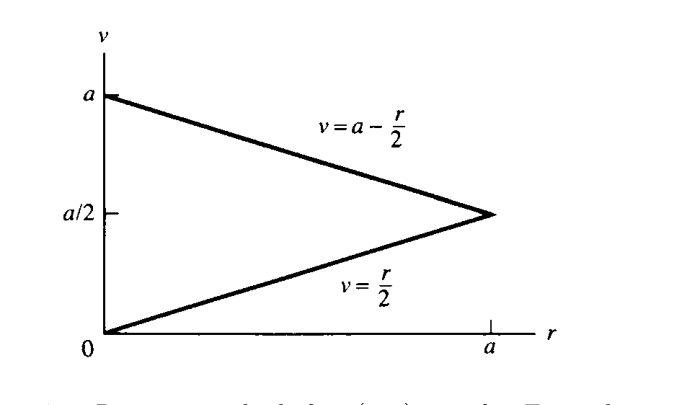
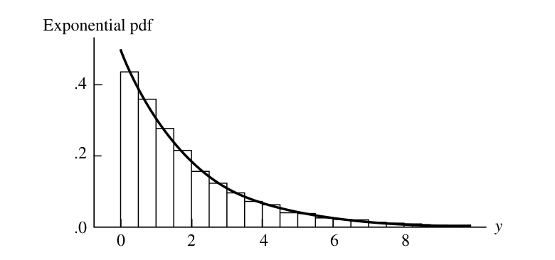
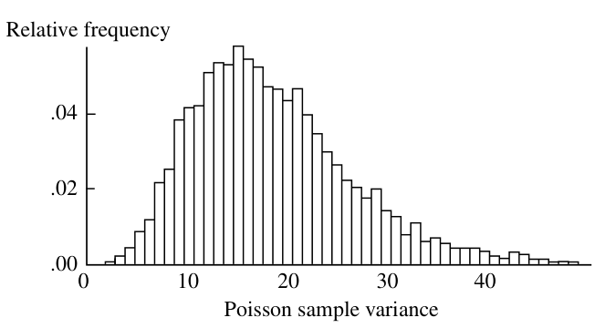
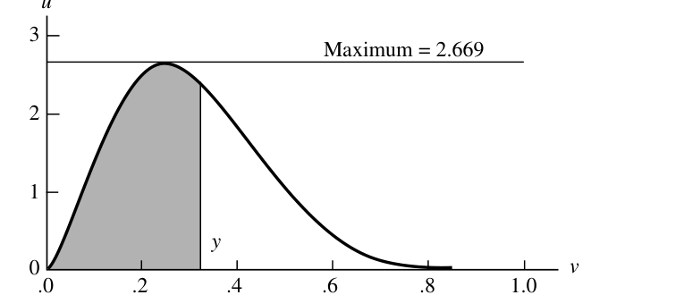

# 확률표본의 성질 {#chapter5}

> “I’m afraid that I rather give myself away when I explain,” said he. “Results without causes are much more impressive.”  
> — Sherlock Holmes, *The Stock-Broker’s Clerk*

- 이 장의 핵심은 **확률표본(random sample)**이다.
- 통계학에서 실제 자료는 보통 하나의 숫자가 아니라 여러 관측값으로 이루어진다.
- 이 장에서는 여러 관측값이 어떤 확률구조를 가질 때 이를 확률표본이라고 부르는지, 그리고 확률표본으로부터 계산한 통계량들이 어떤 분포와 성질을 갖는지 배운다.
- 특히 다음 주제들이 중요하다.
  - 확률표본과 iid 가정
  - 표본평균과 표본분산
  - 정규표본에서의 표본평균, 표본분산, t 분포, F 분포
  - 순서통계량
  - 대수의 법칙, 중심극한정리, Slutsky 정리, Delta method
  - 난수 생성과 시뮬레이션

## 확률표본의 기본 개념 {#sec-5-1}

### 확률표본의 정의

- 많은 실험에서 자료는 관심 변수에 대한 여러 번의 관측값으로 이루어진다.
- 예를 들어 회로판 수명 실험에서 여러 회로판을 테스트하면 각 회로판의 고장 시간이 하나의 관측값이다.
- 이런 상황을 수학적으로 표현하는 대표적 모형이 **확률표본(random sampling)**이다.

#### 정의

- 확률변수 $X_1,\ldots,X_n$이 모집단 $f(x)$에서 추출한 크기 $n$의 확률표본이라는 것은 다음 두 조건을 만족한다는 뜻이다.
  - $X_1,\ldots,X_n$이 서로 독립이다.
  - 각 $X_i$의 주변 pdf 또는 pmf가 모두 같은 함수 $f(x)$이다.
- 같은 뜻으로 $X_1,\ldots,X_n$은 **independent and identically distributed**, 즉 **iid**라고 한다.

### 결합 pdf 또는 pmf

- 확률표본에서는 모든 관측값이 독립이고 같은 분포를 가지므로 결합 pdf 또는 pmf가 곱으로 표현된다.

$$
f(x_1,\ldots,x_n)
=
f(x_1)f(x_2)\cdots f(x_n)
=
\prod_{i=1}^{n} f(x_i).
\tag{5.1.1}
$$

- 모집단이 모수 $\theta$를 가진 분포족 $f(x\mid\theta)$에 속하면 표본의 결합 pdf 또는 pmf는

$$
f(x_1,\ldots,x_n\mid\theta)
=
\prod_{i=1}^{n}f(x_i\mid\theta)
\tag{5.1.2}
$$

이다.

- 여기서 모든 항에 동일한 모수값 $\theta$가 들어간다.
- 통계추론에서는 보통 분포족은 알고 있지만 $\theta$는 모른다고 가정한다.
- 표본의 결합분포는 $\theta$가 어떤 값일 때 표본이 어떻게 행동하는지 분석하는 출발점이다.

### 예제: 지수분포 표본의 결합 pdf

- $X_1,\ldots,X_n$이 exponential$(\beta)$ 모집단에서 나온 확률표본이라고 하자.
- 각 $X_i$는 회로판의 고장 시간처럼 해석할 수 있다.
- 단일 관측값의 pdf는

$$
f(x_i\mid\beta)=\frac1\beta e^{-x_i/\beta},\qquad x_i>0.
$$

- 따라서 표본의 결합 pdf는

$$
\begin{aligned}
f(x_1,\ldots,x_n\mid\beta)
&=
\prod_{i=1}^{n}\frac1\beta e^{-x_i/\beta}\\
&=
\frac{1}{\beta^n}e^{-(x_1+\cdots+x_n)/\beta}.
\end{aligned}
$$

- 모든 회로판이 2년 이상 지속될 확률은

$$
P(X_1>2,\ldots,X_n>2).
$$

- 독립성과 동일분포성을 이용하면

$$
\begin{aligned}
P(X_1>2,\ldots,X_n>2)
&=
P(X_1>2)\cdots P(X_n>2)\\
&=[P(X_1>2)]^n\\
&=(e^{-2/\beta})^n\\
&=e^{-2n/\beta}.
\end{aligned}
$$

- 이 예제는 확률표본의 핵심 계산 원리가 “독립이므로 곱하고, 동일분포이므로 같은 항이 반복된다”는 데 있음을 보여준다.

### 무한 모집단과 유한 모집단

- 정의 5.1.1의 확률표본은 흔히 **무한 모집단에서의 표본추출**로 이해할 수 있다.
- 첫 번째 관측값 $X_1=x_1$을 얻어도 모집단은 변하지 않고, 두 번째 관측값 $X_2$도 여전히 같은 분포에서 나온다.
- 유한 모집단에서는 표본추출 방식에 따라 iid가 성립할 수도 있고 성립하지 않을 수도 있다.

#### 복원추출

- 유한 모집단 $\{x_1,\ldots,x_N\}$에서 하나를 뽑아 기록한 뒤 다시 모집단에 넣는다.
- 이 과정을 $n$번 반복한다.
- 각 $X_i$는 같은 이산분포를 가진다.

$$
P(X_i=x_j)=\frac1N,
\qquad j=1,\ldots,N.
$$

- 매번 모집단이 원래 상태로 돌아가므로 $X_1,\ldots,X_n$은 독립이다.
- 따라서 복원추출에서는 정의 5.1.1의 확률표본 조건이 만족된다.

#### 비복원추출

- 한 번 뽑힌 값은 다시 뽑을 수 없다.
- 이 경우 각 $X_i$의 주변분포는 같지만 서로 독립은 아니다.
- 예를 들어 $x\ne y$일 때

$$
P(X_2=y\mid X_1=y)=0,
$$

하지만

$$
P(X_2=y\mid X_1=x)=\frac{1}{N-1}.
$$

- 따라서 $X_2$의 조건부분포는 $X_1$의 값에 의존한다.
- 즉, 독립이 아니다.
- 그러나 각 $X_i$의 주변분포는 여전히

$$
P(X_i=x)=\frac1N
$$

이다.

### 유한 모집단에서의 근사

- 비복원추출은 엄밀히 말해 iid는 아니지만, 모집단 크기 $N$이 표본 크기 $n$보다 매우 크면 거의 독립처럼 다룰 수 있다.
- 조건부분포의 비영 확률은

$$
\frac{1}{N-i+1}
$$

이고, $i\le n$이 $N$에 비해 작으면 이는 $1/N$에 가깝다.

### 예제: 유한 모집단 모형

- 모집단이 $\{1,2,\ldots,1000\}$이고, 비복원으로 $n=10$개를 뽑는다고 하자.
- 표본값이 모두 200보다 클 확률을 구하고 싶다.
- 독립이라고 근사하면

$$
P(X_1>200,\ldots,X_{10}>200)
\approx
\left(\frac{800}{1000}\right)^{10}
=
0.107374.
\tag{5.1.4}
$$

- 정확한 계산은 초기하분포를 이용한다.
- $Y$를 표본 중 200보다 큰 값의 개수라고 하면

$$
Y\sim Hypergeometric(N=1000,M=800,K=10).
$$

- 따라서

$$
P(X_1>200,\ldots,X_{10}>200)
=
P(Y=10)
=
\frac{\binom{800}{10}\binom{200}{0}}{\binom{1000}{10}}
=
0.106164.
$$

- 독립 근사값과 정확값이 매우 가깝다.
- 이후 이 책에서는 특별한 언급이 없으면 정의 5.1.1의 iid 확률표본을 사용한다.

## 확률표본에서 나온 합과 통계량 {#sec-5-2}

### 통계량과 표집분포

- 표본 $X_1,\ldots,X_n$이 주어지면, 실제 분석에서는 표본 전체를 요약하는 값을 계산한다.
- 이 요약값은 표본의 함수이다.
- 예를 들어 평균, 분산, 최소값, 최대값, 중앙값 등이 있다.

#### 정의

- $X_1,\ldots,X_n$이 확률표본이고 $T(x_1,\ldots,x_n)$이 표본공간에서 정의된 실수값 또는 벡터값 함수라고 하자.
- 그러면

$$
Y=T(X_1,\ldots,X_n)
$$

을 **통계량(statistic)**이라고 한다.
- 통계량의 확률분포를 **표집분포(sampling distribution)**라고 한다.
- 통계량은 모수의 함수가 될 수 없다.
- 통계량은 관측자료만으로 계산되어야 한다.

### 표본평균, 표본분산, 표본표준편차

#### 정의: 표본평균

$$
\bar X
=
\frac{X_1+\cdots+X_n}{n}
=
\frac1n\sum_{i=1}^{n}X_i.
$$

#### 정의 5.2.3: 표본분산과 표본표준편차

$$
S^2
=
\frac{1}{n-1}\sum_{i=1}^{n}(X_i-\bar X)^2.
$$

$$
S=\sqrt{S^2}.
$$

- 관측값에 대해서는 보통 소문자로 $\bar x$, $s^2$, $s$를 쓴다.
- $S^2$의 분모가 $n$이 아니라 $n-1$인 이유는 뒤에서 $E(S^2)=\sigma^2$가 되도록 하기 위함임을 확인한다.

### 표본분산의 대수적 성질

#### 정리

- 임의의 수 $x_1,\ldots,x_n$에 대해

$$
\bar x=\frac{x_1+\cdots+x_n}{n}
$$

라고 하자.
- 그러면 다음이 성립한다.

1. $\bar x$는 제곱거리합을 최소화한다.

$$
\min_a\sum_{i=1}^{n}(x_i-a)^2
=
\sum_{i=1}^{n}(x_i-\bar x)^2.
$$

2. 표본분산의 계산식은

$$
(n-1)s^2
=
\sum_{i=1}^{n}(x_i-\bar x)^2
=
\sum_{i=1}^{n}x_i^2-n\bar x^2.
$$

- 이 식은 계산에도 유용하고, 이론적으로도 $S^2$의 기댓값을 계산할 때 중요하다.

### 합의 기댓값과 분산

#### 보조정리

- $X_1,\ldots,X_n$이 모집단에서 나온 확률표본이고, $g(x)$에 대해 $E[g(X_1)]$와 $Var[g(X_1)]$가 존재한다고 하자.
- 그러면

$$
E\left[\sum_{i=1}^{n}g(X_i)\right]
=
nE[g(X_1)].
\tag{5.2.1}
$$

- 또한 독립성에 의해

$$
Var\left[\sum_{i=1}^{n}g(X_i)\right]
=
nVar[g(X_1)].
\tag{5.2.2}
$$

- 첫 번째 식은 동일분포성만 있으면 된다.
- 두 번째 식은 독립성이 필요하다.

### 표본평균과 표본분산의 평균

#### 정리

- $X_1,\ldots,X_n$이 평균 $\mu$, 분산 $\sigma^2<\infty$인 모집단에서 나온 확률표본이라고 하자.
- 그러면

$$
E\bar X=\mu,
$$

$$
Var(\bar X)=\frac{\sigma^2}{n},
$$

$$
E(S^2)=\sigma^2.
$$

- 해석:
  - 표본평균은 모집단 평균 $\mu$의 불편추정량이다.
  - 표본평균의 분산은 표본크기가 커질수록 $1/n$ 비율로 감소한다.
  - 표본분산 $S^2$은 모집단 분산 $\sigma^2$의 불편추정량이다.

### 표본평균의 mgf

- $\bar X$의 표집분포를 구하는 방법 중 하나는 mgf를 사용하는 것이다.
- $Y=X_1+\cdots+X_n$의 pdf를 알면 $\bar X=Y/n$의 pdf는 변환공식으로 얻을 수 있다.
- mgf에서는 더 간단하게

$$
M_{\bar X}(t)
=
E[e^{t\bar X}]
=
E[e^{(t/n)(X_1+\cdots+X_n)}]
=
M_Y(t/n).
$$

#### 정리

- $X_1,\ldots,X_n$이 mgf $M_X(t)$를 갖는 모집단에서 나온 확률표본이면 표본평균의 mgf는

$$
M_{\bar X}(t)=[M_X(t/n)]^n.
$$

### 예제: 정규표본 평균의 분포

- $X_1,\ldots,X_n$이 $N(\mu,\sigma^2)$에서 나온 확률표본이라고 하자.
- 정규분포의 mgf는

$$
M_X(t)=\exp\left(\mu t+\frac{\sigma^2t^2}{2}\right).
$$

- 따라서

$$
\begin{aligned}
M_{\bar X}(t)
&=
\left[
\exp\left(\mu\frac tn+\frac{\sigma^2(t/n)^2}{2}\right)
\right]^n\\
&=
\exp\left(\mu t+\frac{(\sigma^2/n)t^2}{2}\right).
\end{aligned}
$$

- 이는 $N(\mu,\sigma^2/n)$의 mgf이다.
- 따라서

$$
\bar X\sim N\left(\mu,\frac{\sigma^2}{n}\right).
$$

- 감마표본에서도 비슷하게 $X_i\sim Gamma(\alpha,\beta)$이면

$$
\bar X\sim Gamma(n\alpha,\beta/n)
$$

가 된다.

### 합의 pdf: convolution 공식

#### 정리

- $X$와 $Y$가 독립인 연속형 확률변수이고 pdf가 각각 $f_X$, $f_Y$이면 $Z=X+Y$의 pdf는

$$
f_Z(z)=
\int_{-\infty}^{\infty}f_X(w)f_Y(z-w)\,dw.
\tag{5.2.3}
$$

- 이를 **convolution**이라고 한다.
- 지지집합에 따라 적분구간은 실제로 더 좁아질 수 있다.

### 예제: 코시 표본평균

- $U\sim Cauchy(0,\sigma)$, $V\sim Cauchy(0,\tau)$가 독립이라고 하자.
- 각각의 pdf는

$$
f_U(u)=\frac{1}{\pi\sigma}\frac{1}{1+(u/\sigma)^2},
$$

$$
f_V(v)=\frac{1}{\pi\tau}\frac{1}{1+(v/\tau)^2}.
$$

- convolution을 계산하면 $Z=U+V$는

$$
f_Z(z)=
\frac{1}{\pi(\sigma+\tau)}
\frac{1}{1+(z/(\sigma+\tau))^2}.
\tag{5.2.5}
$$

- 즉, 독립 코시확률변수의 합은 다시 코시분포이고 scale parameter가 더해진다.
- 특히 $Z_1,\ldots,Z_n$이 iid Cauchy$(0,1)$이면

$$
\sum_{i=1}^{n}Z_i\sim Cauchy(0,n).
$$

- 따라서 표본평균은

$$
\bar Z\sim Cauchy(0,1).
$$

- 표본크기를 늘려도 표본평균의 분포가 좁아지지 않는다.
- 이는 분산이 유한한 경우 $Var(\bar X)=\sigma^2/n$과 극명하게 다르다.

### 위치-척도분포족에서 표본평균

- $X_i$가 위치-척도분포족

$$
\frac1\sigma f\left(\frac{x-\mu}{\sigma}\right)
$$

에서 나온 확률표본이면 각 $X_i$는

$$
X_i=\sigma Z_i+\mu
$$

로 표현할 수 있다.
- 따라서

$$
\bar X=\sigma\bar Z+\mu.
$$

- 먼저 표준분포 $f(z)$에서 $\bar Z$의 분포를 구하면, $\bar X$의 분포는 위치-척도 변환으로 즉시 얻을 수 있다.

### 지수족 표본에서 합의 분포

#### 정리

- 모집단 pdf 또는 pmf가 지수족

$$
f(x\mid\theta)=h(x)c(\theta)\exp\left[\sum_{i=1}^{k}w_i(\theta)t_i(x)\right]
$$

라고 하자.
- 통계량을

$$
T_i(X_1,\ldots,X_n)=\sum_{j=1}^{n}t_i(X_j),
\qquad i=1,\ldots,k
$$

로 정의한다.
- 적절한 개방집합 조건이 만족되면 $(T_1,\ldots,T_k)$의 분포도 지수족 형태를 갖는다.

$$
f_T(u_1,\ldots,u_k\mid\theta)
=
H(u_1,\ldots,u_k)[c(\theta)]^n
\exp\left[\sum_{i=1}^{k}w_i(\theta)u_i\right].
\tag{5.2.6}
$$

### 예제: Bernoulli 합은 이항분포

- $X_1,\ldots,X_n$이 iid Bernoulli$(p)$라고 하자.
- Bernoulli 분포는 지수족이며 $t_1(x)=x$이다.
- 따라서

$$
T_1=X_1+\cdots+X_n.
$$

- 이 통계량은 성공 횟수이므로

$$
T_1\sim Binomial(n,p).
$$

## 정규분포에서의 표본추출 {#sec-5-3}

- 정규모집단은 통계학에서 가장 널리 쓰이는 모델 중 하나이다.
- 정규모집단에서 표본을 추출하면 표본평균, 표본분산, t 분포, F 분포와 같은 핵심 표집분포들이 자연스럽게 등장한다.

### 표본평균과 표본분산의 성질

#### 정리 

- $X_1,\ldots,X_n$이 $N(\mu,\sigma^2)$에서 나온 확률표본이라고 하자.
- 표본평균과 표본분산은

$$
\bar X=\frac1n\sum_{i=1}^{n}X_i,
$$

$$
S^2=\frac1{n-1}\sum_{i=1}^{n}(X_i-\bar X)^2
$$

이다.
- 그러면 다음이 성립한다.

1. $\bar X$와 $S^2$은 독립이다.
2. $\bar X$는

$$
\bar X\sim N\left(\mu,\frac{\sigma^2}{n}\right)
$$

을 따른다.
3. 표본분산의 스케일 변환은 카이제곱분포를 따른다.

$$
\frac{(n-1)S^2}{\sigma^2}\sim\chi^2_{n-1}.
$$

- 이 정리는 정규분포 기반 추론의 핵심이다.
- 특히 $\bar X$와 $S^2$의 독립성은 정규분포에서만 나타나는 매우 특별한 성질이다.

### 카이제곱분포 관련 사실

#### 보조정리

- $Z\sim N(0,1)$이면

$$
Z^2\sim\chi^2_1.
$$

- 독립인 카이제곱확률변수들은 더하면 자유도도 더해진다.
- 즉, $X_i\sim\chi^2_{p_i}$가 서로 독립이면

$$
X_1+\cdots+X_n\sim\chi^2_{p_1+\cdots+p_n}.
$$

### 표본분산 분포의 유도 아이디어

- 정리 5.3.1(c)는 다음 재귀관계를 이용해 증명할 수 있다.

$$
(n-1)S_n^2
=
(n-2)S_{n-1}^2
+
\left(\frac{n-1}{n}\right)(X_n-\bar X_{n-1})^2.
\tag{5.3.1}
$$

- $n=2$에서

$$
S_2^2=\frac12(X_2-X_1)^2
$$

이고, $(X_2-X_1)/\sqrt2\sim N(0,1)$이므로 $S_2^2\sim\chi^2_1$이다.
- 귀납적으로 각 단계에서 자유도 1의 카이제곱 항이 더해져 $(n-1)S_n^2\sim\chi^2_{n-1}$가 된다.

### 정규표본에서 독립성과 상관

#### 보조정리

- $X_j\sim N(\mu_j,\sigma_j^2)$가 서로 독립이라고 하자.
- 선형결합

$$
U_i=\sum_{j=1}^{n}a_{ij}X_j,
\qquad
V_r=\sum_{j=1}^{n}b_{rj}X_j
$$

을 생각한다.
- 정규확률변수의 선형결합들에서는

$$
U_i\text{와 }V_r\text{가 독립}
\quad\Longleftrightarrow\quad
Cov(U_i,V_r)=0.
$$

- 또한

$$
Cov(U_i,V_r)=\sum_{j=1}^{n}a_{ij}b_{rj}\sigma_j^2.
$$

- 일반 확률변수에서는 무상관이 독립을 뜻하지 않지만, 정규표본의 선형결합에서는 무상관과 독립이 일치한다.

### Student의 t 분포와 Snedecor의 F 분포

### t 분포의 동기

- 정규표본에서 $\sigma$를 알고 있다면

$$
\frac{\bar X-\mu}{\sigma/\sqrt n}
\tag{5.3.3}
$$

은 표준정규분포를 따른다.
- 그러나 실제로는 $\sigma$를 모르는 경우가 많다.
- 그래서 $\sigma$ 대신 표본표준편차 $S$를 사용한다.

$$
\frac{\bar X-\mu}{S/\sqrt n}.
\tag{5.3.4}
$$

- 이 통계량의 분포가 Student의 t 분포이다.

### t 통계량의 구조

- 식 (5.3.4)는 다음처럼 쓸 수 있다.

$$
\frac{\bar X-\mu}{S/\sqrt n}
=
\frac{(\bar X-\mu)/(\sigma/\sqrt n)}{
\sqrt{S^2/\sigma^2}
}
=
\frac{Z}{\sqrt{V/(n-1)}}
\tag{5.3.5}
$$

- 여기서

$$
Z\sim N(0,1),
\qquad
V\sim\chi^2_{n-1},
$$

이고 $Z$와 $V$는 독립이다.

#### 정의

- $T$가 자유도 $p$인 Student의 t 분포를 따른다는 것은

$$
T=\frac{U}{\sqrt{V/p}}
$$

으로 표현할 수 있다는 뜻이다.
- 여기서 $U\sim N(0,1)$, $V\sim\chi^2_p$이고 서로 독립이다.
- pdf는

$$
f_T(t)
=
\frac{\Gamma((p+1)/2)}{\Gamma(p/2)}
\frac{1}{(p\pi)^{1/2}}
\frac{1}{(1+t^2/p)^{(p+1)/2}},
\qquad -\infty<t<\infty.
\tag{5.3.6}
$$

- $p=1$이면 t 분포는 코시분포가 된다.
- 자유도 $p$인 t 분포는 $p-1$차 모멘트까지만 존재한다.
- 평균과 분산은

$$
E(T_p)=0,\qquad p>1,
\tag{5.3.7}
$$

$$
Var(T_p)=\frac{p}{p-2},\qquad p>2.
$$

### F 분포의 동기

- F 분포는 두 분산의 비율을 다룰 때 등장한다.
- 두 독립 정규모집단에서

$$
X_1,\ldots,X_n\sim N(\mu_X,\sigma_X^2),
$$

$$
Y_1,\ldots,Y_m\sim N(\mu_Y,\sigma_Y^2)
$$

라고 하자.
- 모집단 분산비 $\sigma_X^2/\sigma_Y^2$에 대한 정보는 표본분산비 $S_X^2/S_Y^2$에 들어 있다.
- 표준화된 비율은

$$
\frac{S_X^2/S_Y^2}{\sigma_X^2/\sigma_Y^2}
=
\frac{S_X^2/\sigma_X^2}{S_Y^2/\sigma_Y^2}.
\tag{5.3.8}
$$

- 각 항은 스케일된 카이제곱확률변수이므로 이 비율은 F 분포를 따른다.

#### 정의

- $U\sim\chi^2_p$, $V\sim\chi^2_q$가 서로 독립이면

$$
F=\frac{U/p}{V/q}
$$

는 자유도 $(p,q)$인 F 분포를 따른다.
- pdf는

$$
f_F(x)
=
\frac{\Gamma((p+q)/2)}{\Gamma(p/2)\Gamma(q/2)}
\left(\frac pq\right)^{p/2}
\frac{x^{p/2-1}}{[1+(p/q)x]^{(p+q)/2}},
\qquad x>0.
\tag{5.3.9}
$$

### 예제: F 분포 평균과 분산비

- $F_{n-1,m-1}$의 평균은 $m>3$일 때

$$
E(F_{n-1,m-1})=\frac{m-1}{m-3}.
$$

- 따라서 $m$이 충분히 크면

$$
\frac{S_X^2/S_Y^2}{\sigma_X^2/\sigma_Y^2}
\approx 1.
$$

- 표본분산비가 모집단 분산비를 대략 반영한다는 직관과 일치한다.

### 정리: F 분포의 관계

- $X\sim F_{p,q}$이면

$$
\frac1X\sim F_{q,p}.
$$

- $X\sim t_q$이면

$$
X^2\sim F_{1,q}.
$$

- $X\sim F_{p,q}$이면

$$
\frac{(p/q)X}{1+(p/q)X}
\sim
Beta(p/2,q/2).
$$

## 순서통계량 {#sec-5-4}

- 표본의 최솟값, 최댓값, 중앙값 같은 값들은 표본을 정렬해서 얻어진다.
- 이런 통계량을 **순서통계량(order statistics)**이라고 한다.

#### 정의

- 확률표본 $X_1,\ldots,X_n$을 오름차순으로 정렬한 값을

$$
X_{(1)},\ldots,X_{(n)}
$$

이라고 한다.
- 즉,

$$
X_{(1)}=\min_i X_i,
\qquad
X_{(n)}=\max_i X_i.
$$

### 범위와 중앙값

- 표본범위는

$$
R=X_{(n)}-X_{(1)}
$$

이다.
- 이는 표본의 퍼짐 정도를 나타낸다.

- 표본중앙값 $M$은

$$
M=
\begin{cases}
X_{((n+1)/2)}, & n\text{ odd},\\
\dfrac{X_{(n/2)}+X_{(n/2+1)}}{2}, & n\text{ even}.
\end{cases}
\tag{5.4.1}
$$

- 중앙값은 평균보다 극단값의 영향을 덜 받는다.
- 소득, 주택가격, 연봉처럼 극단적으로 큰 값이 있는 자료에서는 평균보다 중앙값이 전형적인 값을 더 잘 나타낼 수 있다.

### 표본 백분위수

- $(100p)$번째 표본 백분위수는 대략 $np$개의 관측값이 그보다 작고 $n(1-p)$개의 관측값이 그보다 크도록 하는 관측값이다.
- 50번째 백분위수는 중앙값이다.
- 25번째와 75번째 백분위수는 각각 하사분위수와 상사분위수이다.
- 상사분위수와 하사분위수의 차이는 **사분위범위(interquartile range)**이다.

### 이산형 순서통계량

#### 정리

- $X_1,\ldots,X_n$이 이산분포에서 나온 확률표본이라고 하자.
- 가능한 값들을 $x_1<x_2<\cdots$라고 하고

$$
P_i=P(X\le x_i)=p_1+\cdots+p_i
$$

라고 하자.
- 그러면 $j$번째 순서통계량에 대해

$$
P(X_{(j)}\le x_i)
=
\sum_{k=j}^{n}\binom{n}{k}P_i^k(1-P_i)^{n-k}.
\tag{5.4.2}
$$

- 또한

$$
P(X_{(j)}=x_i)
=
\sum_{k=j}^{n}\binom{n}{k}
\left[P_i^k(1-P_i)^{n-k}-P_{i-1}^k(1-P_{i-1})^{n-k}\right].
\tag{5.4.3}
$$

- 핵심 아이디어:
  - $X_{(j)}\le x_i$라는 사건은 표본 중 적어도 $j$개가 $x_i$ 이하라는 사건이다.
  - 이 개수는 성공확률 $P_i$인 이항분포를 따른다.

### 연속형 순서통계량의 pdf

#### 정리

- $X_1,\ldots,X_n$이 cdf $F_X(x)$와 pdf $f_X(x)$를 갖는 연속형 모집단에서 나온 확률표본이라고 하자.
- $j$번째 순서통계량의 pdf는

$$
f_{X_{(j)}}(x)
=
\frac{n!}{(j-1)!(n-j)!}
 f_X(x)[F_X(x)]^{j-1}[1-F_X(x)]^{n-j}.
\tag{5.4.4}
$$

- 해석:
  - 하나의 관측값이 $x$ 근처에 있어야 한다.
  - $j-1$개의 관측값이 $x$보다 작아야 한다.
  - $n-j$개의 관측값이 $x$보다 커야 한다.
  - 조합의 수가 계수로 들어간다.

### 예제: 균등분포 순서통계량

- $X_i\sim Uniform(0,1)$이면 $f_X(x)=1$, $F_X(x)=x$이다.
- 정리 5.4.4에 의해

$$
f_{X_{(j)}}(x)
=
\frac{n!}{(j-1)!(n-j)!}x^{j-1}(1-x)^{n-j},
\qquad 0<x<1.
$$

- 이는

$$
X_{(j)}\sim Beta(j,n-j+1)
$$

임을 뜻한다.
- 따라서

$$
E[X_{(j)}]=\frac{j}{n+1},
$$

$$
Var(X_{(j)})=
\frac{j(n-j+1)}{(n+1)^2(n+2)}.
$$

### 두 순서통계량의 결합 pdf

#### 정리

- $1\le i<j\le n$일 때 $X_{(i)}$와 $X_{(j)}$의 결합 pdf는

$$
\begin{aligned}
f_{X_{(i)},X_{(j)}}(u,v)
&=
\frac{n!}{(i-1)!(j-1-i)!(n-j)!}
 f_X(u)f_X(v)[F_X(u)]^{i-1}\\
&\quad\times [F_X(v)-F_X(u)]^{j-1-i}[1-F_X(v)]^{n-j},
\qquad -\infty<u<v<\infty.
\end{aligned}
\tag{5.4.7}
$$

- 모든 순서통계량의 결합 pdf는

$$
f_{X_{(1)},\ldots,X_{(n)}}(x_1,\ldots,x_n)
=
\begin{cases}
 n! f_X(x_1)\cdots f_X(x_n), & x_1<\cdots<x_n,\\
0, & \text{otherwise}.
\end{cases}
$$

### 예제: midrange와 range의 분포

- $X_1,\ldots,X_n$이 iid uniform$(0,a)$라고 하자.
- 범위와 midrange를

$$
R=X_{(n)}-X_{(1)},
$$

$$
V=\frac{X_{(1)}+X_{(n)}}{2}
$$

로 정의한다.
- 역변환은

$$
X_{(1)}=V-\frac R2,
\qquad
X_{(n)}=V+\frac R2.
$$

- 가능한 영역은

$$
0<r<a,
\qquad
\frac r2<v<a-\frac r2.
$$

- 결합 pdf는

$$
f_{R,V}(r,v)=
\frac{n(n-1)r^{n-2}}{a^n},
\qquad 0<r<a,
\quad r/2<v<a-r/2.
$$

- 범위 $R$의 주변 pdf는

$$
f_R(r)=
\frac{n(n-1)r^{n-2}(a-r)}{a^n},
\qquad 0<r<a.
\tag{5.4.8}
$$

- $a=1$이면 $R$은 beta$(n-1,2)$ 분포를 따른다.
- $V$의 pdf는 $a/2$를 중심으로 대칭이고, $a/2$에서 peak를 가진다.

## 수렴 개념 {#sec-5-5}

- 표본크기 $n$을 무한히 크게 보내는 것은 이론적 장치이지만, 유한표본에서도 유용한 근사를 제공한다.
- 특히 표본평균 $\bar X_n$이 $n\to\infty$일 때 어떻게 행동하는지가 중요하다.
- 이 절에서는 세 가지 수렴을 다룬다.
  - 확률수렴
  - 거의 확실한 수렴
  - 분포수렴

### 확률수렴

#### 정의

- 확률변수열 $X_1,X_2,\ldots$가 확률변수 $X$로 **확률수렴**한다는 것은 모든 $\varepsilon>0$에 대해

$$
\lim_{n\to\infty}P(|X_n-X|\ge\varepsilon)=0
$$

또는 동치로

$$
\lim_{n\to\infty}P(|X_n-X|<\varepsilon)=1
$$

이 성립한다는 뜻이다.

### 약한 대수의 법칙

#### 정리

- $X_1,X_2,\ldots$가 iid이고 $EX_i=\mu$, $Var(X_i)=\sigma^2<\infty$라고 하자.
- 표본평균을

$$
\bar X_n=\frac1n\sum_{i=1}^{n}X_i
$$

라고 하면 모든 $\varepsilon>0$에 대해

$$
\lim_{n\to\infty}P(|\bar X_n-\mu|<\varepsilon)=1.
$$

- 즉,

$$
\bar X_n\xrightarrow{p}\mu.
$$

- 증명은 Chebychev 부등식으로 간단히 된다.

$$
P(|\bar X_n-\mu|\ge\varepsilon)
\le
\frac{Var(\bar X_n)}{\varepsilon^2}
=
\frac{\sigma^2}{n\varepsilon^2}
\to0.
$$

- 이는 표본평균이 표본크기가 커질수록 모집단 평균에 가까워진다는 정리이다.

### 일관성

- 표본크기가 커질수록 통계량이 어떤 상수 또는 모수값으로 수렴하는 성질을 **일관성(consistency)**이라고 한다.
- 약한 대수의 법칙은 $\bar X_n$이 $\mu$의 일관된 추정량임을 보여준다.

### 예제: $S_n^2$의 일관성

- 표본분산

$$
S_n^2=\frac1{n-1}\sum_{i=1}^{n}(X_i-\bar X_n)^2
$$

이 $\sigma^2$로 확률수렴하는지 알고 싶다.
- Chebychev 부등식을 쓰면

$$
P(|S_n^2-\sigma^2|\ge\varepsilon)
\le
\frac{Var(S_n^2)}{\varepsilon^2}.
$$

- 따라서 $Var(S_n^2)\to0$이면

$$
S_n^2\xrightarrow{p}\sigma^2.
$$

### 연속함수와 확률수렴

#### 정리

- $X_n\xrightarrow{p}X$이고 $h$가 연속함수이면

$$
h(X_n)\xrightarrow{p}h(X).
$$

### 예제 : 표본표준편차의 일관성

- $S_n^2\xrightarrow{p}\sigma^2$이면 $h(x)=\sqrt{x}$가 연속이므로

$$
S_n=\sqrt{S_n^2}\xrightarrow{p}\sigma.
$$

- $S_n$은 $\sigma$의 biased estimator일 수 있지만, 표본크기가 커지면 bias는 사라진다.

### 거의 확실한 수렴

#### 정의

- 확률변수열 $X_1,X_2,\ldots$가 $X$로 **거의 확실하게 수렴(almost surely)**한다는 것은 모든 $\varepsilon>0$에 대해

$$
P\left(\lim_{n\to\infty}|X_n-X|<\varepsilon\right)=1
$$

이 성립한다는 뜻이다.

- 거의 확실한 수렴은 확률수렴보다 강한 개념이다.
- 표본공간의 거의 모든 점에서 함수값 $X_n(s)$가 $X(s)$로 점별수렴한다고 생각할 수 있다.

### 예제: 거의 확실한 수렴

- 표본공간을 $[0,1]$로 두고 균등분포를 부여한다.
- $X_n(s)=s+s^n$, $X(s)=s$라고 하자.
- $s\in[0,1)$이면 $s^n\to0$이므로 $X_n(s)\to X(s)$이다.
- $s=1$에서는 수렴하지 않지만, 한 점의 확률은 0이다.
- 따라서 $X_n\to X$ almost surely이다.

### 예제: 확률수렴하지만 거의 확실하게 수렴하지 않는 경우

- 표본공간을 $[0,1]$로 두고, 길이가 점점 작아지는 구간 위에서만 $X_n(s)=s+1$이 되도록 순서대로 움직이는 지시함수열을 만들 수 있다.
- 각 $n$에서 $|X_n-X|\ge\varepsilon$인 구간의 길이는 0으로 가므로 확률수렴은 한다.
- 그러나 어떤 $s$에서도 점별로 안정되지 않으면 almost sure convergence는 성립하지 않는다.
- 이 예제는 확률수렴과 거의 확실한 수렴이 다르다는 점을 보여준다.

### 강한 대수의 법칙

#### 정리

- $X_1,X_2,\ldots$가 iid이고 $EX_i=\mu$, $Var(X_i)=\sigma^2<\infty$라고 하자.
- 그러면

$$
\bar X_n\to\mu
$$

almost surely이다.
- 즉, 모든 $\varepsilon>0$에 대해

$$
P\left(\lim_{n\to\infty}|\bar X_n-\mu|<\varepsilon\right)=1.
$$

- 실제로는 유한분산 조건보다 약한 $E|X_i|<\infty$ 조건만으로도 강한 대수의 법칙이 성립한다.

### 분포수렴

#### 정의

- 확률변수열 $X_n$이 확률변수 $X$로 **분포수렴**한다는 것은 $F_X$가 연속인 모든 $x$에서

$$
\lim_{n\to\infty}F_{X_n}(x)=F_X(x)
$$

가 성립한다는 뜻이다.

- 분포수렴은 확률변수 자체의 점별수렴이 아니라 cdf의 수렴이다.

### 예제: 균등분포 최댓값

- $X_1,X_2,\ldots$가 iid uniform$(0,1)$이라고 하자.
- 최댓값을

$$
X_{(n)}=\max_{1\le i\le n}X_i
$$

라고 하자.
- 직관적으로 $X_{(n)}$은 1에 가까워진다.
- 실제로

$$
P(X_{(n)}\le1-\varepsilon)=(1-\varepsilon)^n\to0.
$$

- 따라서 $X_{(n)}\xrightarrow{p}1$이다.
- 더 정교하게 보면 $t>0$에 대해

$$
P(X_{(n)}\le1-t/n)=(1-t/n)^n\to e^{-t}.
$$

- 따라서

$$
n(1-X_{(n)})\xrightarrow{d} Exponential(1).
$$

### 수렴들 사이의 관계

- almost sure convergence는 convergence in probability를 함의한다.
- convergence in probability는 convergence in distribution을 함의한다.
- 특히 상수 $\mu$로의 수렴에서는

$$
X_n\xrightarrow{p}\mu
\quad\Longleftrightarrow\quad
X_n\xrightarrow{d}\mu.
$$

### 중심극한정리

#### 정리

- $X_1,X_2,\ldots$가 iid이고 mgf가 0의 근방에서 존재한다고 하자.
- $EX_i=\mu$, $Var(X_i)=\sigma^2>0$라고 하자.
- 그러면

$$
\frac{\sqrt n(\bar X_n-\mu)}{\sigma}
$$

의 분포는 표준정규분포로 수렴한다.
- 즉, 임의의 $x$에 대해

$$
\lim_{n\to\infty}
P\left(\frac{\sqrt n(\bar X_n-\mu)}{\sigma}\le x\right)
=
\int_{-\infty}^{x}\frac{1}{\sqrt{2\pi}}e^{-y^2/2}\,dy.
$$

- 더 일반적인 형태에서는 mgf 존재 조건 없이 유한분산만 있으면 충분하다.

#### 정리: 더 강한 중심극한정리

- $X_1,X_2,\ldots$가 iid이고 $EX_i=\mu$, $0<Var(X_i)=\sigma^2<\infty$이면

$$
\frac{\sqrt n(\bar X_n-\mu)}{\sigma}
\xrightarrow{d}N(0,1).
$$

- 중심극한정리의 의미:
  - 원래 모집단이 정규분포일 필요가 없다.
  - 독립이고 분산이 유한한 작은 요인들의 합은 큰 표본에서 정규분포처럼 행동한다.
  - 하지만 근사의 정확도는 원래 분포에 따라 달라지므로 실제 문제에서는 주의가 필요하다.

### 예제: 음이항분포의 정규근사

- $X_1,\ldots,X_n$이 negative binomial$(r,p)$에서 나온 확률표본이라고 하자.
- 평균과 분산은

$$
EX=\frac{r(1-p)}{p},
\qquad
Var(X)=\frac{r(1-p)}{p^2}.
$$

- 중심극한정리에 의해

$$
\frac{\sqrt n(\bar X-r(1-p)/p)}{\sqrt{r(1-p)/p^2}}
\approx N(0,1).
$$

- 예를 들어 $r=10$, $p=1/2$, $n=30$에서 $P(\bar X\le11)$의 정확계산은 복잡하지만, CLT 근사는 매우 쉽게 계산된다.

### Slutsky 정리

#### 정리

- $X_n\xrightarrow{d}X$이고 $Y_n\xrightarrow{p}a$이면

$$
Y_nX_n\xrightarrow{d}aX,
$$

$$
X_n+Y_n\xrightarrow{d}X+a.
$$

### 예제: 분산을 추정해서 쓰는 정규근사

- 중심극한정리로

$$
\frac{\sqrt n(\bar X_n-\mu)}{\sigma}\xrightarrow{d}N(0,1)
$$

이지만 $\sigma$를 모를 수 있다.
- 만약 $S_n\xrightarrow{p}\sigma$이면

$$
\frac{\sigma}{S_n}\xrightarrow{p}1.
$$

- Slutsky 정리에 의해

$$
\frac{\sqrt n(\bar X_n-\mu)}{S_n}
=
\frac{\sigma}{S_n}
\frac{\sqrt n(\bar X_n-\mu)}{\sigma}
\xrightarrow{d}N(0,1).
$$

### Delta Method

- 중심극한정리는 표본평균 자체의 분포근사를 준다.
- 실제로는 표본평균의 함수 $g(\bar X)$에 관심이 있을 수 있다.
- 예를 들어 Bernoulli 성공확률 $p$ 대신 odds

$$
\frac{p}{1-p}
$$

에 관심을 가질 수 있다.

### 예제: odds 추정

- $X_1,\ldots,X_n$이 iid Bernoulli$(p)$라고 하자.
- 성공확률의 추정량은

$$
\hat p=\frac1n\sum_{i=1}^{n}X_i.
$$

- odds의 자연스러운 추정량은

$$
\frac{\hat p}{1-\hat p}
$$

이다.
- 이 추정량의 분산과 표집분포를 정확히 구하기는 어렵다.
- Delta method는 Taylor 근사를 사용해 답을 제공한다.

### Taylor 근사

#### 정의

- 함수 $g(x)$가 $r$차 도함수를 가지면, $a$ 주변의 $r$차 Taylor 다항식은

$$
T_r(x)=\sum_{i=0}^{r}\frac{g^{(i)}(a)}{i!}(x-a)^i.
$$

#### 정리

- $g^{(r)}(a)$가 존재하면

$$
\lim_{x\to a}\frac{g(x)-T_r(x)}{(x-a)^r}=0.
$$

### 함수 추정량의 평균과 분산 근사

- $T=(T_1,\ldots,T_k)$이고 $E(T_i)=\theta_i$라고 하자.
- $g(T)$를 $\theta=(\theta_1,\ldots,\theta_k)$ 주변에서 1차 Taylor 전개하면

$$
g(T)\approx g(\theta)+\sum_{i=1}^{k}g_i'(\theta)(T_i-\theta_i).
\tag{5.5.7}
$$

- 따라서

$$
E[g(T)]\approx g(\theta)
\tag{5.5.8}
$$

이고,

$$
Var[g(T)]
\approx
\sum_{i=1}^{k}[g_i'(\theta)]^2Var(T_i)
+2\sum_{i>j}g_i'(\theta)g_j'(\theta)Cov(T_i,T_j).
\tag{5.5.9}
$$

### 예제: odds 추정량의 분산 근사

- $g(p)=p/(1-p)$이면

$$
g'(p)=\frac{1}{(1-p)^2}.
$$

- $Var(\hat p)=p(1-p)/n$이므로

$$
Var\left(\frac{\hat p}{1-\hat p}\right)
\approx
\left[\frac{1}{(1-p)^2}\right]^2\frac{p(1-p)}{n}
=
\frac{p}{n(1-p)^3}.
$$

### 예제: 역수 추정

- $EX=\mu\ne0$이고 $g(\mu)=1/\mu$라고 하자.
- $g'(\mu)=-1/\mu^2$이므로

$$
E\left(\frac1X\right)\approx\frac1\mu,
$$

$$
Var\left(\frac1X\right)
\approx
\left(\frac1\mu\right)^4Var(X).
$$

### Delta Method

#### 정리

- $Y_n$이

$$
\sqrt n(Y_n-\theta)\xrightarrow{d}N(0,\sigma^2)
$$

를 만족한다고 하자.
- $g'(\theta)$가 존재하고 $g'(\theta)\ne0$이면

$$
\sqrt n[g(Y_n)-g(\theta)]
\xrightarrow{d}
N(0,\sigma^2[g'(\theta)]^2).
\tag{5.5.10}
$$

### 예제: $1/\bar X$의 근사분포

- $\mu\ne0$일 때

$$
\sqrt n\left(\frac1{\bar X}-\frac1\mu\right)
\xrightarrow{d}
N\left(0,\left(\frac1\mu\right)^4Var(X_1)\right).
$$

- 실제로는 $\mu$와 $Var(X_1)$을 모르므로 $\bar X$와 $S^2$으로 대체한다.
- Slutsky 정리를 사용하면

$$
\frac{\sqrt n\left(1/\bar X-1/\mu\right)}{(1/\bar X)^2S}
\xrightarrow{d}N(0,1).
$$

### 2차 Delta Method

- 만약 $g'(\theta)=0$이면 1차 Taylor 전개가 충분하지 않다.
- 이때는 2차항을 사용한다.

#### 정리

- $\sqrt n(Y_n-\theta)\xrightarrow{d}N(0,\sigma^2)$이고 $g'(\theta)=0$, $g''(\theta)\ne0$이면

$$
n[g(Y_n)-g(\theta)]
\xrightarrow{d}
\sigma^2\frac{g''(\theta)}{2}\chi^2_1.
\tag{5.5.13}
$$

### 다변량 Delta Method

- 여러 평균의 함수에 관심이 있을 때 다변량 Delta method를 사용한다.
- 예를 들어 비율 $\mu_X/\mu_Y$를 추정하는 경우가 대표적이다.

### 예제: 비율 추정량의 평균과 분산 근사

- 관심 함수가

$$
g(\mu_X,\mu_Y)=\frac{\mu_X}{\mu_Y}
$$

라고 하자.
- 편미분은

$$
\frac{\partial g}{\partial\mu_X}=\frac1{\mu_Y},
\qquad
\frac{\partial g}{\partial\mu_Y}=-\frac{\mu_X}{\mu_Y^2}.
$$

- 따라서

$$
E\left(\frac XY\right)\approx\frac{\mu_X}{\mu_Y},
$$

$$
Var\left(\frac XY\right)
\approx
\frac{1}{\mu_Y^2}Var(X)
+
\frac{\mu_X^2}{\mu_Y^4}Var(Y)
-
2\frac{\mu_X}{\mu_Y^3}Cov(X,Y).
$$

- 상대적 형태로 쓰면

$$
Var\left(\frac XY\right)
\approx
\left(\frac{\mu_X}{\mu_Y}\right)^2
\left[
\frac{Var(X)}{\mu_X^2}
+
\frac{Var(Y)}{\mu_Y^2}
-
2\frac{Cov(X,Y)}{\mu_X\mu_Y}
\right].
$$

#### 정리: 다변량 Delta Method

- 벡터 평균 추정량이 다변량 중심극한정리를 만족하고 $g$가 연속 편미분 가능하면

$$
\sqrt n[g(\bar X_1,\ldots,\bar X_p)-g(\mu_1,\ldots,\mu_p)]
\xrightarrow{d}N(0,\tau^2)
$$

이고,

$$
\tau^2=
\sum_i\sum_j
\sigma_{ij}
\frac{\partial g(\mu)}{\partial\mu_i}
\frac{\partial g(\mu)}{\partial\mu_j}.
$$

## 확률표본 생성 {#sec-5-6}

- 지금까지는 확률변수의 분포와 통계량의 표집분포를 분석했다.
- 이 절에서는 방향을 바꾸어, 주어진 분포 $f(x\mid\theta)$에서 실제로 랜덤 표본을 생성하는 방법을 다룬다.
- 시뮬레이션은 복잡한 확률이나 적분을 근사하는 강력한 도구이다.

### 예제: 지수수명 모형

- 어떤 전기 부품의 수명이 exponential$(\lambda)$로 모형화된다고 하자.
- 제조업자는 $c$개 부품 중 적어도 $t$개가 $h$시간 이상 지속될 확률을 알고 싶어 한다.
- 한 부품이 $h$시간 이상 지속될 확률은

$$
p_1=P(X\ge h\mid\lambda).
\tag{5.6.1}
$$

- 독립 부품 $c$개에 대해 적어도 $t$개가 성공할 확률은 이항확률이다.

$$
p_2=P(\text{at least }t\text{ components last }h\text{ hours})
=
\sum_{k=t}^{c}\binom{c}{k}p_1^k(1-p_1)^{c-k}.
\tag{5.6.2}
$$

- 지수분포에서는

$$
p_1=\int_h^\infty\frac1\lambda e^{-x/\lambda}\,dx=e^{-h/\lambda}.
\tag{5.6.3}
$$

- 감마분포처럼 $p_1$을 닫힌 형태로 쓰기 어려운 경우에는 계산이 더 복잡해질 수 있다.

### 시뮬레이션과 대수의 법칙

- $Y_i$가 iid이면 대수의 법칙에 의해

$$
\frac1n\sum_{i=1}^{n}h(Y_i)\to E[h(Y)]
\tag{5.6.4}
$$

가 성립한다.
- 따라서 복잡한 기대값이나 확률을 랜덤 표본 평균으로 근사할 수 있다.

### 예제: 시뮬레이션으로 $p_2$ 계산

- $j=1,\ldots,n$에 대해 다음을 반복한다.
  1. $X_1,\ldots,X_c$를 iid exponential$(\lambda)$에서 생성한다.
  2. 적어도 $t$개의 $X_i$가 $h$ 이상이면 $Y_j=1$, 아니면 $Y_j=0$으로 둔다.
- 그러면

$$
Y_j\sim Bernoulli(p_2)
$$

이고

$$
\frac1n\sum_{j=1}^{n}Y_j\to p_2.
$$

### 균등난수에서 시작하기

- 대부분의 난수생성은 먼저 iid uniform$(0,1)$ 난수를 생성할 수 있다고 가정한다.
- 실제 컴퓨터는 pseudo-random number를 사용하지만, 통계 패키지들은 대부분 충분히 좋은 균등난수 생성기를 제공한다.
- 이후 목표는 균등난수를 원하는 분포로 변환하는 것이다.

### 직접 방법

- 직접 방법은 $U\sim Uniform(0,1)$에 대해 어떤 닫힌 형태 함수 $g$가 존재하여

$$
Y=g(U)
$$

가 원하는 분포를 갖는 경우이다.

### 확률적분변환의 역변환

- $Y$의 cdf가 $F_Y$이면

$$
F_Y^{-1}(U)
$$

는 cdf $F_Y$를 갖는 확률변수이다.

### 예제: 지수분포 생성

- $Y\sim Exponential(\lambda)$이면

$$
F_Y(y)=1-e^{-y/\lambda}.
$$

- $u=1-e^{-y/\lambda}$를 풀면

$$
F_Y^{-1}(u)=-\lambda\log(1-u).
$$

- 따라서 $U_i\sim Uniform(0,1)$이면

$$
Y_i=-\lambda\log(1-U_i)
$$

는 iid exponential$(\lambda)$이다.
- $\lambda=2$, $n=10,000$에서 생성한 표본은 평균과 분산이 각각 이론값 $2$, $4$에 가깝다.

### 균등-지수 변환으로 만드는 다른 분포

- $U_j$가 iid uniform$(0,1)$이면 $-\lambda\log U_j$는 exponential$(\lambda)$이다.
- 이 관계로 다음 변환을 만들 수 있다.

$$
Y=-2\sum_{j=1}^{\nu}\log U_j\sim\chi^2_{2\nu},
$$

$$
Y=-\beta\sum_{j=1}^{a}\log U_j\sim Gamma(a,\beta),
\tag{5.6.5}
$$

$$
Y=
\frac{\sum_{j=1}^{a}\log U_j}{\sum_{j=1}^{a+b}\log U_j}
\sim Beta(a,b).
$$

- 단, 이 방법은 정수 형태의 shape parameter 등에 제한이 있을 수 있다.
- 예를 들어 홀수 자유도의 카이제곱분포나 표준정규분포를 직접 만들기에는 충분하지 않다.

### Box-Muller 알고리즘

#### 예제 

- $U_1,U_2$를 독립 uniform$(0,1)$로 생성하고

$$
R=\sqrt{-2\log U_1},
\qquad
\theta=2\pi U_2
$$

라고 둔다.
- 그러면

$$
X=R\cos\theta,
\qquad
Y=R\sin\theta
$$

는 서로 독립인 표준정규확률변수이다.
- 단일 표준정규를 단순 역변환으로 만들기는 어렵지만, 두 개의 균등난수를 이용해 두 개의 표준정규를 만들 수 있다.

### 이산형 확률변수의 생성

- 이산형 확률변수 $Y$가 $y_1<y_2<\cdots$ 값을 가질 때

$$
P(F_Y(y_i)<U\le F_Y(y_{i+1}))
=
F_Y(y_{i+1})-F_Y(y_i)
=
P(Y=y_{i+1}).
\tag{5.6.7}
$$

- 알고리즘:
  1. $U\sim Uniform(0,1)$를 생성한다.
  2. $F_Y(y_i)<U\le F_Y(y_{i+1})$이면 $Y=y_{i+1}$로 둔다.

### 예제: 이항난수 생성

- $Y\sim Binomial(4,5/8)$를 생성하려면 $U\sim Uniform(0,1)$를 생성하고 누적확률 구간에 따라 값을 배정한다.

$$
Y=
\begin{cases}
0, & 0<U\le .020,\\
1, & .020<U\le .152,\\
2, & .152<U\le .481,\\
3, & .481<U\le .847,\\
4, & .847<U\le 1.
\end{cases}
\tag{5.6.8}
$$

### 예제: 포아송 표본분산의 분포 시뮬레이션

- $X_1,\ldots,X_n$이 iid Poisson$(\lambda)$이면 $\sum X_i\sim Poisson(n\lambda)$이므로 표본평균의 분포는 비교적 쉽다.
- 그러나 표본분산

$$
S^2=\frac1{n-1}\sum(X_i-\bar X)^2
$$

의 분포는 간단하지 않다.
- 이런 경우 시뮬레이션으로 $S^2$의 분포를 근사할 수 있다.

- 예를 들어 Hudson River에서 채집한 bay anchovy larvae 개수 자료가 있다.

$$
19,32,29,13,8,12,16,20,14,17,22,18,23.
\tag{5.6.9}
$$

- 이 자료의 평균은 $\bar x=18.69$, 표본분산은 $s^2=44.90$이다.
- 포아송분포라면 평균과 분산이 같아야 하므로 $s^2$가 상당히 커 보인다.
- $\lambda=18.69$, $n=13$인 포아송표본을 5,000번 생성하여 $S^2$의 분포를 보면, 관측값 44.90은 꼬리 부분에 위치한다.

- 실제로 5,000개 중 27개만 $S^2>44.90$이므로

$$
P(S^2>44.90\mid\lambda=18.69)
\approx
\frac{27}{5000}=0.0054.
$$

- 이는 포아송 가정이 의심스럽다는 근거가 된다.

### 간접 방법

- 직접 변환이 없거나 계산이 어려울 때는 간접 방법을 사용한다.
- 대표적인 방법이 Accept/Reject 알고리즘이다.

### 예제: 베타난수 생성 I

- 목표는 $Y\sim Beta(a,b)$를 생성하는 것이다.
- $a=2.7$, $b=6.3$처럼 정수가 아니면 직접 변환법이 작동하지 않을 수 있다.
- 베타밀도 $f_Y(y)$를 높이 $c\ge\max_y f_Y(y)$인 상자 안에 넣는다고 하자.
- $U,V$를 독립 uniform$(0,1)$로 생성하면

$$
P\left(V\le y,\;U\le\frac1c f_Y(V)\right)
=
\frac1c\int_0^y f_Y(v)\,dv
=
\frac1c P(Y\le y).
\tag{5.6.10}
$$

- 따라서 조건부확률로 보면

$$
P(Y\le y)
=
P\left(V\le y\mid U\le\frac1c f_Y(V)\right).
\tag{5.6.11}
$$

- 알고리즘:
  1. $U,V$를 독립 uniform$(0,1)$로 생성한다.
  2. $U<(1/c)f_Y(V)$이면 $Y=V$로 채택한다.
  3. 그렇지 않으면 다시 생성한다.

- 하나의 $Y$를 얻기 위해 필요한 $(U,V)$ 쌍의 개수를 $N$이라고 하면

$$
N=\text{number of }(U,V)\text{ pairs required for one }Y.
\tag{5.6.12}
$$

- $N$은 geometric$(1/c)$이고

$$
E(N)=c.
$$

- 따라서 $c$를 가능한 작게, 즉 $c=\max_y f_Y(y)$로 잡는 것이 효율적이다.

### Accept/Reject Algorithm

#### 정리

- 목표밀도 $f_Y(y)$와 후보밀도 $f_V(v)$가 같은 지지집합을 가진다고 하자.
- 그리고

$$
M=\sup_y\frac{f_Y(y)}{f_V(y)}<\infty
$$

라고 하자.
- $Y\sim f_Y$를 생성하는 알고리즘은 다음과 같다.

1. $U\sim Uniform(0,1)$, $V\sim f_V$를 독립으로 생성한다.
2. 만약

$$
U<\frac1M\frac{f_Y(V)}{f_V(V)}
$$

이면 $Y=V$로 채택한다.
3. 그렇지 않으면 다시 1단계로 돌아간다.

- 이 알고리즘으로 생성된 $Y$의 cdf는 목표 cdf와 같다.
- 하나의 $Y$를 얻는 데 필요한 시행 수의 기대값은 $M$이다.

### 예제: 베타난수 생성 II

- $Y\sim Beta(2.7,6.3)$를 만들고 싶다고 하자.
- 후보분포로 $V\sim Beta(2,6)$를 사용한다.
- 이때

$$
M=\sup_y\frac{f_Y(y)}{f_V(y)}=1.67
$$

로 잡을 수 있다.
- uniform 후보를 썼을 때보다 $M$은 작지만, 후보 $Beta(2,6)$를 생성하는 데 필요한 비용도 고려해야 한다.
- 좋은 알고리즘은 단순히 $M$이 작은 것뿐 아니라 구현 비용도 함께 고려해야 한다.

### 후보분포의 꼬리와 MCMC

- Accept/Reject 알고리즘이 잘 작동하려면 후보밀도 $f_V$가 목표밀도 $f_Y$보다 꼬리가 충분히 두꺼워야 한다.
- 그렇지 않으면

$$
\sup_y\frac{f_Y(y)}{f_V(y)}
$$

가 무한대가 되어 알고리즘이 적용되지 않는다.
- 목표분포의 꼬리가 매우 두꺼운 경우에는 Markov Chain Monte Carlo, 특히 Metropolis 알고리즘 같은 방법이 필요할 수 있다.

### Metropolis 알고리즘

- 목표는 $Y\sim f_Y(y)$를 생성하는 것이다.
- 후보분포 $f_V(v)$를 사용한다.
- 초기값 $Z_0$를 후보분포에서 생성한다.
- 반복적으로 다음을 수행한다.
  1. $U_i\sim Uniform(0,1)$, $V_i\sim f_V$를 생성한다.
  2. 수락확률을

$$
\rho_i=
\min\left\{
\frac{f_Y(V_i)}{f_V(V_i)}
\frac{f_V(Z_{i-1})}{f_Y(Z_{i-1})},
1
\right\}
$$

로 계산한다.
  3. $U_i\le\rho_i$이면 $Z_i=V_i$, 아니면 $Z_i=Z_{i-1}$로 둔다.

- $i\to\infty$일 때 $Z_i$의 분포는 목표분포 $f_Y$로 수렴한다.
- 이 방법은 정확히 한 번에 목표분포에서 생성하는 것이 아니라, 목표분포로 수렴하는 Markov chain을 구성한다.

