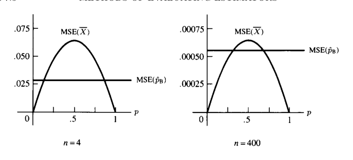
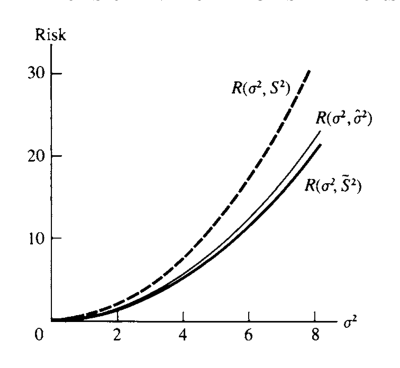

# 점추정 {#chapter7}

> “What! you have solved it already?”  
> “Well, that would be too much to say. I have discovered a suggestive fact, that is all.”  
> — Dr. Watson and Sherlock Holmes, *The Sign of Four*

- 이 장의 주제는 **점추정(point estimation)**이다.
- 모집단이 pdf 또는 pmf $f(x\mid\theta)$로 주어질 때, 모수 $\theta$를 알면 모집단 전체의 확률구조를 알 수 있다.
- 실제로는 $\theta$를 모르므로, 표본 $X_1,\ldots,X_n$을 이용하여 $\theta$ 또는 $\tau(\theta)$를 하나의 값으로 추정한다.
- 이 장은 크게 두 부분으로 나뉜다.
  - **추정량을 찾는 방법**: 적률법, 최대가능도법, 베이즈 추정량, EM 알고리즘
  - **추정량을 평가하는 방법**: 평균제곱오차, 최량불편추정량, Rao--Blackwell, 완비충분통계량, 손실함수와 위험함수
- 여기서 중요한 관점은 다음이다.
  - 추정량을 만드는 방법은 후보를 제공할 뿐이다.
  - 좋은 추정량인지 여부는 별도의 평가 기준으로 판단해야 한다.

## 도입 {#sec-7-1}

### 점추정의 목적

- 표본이 모집단 $f(x\mid\theta)$에서 나왔다고 하자.
- $\theta$가 알려지면 모집단의 분포가 완전히 결정되는 경우가 많다.
- 그러므로 표본으로부터 $\theta$를 잘 추정하는 것은 통계추론의 핵심이다.
- 어떤 경우에는 $\theta$ 자체보다 함수

$$
\tau(\theta)
$$

에 관심이 있을 수도 있다.
- 예:
  - 정규분포에서 평균 $\mu$
  - 베르누이분포에서 성공확률 $p$
  - 분산 $\sigma^2$
  - 오즈 $p/(1-p)$
  - 성공확률의 함수 $p(1-p)$

### 정의: 점추정량

- 표본 $X_1,\ldots,X_n$의 임의의 함수

$$
W(X_1,\ldots,X_n)
$$

를 **점추정량(point estimator)**이라고 한다.
- 즉, 모든 통계량은 점추정량의 후보가 될 수 있다.
- 이 정의에는 두 가지 의도적인 느슨함이 있다.
  - $W$가 어떤 모수를 추정하는지 명시하지 않는다.
  - $W$의 값의 범위가 모수공간과 반드시 같아야 한다고 요구하지 않는다.

### 추정량과 추정값

- **추정량(estimator)**은 표본 확률변수의 함수이다.

$$
W(X_1,\ldots,X_n)
$$

- **추정값(estimate)**은 실제 관측값 $x_1,\ldots,x_n$을 대입한 숫자이다.

$$
W(x_1,\ldots,x_n)
$$

- 예를 들어 표본평균 $\bar X$는 추정량이고, 실제 자료에서 계산된 $\bar x$는 추정값이다.

## 추정량을 찾는 방법 {#sec-7-2}

- 단순한 경우에는 직관만으로도 좋은 추정량을 찾을 수 있다.
- 예를 들어 모집단 평균을 추정할 때 표본평균 $\bar X$는 자연스러운 후보이다.
- 그러나 복잡한 모형에서는 직관이 불충분하거나 잘못된 방향으로 이끌 수 있다.
- 이 절에서는 네 가지 추정량 구성 방법을 다룬다.
  - 적률법
  - 최대가능도법
  - 베이즈 추정량
  - EM 알고리즘

### 적률법 {#sec-7-2-1}

- **적률법(method of moments)**은 가장 오래된 점추정법 중 하나이다.
- 기본 아이디어는 단순하다.
  - 표본적률을 모집단 적률과 같다고 놓는다.
  - 그 방정식을 풀어 모수의 추정량을 얻는다.
- 장점:
  - 계산이 비교적 쉽다.
  - 거의 항상 어떤 형태의 추정량을 제공한다.
- 단점:
  - 항상 좋은 추정량을 주는 것은 아니다.
  - 추정량의 범위가 모수공간과 맞지 않을 수 있다.

#### 적률법의 일반형

- $X_1,\ldots,X_n$이 $f(x\mid\theta_1,\ldots,\theta_k)$에서 나온 표본이라고 하자.
- 첫 $k$개의 표본적률을 다음과 같이 정의한다.

$$
m_1=\frac1n\sum_{i=1}^{n}X_i,
\qquad
\mu'_1=EX,
$$

$$
m_2=\frac1n\sum_{i=1}^{n}X_i^2,
\qquad
\mu'_2=EX^2,
$$

$$
\vdots
$$

$$
m_k=\frac1n\sum_{i=1}^{n}X_i^k,
\qquad
\mu'_k=EX^k.
\tag{7.2.1}
$$

- 모집단 적률은 보통 모수의 함수이다.

$$
\mu'_j=\mu'_j(\theta_1,\ldots,\theta_k).
$$

- 적률법 추정량 $(\tilde\theta_1,\ldots,\tilde\theta_k)$는 다음 연립방정식을 풀어 얻는다.

$$
m_1=\mu'_1(\theta_1,\ldots,\theta_k),
$$

$$
m_2=\mu'_2(\theta_1,\ldots,\theta_k),
$$

$$
\vdots
$$

$$
m_k=\mu'_k(\theta_1,\ldots,\theta_k).
\tag{7.2.2}
$$

### 예제: 정규분포의 적률법

- $X_1,\ldots,X_n$이 iid $N(\theta,\sigma^2)$라고 하자.
- 모수는

$$
\theta_1=\theta,
\qquad
\theta_2=\sigma^2
$$

이다.
- 첫 두 모집단 적률은

$$
\mu'_1=EX=\theta,
$$

$$
\mu'_2=EX^2=\theta^2+\sigma^2.
$$

- 표본적률은

$$
m_1=\bar X,
\qquad
m_2=\frac1n\sum_{i=1}^{n}X_i^2.
$$

- 적률방정식은

$$
\bar X=\theta,
$$

$$
\frac1n\sum_{i=1}^{n}X_i^2=\theta^2+\sigma^2.
$$

- 따라서 적률법 추정량은

$$
\tilde\theta=\bar X,
$$

$$
\tilde\sigma^2
=
\frac1n\sum_{i=1}^{n}X_i^2-\bar X^2
=
\frac1n\sum_{i=1}^{n}(X_i-\bar X)^2.
$$

- 이 예제에서는 적률법이 직관과 잘 맞는다.
- 단, 분산 추정량의 분모가 $n-1$이 아니라 $n$이라는 점에 유의한다.

### 예제: 이항분포에서 시행 횟수와 성공확률 추정

- $X_1,\ldots,X_n$이 iid $Binomial(k,p)$라고 하자.
- 여기서는 $k$와 $p$가 모두 미지라고 가정한다.
- pmf는

$$
P(X_i=x\mid k,p)
=
\binom{k}{x}p^x(1-p)^{k-x},
\qquad x=0,1,\ldots,k.
$$

- 이 문제는 범죄 발생건수처럼 실제 발생 횟수 $k$와 보고확률 $p$가 모두 불확실한 상황에서 나타날 수 있다.
- 모집단 평균과 분산은

$$
EX=kp,
\qquad
Var(X)=kp(1-p).
$$

- 두 번째 모멘트는

$$
EX^2=Var(X)+(EX)^2=kp(1-p)+k^2p^2.
$$

- 적률방정식은

$$
\bar X=kp,
$$

$$
\frac1n\sum_{i=1}^{n}X_i^2=kp(1-p)+k^2p^2.
$$

- 정리하면

$$
\tilde k
=
\frac{\bar X^2}{\bar X-\frac1n\sum_{i=1}^{n}(X_i-\bar X)^2},
$$

$$
\tilde p
=
\frac{\bar X}{\tilde k}.
$$

- 이 추정량은 항상 합리적인 값을 주지는 않는다.
- 예를 들어 표본분산이 표본평균보다 크면 $\tilde k$가 음수가 될 수 있다.
- 이 점은 적률법의 한계를 보여준다.

### 예제: Satterthwaite 근사

- 적률법은 추정량 자체뿐 아니라 분포근사에도 사용된다.
- $Y_i\sim\chi^2_{r_i}$가 서로 독립이라고 하자.
- 관심은 다음 형태의 합이다.

$$
\sum_{i=1}^{k}a_iY_i.
$$

- 일반적으로 이 합의 정확한 분포는 다루기 어렵다.
- Satterthwaite 근사는 이를 적절한 자유도 $\nu$를 가진 카이제곱형 분포로 맞춘다.
- 단순한 적률맞춤은 음의 자유도 추정량을 만들 수 있으므로, Satterthwaite는 더 안정적인 형태를 사용하였다.
- 그 결과 자유도 추정량은

$$
\hat\nu
=
\frac{\left(\sum_i a_iY_i\right)^2}
{\sum_i \frac{a_i^2}{r_i}Y_i^2}.
$$

- 이 근사는 실제 응용에서 여전히 널리 쓰인다.
- 중요한 교훈은 다음이다.
  - 단순 적률법은 출발점이다.
  - 문제 구조에 맞추어 적률법을 조정하면 훨씬 좋은 근사를 얻을 수 있다.

## 최대가능도추정량 {#sec-7-2-2}

- **최대가능도법(maximum likelihood)**은 추정량을 찾는 가장 널리 쓰이는 방법이다.
- 표본이 $f(x\mid\theta_1,\ldots,\theta_k)$에서 iid로 나왔다면 가능도함수는

$$
L(\theta\mid x)
=
L(\theta_1,\ldots,\theta_k\mid x_1,\ldots,x_n)
=
\prod_{i=1}^{n}f(x_i\mid\theta_1,\ldots,\theta_k).
\tag{7.2.3}
$$

### 정의: MLE

- 각 표본점 $x$에 대해 $L(\theta\mid x)$를 $\theta$의 함수로 보고 최대화하는 값 $\hat\theta(x)$를 찾는다.
- 이때 $\hat\theta(X)$를 $\theta$의 **최대가능도추정량(MLE)**이라고 한다.
- 직관적으로 MLE는 “관측된 표본이 가장 그럴듯해지는 모수값”이다.

### MLE를 찾을 때의 기본 절차

- 가능도함수가 미분가능하면 내부 극값 후보는 다음 방정식을 만족한다.

$$
\frac{\partial}{\partial\theta_i}L(\theta\mid x)=0,
\qquad i=1,\ldots,k.
\tag{7.2.4}
$$

- 실제 계산에서는 보통 로그가능도

$$
\ell(\theta\mid x)=\log L(\theta\mid x)
$$

를 사용한다.
- 로그함수는 증가함수이므로 $L$과 $\log L$의 최대점은 같다.
- 그러나 1차 미분이 0이라는 조건은 필요조건일 뿐이다.
- 다음을 별도로 확인해야 한다.
  - 그 점이 최대인지 최소인지
  - 지역최대인지 전역최대인지
  - 경계점에서 더 큰 값이 나오는지
  - 수치적으로 안정적인지

### 예제: 정규 평균의 MLE

- $X_1,\ldots,X_n$이 iid $N(\theta,1)$이라고 하자.
- 가능도함수는

$$
L(\theta\mid x)
=
\prod_{i=1}^{n}\frac{1}{\sqrt{2\pi}}e^{-(x_i-\theta)^2/2}
=
\frac{1}{(2\pi)^{n/2}}
\exp\left[-\frac12\sum_{i=1}^{n}(x_i-\theta)^2\right].
$$

- 미분방정식은

$$
\sum_{i=1}^{n}(x_i-\theta)=0
$$

이며 해는

$$
\hat\theta=\bar x.
$$

- 따라서

$$
\hat\theta=\bar X
$$

가 MLE이다.

### 예제: 직접 최대화

- 정규 평균 예제에서 다음 항등식을 사용할 수 있다.

$$
\sum_{i=1}^{n}(x_i-a)^2
\ge
\sum_{i=1}^{n}(x_i-\bar x)^2,
$$

- 등호는 $a=\bar x$일 때만 성립한다.
- 따라서 지수항

$$
\exp\left[-\frac12\sum_{i=1}^{n}(x_i-\theta)^2\right]
$$

은 $\theta=\bar x$에서 최대가 된다.
- 이 방식은 미분보다 더 간결할 수 있다.

### 예제: 베르누이 MLE

- $X_1,\ldots,X_n$이 iid Bernoulli$(p)$라고 하자.
- $y=\sum_i x_i$라고 하면 가능도는

$$
L(p\mid x)=p^y(1-p)^{n-y}.
$$

- 로그가능도는

$$
\ell(p\mid x)=y\log p+(n-y)\log(1-p).
$$

- $0<y<n$일 때 미분하여 풀면

$$
\hat p=\frac{y}{n}=\bar x.
$$

- $y=0$ 또는 $y=n$인 경계 경우에도 같은 형태가 성립한다.
- 따라서

$$
\hat p=\bar X
$$

가 MLE이다.

### 예제: 제한된 모수공간에서의 MLE

- $X_1,\ldots,X_n$이 iid $N(\theta,1)$이고 $\theta\ge0$임을 알고 있다고 하자.
- 제한이 없다면 MLE는 $\bar X$이다.
- 그러나 $\bar X<0$이면 모수공간 밖에 있다.
- 이 경우 $\theta\ge0$에서 가능도는 $\theta=0$에서 최대가 된다.
- 따라서 MLE는

$$
\hat\theta=
\begin{cases}
\bar X, & \bar X\ge0,\\
0, & \bar X<0.
\end{cases}
$$

- 일반적으로 MLE는 항상 **허용된 모수공간 안에서** 최대화해야 한다.

### 예제: 이항분포에서 시행 횟수 $k$의 MLE

- $X_1,\ldots,X_n$이 $Binomial(k,p)$에서 나온 표본이고 $p$는 알려져 있지만 $k$는 미지라고 하자.
- 가능도는

$$
L(k\mid x,p)
=
\prod_{i=1}^{n}\binom{k}{x_i}p^{x_i}(1-p)^{k-x_i}.
$$

- 여기서 $k$는 정수이며 $k\ge\max_i x_i$이어야 한다.
- factorial 때문에 미분으로 직접 풀기 어렵다.
- 따라서 likelihood ratio

$$
\frac{L(k\mid x,p)}{L(k-1\mid x,p)}
=
\frac{[k(1-p)]^n}{\prod_{i=1}^{n}(k-x_i)}
$$

를 이용한다.
- 최대점은 다음 부등식을 만족하는 정수 $k$이다.

$$
[k(1-p)]^n\ge\prod_{i=1}^{n}(k-x_i),
$$

$$
[(k+1)(1-p)]^n<\prod_{i=1}^{n}(k+1-x_i).
$$

- 적절한 변환 $z=1/k$를 쓰면 하나의 다항방정식으로 환원된다.
- 이 예제는 MLE가 수치해석적으로 민감할 수 있음을 보여주는 중요한 사례이다.

### MLE의 불변성

- 관심 모수가 $\theta$가 아니라 $\tau(\theta)$일 수 있다.
- MLE의 중요한 성질은 다음이다.
  - $\hat\theta$가 $\theta$의 MLE이면
  - $\tau(\hat\theta)$가 $\tau(\theta)$의 MLE이다.

#### 유도 가능도의 정의

- $\tau$가 일대일이 아니면 $\tau(\theta)=\eta$를 만족하는 $\theta$가 여러 개 있을 수 있다.
- 이 경우 $\eta=\tau(\theta)$의 유도 가능도는

$$
L^*(\eta\mid x)
=
\sup_{\{\theta:\tau(\theta)=\eta\}}L(\theta\mid x).
\tag{7.2.5}
$$

#### 정리: MLE의 불변성

- $\hat\theta$가 $\theta$의 MLE이면, 임의의 함수 $\tau(\theta)$에 대해 $\tau(\hat\theta)$가 $\tau(\theta)$의 MLE이다.
- 예:
  - 정규 평균 $\theta$의 MLE가 $\bar X$이면 $\theta^2$의 MLE는 $\bar X^2$이다.
  - 베르누이 $p$의 MLE가 $\hat p$이면 $p(1-p)$의 MLE는 $\hat p(1-\hat p)$이다.

### 예제: 정규분포에서 $\mu,\sigma^2$ 모두 미지

- $X_1,\ldots,X_n$이 iid $N(\theta,\sigma^2)$라고 하자.
- 가능도는

$$
L(\theta,\sigma^2\mid x)
=
\frac{1}{(2\pi\sigma^2)^{n/2}}
\exp\left[-\frac{1}{2\sigma^2}\sum_{i=1}^{n}(x_i-\theta)^2\right].
$$

- 로그가능도는

$$
\ell(\theta,\sigma^2\mid x)
=
-\frac n2\log(2\pi)-\frac n2\log\sigma^2
-
\frac{1}{2\sigma^2}\sum_{i=1}^{n}(x_i-\theta)^2.
$$

- 미분방정식을 풀면

$$
\hat\theta=\bar x,
$$

$$
\hat\sigma^2
=
\frac1n\sum_{i=1}^{n}(x_i-\bar x)^2.
$$

- 즉, 정규분포에서 분산의 MLE는 불편표본분산 $S^2$가 아니라 분모가 $n$인 추정량이다.

### 예제: MLE의 수치적 불안정성

- Olkin, Petkau, Zidek의 예에서 이항분포의 $k$를 추정할 때 다음 두 자료를 비교한다.

$$
(16,18,22,25,27)
$$

와

$$
(16,18,22,25,28).
$$

- 두 번째 자료는 마지막 값이 27에서 28로 1만 증가했을 뿐이다.
- 그러나 $k$의 MLE는 크게 변할 수 있다.
- 이 현상은 likelihood가 최대점 근처에서 매우 평평하거나 유한한 최대점이 약할 때 발생한다.
- 수치적으로 MLE를 구할 때는 안정성을 반드시 점검해야 한다.

## 베이즈 추정량 {#sec-7-2-3}

- 고전적 접근에서는 $\theta$를 미지이지만 고정된 값으로 본다.
- 베이즈 접근에서는 $\theta$를 확률분포를 갖는 양으로 본다.
- 이때 자료를 보기 전 $\theta$에 대한 믿음을 나타내는 분포를 **사전분포(prior distribution)**라고 한다.
- 자료를 본 뒤 사전분포를 갱신한 분포를 **사후분포(posterior distribution)**라고 한다.

### 사후분포

- 사전분포를 $\pi(\theta)$, 표본분포를 $f(x\mid\theta)$라고 하자.
- 사후분포는 Bayes 규칙으로

$$
\pi(\theta\mid x)
=
\frac{f(x\mid\theta)\pi(\theta)}{m(x)},
\tag{7.2.7}
$$

여기서

$$
m(x)=\int f(x\mid\theta)\pi(\theta)\,d\theta
\tag{7.2.8}
$$

는 $X$의 주변분포이다.
- 사후분포는 관측된 표본 $x$에 조건을 건 $\theta$의 조건부분포이다.
- 사후평균 $E(\theta\mid x)$는 대표적인 베이즈 점추정량이다.

### 예제: 이항 베이즈 추정

- $X_1,\ldots,X_n$이 iid Bernoulli$(p)$이고 $Y=\sum_iX_i$라 하자.
- 표본분포는

$$
Y\mid p\sim Binomial(n,p).
$$

- 사전분포를

$$
p\sim Beta(\alpha,\beta)
$$

로 둔다.
- 결합밀도 또는 결합질량은

$$
f(y,p)
=
\binom{n}{y}p^y(1-p)^{n-y}
\frac{\Gamma(\alpha+\beta)}{\Gamma(\alpha)\Gamma(\beta)}
p^{\alpha-1}(1-p)^{\beta-1}.
$$

- $Y$의 주변분포는 beta-binomial 형태이다.

$$
f(y)
=
\binom{n}{y}
\frac{\Gamma(\alpha+\beta)}{\Gamma(\alpha)\Gamma(\beta)}
\frac{\Gamma(y+\alpha)\Gamma(n-y+\beta)}{\Gamma(n+\alpha+\beta)}.
\tag{7.2.9}
$$

- 사후분포는

$$
p\mid y\sim Beta(y+\alpha,n-y+\beta).
$$

- 사후평균을 베이즈 추정량으로 쓰면

$$
\hat p_B
=
\frac{y+\alpha}{\alpha+\beta+n}.
$$

- 이를 다음과 같이 해석할 수 있다.

$$
\hat p_B
=
\left(\frac{n}{\alpha+\beta+n}\right)\left(\frac yn\right)
+
\left(\frac{\alpha+\beta}{\alpha+\beta+n}\right)
\left(\frac{\alpha}{\alpha+\beta}\right).
$$

- 즉, 베이즈 추정량은 표본비율과 사전평균의 가중평균이다.
- 표본크기 $n$이 커질수록 표본정보의 가중치가 커진다.

### 정의: 켤레사전분포

- 분포족 $F=\{f(x\mid\theta)\}$에 대해 사전분포족 $\Pi$가 다음 성질을 가지면 켤레사전분포족이라고 한다.
  - $\Pi$의 사전분포와 $F$의 표본분포를 결합했을 때,
  - 모든 자료 $x$에 대해 사후분포가 다시 $\Pi$에 속한다.
- 베타분포족은 이항분포족에 대한 켤레사전분포족이다.
- 켤레성은 계산을 단순하게 해주지만, 실제 사전지식을 잘 반영하는지는 별도의 문제이다.

### 예제: 정규 베이즈 추정량

- $X\sim N(\theta,\sigma^2)$이고 $\theta$의 사전분포가

$$
\theta\sim N(\mu,\tau^2)
$$

라고 하자.
- 여기서 $\sigma^2,\mu,\tau^2$는 알려져 있다고 가정한다.
- 사후분포도 정규분포이며

$$
E(\theta\mid x)
=
\frac{\tau^2}{\tau^2+\sigma^2}x
+
\frac{\sigma^2}{\sigma^2+\tau^2}\mu,
\tag{7.2.10}
$$

$$
Var(\theta\mid x)
=
\frac{\sigma^2\tau^2}{\sigma^2+\tau^2}.
$$

- 사후평균은 자료 $x$와 사전평균 $\mu$의 가중평균이다.
- 사전분산 $\tau^2$가 매우 크면 사전정보가 흐려지고, 베이즈 추정량은 표본정보 $x$에 가까워진다.
- 사전분산이 작으면 사전평균에 더 큰 가중치가 부여된다.

## EM 알고리즘 {#sec-7-2-4}

- EM 알고리즘은 MLE를 찾기 위한 반복 알고리즘이다.
- 특히 **결측자료(missing data)** 또는 **잠재변수(latent variable)**가 있는 문제에 적합하다.
- 핵심 아이디어는 다음이다.
  - 직접 최대화하기 어려운 불완전자료 가능도 대신,
  - 완전자료 로그가능도의 조건부기댓값을 반복적으로 최대화한다.

### 완전자료와 불완전자료

- 관측된 자료를 $Y$라고 하고, 관측되지 않은 보강자료를 $X$라고 하자.
- 완전자료는 $(Y,X)$이다.
- 완전자료 밀도 또는 질량함수를 $f(y,x\mid\theta)$, 불완전자료 밀도 또는 질량함수를 $g(y\mid\theta)$라고 하면

$$
g(y\mid\theta)=\int f(y,x\mid\theta)\,dx.
\tag{7.2.14}
$$

- 이산형에서는 적분 대신 합을 사용한다.

### EM의 기본 항등식

- 완전자료 가능도, 불완전자료 가능도, 결측자료의 조건부분포를 각각

$$
L(\theta\mid y,x)=f(y,x\mid\theta),
$$

$$
L(\theta\mid y)=g(y\mid\theta),
$$

$$
k(x\mid\theta,y)=\frac{f(y,x\mid\theta)}{g(y\mid\theta)}
\tag{7.2.17}
$$

로 둔다.
- 그러면

$$
\log L(\theta\mid y)
=
\log L(\theta\mid y,x)-\log k(x\mid\theta,y).
\tag{7.2.18}
$$

- 관측되지 않은 $x$를 현재 모수값 $\theta'$에서의 조건부분포로 평균내면

$$
\log L(\theta\mid y)
=
E[\log L(\theta\mid y,X)\mid\theta',y]
-
E[\log k(X\mid\theta,y)\mid\theta',y].
\tag{7.2.19}
$$

### EM 반복식

- 초기값 $\theta^{(0)}$에서 시작한다.
- 반복 $r$에서 다음 값을 계산한다.

$$
\theta^{(r+1)}
=
\arg\max_{\theta}
E[\log L(\theta\mid y,X)\mid\theta^{(r)},y].
\tag{7.2.20}
$$

- E-step:
  - 현재 추정값으로 완전자료 로그가능도의 조건부기댓값을 계산한다.
- M-step:
  - 그 조건부기댓값을 $\theta$에 대해 최대화한다.

### 예제: 여러 포아송 비율 모형

- 서로 독립인 자료가 다음과 같이 주어진다고 하자.

$$
Y_i\sim Poisson(\beta\tau_i),
\qquad
X_i\sim Poisson(\tau_i).
$$

- $Y_i$는 질병 발생 수, $X_i$는 노출량 또는 인구밀도에 대한 보조정보로 해석할 수 있다.
- 완전자료 가능도는

$$
f((x_1,y_1),\ldots,(x_n,y_n)\mid\beta,\tau_1,\ldots,\tau_n)
=
\prod_{i=1}^{n}
\frac{e^{-\beta\tau_i}(\beta\tau_i)^{y_i}}{y_i!}
\frac{e^{-\tau_i}\tau_i^{x_i}}{x_i!}.
\tag{7.2.11}
$$

- 완전자료가 모두 관측되면 MLE는

$$
\hat\beta
=
\frac{\sum_{i=1}^{n}y_i}{\sum_{i=1}^{n}x_i},
$$

$$
\hat\tau_j
=
\frac{x_j+y_j}{\hat\beta+1},
\qquad j=1,\ldots,n.
\tag{7.2.12}
$$

- 만약 $x_1$이 결측이면, EM에서 $x_1$의 조건부 기대값이 현재 $\hat\tau_1^{(r)}$로 대체된다.
- 반복식은

$$
\hat\beta^{(r+1)}
=
\frac{\sum_{i=1}^{n}y_i}{\hat\tau_1^{(r)}+\sum_{i=2}^{n}x_i},
$$

$$
\hat\tau_1^{(r+1)}
=
\frac{\hat\tau_1^{(r)}+y_1}{\hat\beta^{(r+1)}+1},
$$

$$
\hat\tau_j^{(r+1)}
=
\frac{x_j+y_j}{\hat\beta^{(r+1)}+1},
\qquad j=2,\ldots,n.
\tag{7.2.23}
$$

### 정리: EM 가능도의 단조성

- EM 반복열 $\{\hat\theta^{(r)}\}$는 불완전자료 가능도를 감소시키지 않는다.

$$
L(\hat\theta^{(r+1)}\mid y)
\ge
L(\hat\theta^{(r)}\mid y).
\tag{7.2.24}
$$

- 이 성질은 EM 알고리즘의 핵심이다.
- 다만 가능도가 증가한다고 해서 항상 전역최대점으로 수렴한다는 뜻은 아니다.
- 초기값, 다봉 가능도, saddle point 가능성 등을 고려해야 한다.

## 추정량을 평가하는 방법 {#sec-7-3}

- 앞 절의 방법들은 추정량 후보를 만든다.
- 이제 필요한 것은 후보들을 비교하고 평가하는 기준이다.
- 이 절에서는 다음 기준을 다룬다.
  - 평균제곱오차
  - 최량불편추정량
  - 충분성과 불편성
  - 손실함수와 위험함수

## 평균제곱오차 {#sec-7-3-1}

### 정의: MSE

- 추정량 $W$의 $\theta$에 대한 평균제곱오차는

$$
MSE_\theta(W)=E_\theta(W-\theta)^2
$$

이다.
- MSE는 추정량이 평균적으로 모수에서 얼마나 멀리 떨어지는지 제곱거리로 측정한다.

### 정의: 편향

- 추정량 $W$의 편향은

$$
Bias_\theta(W)=E_\theta W-\theta
$$

이다.
- $Bias_\theta(W)=0$이 모든 $\theta$에서 성립하면 $W$는 불편추정량이다.

### MSE 분해

- MSE는 분산과 편향의 제곱으로 분해된다.

$$
E_\theta(W-\theta)^2
=
Var_\theta(W)+[E_\theta W-\theta]^2
=
Var_\theta(W)+[Bias_\theta(W)]^2.
\tag{7.3.1}
$$

- 해석:
  - 분산은 추정량의 정밀도와 관련된다.
  - 편향은 추정량의 정확도와 관련된다.
  - 좋은 추정량은 두 요소를 함께 작게 만들어야 한다.

### 예제: 정규분포에서 MSE

- $X_1,\ldots,X_n$이 iid $N(\mu,\sigma^2)$라고 하자.
- $\bar X$와 $S^2$는 각각 $\mu$와 $\sigma^2$의 불편추정량이다.

$$
E\bar X=\mu,
\qquad
ES^2=\sigma^2.
$$

- 따라서 MSE는 각각 분산과 같다.

$$
E(\bar X-\mu)^2=Var(\bar X)=\frac{\sigma^2}{n}.
$$

- 정규성 하에서

$$
E(S^2-\sigma^2)^2=Var(S^2)=\frac{2\sigma^4}{n-1}.
$$

### 예제: 분산 MLE와 불편표본분산 비교

- 정규분포에서 $\sigma^2$의 MLE는

$$
\hat\sigma^2
=
\frac1n\sum_{i=1}^{n}(X_i-\bar X)^2
=
\frac{n-1}{n}S^2.
$$

- 이 추정량은 편향되어 있다.

$$
E\hat\sigma^2
=
\frac{n-1}{n}\sigma^2.
$$

- 분산은

$$
Var(\hat\sigma^2)
=
\left(\frac{n-1}{n}\right)^2Var(S^2)
=
\frac{2(n-1)\sigma^4}{n^2}.
$$

- MSE는

$$
E(\hat\sigma^2-\sigma^2)^2
=
\left(\frac{2n-1}{n^2}\right)\sigma^4.
$$

- 이는

$$
\left(\frac{2n-1}{n^2}\right)\sigma^4
<
\frac{2\sigma^4}{n-1}
$$

이므로 $\hat\sigma^2$가 $S^2$보다 작은 MSE를 갖는다.
- 그러나 $\hat\sigma^2$는 평균적으로 $\sigma^2$를 과소추정한다.
- MSE만으로 추정량의 모든 성질을 판단할 수는 없다.

### 예제: 이항 베이즈 추정량의 MSE

- $X_1,\ldots,X_n$이 iid Bernoulli$(p)$이고 $Y=\sum_iX_i$라 하자.
- MLE는

$$
\hat p=\frac Yn.
$$

- MSE는

$$
E_p(\hat p-p)^2
=
Var_p(\bar X)
=
\frac{p(1-p)}{n}.
$$

- 베이즈 추정량

$$
\hat p_B
=
\frac{Y+\alpha}{\alpha+\beta+n}
$$

의 MSE는

$$
E_p(\hat p_B-p)^2
=
\frac{np(1-p)}{(\alpha+\beta+n)^2}
+
\left(\frac{np+\alpha}{\alpha+\beta+n}-p\right)^2.
$$

- 특별히 $\alpha=\beta=\sqrt n/4$를 선택하면 MSE를 상수에 가깝게 만들 수 있다.
- 이때

$$
\hat p_B
=
\frac{Y+\sqrt n/4}{n+\sqrt n},
$$

$$
E(\hat p_B-p)^2
=
\frac{n}{4(n+\sqrt n)^2}.
$$

- 작은 표본에서는 $\hat p_B$가 안정적일 수 있다.
- 큰 표본에서는 $\hat p$가 대체로 더 좋은 선택이 된다.
- 이 예제는 MSE가 모수값에 따라 달라지며, 하나의 추정량이 모든 곳에서 항상 최선이 아닐 수 있음을 보여준다.

### 예제: 등변추정량의 MSE

- 위치모수 모형에서 $X_i\sim f(x_i-\theta)$라고 하자.
- 등변추정량은 자료를 모두 $a$만큼 이동시키면 추정량도 $a$만큼 이동해야 한다.
- 즉,

$$
W(x_1+a,\ldots,x_n+a)=W(x_1,\ldots,x_n)+a.
\tag{7.3.2}
$$

- 이 성질을 만족하는 경우 MSE가 $\theta$에 의존하지 않을 수 있다.
- 따라서 등변추정량의 클래스 안에서는 MSE로 추정량을 비교하기가 쉬워진다.

## 최량불편추정량 {#sec-7-3-2}

- 전체 추정량 클래스에서 MSE가 가장 작은 추정량을 찾는 것은 일반적으로 불가능하거나 의미가 약할 수 있다.
- 예를 들어 상수 추정량 $\hat\theta=17$은 $\theta=17$ 근처에서는 매우 좋지만 다른 곳에서는 나쁘다.
- 그래서 추정량의 범위를 제한한다.
- 대표적인 제한이 **불편성(unbiasedness)**이다.

### 정의: 최량불편추정량

- $W^*$가 $\tau(\theta)$의 불편추정량이고

$$
E_\theta W^*=\tau(\theta)
\quad\text{for all }\theta
$$

이며, 임의의 다른 불편추정량 $W$에 대해

$$
Var_\theta(W^*)\le Var_\theta(W)
\quad\text{for all }\theta
$$

이면 $W^*$를 $\tau(\theta)$의 **최량불편추정량(best unbiased estimator)**이라고 한다.
- 같은 개념을 **UMVUE(uniform minimum variance unbiased estimator)**라고도 한다.

### 예제: 포아송에서 불편추정량 비교

- $X_1,\ldots,X_n$이 iid Poisson$(\lambda)$라고 하자.
- 포아송분포에서는 평균과 분산이 모두 $\lambda$이다.
- 따라서

$$
E_\lambda\bar X=\lambda,
\qquad
E_\lambda S^2=\lambda.
$$

- $\bar X$와 $S^2$는 모두 $\lambda$의 불편추정량이다.
- 그러나 둘 중 어느 것이 더 좋은지 판단하려면 분산을 비교해야 한다.
- 실제로는 $\bar X$가 최량불편추정량이 된다.

### Cramer--Rao 부등식

- 최량불편추정량을 찾기 위한 중요한 도구는 분산의 하한이다.
- 어떤 불편추정량도 가질 수 없는 분산의 하한을 알면, 그 하한을 달성하는 추정량이 최량불편추정량이다.

#### 정리: Cramer--Rao 부등식

- $X$가 pdf 또는 pmf $f(x\mid\theta)$를 갖고, 적절한 미분과 적분 교환 조건이 성립한다고 하자.
- $W(X)$가 $\tau(\theta)$의 불편추정량이면

$$
Var_\theta W(X)
\ge
\frac{[\tau'(\theta)]^2}{E_\theta\left[\left(\frac{\partial}{\partial\theta}\log f(X\mid\theta)\right)^2\right]}.
\tag{7.3.6}
$$

- 분모는 Fisher information이다.

$$
I(\theta)
=
E_\theta\left[\left(\frac{\partial}{\partial\theta}\log f(X\mid\theta)\right)^2\right].
$$

- iid 표본에서는 정보가 더해지므로 하한이 다음처럼 된다.

$$
Var_\theta W(X)
\ge
\frac{[\tau'(\theta)]^2}{nI_1(\theta)}.
$$

### 예제: 포아송에서 Cramer--Rao 하한

- $X_i\sim Poisson(\lambda)$에서 하나의 관측값에 대한 정보량은

$$
I_1(\lambda)=\frac1\lambda.
$$

- $\tau(\lambda)=\lambda$이면 $\tau'(\lambda)=1$이다.
- 따라서 iid 표본에서 불편추정량의 분산 하한은

$$
\frac{1}{n/\lambda}=\frac{\lambda}{n}.
$$

- 그런데

$$
Var(\bar X)=\frac{\lambda}{n}.
$$

- 그러므로 $\bar X$는 $\lambda$의 최량불편추정량이다.

### 예제: 균등분포의 스케일 모수

- $X_1,\ldots,X_n$이 iid Uniform$(0,\theta)$라고 하자.
- 이 모형은 지지집합이 $\theta$에 의존하므로 Cramer--Rao 정리의 조건이 성립하지 않는다.
- 최대값

$$
Y=X_{(n)}=\max_iX_i
$$

의 pdf는

$$
f_Y(y\mid\theta)=
\frac{n y^{n-1}}{\theta^n},
\qquad 0<y<\theta.
$$

- 평균은

$$
EY=\frac{n}{n+1}\theta.
$$

- 따라서

$$
\frac{n+1}{n}Y
$$

는 $\theta$의 불편추정량이다.

### 예제: 정규분산의 하한과 달성

- $X_1,\ldots,X_n$이 iid $N(\mu,\sigma^2)$라고 하자.
- $\sigma^2$를 추정할 때 $\mu$가 알려져 있으면

$$
\frac1n\sum_{i=1}^{n}(X_i-\mu)^2
$$

가 $\sigma^2$의 최량불편추정량이 될 수 있다.
- 하지만 $\mu$가 미지이면 이 추정량은 계산할 수 없다.
- 이 경우 불편표본분산 $S^2$는 Cramer--Rao 하한을 달성하지 못한다.
- 따라서 Cramer--Rao 하한만으로 $S^2$가 최량불편인지 판단할 수 없다.

## 충분성과 불편성 {#sec-7-3-3}

- Cramer--Rao 하한은 강력하지만 적용 조건이 제한적이다.
- 더 넓은 상황에서는 충분통계량과 조건부기댓값을 사용한다.

### 정리: Rao--Blackwell 정리

- $W$가 $\tau(\theta)$의 불편추정량이고, $T$가 $\theta$에 대한 충분통계량이라고 하자.
- 그러면

$$
\phi(T)=E[W\mid T]
$$

도 $\tau(\theta)$의 불편추정량이며,

$$
Var_\theta(\phi(T))\le Var_\theta(W)
$$

가 모든 $\theta$에서 성립한다.
- 즉, 충분통계량에 조건화하면 불편성을 유지하면서 분산을 줄일 수 있다.

### Rao--Blackwell 정리의 의미

- 충분통계량 $T$는 $\theta$에 대한 모든 정보를 담는다.
- $W$가 $T$ 외의 불필요한 잡음을 포함하고 있다면, $E(W\mid T)$는 그 잡음을 평균내어 제거한다.
- 따라서 추정량이 개선된다.
- 이 정리는 “좋은 불편추정량은 충분통계량의 함수로 생각해도 된다”는 메시지를 준다.

### 정리: 최량불편추정량의 유일성

- 최량불편추정량이 존재하면 거의 확실하게 유일하다.
- 두 최량불편추정량이 서로 다르면 평균을 취해 더 작은 분산을 만들 수 있기 때문이다.

### 정리: 최량불편추정량의 특징

- $W$가 $\tau(\theta)$의 불편추정량이라고 하자.
- $W$가 최량불편추정량일 필요충분조건은 모든 0의 불편추정량 $U$에 대해

$$
Cov_\theta(W,U)=0
\quad\text{for all }\theta
$$

인 것이다.
- 여기서 $U$는

$$
E_\theta U=0
$$

을 만족하는 추정량이다.
- 직관적으로 0의 불편추정량은 순수한 랜덤 잡음이다.
- 좋은 추정량은 이런 잡음과 상관되어 있지 않아야 한다.

### 예제: 0의 불편추정량

- $X\sim Uniform(\theta,\theta+1)$라고 하자.
- 그러면

$$
EX=\theta+\frac12.
$$

- 따라서

$$
X-\frac12
$$

는 $\theta$의 불편추정량이다.
- 이 모형에서는 주기 1을 갖고 평균이 0이 되는 함수들이 0의 불편추정량을 만든다.
- 예를 들어

$$
h(x)=\sin(2\pi x)
$$

는 0의 불편추정량이다.
- 그런데 $X-1/2$는 이러한 0의 불편추정량과 상관될 수 있으므로 최량불편추정량이 아니다.

### 예제: 균등분포 최대값 추정량의 최량성

- $X_1,\ldots,X_n$이 iid Uniform$(0,\theta)$라고 하자.
- 앞에서

$$
\frac{n+1}{n}X_{(n)}
$$

가 $\theta$의 불편추정량임을 보았다.
- $X_{(n)}$는 완비충분통계량이다.
- 그러므로 완비성 때문에 $X_{(n)}$의 함수인 0의 불편추정량은 0뿐이다.
- 따라서

$$
\frac{n+1}{n}X_{(n)}
$$

는 $\theta$의 최량불편추정량이다.

### 정리: 완비충분통계량과 UMVUE

- $T$가 $\theta$에 대한 완비충분통계량이라고 하자.
- $\phi(T)$가 $T$에만 의존하는 추정량이면, $\phi(T)$는 자신의 기댓값

$$
E_\theta[\phi(T)]
$$

에 대한 유일한 최량불편추정량이다.
- 실전 규칙:
  - 어떤 함수 $\tau(\theta)$의 불편추정량 $h(X)$를 찾는다.
  - 완비충분통계량 $T$에 대해 조건화한다.

$$
\phi(T)=E[h(X)\mid T].
$$

  - 그러면 $\phi(T)$가 $\tau(\theta)$의 UMVUE이다.

### 예제: 이항분포에서 정확히 한 번 성공할 확률의 UMVUE

- $X_1,\ldots,X_n$이 iid $Binomial(k,\theta)$라고 하자.
- 추정하려는 양은 단일 관측 $X$에서 정확히 한 번 성공할 확률이다.

$$
\tau(\theta)=P_\theta(X=1)=k\theta(1-\theta)^{k-1}.
$$

- 충분완비통계량은

$$
T=\sum_{i=1}^{n}X_i\sim Binomial(kn,\theta).
$$

- 단순한 불편추정량은

$$
h(X_1)=
\begin{cases}
1, & X_1=1,\\
0, & \text{otherwise}.
\end{cases}
$$

- 왜냐하면

$$
E_\theta h(X_1)=P_\theta(X_1=1)=k\theta(1-\theta)^{k-1}.
$$

- Rao--Blackwell화하면 UMVUE는

$$
\phi(T)=E[h(X_1)\mid T].
$$

- $T=t$가 관측되었을 때 계산하면

$$
\phi(t)
=
\frac{k\binom{k(n-1)}{t-1}}{\binom{kn}{t}}.
$$

- 따라서 UMVUE는

$$
\phi\left(\sum_{i=1}^{n}X_i\right)
=
\frac{k\binom{k(n-1)}{\sum_iX_i-1}}
{\binom{kn}{\sum_iX_i}}.
$$

## 손실함수 최적성 {#sec-7-3-4}

- 지금까지 MSE를 중심으로 추정량을 평가했다.
- MSE는 손실함수의 특수한 경우이다.
- 손실함수 기반의 추정량 평가와 최적화는 의사결정이론의 핵심이다.

### 손실함수

- 관측자료 $X=x$를 본 뒤 $\theta$에 대한 행동 또는 결정 $a$를 선택한다고 하자.
- 행동공간을 $\mathcal A$라고 한다.
- 점추정 문제에서는 보통 $\mathcal A=\Theta$이다.
- 손실함수 $L(\theta,a)$는 참값이 $\theta$일 때 행동 $a$를 선택해서 입는 손실이다.
- 대표적인 손실함수는 다음과 같다.

#### 절대오차 손실

$$
L(\theta,a)=|a-\theta|.
$$

#### 제곱오차 손실

$$
L(\theta,a)=(a-\theta)^2.
$$

#### 비대칭 제곱오차 손실

$$
L(\theta,a)=
\begin{cases}
(a-\theta)^2, & a<\theta,\\
10(a-\theta)^2, & a\ge\theta.
\end{cases}
$$

#### 상대 제곱오차 손실

$$
L(\theta,a)=\frac{(a-\theta)^2}{|\theta|+1}.
$$

- 손실함수는 실제 문제에서 과대추정과 과소추정의 비용, 모수값에 따른 손실 크기 등을 반영해야 한다.

### 위험함수

- 추정량 $\delta(X)$의 위험함수는

$$
R(\theta,\delta)
=
E_\theta[L(\theta,\delta(X))].
\tag{7.3.16}
$$

- 참값 $\theta$에서 평균적으로 입는 손실이다.
- 제곱오차 손실에서는 위험함수가 MSE와 같다.

$$
R(\theta,\delta)
=Var_\theta[\delta(X)]+[Bias_\theta\delta(X)]^2.
\tag{7.3.17}
$$

### 예제: 이항 추정량의 위험함수

- Bernoulli$(p)$ 표본에서 두 추정량을 비교한다.

$$
\hat p=\bar X,
$$

$$
\hat p_B=
\frac{\sum_iX_i+\sqrt n/4}{n+\sqrt n}.
$$

- 제곱오차 손실에서는 위험함수가 MSE이다.
- 앞의 Figure 7.3.1은 $n=4$와 $n=400$에서 두 위험함수를 비교한다.
- 작은 표본에서는 베이즈형 shrinkage 추정량이 유리할 수 있고, 큰 표본에서는 표본비율이 유리해진다.

### 예제: 정규분산 추정의 위험함수

- $X_1,\ldots,X_n$이 iid $N(\mu,\sigma^2)$이고, $\sigma^2$를 추정한다고 하자.
- 추정량을

$$
\delta_b(X)=bS^2
$$

의 형태로 제한한다.
- 제곱오차 손실에서 위험함수는

$$
R((\mu,\sigma^2),\delta_b)
=
\left[\frac{2b^2}{n-1}+(b-1)^2\right]\sigma^4.
$$

- 괄호 안의 상수

$$
c_b=\frac{2b^2}{n-1}+(b-1)^2
\tag{7.3.18}
$$

를 최소화하면

$$
b=\frac{n-1}{n+1}.
$$

- 따라서 이 클래스 안에서 위험을 최소화하는 추정량은

$$
\tilde S^2
=
\frac{n-1}{n+1}S^2
=
\frac1{n+1}\sum_{i=1}^{n}(X_i-\bar X)^2.
$$

### 예제: Stein 손실을 사용한 분산추정

- 분산추정에서는 제곱오차 손실이 항상 적절하지 않을 수 있다.
- Stein 손실은 다음과 같다.

$$
L(\sigma^2,a)
=
\frac{a}{\sigma^2}-1-\log\left(\frac{a}{\sigma^2}\right).
$$

- $a=\sigma^2$이면 손실은 0이다.
- $a\to0$ 또는 $a\to\infty$이면 손실은 무한대로 간다.
- $\delta_b=bS^2$에 대한 위험은

$$
R(\sigma^2,\delta_b)
=b-\log b-1-E\log\left(\frac{S^2}{\sigma^2}\right).
$$

- $b$에 의존하는 부분은 $b-\log b$이므로 최소값은 $b=1$에서 얻는다.
- 따라서 Stein 손실에서는 $S^2$가 $bS^2$ 클래스 안에서 최적이다.
- 이 예제는 “좋은 추정량”이 손실함수 선택에 따라 달라짐을 보여준다.

### 베이즈 위험과 베이즈 규칙

- 사전분포 $\pi(\theta)$가 있으면 위험함수를 평균낼 수 있다.

$$
\int_\Theta R(\theta,\delta)\pi(\theta)\,d\theta.
$$

- 이를 **베이즈 위험(Bayes risk)**이라고 한다.
- 베이즈 위험을 최소화하는 결정규칙을 **베이즈 규칙(Bayes rule)**이라고 한다.

### 사후기대손실

- 베이즈 위험은 다음과 같이 쓸 수 있다.

$$
\int_\Theta R(\theta,\delta)\pi(\theta)d\theta
=
\int_\mathcal X
\left[
\int_\Theta L(\theta,\delta(x))\pi(\theta\mid x)d\theta
\right]
m(x)dx.
\tag{7.3.19}
$$

- 대괄호 안은 관측 $x$가 주어졌을 때의 **사후기대손실(posterior expected loss)**이다.
- 따라서 각 $x$에서 사후기대손실을 최소화하는 $\delta(x)$를 선택하면 베이즈 위험이 최소화된다.

### 예제: 두 가지 베이즈 규칙

- 제곱오차 손실에서 사후기대손실은

$$
E[(\theta-a)^2\mid X=x]
$$

이며, 이는 $a=E(\theta\mid x)$에서 최소가 된다.
- 따라서 제곱오차 손실의 베이즈 추정량은 사후평균이다.
- 절대오차 손실에서는

$$
E[|\theta-a|\mid X=x]
$$

을 최소화하는 값이 사후중앙값이다.
- 따라서 절대오차 손실의 베이즈 추정량은 사후중앙값이다.

### 예제: 정규 베이즈 추정

- $X_1,\ldots,X_n$이 iid $N(\theta,\sigma^2)$이고 $\theta\sim N(\mu,\tau^2)$라고 하자.
- 사후분포는 정규분포이며

$$
E(\theta\mid\bar x)
=
\frac{\tau^2}{\tau^2+\sigma^2/n}\bar x
+
\frac{\sigma^2/n}{\tau^2+\sigma^2/n}\mu.
$$

- 사후분산은

$$
Var(\theta\mid\bar x)
=
\frac{\tau^2\sigma^2/n}{\tau^2+\sigma^2/n}.
$$

- 사후분포가 대칭 정규분포이므로 사후평균과 사후중앙값이 같다.
- 따라서 제곱오차 손실과 절대오차 손실에서 같은 베이즈 추정량이 나온다.

### 예제: 이항 베이즈 추정

- $Y=\sum_iX_i$이고 $p\sim Beta(\alpha,\beta)$이면

$$
p\mid y\sim Beta(y+\alpha,n-y+\beta).
$$

- 제곱오차 손실에서 베이즈 추정량은 사후평균이다.

$$
\delta_\pi(y)=E(p\mid y)
=
\frac{y+\alpha}{\alpha+\beta+n}.
$$

- 절대오차 손실에서는 사후중앙값이 필요하다.
- 베타분포의 중앙값은 일반적으로 닫힌 형태가 없으므로 다음 방정식을 수치적으로 풀어야 한다.

$$
\int_0^m
\frac{\Gamma(\alpha+\beta+n)}{\Gamma(y+\alpha)\Gamma(n-y+\beta)}
p^{y+\alpha-1}(1-p)^{n-y+\beta-1}\,dp
=
\frac12.
$$

#### Table: $n=10$, uniform$(0,1)$ prior에서 세 추정량 비교

| $y$ | MLE $y/n$ | 절대오차 Bayes | 제곱오차 Bayes |
|---:|---:|---:|---:|
| 0 | 0.0000 | 0.0611 | 0.0833 |
| 1 | 0.1000 | 0.1480 | 0.1667 |
| 2 | 0.2000 | 0.2358 | 0.2500 |
| 3 | 0.3000 | 0.3238 | 0.3333 |
| 4 | 0.4000 | 0.4119 | 0.4167 |
| 5 | 0.5000 | 0.5000 | 0.5000 |
| 6 | 0.6000 | 0.5881 | 0.5833 |
| 7 | 0.7000 | 0.6762 | 0.6667 |
| 8 | 0.8000 | 0.7642 | 0.7500 |
| 9 | 0.9000 | 0.8520 | 0.8333 |
| 10 | 1.0000 | 0.9389 | 0.9137 |

- Bayes 추정량은 $y=0$ 또는 $y=n$이어도 정확히 0 또는 1을 주지 않는다.
- 사전분포가 극단값을 완화하여 추정량을 내부로 끌어당기기 때문이다.

