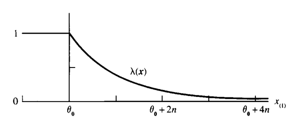
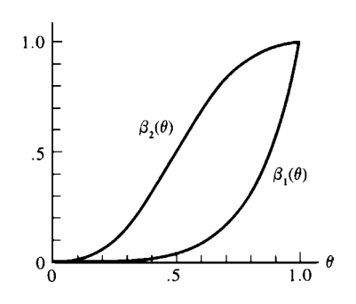
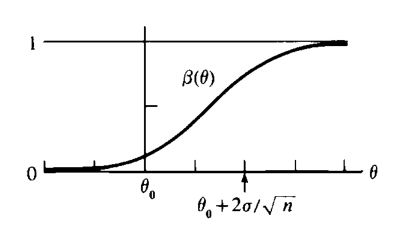
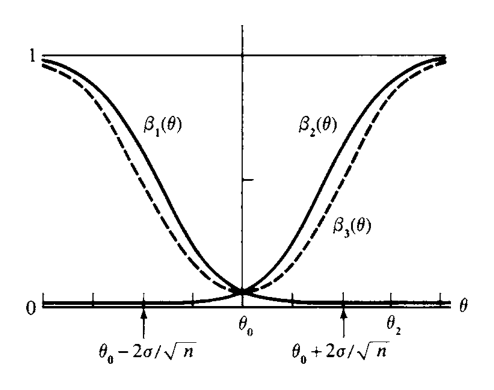
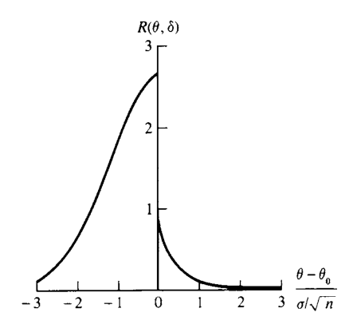

# 가설검정 {#chapter8}

> “It is a mistake to confound strangeness with mystery.”  
> — Sherlock Holmes, *A Study in Scarlet*

- 7장에서는 **점추정(point estimation)**을 다루었다.
- 이 장에서는 또 다른 통계적 추론 방법인 **가설검정(hypothesis testing)**을 다룬다.
- 가설검정도 점추정과 마찬가지로 두 가지 과제를 포함한다.
  - 좋은 검정절차를 어떻게 찾을 것인가?
  - 찾은 검정절차가 좋은지 어떻게 평가할 것인가?
- 따라서 이 장은 크게 두 부분으로 나뉜다.
  - 8.2절: 검정절차를 찾는 방법
  - 8.3절: 검정절차를 평가하는 방법

## 도입 {#sec-8-1}

### 통계적 가설

#### 정의

- **가설(hypothesis)**은 모집단 모수에 대한 진술이다.
- 여기서 중요한 점은 가설이 표본 자체에 대한 진술이 아니라, 표본이 나온 **모집단** 또는 **모수**에 대한 진술이라는 것이다.

#### 정의

- 가설검정 문제에서 서로 보완적인 두 가설을 다음과 같이 부른다.
  - **귀무가설(null hypothesis)**: $H_0$
  - **대립가설(alternative hypothesis)**: $H_1$

- 모수가 $	heta$이고 모수공간이 $	heta\\in\\Theta$라고 하자.
- 일반적으로 가설검정은 다음 형태로 쓸 수 있다.

$$
H_0:\theta\in\Theta_0
\qquad\text{versus}\qquad
H_1:\theta\in\Theta_0^c.
$$

- 여기서 $\Theta_0$는 모수공간의 부분집합이고, $\Theta_0^c$는 그 여집합이다.

### 예: 혈압약 효과 검정

- $\theta$가 어떤 약을 복용한 뒤 환자의 혈압 평균 변화량이라고 하자.
- 약이 평균적으로 혈압에 아무 효과가 없는지를 검정하려면 다음과 같이 쓸 수 있다.

$$
H_0:\theta=0
\qquad\text{versus}\qquad
H_1:\theta\ne0.
$$

- 귀무가설 $H_0$는 “약은 평균적으로 혈압에 영향을 주지 않는다”는 진술이다.
- 대립가설 $H_1$는 “약은 평균적으로 혈압에 어떤 영향을 준다”는 진술이다.
- 이처럼 $H_0$가 보통 “효과 없음” 또는 “차이 없음”을 나타내는 경우가 많아 null hypothesis라는 이름이 붙었다.

### 예: acceptance sampling

- $\theta$가 어떤 공급자가 생산한 제품 중 불량품 비율이라고 하자.
- 허용 가능한 최대 불량률을 $\theta_0$라 하면, 소비자는 다음 가설을 검정할 수 있다.

$$
H_0:\theta\ge\theta_0
\qquad\text{versus}\qquad
H_1:\theta<\theta_0.
$$

- 이때 $H_0$는 “불량률이 너무 높다”는 진술이다.
- 제품의 품질이 일정 기준을 만족하는지 판단하는 이런 문제를 **acceptance sampling problem**이라고 한다.

### 가설검정 절차

#### 정의

- **가설검정 절차(hypothesis testing procedure)** 또는 **가설검정(hypothesis test)**은 다음을 지정하는 규칙이다.
  - 어떤 표본값이 관측되면 $H_0$를 참으로 받아들일 것인가?
  - 어떤 표본값이 관측되면 $H_0$를 기각하고 $H_1$을 참으로 받아들일 것인가?

- $H_0$를 기각하는 표본공간의 부분집합을 **기각역(rejection region)** 또는 **임계역(critical region)**이라고 한다.
- 기각역의 여집합은 **수용역(acceptance region)**이라고 한다.

### “기각한다”와 “받아들인다”의 표현

- 철학적으로는 다음 표현들 사이에 미묘한 차이가 있다.
  - $H_0$를 기각한다.
  - $H_1$을 받아들인다.
  - $H_0$를 받아들인다.
  - $H_0$를 기각하지 못한다.
- 예를 들어 “$H_0$를 기각하지 못한다”는 말은 $H_0$가 참임을 적극적으로 주장한다기보다, $H_0$를 기각할 충분한 증거가 없다는 뜻에 가깝다.
- 이 장에서는 의사결정 관점에서 둘 중 하나의 행동을 선택한다고 본다.
  - $H_0$를 주장하는 행동
  - $H_1$을 주장하는 행동

### 검정통계량

- 대부분의 가설검정은 표본의 함수인 **검정통계량(test statistic)**을 통해 정의된다.
- 검정통계량을

$$
W(X_1,\ldots,X_n)=W(X)
$$

라고 쓰자.

- 예를 들어 “표본평균 $\bar X$가 3보다 크면 $H_0$를 기각한다”라는 검정에서는

$$
W(X)=\bar X
$$

이고 기각역은

$$
\{(x_1,\ldots,x_n):\bar x>3\}
$$

이다.

## 검정을 찾는 방법 {#sec-8-2}

- 이 절에서는 검정절차를 찾는 네 가지 방법을 다룬다.
  - 가능도비 검정
  - 베이즈 검정
  - Union-intersection test
  - Intersection-union test
- 이 방법들은 서로 다른 상황에서 유용하고, 문제의 서로 다른 구조를 활용한다.

## 가능도비 검정 {#sec-8-2-1}

- **가능도비 검정(likelihood ratio test, LRT)**은 최대가능도추정과 밀접하게 연결된다.
- $X_1,\ldots,X_n$이 pdf 또는 pmf $f(x\mid\theta)$에서 나온 랜덤표본이라고 하자.
- 가능도함수는

$$
L(\theta\mid x_1,\ldots,x_n)
=L(\theta\mid x)
=f(x\mid\theta)
=\prod_{i=1}^{n}f(x_i\mid\theta).
$$

### 정의: 가능도비 검정통계량

- $H_0:\theta\in\Theta_0$ 대 $H_1:\theta\in\Theta_0^c$를 검정한다고 하자.
- 가능도비 검정통계량은

$$
\lambda(x)
=
\frac{\sup_{\Theta_0}L(\theta\mid x)}
{\sup_{\Theta}L(\theta\mid x)}.
$$

- 가능도비 검정은 다음 형태의 기각역을 갖는 검정이다.

$$
\{x:\lambda(x)\le c\},
\qquad 0\le c\le1.
$$

### LRT의 직관

- 분모는 전체 모수공간에서 관측자료를 가장 그럴듯하게 만드는 최대가능도이다.
- 분자는 귀무가설이 허용하는 모수값들 중에서 관측자료를 가장 그럴듯하게 만드는 최대가능도이다.
- $\lambda(x)$가 작다는 것은 다음을 의미한다.
  - $H_0$ 안에서는 자료가 그다지 그럴듯하지 않다.
  - 그러나 전체 모수공간, 특히 $H_1$ 쪽에서는 자료가 훨씬 그럴듯할 수 있다.
- 따라서 작은 $\lambda(x)$는 $H_0$에 불리한 증거이다.

### restricted MLE와 unrestricted MLE

- 전체 모수공간 $\Theta$에서의 MLE를 $\hat\theta$라고 하자.
- 귀무가설 공간 $\Theta_0$로 제한하여 얻은 MLE를 $\hat\theta_0$라고 하자.
- 그러면 가능도비는

$$
\lambda(x)=\frac{L(\hat\theta_0\mid x)}{L(\hat\theta\mid x)}.
$$

- 즉, LRT는 “귀무가설 하에서의 최선”과 “전체 모형에서의 최선”을 비교한다.

### 예제: 정규분포 평균에 대한 LRT

- $X_1,\ldots,X_n$이 $N(\theta,1)$에서 나온 랜덤표본이라고 하자.
- 다음을 검정한다.

$$
H_0:\theta=\theta_0
\qquad\text{versus}\qquad
H_1:\theta\ne\theta_0.
$$

- $H_0$에는 모수값이 하나뿐이므로 분자는 $L(\theta_0\mid x)$이다.
- 전체 모수공간에서의 MLE는

$$
\hat\theta=\bar X.
$$

- 따라서

$$
\lambda(x)
=
\frac{(2\pi)^{-n/2}\exp\left[-\sum_{i=1}^{n}(x_i-\theta_0)^2/2\right]}
{(2\pi)^{-n/2}\exp\left[-\sum_{i=1}^{n}(x_i-\bar x)^2/2\right]}.
\tag{8.2.1}
$$

- 다음 항등식을 사용한다.

$$
\sum_{i=1}^{n}(x_i-\theta_0)^2
=
\sum_{i=1}^{n}(x_i-\bar x)^2+n(\bar x-\theta_0)^2.
$$

- 그러면

$$
\lambda(x)=\exp\left[-\frac{n(\bar x-\theta_0)^2}{2}\right].
\tag{8.2.2}
$$

- LRT는 $\lambda(x)$가 작으면 기각한다.
- 이는 다음과 동치이다.

$$
|\bar x-\theta_0|
\ge
\sqrt{\frac{-2\log c}{n}}.
$$

- 결론:
  - 이 문제에서 LRT는 표본평균이 가설값 $\theta_0$에서 충분히 멀리 떨어져 있으면 $H_0$를 기각한다.

### 예제: 이동된 지수분포의 LRT

- $X_1,\ldots,X_n$이 다음 pdf에서 나온 랜덤표본이라고 하자.

$$
f(x\mid\theta)=
\begin{cases}
e^{-(x-\theta)}, & x\ge\theta,\\
0, & x<\theta,
\end{cases}
\qquad -\infty<\theta<\infty.
$$

- 가능도함수는

$$
L(\theta\mid x)=
\begin{cases}
e^{-\sum_i x_i+n\theta}, & \theta\le x_{(1)},\\
0, & \theta>x_{(1)},
\end{cases}
$$

여기서

$$
x_{(1)}=\min_i x_i.
$$

- 다음을 검정한다.

$$
H_0:\theta\le\theta_0
\qquad\text{versus}\qquad
H_1:\theta>\theta_0.
$$

- $L(\theta\mid x)$는 $\theta\le x_{(1)}$에서 증가함수이다.
- 따라서 전체 모수공간에서의 최대값은 $\theta=x_{(1)}$에서 얻어진다.
- 귀무가설 하에서는 두 경우가 생긴다.
  - $x_{(1)}\le\theta_0$이면 unrestricted maximum과 restricted maximum이 같다.
  - $x_{(1)}>\theta_0$이면 restricted maximum은 $\theta=\theta_0$에서 얻어진다.

- 가능도비 검정통계량은

$$
\lambda(x)=
\begin{cases}
1, & x_{(1)}\le\theta_0,\\
e^{-n(x_{(1)}-\theta_0)}, & x_{(1)}>\theta_0.
\end{cases}
$$

- 따라서 LRT의 기각역은

$$
\left\{x:x_{(1)}\ge\theta_0-\frac{\log c}{n}\right\}
$$

형태이다.
- 이 기각역은 표본 전체가 아니라 충분통계량 $X_{(1)}$만을 통해 결정된다.

### LRT와 충분통계량

#### 정리

- $T(X)$가 $\theta$에 대한 충분통계량이라고 하자.
- $X$ 전체를 이용한 LRT 통계량을 $\lambda(x)$, $T$의 분포를 이용한 LRT 통계량을 $\lambda^*(t)$라고 하자.
- 그러면 모든 표본점 $x$에 대해

$$
\lambda^*(T(x))=\lambda(x).
$$

- 이유:
  - 충분통계량이면 Factorization Theorem에 의해

$$
f(x\mid\theta)=g(T(x)\mid\theta)h(x)
$$

로 쓸 수 있다.
  - 가능도비에서 $h(x)$는 분자와 분모에서 서로 약분된다.

- 결론:
  - 충분통계량이 있으면 LRT는 그 충분통계량만으로 구성해도 표본 전체를 사용한 것과 같다.

### 예제: LRT와 충분성

- 예제 8.2.2에서 $\bar X$는 $\theta$에 대한 충분통계량이다.
- 따라서 $\bar X\sim N(\theta,1/n)$의 가능도만 사용해도 같은 LRT를 얻는다.
- 예제 8.2.3에서는 $X_{(1)}$이 $\theta$에 대한 충분통계량이다.
- 따라서 $X_{(1)}$의 pdf만 사용해도 같은 LRT를 얻는다.

### 예제: 미지의 분산을 가진 정규 LRT

- $X_1,\ldots,X_n$이 $N(\mu,\sigma^2)$에서 나온 랜덤표본이라고 하자.
- 관심은 $\mu$에 있고, $\sigma^2$는 nuisance parameter이다.
- 다음을 검정한다.

$$
H_0:\mu\le\mu_0
\qquad\text{versus}\qquad
H_1:\mu>\mu_0.
$$

- 가능도비는

$$
\lambda(x)=
\frac{
\max_{\{\mu,\sigma^2:\mu\le\mu_0,\;\sigma^2\ge0\}}L(\mu,\sigma^2\mid x)
}{
\max_{\{\mu,\sigma^2:-\infty<\mu<\infty,\;\sigma^2\ge0\}}L(\mu,\sigma^2\mid x)
}.
$$

- unrestricted MLE는

$$
\hat\mu=\bar X,
\qquad
\hat\sigma^2=\frac1n\sum_{i=1}^{n}(X_i-\bar X)^2.
$$

- 만약 $\hat\mu\le\mu_0$이면 restricted maximum과 unrestricted maximum이 같다.
- 만약 $\hat\mu>\mu_0$이면 restricted maximum은 $\mu=\mu_0$에서 얻어진다.
- 대수적 정리를 하면 이 LRT는 Student의 $t$ 통계량에 기반한 검정과 동치이다.

## 베이즈 검정 {#sec-8-2-2}

- 베이즈 모형에서는 표본분포 $f(x\mid\theta)$뿐 아니라 사전분포 $\pi(\theta)$도 포함한다.
- 표본을 관측한 뒤 베이즈 정리는 사후분포를 만든다.

$$
\pi(\theta\mid x).
$$

- 베이즈 가설검정에서는 사후분포를 사용해 다음 확률을 계산할 수 있다.

$$
P(\theta\in\Theta_0\mid x)=P(H_0\text{ is true}\mid x),
$$

$$
P(\theta\in\Theta_0^c\mid x)=P(H_1\text{ is true}\mid x).
$$

### 고전적 관점과 베이즈 관점의 차이

- 고전적 관점에서는 $\theta$가 고정된 미지의 값이다.
- 따라서 $H_0$는 실제로 참이거나 거짓이다.
- 표본을 관측한 뒤 $P(H_0\text{ is true}\mid x)$ 같은 확률은 고전적 관점에서는 의미 있게 사용되지 않는다.
- 베이즈 관점에서는 $\theta$ 자체가 확률분포를 가지므로, 사후확률이 의미 있는 추론량이 된다.

### 베이즈 검정 규칙의 예

- 다음 규칙을 사용할 수 있다.
  - $P(\theta\in\Theta_0\mid X)\ge P(\theta\in\Theta_0^c\mid X)$이면 $H_0$를 받아들인다.
  - 그렇지 않으면 $H_0$를 기각한다.
- 이는 다음 기각역을 갖는 검정과 같다.

$$
\left\{x:P(\theta\in\Theta_0^c\mid x)>\frac12\right\}.
$$

- 또는 더 보수적으로 $P(\theta\in\Theta_0^c\mid x)>0.99$일 때만 기각할 수도 있다.

### 예제: 정규 베이즈 검정

- $X_1,\ldots,X_n$이 iid $N(\theta,\sigma^2)$이고, 사전분포가

$$
\theta\sim N(\mu,\tau^2)
$$

라고 하자.
- $\sigma^2,\mu,\tau^2$는 알려져 있다고 한다.
- 다음을 검정한다.

$$
H_0:\theta\le\theta_0
\qquad\text{versus}\qquad
H_1:\theta>\theta_0.
$$

- 사후분포는 정규분포이며 평균과 분산은

$$
E(\theta\mid x)
=
\frac{n\tau^2\bar x+\sigma^2\mu}{n\tau^2+\sigma^2},
$$

$$
Var(\theta\mid x)
=
\frac{\sigma^2\tau^2}{n\tau^2+\sigma^2}.
$$

- $P(\theta\le\theta_0\mid X)\ge1/2$이면 $H_0$를 받아들이는 규칙을 쓰면, 정규분포의 대칭성 때문에 이는 사후평균이 $\theta_0$ 이하라는 조건과 같다.
- 따라서 $H_0$를 받아들이는 조건은

$$
\bar X\le
\theta_0+\frac{\sigma^2(\theta_0-\mu)}{n\tau^2}.
$$

- 특히 $\mu=\theta_0$이면 사전적으로 두 가설에 같은 확률을 주는 경우이고, 이때 규칙은 단순히

$$
\bar X\le\theta_0
$$

이면 $H_0$를 받아들이는 것이 된다.

## Union-intersection 및 intersection-union 검정 {#sec-8-2-3}

- 복잡한 귀무가설을 여러 단순한 가설의 조합으로 표현할 수 있을 때가 있다.
- 이때 각각의 단순한 검정을 결합해 전체 검정을 만들 수 있다.

### Union-intersection test

- 귀무가설이 교집합 형태로 표현된다고 하자.

$$
H_0:\theta\in\bigcap_{\gamma\in\Gamma}\Theta_\gamma.
\tag{8.2.3}
$$

- 각 $\gamma$에 대해

$$
H_{0\gamma}:\theta\in\Theta_\gamma
\qquad\text{versus}\qquad
H_{1\gamma}:\theta\in\Theta_\gamma^c
$$

를 검정하는 검정이 있다고 하자.
- 그 기각역을

$$
\{x:T_\gamma(x)\in R_\gamma\}
$$

라고 하면, union-intersection test의 기각역은

$$
\bigcup_{\gamma\in\Gamma}\{x:T_\gamma(x)\in R_\gamma\}.
\tag{8.2.4}
$$

- 직관:
  - $H_0$는 모든 $H_{0\gamma}$가 참일 때만 참이다.
  - 따라서 하나라도 기각되면 전체 $H_0$도 기각된다.

- 만약 각 기각역이

$$
\{x:T_\gamma(x)>c\}
$$

형태이고 $c$가 $\gamma$에 의존하지 않으면 전체 검정통계량은

$$
T(x)=\sup_{\gamma\in\Gamma}T_\gamma(x)
$$

로 쓸 수 있다.

### 예제: 정규분포의 union-intersection 검정

- $X_1,\ldots,X_n$이 $N(\mu,\sigma^2)$에서 나온 랜덤표본이라고 하자.
- 다음을 검정한다.

$$
H_0:\mu=\mu_0
\qquad\text{versus}\qquad
H_1:\mu\ne\mu_0.
$$

- $H_0$는 두 집합의 교집합으로 쓸 수 있다.

$$
\{\mu:\mu\le\mu_0\}\cap\{\mu:\mu\ge\mu_0\}.
$$

- 왼쪽 단측검정과 오른쪽 단측검정을 결합하면 기각역은

$$
\frac{\bar X-\mu_0}{S/\sqrt n}\ge t_L
\quad\text{or}\quad
\frac{\bar X-\mu_0}{S/\sqrt n}\le t_U
$$

이 된다.
- 보통 $t_L=-t_U$로 잡으면

$$
\frac{|\bar X-\mu_0|}{S/\sqrt n}\ge t_L
$$

형태가 된다.
- 이는 잘 알려진 **양측 $t$ 검정(two-sided t test)**이다.

### Intersection-union test

- 귀무가설이 합집합 형태로 표현된다고 하자.

$$
H_0:\theta\in\bigcup_{\gamma\in\Gamma}\Theta_\gamma.
\tag{8.2.5}
$$

- 각 $H_{0\gamma}:\theta\in\Theta_\gamma$에 대한 검정의 기각역이 $\{x:T_\gamma(x)\in R_\gamma\}$이면, intersection-union test의 기각역은

$$
\bigcap_{\gamma\in\Gamma}\{x:T_\gamma(x)\in R_\gamma\}.
\tag{8.2.6}
$$

- 직관:
  - $H_0$는 어느 하나의 $H_{0\gamma}$라도 참이면 참이다.
  - 따라서 전체 $H_0$를 기각하려면 모든 개별 귀무가설을 기각해야 한다.

- 만약 각 기각역이

$$
\{x:T_\gamma(x)\ge c\}
$$

형태라면 전체 검정통계량은

$$
\inf_{\gamma\in\Gamma}T_\gamma(x)
$$

가 된다.

### 예제: Acceptance sampling

- 직물 품질을 두 모수로 평가한다고 하자.
  - $\theta_1$: 평균 인장강도
  - $\theta_2$: 가연성 시험을 통과할 확률
- 기준이 다음과 같다고 하자.
  - 평균 인장강도는 50파운드를 넘어야 한다.
  - 가연성 통과 확률은 0.95를 넘어야 한다.
- 제품은 두 기준을 모두 만족할 때만 적합하다.
- 따라서 검정은

$$
H_0:\{\theta_1\le50\text{ or }\theta_2\le0.95\}
\qquad\text{versus}\qquad
H_1:\{\theta_1>50\text{ and }\theta_2>0.95\}.
$$

- $H_0$가 합집합 형태이므로 intersection-union test가 자연스럽다.
- 인장강도 표본 $X_1,\ldots,X_n$에 대해서는 단측 $t$ 검정을 사용하고, 가연성 시험 결과 $Y_1,\ldots,Y_m$에 대해서는 Bernoulli LRT를 사용한다.
- 전체 기각역은

$$
\left\{(x,y):
\frac{\bar x-50}{s/\sqrt n}>t
\quad\text{and}\quad
\sum_{i=1}^{m}y_i>b
\right\}
$$

이다.
- 즉, 제품을 적합하다고 판단하려면 두 개별 기준 모두를 통과해야 한다.

## 검정을 평가하는 방법 {#sec-8-3}

- 가설검정은 표본을 보고 $H_0$ 또는 $H_1$ 중 하나를 선택한다.
- 따라서 잘못된 결정을 내릴 수 있다.
- 검정의 성능은 보통 이런 오류확률을 통해 평가된다.

## 오류확률과 검정력 함수 {#sec-8-3-1}

### 두 종류의 오류

- $H_0:\theta\in\Theta_0$ 대 $H_1:\theta\in\Theta_0^c$를 검정한다고 하자.

| 실제 상태 | $H_0$를 받아들임 | $H_0$를 기각함 |
|---|---:|---:|
| $H_0$ 참 | 올바른 결정 | 제1종 오류 |
| $H_1$ 참 | 제2종 오류 | 올바른 결정 |

- **제1종 오류(Type I Error)**:
  - 실제로 $\theta\in\Theta_0$인데 $H_0$를 기각하는 오류이다.
- **제2종 오류(Type II Error)**:
  - 실제로 $\theta\in\Theta_0^c$인데 $H_0$를 받아들이는 오류이다.

### 검정력 함수

#### 정의

- 기각역이 $R$인 검정의 **검정력 함수(power function)**는

$$
\beta(\theta)=P_\theta(X\in R)
$$

로 정의된다.

- $\theta\in\Theta_0$이면 $\beta(\theta)$는 제1종 오류확률이다.
- $\theta\in\Theta_0^c$이면 $1-\beta(\theta)$가 제2종 오류확률이다.
- 이상적인 검정력 함수는 다음과 같다.
  - $\theta\in\Theta_0$에서는 0
  - $\theta\in\Theta_0^c$에서는 1
- 현실적으로는 보통 이 이상적인 형태를 정확히 달성할 수 없다.

### 예제: 이항분포 검정력 함수

- $X\sim Binomial(5,\theta)$라고 하자.
- 다음을 검정한다.

$$
H_0:\theta\le\frac12
\qquad\text{versus}\qquad
H_1:\theta>\frac12.
$$

- 첫 번째 검정은 모든 시행이 성공일 때만 $H_0$를 기각한다.
- 즉, 기각역은 $R_1=\{5\}$이고 검정력 함수는

$$
\beta_1(\theta)=P_\theta(X=5)=\theta^5.
$$

- 이 검정은 제1종 오류확률이 작지만, $\theta>1/2$에서도 검정력이 낮아 제2종 오류가 클 수 있다.
- 두 번째 검정은 $X=3,4,5$일 때 $H_0$를 기각한다.
- 검정력 함수는

$$
\beta_2(\theta)
=P_\theta(X=3,4,5)
$$

$$
=
\binom53\theta^3(1-\theta)^2
+
\binom54\theta^4(1-\theta)
+
\binom55\theta^5.
$$

- 두 번째 검정은 대립가설 영역에서 검정력이 더 크지만, 귀무가설 영역에서도 기각확률이 더 커져 제1종 오류확률도 증가한다.
- 검정 선택은 어떤 오류구조가 더 받아들일 만한지에 달려 있다.

### 예제: 정규분포 검정력 함수

- $X_1,\ldots,X_n$이 $N(\theta,\sigma^2)$에서 나온 랜덤표본이고 $\sigma^2$는 알려져 있다고 하자.
- 다음을 검정한다.

$$
H_0:\theta\le\theta_0
\qquad\text{versus}\qquad
H_1:\theta>\theta_0.
$$

- LRT는 다음 조건에서 기각한다.

$$
\frac{\bar X-\theta_0}{\sigma/\sqrt n}>c.
$$

- 검정력 함수는

$$
\begin{aligned}
\beta(\theta)
&=P_\theta\left(\frac{\bar X-\theta_0}{\sigma/\sqrt n}>c\right)\\
&=P\left(Z>c+\frac{\theta_0-\theta}{\sigma/\sqrt n}\right),
\end{aligned}
$$

여기서 $Z\sim N(0,1)$이다.

- $\theta$가 증가하면 오른쪽 꼬리확률이 증가하므로 $\beta(\theta)$는 증가함수이다.
- 또한

$$
\lim_{\theta\to-\infty}\beta(\theta)=0,
\qquad
\lim_{\theta\to\infty}\beta(\theta)=1.
$$

- $P(Z>c)=\alpha$이면

$$
\beta(\theta_0)=\alpha.
$$

### 예제: 표본크기 선택

- 예제 8.3.3에서 제1종 오류확률을 최대 0.1로, 그리고 $\theta\ge\theta_0+\sigma$일 때 제2종 오류확률을 최대 0.2로 만들고 싶다고 하자.
- 즉,

$$
\beta(\theta_0)=0.1,
\qquad
\beta(\theta_0+\sigma)=0.8
$$

이 되도록 $c$와 $n$을 고른다.
- $P(Z>1.28)=0.1$이므로 $c=1.28$로 둔다.
- 또한

$$
\beta(\theta_0+\sigma)=P(Z>1.28-\sqrt n)=0.8.
$$

- $P(Z>-0.84)=0.8$이므로

$$
1.28-\sqrt n=-0.84
$$

이고

$$
n=4.49.
$$

- 표본크기는 정수여야 하므로 $n=5$를 선택한다.

### 크기와 수준

#### 정의

- 검정력 함수가 $\beta(\theta)$인 검정이

$$
\sup_{\theta\in\Theta_0}\beta(\theta)=\alpha
$$

을 만족하면 **size $\alpha$ 검정**이라고 한다.

#### 정의

- 검정력 함수가 $\beta(\theta)$인 검정이

$$
\sup_{\theta\in\Theta_0}\beta(\theta)\le\alpha
$$

을 만족하면 **level $\alpha$ 검정**이라고 한다.

- 모든 size $\alpha$ 검정은 level $\alpha$ 검정이다.
- 하지만 level $\alpha$ 검정이 반드시 size $\alpha$ 검정인 것은 아니다.
- 실제 복잡한 문제에서는 정확히 size $\alpha$ 검정을 만들기 어려워 level $\alpha$ 검정으로 만족해야 할 수 있다.

### 예제: LRT의 크기

- 예제 8.2.2의 정규 양측검정에서 $\Theta_0$는 한 점 $\theta_0$뿐이다.
- $\theta=\theta_0$일 때

$$
\sqrt n(\bar X-\theta_0)\sim N(0,1).
$$

- 따라서 size $\alpha$ LRT는

$$
\text{reject }H_0
\quad\text{if}\quad
|\bar X-\theta_0|\ge \frac{z_{\alpha/2}}{\sqrt n},
$$

여기서

$$
P(Z\ge z_{\alpha/2})=\frac\alpha2.
$$

- 예제 8.2.3의 이동 지수분포에서는 LRT가 $X_{(1)}\ge c$일 때 기각한다.
- $c$를

$$
c=\theta_0+\frac{-\log\alpha}{n}
$$

로 잡으면

$$
P_{\theta_0}(X_{(1)}\ge c)=\alpha
$$

이 되어 size $\alpha$ 검정이 된다.

### 컷오프 표기

- $z_\alpha$는

$$
P(Z>z_\alpha)=\alpha,
\qquad Z\sim N(0,1)
$$

를 만족하는 점이다.
- 비슷하게 $t_{n-1,\alpha}$, $\chi^2_{p,1-\alpha}$ 등의 표기를 사용한다.

### 불편검정

#### 정의

- 검정력 함수 $\beta(\theta)$를 갖는 검정이 모든 $\theta'\in\Theta_0^c$와 $\theta''\in\Theta_0$에 대해

$$
\beta(\theta')\ge\beta(\theta'')
$$

를 만족하면 **불편검정(unbiased test)**이라고 한다.
- 즉, 대립가설이 참일 때의 기각확률이 귀무가설이 참일 때보다 작아서는 안 된다.

## 최강력 검정 {#sec-8-3-2}

### UMP 검정

#### 정의 8.3.11

- $C$가 $H_0:\theta\in\Theta_0$ 대 $H_1:\theta\in\Theta_0^c$에 대한 검정들의 한 클래스라고 하자.
- 검정력 함수가 $\beta(\theta)$인 어떤 검정이 다음을 만족하면 **uniformly most powerful, UMP class $C$ test**라고 한다.

$$
\beta(\theta)\ge\beta'(\theta)
$$

for every $\theta\in\Theta_0^c$ and every power function $\beta'(\theta)$ of a test in $C$.

- 이 절에서는 보통 $C$를 모든 level $\alpha$ 검정의 클래스라고 둔다.
- 그러면 UMP level $\alpha$ 검정은 제1종 오류확률을 $\alpha$ 이하로 제한한 검정들 중에서 모든 대립모수값에 대해 검정력이 가장 큰 검정이다.

### Neyman-Pearson Lemma

#### 정리

- 단순가설

$$
H_0:\theta=\theta_0
\qquad\text{versus}\qquad
H_1:\theta=\theta_1
$$

을 검정한다고 하자.
- $\theta_i$에 해당하는 pdf 또는 pmf를 $f(x\mid\theta_i)$라고 하자.
- 기각역 $R$이 어떤 $k\ge0$에 대해 다음을 만족한다고 하자.

$$
x\in R
\quad\text{if}\quad
f(x\mid\theta_1)>k f(x\mid\theta_0),
$$

$$
x\in R^c
\quad\text{if}\quad
f(x\mid\theta_1)<k f(x\mid\theta_0),
\tag{8.3.1}
$$

그리고

$$
\alpha=P_{\theta_0}(X\in R).
\tag{8.3.2}
$$

- 그러면 다음이 성립한다.
  - 충분성: 식 (8.3.1), (8.3.2)를 만족하는 검정은 UMP level $\alpha$ 검정이다.
  - 필요성: $k>0$인 검정이 존재하면, 모든 UMP level $\alpha$ 검정은 거의 어디서나 식 (8.3.1)을 만족한다.

- 핵심 직관:
  - $H_1$ 아래에서 $H_0$보다 훨씬 더 그럴듯한 표본값을 기각역에 넣는 것이 최적이다.
  - 즉, likelihood ratio $f(x\mid\theta_1)/f(x\mid\theta_0)$가 큰 곳에서 기각한다.

### 충분통계량을 이용한 Neyman-Pearson Lemma

#### 따름정리

- $T(X)$가 $\theta$에 대한 충분통계량이라고 하자.
- $T$의 pdf 또는 pmf를 $g(t\mid\theta_i)$라고 하자.
- $T$에 기반한 기각역 $S$가

$$
t\in S
\quad\text{if}\quad
g(t\mid\theta_1)>kg(t\mid\theta_0),
$$

$$
t\in S^c
\quad\text{if}\quad
g(t\mid\theta_1)<kg(t\mid\theta_0)
\tag{8.3.4}
$$

을 만족하고

$$
\alpha=P_{\theta_0}(T\in S)
\tag{8.3.5}
$$

이면, $T$에 기반한 검정은 UMP level $\alpha$ 검정이다.

### 예제: 이항분포의 UMP 검정

- $X\sim Binomial(2,\theta)$라고 하자.
- 다음을 검정한다.

$$
H_0:\theta=\frac12
\qquad\text{versus}\qquad
H_1:\theta=\frac34.
$$

- likelihood ratio 값은

$$
\frac{f(0\mid3/4)}{f(0\mid1/2)}=\frac14,
$$

$$
\frac{f(1\mid3/4)}{f(1\mid1/2)}=\frac34,
$$

$$
\frac{f(2\mid3/4)}{f(2\mid1/2)}=\frac94.
$$

- $3/4<k<9/4$로 잡으면 $X=2$에서만 $H_0$를 기각하는 검정이 UMP level $\alpha=1/4$ 검정이다.
- $1/4<k<3/4$로 잡으면 $X=1$ 또는 $2$에서 기각하는 검정이 UMP level $\alpha=3/4$ 검정이다.
- 이산분포에서는 원하는 모든 $\alpha$를 정확히 달성하지 못할 수 있다.

### 예제: 정규분포의 UMP 검정

- $X_1,\ldots,X_n$이 $N(\theta,\sigma^2)$에서 나온 랜덤표본이고 $\sigma^2$는 알려져 있다고 하자.
- 다음 단순가설을 검정한다.

$$
H_0:\theta=\theta_0
\qquad\text{versus}\qquad
H_1:\theta=\theta_1,
\qquad \theta_0>\theta_1.
$$

- 충분통계량 $\bar X$를 사용하면 Neyman-Pearson Lemma에 의해 기각역은

$$
\bar X<c
$$

형태가 된다.
- size $\alpha$를 원하면

$$
c=\theta_0-\frac{\sigma z_\alpha}{\sqrt n}
$$

로 잡는다.
- 즉,

$$
\text{reject }H_0
\quad\text{if}\quad
\bar X<\theta_0-\frac{\sigma z_\alpha}{\sqrt n}.
$$

### 단순가설과 복합가설

- 하나의 모수값만 지정하는 가설을 **단순가설(simple hypothesis)**이라고 한다.
- 여러 모수값을 허용하는 가설을 **복합가설(composite hypothesis)**이라고 한다.
- Neyman-Pearson Lemma는 단순가설에 대한 결과지만, 복합가설의 UMP 검정을 찾는 데도 활용된다.

### 단조가능도비

#### 정의

- $T$의 분포족 $\{g(t\mid\theta):\theta\in\Theta\}$가 다음 성질을 가지면 **monotone likelihood ratio, MLR**를 가진다고 한다.
- 모든 $\theta_2>\theta_1$에 대해

$$
\frac{g(t\mid\theta_2)}{g(t\mid\theta_1)}
$$

가 $t$의 단조함수이다.

- 정규분포의 평균모형, 포아송분포, 이항분포 등 많은 분포족이 MLR을 가진다.
- 정규적인 지수족

$$
g(t\mid\theta)=h(t)c(\theta)e^{w(\theta)t}
$$

에서 $w(\theta)$가 비감소함수이면 MLR을 가진다.

### Karlin-Rubin 정리

#### 정리

- 다음을 검정한다고 하자.

$$
H_0:\theta\le\theta_0
\qquad\text{versus}\qquad
H_1:\theta>\theta_0.
$$

- $T$가 $\theta$에 대한 충분통계량이고, $T$의 분포족 $\{g(t\mid\theta)
:\theta\in\Theta\}$가 MLR을 가진다고 하자.
- 그러면 임의의 $t_0$에 대해

$$
\text{reject }H_0\quad\text{if and only if}\quad T>t_0
$$

인 검정은 UMP level $\alpha$ 검정이다.
- 여기서

$$
\alpha=P_{\theta_0}(T>t_0).
$$

- 반대로 $H_0:\theta\ge\theta_0$ 대 $H_1:\theta<\theta_0$에서는 $T<t_0$ 형태의 검정이 UMP가 된다.

### 예제: 정규 단측검정

- $X_1,\ldots,X_n$이 $N(\theta,\sigma^2)$에서 나온 표본이고 $\sigma^2$는 알려져 있다고 하자.
- 다음을 검정한다.

$$
H_0:\theta\ge\theta_0
\qquad\text{versus}\qquad
H_1:\theta<\theta_0.
$$

- $\bar X$는 충분통계량이고 그 분포족은 MLR을 가진다.
- 따라서

$$
\text{reject }H_0
\quad\text{if}\quad
\bar X<\theta_0-\frac{\sigma z_\alpha}{\sqrt n}
$$

인 검정은 UMP level $\alpha$ 검정이다.

### UMP 검정이 존재하지 않는 경우

- 모든 문제에서 UMP level $\alpha$ 검정이 존재하는 것은 아니다.
- 특히 양측검정에서는 대개 모든 대립방향을 동시에 최적으로 만드는 검정이 존재하지 않는다.

### 예제: UMP 검정의 비존재

- $X_1,\ldots,X_n$이 iid $N(\theta,\sigma^2)$이고 $\sigma^2$는 알려져 있다고 하자.
- 다음을 검정한다.

$$
H_0:\theta=\theta_0
\qquad\text{versus}\qquad
H_1:\theta\ne\theta_0.
$$

- $\theta_1<\theta_0$ 방향에서 가장 강력한 level $\alpha$ 검정은 왼쪽 꼬리에서 기각한다.

$$
\bar X<\theta_0-\frac{\sigma z_\alpha}{\sqrt n}.
$$

- 그러나 $\theta_2>\theta_0$ 방향에서는 오른쪽 꼬리에서 기각하는 검정이 더 강력하다.

$$
\bar X>\theta_0+\frac{\sigma z_\alpha}{\sqrt n}.
$$

- 한 검정이 양쪽 대립방향 모두에서 동시에 가장 강력할 수 없으므로, 이 양측검정에는 UMP level $\alpha$ 검정이 존재하지 않는다.

### 예제: UMP unbiased 검정

- UMP가 존재하지 않을 때는 검정의 클래스를 더 제한할 수 있다.
- 예를 들어 **불편검정**들 중에서 UMP를 찾을 수 있다.
- 정규 양측검정에서는

$$
\text{reject }H_0
\quad\text{if}\quad
\bar X>\theta_0+\frac{\sigma z_{\alpha/2}}{\sqrt n}
\quad\text{or}\quad
\bar X<\theta_0-\frac{\sigma z_{\alpha/2}}{\sqrt n}
$$

인 검정이 UMP unbiased level $\alpha$ 검정이다.

## UIT와 IUT의 크기 {#sec-8-3-3}

- Union-intersection test와 intersection-union test는 구조가 단순하기 때문에 크기(size)를 다른 검정의 크기로 상계할 수 있다.

### UIT의 크기

#### 정리

- $\Theta_0=\bigcap_{\gamma\in\Gamma}\Theta_\gamma$라고 하자.
- 각 $H_{0\gamma}:\theta\in\Theta_\gamma$에 대한 LRT 통계량을 $\lambda_\gamma(x)$라고 하자.
- 전체 $H_0$에 대한 LRT 통계량을 $\lambda(x)$라고 하자.
- 다음을 정의한다.

$$
T(x)=\inf_{\gamma\in\Gamma}\lambda_\gamma(x).
$$

- 그러면 다음이 성립한다.
  - $T(x)\ge\lambda(x)$ for every $x$.
  - $T$에 기반한 UIT의 검정력은 전체 LRT의 검정력보다 크지 않다.
  - 전체 LRT가 level $\alpha$이면 UIT도 level $\alpha$이다.

### 예제: UIT와 LRT의 동치

- 어떤 상황에서는 $T(x)=\lambda(x)$가 된다.
- 예제 8.2.8의 정규 양측검정에서 두 단측 $t$ 검정을 결합한 UIT는 전체 양측 LRT와 동치이다.

### IUT의 크기

#### 정리

- $\Theta_0=\bigcup_{\gamma\in\Gamma}\Theta_\gamma$라고 하자.
- 각 $H_{0\gamma}$에 대한 검정의 기각역을 $R_\gamma$라고 하자.
- 그 size를 $\alpha_\gamma$라고 하자.
- IUT의 기각역이

$$
R=\bigcap_{\gamma\in\Gamma}R_\gamma
$$

이면, 이 IUT는 level

$$
\alpha=\sup_{\gamma\in\Gamma}\alpha_\gamma
$$

검정이다.

- 특히 모든 개별 검정이 level $\alpha$이면, 그 IUT도 level $\alpha$이다.

#### 정리

- 유한한 합집합 귀무가설

$$
H_0:\theta\in\bigcup_{j=1}^{k}\Theta_j
$$

에서 각 $H_{0j}$에 대한 기각역을 $R_j$라고 하자.
- 어떤 $i$에 대해 $\theta_l\in\Theta_i$인 모수열이 존재하여

$$
\lim_{l\to\infty}P_{\theta_l}(X\in R_i)=\alpha
$$

이고, $j\ne i$에 대해

$$
\lim_{l\to\infty}P_{\theta_l}(X\in R_j)=1
$$

이면, IUT의 size는 정확히 $\alpha$이다.

### 예제: IUT의 size

- 예제 8.2.9에서 $n=m=58$, $t=1.672$, $b=57$이라고 하자.
- 각각의 개별 검정은 대략 size $\alpha=0.05$이다.
- 따라서 IUT는 level $0.05$ 검정이다.
- 적절한 모수열을 잡으면 정리 8.3.24에 의해 실제 size도 $0.05$임을 보일 수 있다.

## p-value {#sec-8-3-4}

- 검정 결과를 보고할 때 단순히 “기각” 또는 “기각하지 않음”만 보고하면 정보가 부족하다.
- 검정의 size와 함께 결론을 보고할 수도 있지만, 더 연속적인 증거척도로 **p-value**를 보고하는 것이 일반적이다.

### 정의 

- **p-value** $p(X)$는 모든 표본점 $x$에 대해

$$
0\le p(x)\le1
$$

을 만족하는 검정통계량이다.
- 작은 $p(X)$는 $H_1$이 참이라는 증거를 제공한다.
- $p(X)$가 모든 $\theta\in\Theta_0$와 모든 $0\le\alpha\le1$에 대해

$$
P_\theta(p(X)\le\alpha)\le\alpha
\tag{8.3.8}
$$

를 만족하면 **valid p-value**라고 한다.

- valid p-value가 있으면

$$
\text{reject }H_0\quad\text{if}\quad p(X)\le\alpha
$$

인 검정은 level $\alpha$ 검정이다.

### 정리: 일반적인 p-value 구성

- 큰 값이 $H_1$의 증거가 되는 검정통계량 $W(X)$가 있다고 하자.
- 각 표본점 $x$에 대해

$$
p(x)=\sup_{\theta\in\Theta_0}P_\theta(W(X)\ge W(x))
\tag{8.3.9}
$$

로 정의하면 $p(X)$는 valid p-value이다.

- 해석:
  - 관측된 $W(x)$ 이상으로 극단적인 값이 귀무가설 하에서 얼마나 자주 나오는지를 계산한다.
  - 복합 귀무가설에서는 $\Theta_0$ 전체에서 가장 보수적인 값을 취한다.

### 예제: 양측 정규 p-value

- $X_1,\ldots,X_n$이 $N(\mu,\sigma^2)$에서 나온 랜덤표본이라고 하자.
- 다음을 검정한다.

$$
H_0:\mu=\mu_0
\qquad\text{versus}\qquad
H_1:\mu\ne\mu_0.
$$

- LRT는 큰

$$
W(X)=\frac{|\bar X-\mu_0|}{S/\sqrt n}
$$

에서 기각한다.
- $H_0$ 아래에서

$$
\frac{\bar X-\mu_0}{S/\sqrt n}\sim t_{n-1}.
$$

- 따라서 양측 $t$ 검정의 p-value는

$$
p(x)=2P\left(T_{n-1}\ge\frac{|\bar x-\mu_0|}{s/\sqrt n}\right).
$$

### 예제: 단측 정규 p-value

- 이번에는

$$
H_0:\mu\le\mu_0
\qquad\text{versus}\qquad
H_1:\mu>\mu_0
$$

를 검정한다.
- LRT는 큰

$$
W(X)=\frac{\bar X-\mu_0}{S/\sqrt n}
$$

에서 기각한다.
- supremum은 경계점 $\mu=\mu_0$에서 얻어진다.
- 따라서 p-value는

$$
p(x)=P\left(T_{n-1}\ge\frac{\bar x-\mu_0}{s/\sqrt n}\right).
$$

### 조건부 p-value와 Fisher의 정확검정

- 또 다른 p-value 구성 방법은 충분통계량에 조건부로 두는 것이다.
- $S(X)$가 귀무모형 $\{f(x\mid\theta):\theta\in\Theta_0\}$에서 충분통계량이라고 하자.
- 큰 $W(X)$가 $H_1$의 증거라면

$$
p(x)=P(W(X)\ge W(x)\mid S=S(x))
\tag{8.3.10}
$$

로 정의할 수 있다.
- 귀무가설이 참이면 조건부분포가 $\theta$에 의존하지 않으므로, 이 $p(X)$는 valid p-value이다.

### 예제: Fisher's Exact Test

- $S_1\sim Binomial(n_1,p_1)$, $S_2\sim Binomial(n_2,p_2)$가 독립이라고 하자.
- 다음을 검정한다.

$$
H_0:p_1=p_2
\qquad\text{versus}\qquad
H_1:p_1>p_2.
$$

- $H_0$ 아래에서 공통 확률을 $p$라고 하면

$$
f(s_1,s_2\mid p)
=
\binom{n_1}{s_1}\binom{n_2}{s_2}
 p^{s_1+s_2}(1-p)^{n_1+n_2-(s_1+s_2)}.
$$

- 따라서

$$
S=S_1+S_2
$$

는 $H_0$ 아래에서 충분통계량이다.
- $S=s$가 주어졌을 때 $S_1$의 조건부분포는 초기하분포이다.
- 큰 $S_1$이 $p_1>p_2$의 증거이므로 p-value는

$$
p(s_1,s_2)=
\sum_{j=s_1}^{\min\{n_1,s\}} f(j\mid s),
$$

여기서 $f(j\mid s)$는 해당 초기하분포의 pmf이다.
- 이 검정이 **Fisher's Exact Test**이다.

## 손실함수 최적성 {#sec-8-3-5}

- 검정을 의사결정 문제로 보면 점추정에서처럼 손실함수와 위험함수를 이용해 평가할 수 있다.
- 가설검정에서는 가능한 행동이 두 개뿐이다.
  - $a_0$: $H_0$를 받아들임
  - $a_1$: $H_0$를 기각함

### 0-1 손실

- 가장 단순한 손실은 올바른 결정을 하면 0, 잘못된 결정을 하면 1을 잃는 것이다.

$$
L(\theta,a_0)=
\begin{cases}
0, & \theta\in\Theta_0,\\
1, & \theta\in\Theta_0^c,
\end{cases}
$$

$$
L(\theta,a_1)=
\begin{cases}
1, & \theta\in\Theta_0,\\
0, & \theta\in\Theta_0^c.
\end{cases}
$$

### 일반화된 0-1 손실

- 두 오류의 비용이 다를 수 있다.

$$
L(\theta,a_0)=
\begin{cases}
0, & \theta\in\Theta_0,\\
c_{II}, & \theta\in\Theta_0^c,
\end{cases}
$$

$$
L(\theta,a_1)=
\begin{cases}
c_I, & \theta\in\Theta_0,\\
0, & \theta\in\Theta_0^c.
\end{cases}
\tag{8.3.11}
$$

- $c_I$는 제1종 오류 비용이다.
- $c_{II}$는 제2종 오류 비용이다.
- 검정을 비교할 때는 $c_I$와 $c_{II}$의 절대값보다 비율 $c_{II}/c_I$가 중요하다.

### 위험함수와 검정력 함수

- 검정의 기각역을 $R$라고 하고 검정력 함수를

$$
\beta(\theta)=P_\theta(X\in R)
$$

라고 하자.
- 일반화된 0-1 손실에서 위험함수는 다음과 같다.

$$
R(\theta,\delta)=c_I\beta(\theta),
\qquad \theta\in\Theta_0,
\tag{8.3.12}
$$

$$
R(\theta,\delta)=c_{II}[1-\beta(\theta)],
\qquad \theta\in\Theta_0^c.
$$

- 따라서 검정력 함수는 위험함수를 결정하는 핵심 요소이다.

### 예제: UMP 검정의 위험함수

- $X_1,\ldots,X_n$이 $N(\mu,\sigma^2)$에서 나온 랜덤표본이고 $\sigma^2$가 알려져 있다고 하자.
- 다음을 검정한다.

$$
H_0:\theta\ge\theta_0
\qquad\text{versus}\qquad
H_1:\theta<\theta_0.
$$

- UMP level $\alpha$ 검정은

$$
\frac{\bar X-\theta_0}{\sigma/\sqrt n}<-z_\alpha
$$

이면 $H_0$를 기각한다.
- 검정력 함수는

$$
\beta(\theta)=P_\theta\left(Z<-z_\alpha-\frac{\theta-\theta_0}{\sigma/\sqrt n}\right).
$$

- $\alpha=0.10$, $c_I=8$, $c_{II}=3$일 때 위험함수는 아래 그림처럼 $\theta=\theta_0$에서 불연속을 보인다.

### 더 일반적인 손실함수

- 0-1 손실은 단순히 맞고 틀림만 평가한다.
- 하지만 실제 문제에서는 틀린 정도에 따라 손실이 달라질 수 있다.
- 예를 들어 $H_0:\theta\ge\theta_0$ 대 $H_1:\theta<\theta_0$를 검정할 때, $\theta$가 $\theta_0$보다 훨씬 클수록 잘못 기각했을 때 손실이 더 클 수 있다.

$$
L(\theta,a_0)=
\begin{cases}
0, & \theta\ge\theta_0,\\
b(\theta_0-\theta), & \theta<\theta_0,
\end{cases}
$$

$$
L(\theta,a_1)=
\begin{cases}
c(\theta-\theta_0)^2, & \theta\ge\theta_0,\\
0, & \theta<\theta_0,
\end{cases}
\tag{8.3.13}
$$

- 이 경우 일반적인 위험함수는

$$
R(\theta,\delta)
=
L(\theta,a_0)[1-\beta(\theta)]
+
L(\theta,a_1)\beta(\theta).
\tag{8.3.14}
$$

- 결론:
  - power function은 항상 중요하다.
  - decision-theoretic 분석에서는 power function뿐 아니라 손실함수의 가중치도 중요하다.

