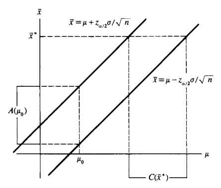
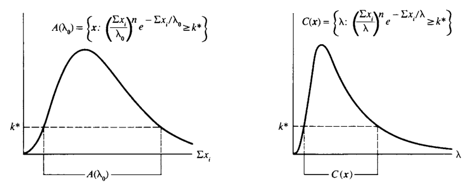
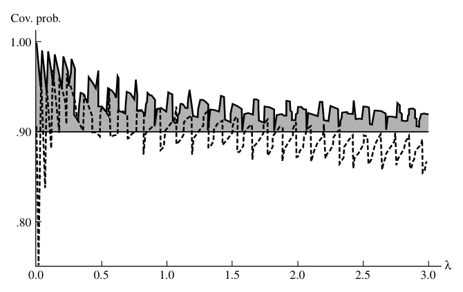
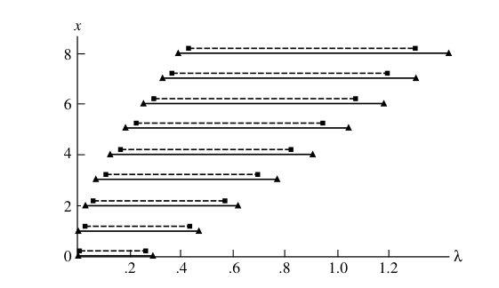
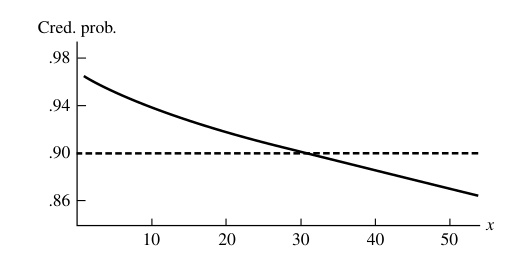
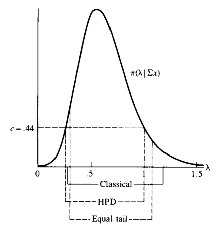

# 구간추정 {#chapter9}

> “I fear,” said Holmes, “that if the matter is beyond humanity it is certainly beyond me. Yet we must exhaust all natural explanations before we fall back upon such a theory as this.”  
> — Sherlock Holmes, *The Adventure of the Devil’s Foot*

- 7장에서는 모수 $\theta$를 하나의 값으로 추정하는 **점추정(point estimation)**을 다루었다.
- 이 장에서는 모수 $\theta$가 어떤 집합 $C(X)$ 안에 있다고 말하는 **집합추정(set estimation)**, 특히 실수값 모수에 대한 **구간추정(interval estimation)**을 다룬다.
- 구간추정은 점추정보다 덜 정밀해 보이지만, 대신 “참값을 포함할 확률”에 대한 보장을 제공한다.
- 이 장의 핵심 질문은 두 가지이다.
  - 어떻게 신뢰구간 또는 신뢰집합을 만들 것인가?
  - 만들어진 구간을 어떤 기준으로 평가할 것인가?

## 도입 {#sec-9-1}

### 구간추정량의 정의

- 실수값 모수 $\theta$에 대한 구간추정은 표본 $X=(X_1,\ldots,X_n)$의 두 함수 $L(X)$와 $U(X)$로 구성된다.
- 모든 표본값 $x$에 대해 $L(x)\le U(x)$라고 하자.
- 표본 $X=x$가 관측되면 다음 추론을 한다.

$$
L(x)\le \theta \le U(x)
$$

#### 정의

- $[L(X),U(X)]$를 $\theta$에 대한 **구간추정량(interval estimator)**이라고 한다.
- 실제 관측 후 얻는 값 $[L(x),U(x)]$를 **구간추정값(interval estimate)**이라고 한다.
- 한쪽만 유한한 구간도 허용한다.
  - $(-\infty,U(x)]$: 상한 신뢰구간
  - $[L(x),\infty)$: 하한 신뢰구간
- 상황에 따라 열린구간이나 반열린구간도 사용할 수 있지만, 기본 표기는 닫힌구간을 사용한다.

### 예제: 정규표본의 단순 구간추정량

- $X_1,X_2,X_3,X_4$가 $N(\mu,1)$에서 온 표본이라고 하자.
- $\mu$에 대한 한 구간추정량은 다음과 같다.

$$
[\bar X-1,\bar X+1].
$$

- 이 구간은 표본평균 주변 폭 1의 구간으로 $\mu$를 추정한다.

### 예제: 점추정과 구간추정의 차이

- 점추정량 $\bar X$로 $\mu$를 맞힐 확률은 연속분포에서 보통 0이다.

$$
P(\bar X=\mu)=0.
$$

- 반면 구간추정량은 양의 확률로 $\mu$를 포함할 수 있다.
- 위 예에서 $n=4$이고 $\bar X\sim N(\mu,1/4)$이므로

$$
\begin{aligned}
P(\mu\in[\bar X-1,\bar X+1])
&=P(\bar X-1\le \mu\le \bar X+1)\\
&=P(-1\le \bar X-\mu\le 1)\\
&=P\left(-2\le \frac{\bar X-\mu}{1/2}\le 2\right)\\
&=P(-2\le Z\le 2)\\
&=0.9544.
\end{aligned}
$$

- 해석:
  - 점추정은 하나의 값을 준다.
  - 구간추정은 정밀도는 줄지만 참값을 포함할 확률 보장을 제공한다.

### 포함확률과 신뢰계수

#### 정의: 포함확률

- 구간추정량 $[L(X),U(X)]$가 참 모수 $\theta$를 포함할 확률을 **포함확률(coverage probability)**이라고 한다.

$$
P_\theta\{\theta\in[L(X),U(X)]\}
$$

또는

$$
P(\theta\in[L(X),U(X)]\mid\theta)
$$

로 쓴다.

#### 정의: 신뢰계수

- 구간추정량의 **신뢰계수(confidence coefficient)**는 포함확률의 하한이다.

$$
\inf_\theta P_\theta\{\theta\in[L(X),U(X)]\}.
$$

- 포함확률이 $\theta$에 따라 달라지는 경우, 참 $\theta$를 모르기 때문에 보장할 수 있는 값은 하한인 신뢰계수이다.
- 포함확률이 $\theta$와 무관한 경우에는 포함확률과 신뢰계수가 같다.

### “모수가 확률적으로 움직인다”는 해석의 주의

- 고전적 신뢰구간에서는 $\theta$가 랜덤이 아니다.
- 랜덤인 것은 구간 $[L(X),U(X)]$이다.
- 따라서

$$
P_\theta\{\theta\in[L(X),U(X)]\}
$$

는 $\theta$에 대한 확률이 아니라, 표본 $X$의 반복추출에 대한 확률이다.
- 관측 후 얻어진 특정 구간 $[L(x),U(x)]$은 이미 고정되어 있다.
- 그 특정 구간이 $\theta$를 포함하는지는 참이거나 거짓이다.

### 예제: 균등분포 척도모수의 구간추정량

- $X_1,\ldots,X_n$이 $Uniform(0,\theta)$에서 온 표본이고

$$
Y=\max\{X_1,\ldots,X_n\}
$$

라고 하자.
- 두 후보 구간을 비교한다.

$$
[aY,bY],\qquad 1\le a<b,
$$

$$
[Y+c,Y+d],\qquad 0\le c<d.
$$

#### 배율형 구간 $[aY,bY]$

- $T=Y/\theta$라고 하면 $T$의 pdf는

$$
f_T(t)=nt^{n-1},\qquad 0\le t\le1.
$$

- 포함확률은

$$
\begin{aligned}
P_\theta(\theta\in[aY,bY])
&=P_\theta(aY\le \theta\le bY)\\
&=P_\theta\left(\frac1b\le \frac{Y}{\theta}\le \frac1a\right)\\
&=\int_{1/b}^{1/a}nt^{n-1}\,dt\\
&=\left(\frac1a\right)^n-\left(\frac1b\right)^n.
\end{aligned}
$$

- 이 포함확률은 $\theta$와 무관하다.
- 따라서 신뢰계수도 같은 값이다.

#### 평행이동형 구간 $[Y+c,Y+d]$

- $\theta\ge d$에서 포함확률은

$$
\begin{aligned}
P_\theta(\theta\in[Y+c,Y+d])
&=P_\theta(Y+c\le \theta\le Y+d)\\
&=P_\theta\left(1-\frac d\theta\le \frac{Y}{\theta}\le 1-\frac c\theta\right)\\
&=\left(1-\frac c\theta\right)^n-\left(1-\frac d\theta\right)^n.
\end{aligned}
$$

- 이 값은 $\theta$에 의존한다.
- 특히

$$
\lim_{\theta\to\infty}\left[\left(1-\frac c\theta\right)^n-\left(1-\frac d\theta\right)^n\right]=0.
$$

- 따라서 이 구간의 신뢰계수는 0이다.
- 교훈:
  - 같은 길이처럼 보이는 구간이라도 모수 구조와 맞지 않으면 신뢰계수가 나쁠 수 있다.
  - 척도모수에는 비율형 구간이 자연스럽다.

## 구간추정량을 찾는 방법 {#sec-9-2}

- 이 절에서는 구간추정량을 만드는 여러 방법을 다룬다.
- 겉으로는 서로 다른 방법처럼 보이지만, 대부분은 결국 **검정통계량 또는 피벗을 뒤집는 방식**으로 이해할 수 있다.
- 마지막의 베이지안 구간만은 posterior distribution을 기준으로 구성된다는 점에서 해석이 다르다.

## 검정통계량의 역변환 {#sec-9-2-1}

### 검정과 신뢰구간의 대응

- 가설검정과 구간추정 사이에는 강한 대응관계가 있다.
- 각 $\theta_0$에 대해 $H_0:\theta=\theta_0$를 검정하는 수준 $\alpha$ 검정의 채택역 $A(\theta_0)$이 있다고 하자.
- 표본 $x$가 관측되었을 때, 그 표본을 채택할 수 있게 만드는 $\theta_0$들의 집합을 만들면 신뢰집합이 된다.

### 예제: 정규검정의 역변환

- $X_1,\ldots,X_n$이 iid $N(\mu,\sigma^2)$이고 $\sigma$를 안다고 하자.
- $H_0:\mu=\mu_0$ 대 $H_1:\mu\ne\mu_0$를 수준 $\alpha$에서 검정한다.
- 합리적인 양측 검정의 기각역은

$$
\left\{x: |\bar x-\mu_0|>z_{\alpha/2}\frac{\sigma}{\sqrt n}\right\}.
$$

- 따라서 채택역은

$$
|\bar x-\mu_0|\le z_{\alpha/2}\frac{\sigma}{\sqrt n}.
$$

- 이를 $\mu_0$에 대해 풀면

$$
\bar x-z_{\alpha/2}\frac{\sigma}{\sqrt n}
\le \mu_0\le
\bar x+z_{\alpha/2}\frac{\sigma}{\sqrt n}.
$$

- 따라서 $1-\alpha$ 신뢰구간은

$$
\left[\bar X-z_{\alpha/2}\frac{\sigma}{\sqrt n},\;
\bar X+z_{\alpha/2}\frac{\sigma}{\sqrt n}\right].
$$

- 그림의 핵심:
  - 검정은 $\mu_0$를 고정하고 가능한 $\bar x$를 본다.
  - 신뢰구간은 관측된 $\bar x$를 고정하고 가능한 $\mu$를 본다.
  - 둘은 같은 부등식을 서로 다른 방향에서 읽는 것이다.

### 정리: 검정과 신뢰집합의 일반 대응

- 각 $\theta_0\in\Theta$에 대해 $H_0:\theta=\theta_0$를 검정하는 수준 $\alpha$ 검정의 채택역을 $A(\theta_0)$라고 하자.
- 각 표본값 $x$에 대해

$$
C(x)=\{\theta_0:x\in A(\theta_0)\}
\tag{9.2.1}
$$

라고 정의하면 $C(X)$는 $1-\alpha$ 신뢰집합이다.

- 반대로 $C(X)$가 $1-\alpha$ 신뢰집합이면

$$
A(\theta_0)=\{x:\theta_0\in C(x)\}
$$

는 $H_0:\theta=\theta_0$에 대한 수준 $\alpha$ 검정의 채택역이다.

- 증명 아이디어:
  - 수준 $\alpha$ 검정이므로

$$
P_{\theta_0}(X\in A(\theta_0))\ge 1-\alpha.
$$

  - $\theta_0\in C(X)$와 $X\in A(\theta_0)$가 동치이므로

$$
P_\theta(\theta\in C(X))=P_\theta(X\in A(\theta))\ge1-\alpha.
$$

### 예제: LRT를 뒤집은 지수분포 평균의 신뢰구간

- $X_1,\ldots,X_n$이 exponential$(\lambda)$에서 온 표본이라고 하자.
- $\lambda$에 대한 신뢰구간을 $H_0:\lambda=\lambda_0$ 대 $H_1:\lambda\ne\lambda_0$의 LRT를 뒤집어 얻는다.
- 가능도는

$$
L(\lambda\mid x)=\frac1{\lambda^n}e^{-\sum x_i/\lambda}.
$$

- LRT 통계량은 상수항을 흡수하면 다음 형태의 채택역을 만든다.

$$
A(\lambda_0)=
\left\{x:
\left(\frac{\sum x_i}{\lambda_0}\right)^n
 e^{-\sum x_i/\lambda_0}
\ge k^*
\right\}.
\tag{9.2.2}
$$

- 이를 $\lambda$에 대해 뒤집으면

$$
C(x)=
\left\{\lambda:
\left(\frac{\sum x_i}{\lambda}\right)^n
 e^{-\sum x_i/\lambda}
\ge k^*
\right\}.
$$

- 이 구간은 충분통계량 $\sum X_i$에만 의존한다.
- $n=2$인 경우 $\sum X_i/\lambda\sim Gamma(2,1)$을 이용해 구간을 수치적으로 구할 수 있다.
- 예를 들어 90% 신뢰구간은 상수 $a=5.480$, $b=0.441$을 사용하여

$$
P_\lambda\left(\frac1{5.480}\sum X_i\le\lambda\le \frac1{0.441}\sum X_i\right)\approx0.90006
$$

이 되게 만들 수 있다.

### LRT 역변환의 일반 형태

- $H_0:\theta=\theta_0$ 대 $H_1:\theta\ne\theta_0$의 LRT를 뒤집으면 보통 다음 꼴의 영역이 나온다.

$$
\{\theta:L(\theta\mid x)\ge k'(x,\theta)\}.
\tag{9.2.7}
$$

- 어떤 경우에는 $k'$가 $\theta$에 의존하지 않아, “가능도가 높은 $\theta$들의 집합”이라는 직관적 해석이 가능하다.

### 예제: 정규분포의 한쪽 신뢰상한

- $X_1,\ldots,X_n$이 $N(\mu,\sigma^2)$에서 온 표본이라고 하자.
- $\mu$에 대한 $1-\alpha$ 상한 신뢰구간을 구한다.
- 목표 구간은

$$
(-\infty,U(X)]
$$

이다.
- 이를 위해 $H_0:\mu=\mu_0$ 대 $H_1:\mu<\mu_0$의 한쪽 검정을 뒤집는다.
- LRT는 다음 조건에서 $H_0$를 기각한다.

$$
\frac{\bar X-\mu_0}{S/\sqrt n}< -t_{n-1,\alpha}.
$$

- 채택역을 $\mu_0$에 대해 풀면

$$
\mu_0\le \bar x+t_{n-1,\alpha}\frac{s}{\sqrt n}.
$$

- 따라서

$$
C(X)=\left(-\infty,\bar X+t_{n-1,\alpha}\frac{S}{\sqrt n}\right]
$$

은 $1-\alpha$ 상한 신뢰구간이다.

### 예제: 이항 성공확률의 한쪽 신뢰하한

- $X_1,\ldots,X_n$이 Bernoulli$(p)$ 시행이고

$$
T=\sum_{i=1}^{n}X_i\sim Binomial(n,p)
$$

라고 하자.
- $p$에 대한 하한 신뢰구간 $(L(X),1]$을 만들고 싶다.
- 이를 위해 $H_0:p=p_0$ 대 $H_1:p>p_0$의 한쪽 검정을 뒤집는다.
- 이항분포는 단조가능도비 성질을 가지므로, Karlin-Rubin 정리에 의해 $T$가 큰 값일 때 기각하는 검정이 UMP이다.
- $k(p_0)$는 다음을 만족하는 정수로 정한다.

$$
\sum_{y=0}^{k(p_0)}\binom ny p_0^y(1-p_0)^{n-y}\ge1-\alpha,
\tag{9.2.8}
$$

$$
\sum_{y=0}^{k(p_0)-1}\binom ny p_0^y(1-p_0)^{n-y}<1-\alpha.
$$

- 이 구조를 뒤집으면 Clopper-Pearson류의 정확한 이항 신뢰한계를 얻는다.
- 이산분포에서는 정확히 $\alpha$를 맞추기 어렵기 때문에 보수적인 구간이 생긴다.

## 피벗량 {#sec-9-2-2}

### 피벗량의 정의

#### 정의

- $Q(X,\theta)=Q(X_1,\ldots,X_n,\theta)$의 분포가 모든 모수값에서 같으면 $Q$를 **피벗량(pivotal quantity)** 또는 **pivot**이라고 한다.
- 즉 $X\sim F(x\mid\theta)$일 때, $Q(X,\theta)$의 분포가 $\theta$에 의존하지 않아야 한다.

- 피벗량은 보통 표본과 모수를 모두 포함한다.
- 그러나 그 분포는 알려져 있고 모수에 의존하지 않는다.
- 따라서 피벗량을 사용하면 포함확률이 모수에 의존하지 않는 신뢰구간을 만들 수 있다.

### 위치-척도 피벗

- 위치모수 문제에서는 차이가 피벗이 되는 경우가 많다.
- 척도모수 문제에서는 비율이 피벗이 되는 경우가 많다.
- 정규표본에서

$$
\frac{\bar X-\mu}{S/\sqrt n}
$$

는 $t_{n-1}$ 분포를 따르므로 피벗량이다.

### 예제: 감마 피벗

- $X_1,\ldots,X_n$이 iid exponential$(\lambda)$라고 하자.
- $T=\sum X_i$이면

$$
T\sim Gamma(n,\lambda).
$$

- 감마분포에서 $T$와 $\lambda$는 $T/\lambda$ 꼴로 나타난다.
- 따라서

$$
Q(T,\lambda)=\frac{2T}{\lambda}
$$

는

$$
Q(T,\lambda)\sim Gamma(n,2)=\chi^2_{2n}
$$

를 따른다.
- 분포가 $\lambda$에 의존하지 않으므로 $2T/\lambda$는 피벗량이다.

### 피벗량으로 신뢰구간 만들기

- $Q(X,\theta)$가 피벗량이라고 하자.
- $a,b$를 다음을 만족하도록 정한다.

$$
P_\theta(a\le Q(X,\theta)\le b)\ge1-\alpha.
$$

- 그러면 채택역

$$
A(\theta_0)=\{x:a\le Q(x,\theta_0)\le b\}
\tag{9.2.12}
$$

를 뒤집어

$$
C(x)=\{\theta_0:a\le Q(x,\theta_0)\le b\}
\tag{9.2.13}
$$

를 얻는다.
- $Q(x,\theta)$가 $\theta$에 대해 단조이면 $C(x)$는 구간이 된다.

### 예제: exponential 평균의 피벗 신뢰구간

- 예제 9.2.8의 피벗을 사용한다.
- $T=\sum X_i$이고

$$
\frac{2T}{\lambda}\sim \chi^2_{2n}.
$$

- $a,b$를

$$
P(a\le \chi^2_{2n}\le b)=1-\alpha
$$

가 되도록 고르면

$$
P_\lambda\left(a\le \frac{2T}{\lambda}\le b\right)=1-\alpha.
$$

- $\lambda$에 대해 풀면

$$
\frac{2T}{b}\le \lambda\le \frac{2T}{a}.
$$

- 예를 들어 $n=10$이고 95% 구간을 만들면, 표에서 $a=9.59$, $b=34.17$을 사용하여

$$
\frac{2T}{34.17}\le \lambda\le \frac{2T}{9.59}
$$

을 얻는다.

### 예제: 정규모형의 피벗 신뢰구간

#### $\sigma^2$를 아는 경우

- $X_1,\ldots,X_n$이 iid $N(\mu,\sigma^2)$이고 $\sigma^2$를 안다고 하자.
- 피벗량은

$$
Z=\frac{\bar X-\mu}{\sigma/\sqrt n}\sim N(0,1).
$$

- 따라서

$$
P\left(-a\le \frac{\bar X-\mu}{\sigma/\sqrt n}\le a\right)=P(-a\le Z\le a).
$$

- $a=z_{\alpha/2}$를 쓰면

$$
\bar X-z_{\alpha/2}\frac{\sigma}{\sqrt n}
\le \mu\le
\bar X+z_{\alpha/2}\frac{\sigma}{\sqrt n}.
$$

#### $\sigma^2$를 모르는 경우

- 피벗량은

$$
T=\frac{\bar X-\mu}{S/\sqrt n}\sim t_{n-1}.
$$

- 따라서 고전적인 $1-\alpha$ 신뢰구간은

$$
\bar X-t_{n-1,\alpha/2}\frac{S}{\sqrt n}
\le \mu\le
\bar X+t_{n-1,\alpha/2}\frac{S}{\sqrt n}.
\tag{9.2.14}
$$

#### $\sigma^2$에 대한 구간

- 정규표본에서

$$
\frac{(n-1)S^2}{\sigma^2}\sim \chi^2_{n-1}
$$

도 피벗량이다.
- $a,b$가

$$
P(a\le \chi^2_{n-1}\le b)=1-\alpha
$$

를 만족하면

$$
\frac{(n-1)S^2}{b}
\le \sigma^2\le
\frac{(n-1)S^2}{a}.
$$

- 흔히 $a=\chi^2_{n-1,1-\alpha/2}$, $b=\chi^2_{n-1,\alpha/2}$처럼 양쪽 꼬리확률을 같게 나누지만, 카이제곱분포는 비대칭이므로 이 선택이 항상 최단구간은 아니다.

## CDF 피벗법 {#sec-9-2-3}

- 확률적분변환에 의해, 연속형 통계량 $T$의 cdf가 $F_T(t\mid\theta)$이면

$$
F_T(T\mid\theta)\sim Uniform(0,1).
$$

- 따라서 $F_T(T\mid\theta)$ 자체가 피벗량이다.
- 이 방법은 일반적이며, $F_T(t\mid\theta)$가 $\theta$에 대해 단조이면 신뢰구간을 보장한다.

### 예제: 최단 길이 이항 신뢰집합의 문제점

- Sterne의 방법은 각 $p$에 대해 이항확률이 가장 큰 $x$값부터 채택역에 넣어 길이가 짧은 신뢰집합을 만들고자 한다.
- 그러나 이산분포에서는 채택역을 뒤집었을 때 신뢰집합이 구간이 아닐 수 있다.
- 예를 들어 $X\sim Binomial(3,p)$에서 특정 신뢰계수에서는 $C(0)$ 또는 $C(3)$이 서로 떨어진 두 구간의 합으로 나타날 수 있다.
- 교훈:
  - “가능성이 큰 표본값을 모은다”는 직관적 방법이 항상 좋은 구간을 만들지는 않는다.
  - 이산분포의 신뢰집합은 구간성, 중첩성, 보수성 문제를 함께 고려해야 한다.

### 정리: 연속형 cdf 피벗법

- $T$가 연속 cdf $F_T(t\mid\theta)$를 갖는 통계량이라고 하자.
- $\alpha_1+\alpha_2=\alpha$이고 $0<\alpha<1$이다.
- $F_T(t\mid\theta)$가 각 $t$에서 $\theta$의 감소함수라면 $\theta_L(t)$, $\theta_U(t)$를

$$
F_T(t\mid\theta_U(t))=\alpha_1,
$$

$$
F_T(t\mid\theta_L(t))=1-\alpha_2
$$

로 정의한다.
- $F_T(t\mid\theta)$가 증가함수이면 두 방정식의 역할이 반대로 바뀐다.
- 그러면

$$
[\theta_L(T),\theta_U(T)]
$$

은 $1-\alpha$ 신뢰구간이다.

### 예제: 위치 지수분포 구간

- $X_1,\ldots,X_n$이 다음 pdf에서 온 표본이라고 하자.

$$
f(x\mid\mu)=e^{-(x-\mu)}I_{[\mu,\infty)}(x).
$$

- $Y=\min\{X_1,\ldots,X_n\}$는 $\mu$에 대한 충분통계량이고 pdf는

$$
f_Y(y\mid\mu)=ne^{-n(y-\mu)}I_{[\mu,\infty)}(y).
$$

- $\alpha$를 양쪽에 절반씩 나누면 다음 방정식을 푼다.

$$
\int_{\mu_U(y)}^{y}ne^{-n(u-\mu_U(y))}\,du=\frac\alpha2,
$$

$$
\int_{y}^{\infty}ne^{-n(u-\mu_L(y))}\,du=\frac\alpha2.
$$

- 해는

$$
\mu_U(y)=y+\frac1n\log\left(1-\frac\alpha2\right),
$$

$$
\mu_L(y)=y+\frac1n\log\left(\frac\alpha2\right).
$$

- 따라서 $1-\alpha$ 신뢰구간은

$$
Y+\frac1n\log\left(\frac\alpha2\right)
\le \mu\le
Y+\frac1n\log\left(1-\frac\alpha2\right).
$$

### 정리: 이산형 cdf 피벗법

- $T$가 이산형 통계량이고

$$
F_T(t\mid\theta)=P(T\le t\mid\theta)
$$

라고 하자.
- 이산형에서는 $F_T(T\mid\theta)$가 정확한 균등분포가 아니라 균등분포보다 확률적으로 큰 형태가 된다.
- 따라서 꼬리확률을 다음처럼 조정한다.
- $F_T(t\mid\theta)$가 $\theta$의 감소함수이면

$$
P(T\le t\mid \theta_U(t))=\alpha_1,
$$

$$
P(T\ge t\mid \theta_L(t))=\alpha_2.
$$

- 그러면 $[\theta_L(T),\theta_U(T)]$는 $1-\alpha$ 신뢰구간이다.

### 예제: 포아송 신뢰구간

- $X_1,\ldots,X_n$이 Poisson$(\lambda)$에서 온 표본이고

$$
Y=\sum_{i=1}^{n}X_i\sim Poisson(n\lambda)
$$

라고 하자.
- $Y=y_0$가 관측되었다고 한다.
- $\alpha_1=\alpha_2=\alpha/2$로 두면 다음 방정식을 푼다.

$$
\sum_{k=0}^{y_0}e^{-n\lambda}\frac{(n\lambda)^k}{k!}=\frac\alpha2,
\tag{9.2.16}
$$

$$
\sum_{k=y_0}^{\infty}e^{-n\lambda}\frac{(n\lambda)^k}{k!}=\frac\alpha2.
$$

- 감마-포아송 관계를 사용하면 카이제곱 분위수로 표현할 수 있다.
- $1-\alpha$ 신뢰구간은

$$
\frac{1}{2n}\chi^2_{2y_0,1-\alpha/2}
\le \lambda\le
\frac{1}{2n}\chi^2_{2(y_0+1),\alpha/2}.
\tag{9.2.17}
$$

- $y_0=0$이면 $\chi^2_{0,1-\alpha/2}=0$으로 정의한다.
- 이 구간은 Garwood 구간으로 알려져 있다.
- 예를 들어 $n=10$, $y_0=6$, 90% 신뢰구간은

$$
0.262\le \lambda\le1.184.
$$

## 베이지안 구간 {#sec-9-2-4}

### 신뢰집합과 credible set의 차이

- 고전적 신뢰구간에서는 $\theta$가 고정되어 있고 구간이 랜덤이다.
- 따라서 관측된 구간에 대해 “$\theta$가 그 안에 있을 확률이 90%”라고 말하는 것은 고전적 해석에서는 정확하지 않다.
- 베이지안 모형에서는 $\theta$가 prior와 posterior를 갖는 확률변수이다.
- 따라서 posterior에 대해

$$
P(\theta\in A\mid x)
$$

를 말할 수 있다.

### credible probability와 credible set

- posterior 밀도 $\pi(\theta\mid x)$가 주어졌을 때 집합 $A\subset\Theta$의 credible probability는

$$
P(\theta\in A\mid x)=\int_A\pi(\theta\mid x)\,d\theta.
\tag{9.2.18}
$$

- $A$가 이 값을 기준으로 구성되면 $A$를 **credible set**이라고 한다.
- 이산형 posterior에서는 적분 대신 합을 사용한다.

### 예제: 포아송 credible set

- $X_1,\ldots,X_n$이 iid Poisson$(\lambda)$이고 prior가

$$
\lambda\sim Gamma(a,b)
$$

라고 하자.
- posterior는

$$
\lambda\mid X=x\sim Gamma\left(a+\sum x_i,\;[n+1/b]^{-1}\right).
\tag{9.2.19}
$$

- $a$가 정수이면

$$
\frac{2(nb+1)}{b}\lambda
\sim \chi^2_{2(a+\sum x_i)}.
$$

- equal-tailed $1-\alpha$ credible interval은

$$
\frac{b}{2(nb+1)}\chi^2_{2(\sum x_i+a),1-\alpha/2}
\le \lambda\le
\frac{b}{2(nb+1)}\chi^2_{2(\sum x_i+a),\alpha/2}.
\tag{9.2.20}
$$

- $a=b=1$, $n=10$, $\sum x_i=6$이면 90% credible set은

$$
[0.299,1.077].
$$

- 같은 문제의 고전적 90% 신뢰구간 $[0.262,1.184]$와 다르다.
- prior가 구간을 0 쪽으로 끌어당기기 때문이다.

### credible probability와 coverage probability의 비교

- credible probability는 posterior에서 나온다.
- coverage probability는 반복표본추출에서 나온다.
- 둘은 서로 다른 확률이다.
- 한 방법으로 만든 구간을 다른 기준으로 평가하면 보장이 깨질 수 있다.

### 예제: 포아송 구간의 두 기준 비교

- 포아송 문제에서 90% credible interval은 posterior credible probability가 0.90이 되도록 만든다.
- 그러나 이 구간의 고전적 coverage probability는 $\lambda$에 따라 달라질 수 있고, 큰 $\lambda$에서 나빠질 수 있다.
- 반대로 고전적 confidence interval의 posterior credible probability도 모든 데이터값에서 양호하게 유지되는 것은 아니다.

### 예제: 정규 credible set의 고전적 포함확률

- $X_1,\ldots,X_n$이 iid $N(\theta,\sigma^2)$이고

$$
\theta\sim N(\mu,\tau^2)
$$

이라고 하자.
- posterior는 정규분포이다.

$$
\theta\mid\bar x\sim N(\delta^B(\bar x),Var(\theta\mid\bar x)),
$$

여기서

$$
\delta^B(\bar x)=
\frac{\sigma^2}{\sigma^2+n\tau^2}\mu
+
\frac{n\tau^2}{\sigma^2+n\tau^2}\bar x,
$$

$$
Var(\theta\mid\bar x)=
\frac{\sigma^2\tau^2}{\sigma^2+n\tau^2}.
$$

- posterior equal-tailed credible set은

$$
\delta^B(\bar x)-z_{\alpha/2}\sqrt{Var(\theta\mid\bar x)}
\le\theta\le
\delta^B(\bar x)+z_{\alpha/2}\sqrt{Var(\theta\mid\bar x)}.
\tag{9.2.23}
$$

- 이 구간은 credible set이지만, 일반적으로 $1-\alpha$ confidence set은 아니다.
- 반대로 고전적 신뢰구간도 일반적으로 posterior credible probability를 일정하게 보장하지 않는다.

## 구간추정량의 평가 방법 {#sec-9-3}

- 같은 문제에 대해 여러 신뢰구간을 만들 수 있다.
- 따라서 구간의 품질을 평가하는 기준이 필요하다.
- 핵심 기준은 두 가지이다.
  - **크기(size)**: 보통 구간의 길이 또는 집합의 부피
  - **포함확률(coverage probability)**: 참 모수를 포함할 확률
- 이상적으로는 길이가 짧고 포함확률이 큰 구간을 원한다.
- 그러나 두 목표는 서로 충돌한다.

## 크기와 포함확률 {#sec-9-3-1}

### 예제: 길이 최적화

- $X_1,\ldots,X_n$이 iid $N(\mu,\sigma^2)$이고 $\sigma$를 안다고 하자.
- 피벗량은

$$
Z=\frac{\bar X-\mu}{\sigma/\sqrt n}\sim N(0,1).
$$

- $a,b$가

$$
P(a\le Z\le b)=1-\alpha
$$

를 만족하면 신뢰구간은

$$
\bar x-b\frac{\sigma}{\sqrt n}
\le\mu\le
\bar x-a\frac{\sigma}{\sqrt n}.
$$

- 구간 길이는

$$
(b-a)\frac{\sigma}{\sqrt n}.
$$

- 따라서 $b-a$를 최소화하면 된다.
- 표준정규분포는 대칭이고 단봉이므로 $\alpha$를 양쪽 꼬리에 동일하게 나누는

$$
a=-z_{\alpha/2},\qquad b=z_{\alpha/2}
$$

이 최단구간을 만든다.

### 정리: 단봉 pdf에서 최단확률구간

- $f(x)$가 단봉 pdf라고 하자.
- 구간 $[a,b]$가 다음을 만족한다고 하자.

$$
\int_a^b f(x)\,dx=1-\alpha,
$$

$$
f(a)=f(b)>0,
$$

그리고 $x^*$가 mode일 때

$$
a\le x^*\le b.
$$

- 그러면 $[a,b]$는 확률 $1-\alpha$를 갖는 구간들 중 가장 짧다.
- 직관:
  - 최단구간은 밀도가 높은 부분부터 채운다.
  - 양 끝점의 밀도 높이가 같아야 더 줄일 여지가 없다.
  - 이는 HPD region과 likelihood region의 모양과 연결된다.

### 예제: 기대길이 최적화

- 정규표본에서 $\sigma^2$를 모르는 경우, $t$ 피벗으로 만드는 구간은

$$
\bar x-b\frac{s}{\sqrt n}
\le\mu\le
\bar x-a\frac{s}{\sqrt n}.
$$

- 길이는

$$
Length(s)=(b-a)\frac{s}{\sqrt n}.
$$

- 기대길이 기준에서도 $a=-t_{n-1,\alpha/2}$, $b=t_{n-1,\alpha/2}$가 최적이다.

### 예제: 척도문제의 최단 피벗구간

- $X\sim Gamma(k,\beta)$이고 $Y=X/\beta\sim Gamma(k,1)$이라고 하자.
- $a,b$가

$$
P(a\le Y\le b)=1-\alpha
\tag{9.3.1}
$$

를 만족하면 $\beta$에 대한 구간은

$$
\frac{x}{b}\le \beta\le \frac{x}{a}.
$$

- 이 구간의 길이는

$$
x\left(\frac1a-\frac1b\right).
$$

- 따라서 단순히 $b-a$를 최소화하는 것이 아니다.
- 최단 피벗구간은 제약조건 아래에서

$$
\frac1a-\frac1{b(a)}
$$

을 최소화해야 하며, 미분조건은

$$
f(b)b^2=f(a)a^2
$$

형태로 나온다.

## 검정 관련 최적성 {#sec-9-3-2}

### false coverage probability

- 참 모수가 $\theta$일 때, 다른 값 $\theta'$를 구간이 포함할 확률을 **false coverage probability**라고 한다.
- 양측 구간 $C(X)=[L(X),U(X)]$에서는

$$
P_\theta(\theta'\in C(X)),\qquad \theta'\ne\theta.
$$

- 하한구간 $[L(X),\infty)$에서는 잘못 작은 값 $\theta'<\theta$를 덮는 것이 false coverage이다.
- 상한구간 $(-\infty,U(X)]$에서는 잘못 큰 값 $\theta'>\theta$를 덮는 것이 false coverage이다.

### UMA 신뢰집합

- 주어진 신뢰계수 $1-\alpha$를 유지하면서 false coverage probability를 균일하게 최소화하는 신뢰집합을 **uniformly most accurate (UMA)** 신뢰집합이라고 한다.
- UMP 검정을 뒤집으면 UMA 신뢰집합이 나온다.
- 단, UMP 검정이 주로 한쪽 대립가설에서 존재하므로 UMA 구간도 주로 한쪽 구간이다.

### 정리: UMP 검정의 역변환과 UMA 신뢰구간

- 각 $\theta_0$에 대해 $H_0:\theta=\theta_0$ 대 $H_1:\theta>\theta_0$의 UMP 수준 $\alpha$ 검정의 채택역을 $A^*(\theta_0)$라고 하자.
- 이 채택역을 뒤집어 얻은 $1-\alpha$ 신뢰집합을 $C^*(x)$라고 하자.
- 그러면 임의의 다른 $1-\alpha$ 신뢰집합 $C$에 대해

$$
P_\theta(\theta'\in C^*(X))
\le
P_\theta(\theta'\in C(X)),
\qquad \theta'<\theta.
$$

- 즉, $C^*$는 잘못 작은 값을 포함할 확률을 최소화한다.

### 예제: 정규모형의 UMA 하한 신뢰구간

- $X_1,\ldots,X_n$이 iid $N(\mu,\sigma^2)$이고 $\sigma^2$를 안다고 하자.
- 다음 구간은 $1-\alpha$ UMA 하한 신뢰구간이다.

$$
\left[\bar X-z_\alpha\frac{\sigma}{\sqrt n},\infty\right).
$$

- 이는 $H_0:\mu=\mu_0$ 대 $H_1:\mu>\mu_0$의 UMP 검정을 뒤집어 얻는다.
- 반면 일반적인 양측 구간

$$
\bar X-z_{\alpha/2}\frac{\sigma}{\sqrt n}
\le\mu\le
\bar X+z_{\alpha/2}\frac{\sigma}{\sqrt n}
$$

은 UMA가 아니다.

### 불편 신뢰집합

#### 정의

- $1-\alpha$ 신뢰집합 $C(x)$가 모든 $\theta\ne\theta'$에 대해

$$
P_\theta(\theta'\in C(X))\le1-\alpha
$$

를 만족하면 **불편(unbiased)** 신뢰집합이라고 한다.
- 즉 false coverage probability가 최소 true coverage보다 크지 않다.
- 불편 검정을 뒤집으면 불편 신뢰집합을 얻는다.

### 정리: Pratt의 정리

- $C(x)=[L(x),U(x)]$가 $\theta$에 대한 신뢰구간이고, $L(x)$와 $U(x)$가 모두 증가함수라고 하자.
- 그러면 임의의 $\theta^*$에 대해

$$
E_{\theta^*}[Length(C(X))]
=
\int_{\theta\ne\theta^*}P_{\theta^*}(\theta\in C(X))\,d\theta.
\tag{9.3.3}
$$

- 의미:
  - 기대길이는 모든 거짓 모수값에 대한 false coverage probability의 적분과 같다.
  - 따라서 false coverage를 줄이는 것은 길이 최적성과 연결된다.

## 베이지안 최적성 {#sec-9-3-3}

### HPD region

- posterior density $\pi(\theta\mid x)$가 단봉이면, 주어진 posterior probability $1-\alpha$를 갖는 가장 짧은 credible interval은 밀도가 높은 부분부터 모은 집합이다.

#### 따름정리

- $\pi(\theta\mid x)$가 단봉이면 최단 credible interval은

$$
\{\theta:\pi(\theta\mid x)\ge k\}
$$

꼴이고, $k$는

$$
\int_{\{\theta:\pi(\theta\mid x)\ge k\}}\pi(\theta\mid x)\,d\theta=1-\alpha
$$

가 되도록 정한다.
- 이 영역을 **highest posterior density (HPD) region**이라고 한다.

### 예제: 포아송 HPD region

- 포아송-감마 모형에서 posterior는

$$
\lambda\mid x\sim Gamma\left(a+\sum x_i,[n+1/b]^{-1}\right).
$$

- HPD region은

$$
\{\lambda:\pi(\lambda\mid\sum x_i)\ge k\}
$$

이다.
- 이를 구하려면 $\lambda_L,\lambda_U$가

$$
\pi(\lambda_L\mid\sum x_i)=\pi(\lambda_U\mid\sum x_i),
$$

$$
\int_{\lambda_L}^{\lambda_U}\pi(\lambda\mid\sum x_i)\,d\lambda=1-\alpha
$$

를 만족하도록 정한다.
- $a=b=1$, $n=10$, $\sum x_i=6$인 경우 90% HPD credible set은

$$
[0.253,1.005].
$$

### 예제: 정규 posterior의 HPD region

- 정규 prior와 정규 likelihood의 posterior는 정규분포이다.
- 정규분포는 대칭 단봉이므로 equal-tailed credible set이 HPD region과 일치한다.
- 따라서 HPD region은 posterior 평균 $\delta^B(\bar x)$를 중심으로 대칭이다.

## 손실함수 최적성 {#sec-9-3-4}

- 지금까지는 먼저 최소 포함확률을 정하고 그 안에서 길이를 줄였다.
- 의사결정이론에서는 포함 여부와 길이를 하나의 손실함수로 합칠 수 있다.
- 구간추정의 action은 모수공간의 부분집합 $C$이다.

### 구간추정의 손실함수

- $C$가 구간이고 $I_C(\theta)$가 $\theta\in C$이면 1, 아니면 0인 지시함수라고 하자.
- 한 가지 손실함수는

$$
L(\theta,C)=b\,Length(C)-I_C(\theta),
\tag{9.3.4}
$$

여기서 $b>0$는 길이에 대한 패널티의 크기이다.
- $b$가 작으면 포함 여부를 더 중요하게 본다.
- $b$가 크면 짧은 구간을 더 중요하게 본다.

### 위험함수

- 위험함수는

$$
\begin{aligned}
R(\theta,C)
&=bE_\theta[Length(C(X))]-E_\theta[I_{C(X)}(\theta)]\\
&=bE_\theta[Length(C(X))]-P_\theta(\theta\in C(X)).
\end{aligned}
$$

- 따라서 위험은 기대길이와 포함확률의 trade-off를 동시에 반영한다.

### 예제: 정규구간추정량의 위험

- $X\sim N(\mu,\sigma^2)$이고 $\sigma^2$를 안다고 하자.
- 각 $c\ge0$에 대해

$$
C(x)=[x-c\sigma,x+c\sigma]
$$

를 생각한다.
- 길이는

$$
Length(C(x))=2c\sigma.
$$

- 포함확률은

$$
\begin{aligned}
P_\mu(\mu\in C(X))
&=P_\mu(X-c\sigma\le\mu\le X+c\sigma)\\
&=P(-c\le Z\le c)\\
&=2P(Z\le c)-1.
\end{aligned}
$$

- 위험함수는

$$
R(\mu,C)=b(2c\sigma)-[2P(Z\le c)-1].
\tag{9.3.5}
$$

- 이 위험은 $\mu$에 의존하지 않는다.
- $b\sigma$가 충분히 크면 길이 패널티가 커서 $c=0$이 최적이 될 수 있다.
- 적절한 $b$ 범위에서는 일반적인 신뢰구간과 같은 형태가 최적이 된다.
- 그러나 손실함수의 선택에 따라 직관에 반하는 결과도 가능하므로 주의가 필요하다.
