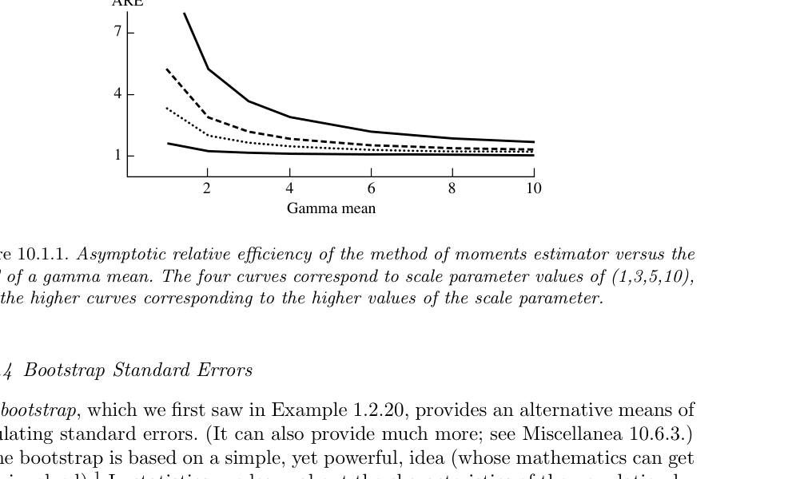
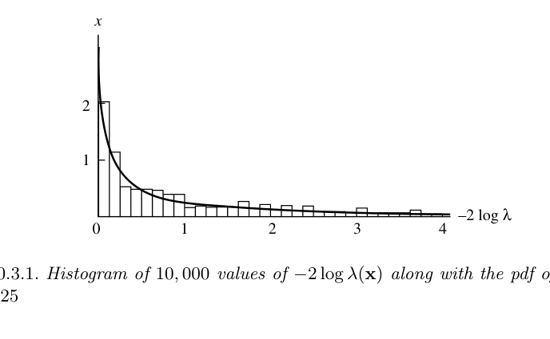
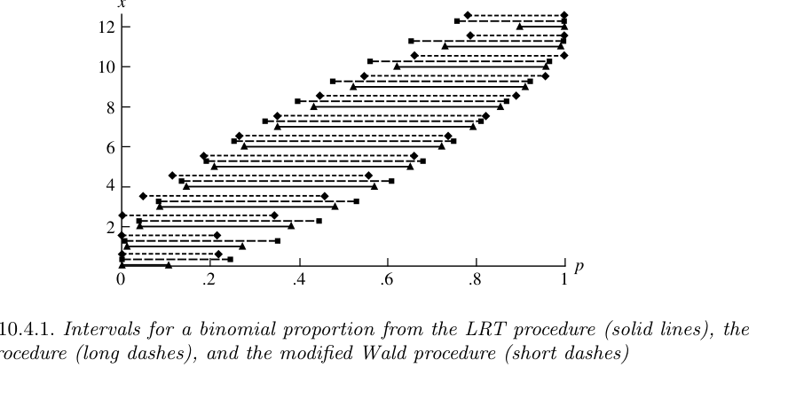
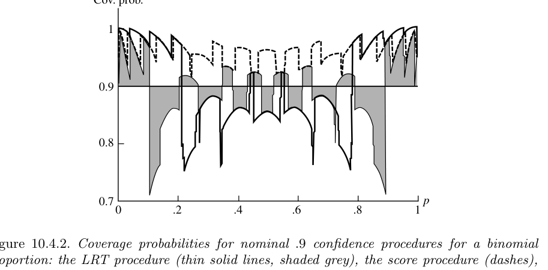

# 점근적 평가 {#chapter10}

> “I know, my dear Watson, that you share my love of all that is bizarre and outside the conventions and humdrum routine of everyday life.”  
> — Sherlock Holmes, *The Red-headed League*

- 지금까지의 장들에서는 주로 **유한표본 기준(finite-sample criteria)**을 사용했다.
- 이 장에서는 표본크기 $n$이 무한히 커질 때 절차가 어떻게 행동하는지, 즉 **점근적 성질(asymptotic properties)**을 다룬다.
- 점근적 평가의 장점은 계산이 크게 단순화된다는 데 있다.
  - 유한표본에서는 정확한 분포를 구하기 어렵거나 불가능한 경우가 많다.
  - $n\to\infty$로 두면 정규분포, 카이제곱분포 같은 표준 근사가 나타난다.
  - 이 근사를 통해 점추정, 가설검정, 구간추정을 체계적으로 평가할 수 있다.
- 이 장은 특히 **최대가능도 방법(maximum likelihood procedures)**의 점근적 성질에 중점을 둔다.
- 또한 bootstrap, robust estimator, M-estimator처럼 실제 응용에서 중요한 방법들을 점근적으로 평가한다.

::: {.summary-box}
**이 장의 큰 흐름**

1. 점추정의 점근적 평가: 일치성, 점근분산, 점근효율
2. bootstrap 표준오차: 비모수 bootstrap과 모수 bootstrap
3. robustness: 평균, 중앙값, Huber 추정량, M-estimator
4. 가설검정: LRT의 카이제곱 근사, Wald 검정, score 검정, robust test
5. 구간추정: MLE 기반 구간, score 구간, LRT 구간, 근사 pivot 구간
6. 기타 주제: superefficiency, 정규성 조건, bootstrap theory, influence function
:::

## 점추정 {#sec-10-1}

### 일치성 {#sec-10-1-1}

- **일치성(consistency)**은 추정량이 표본크기가 커질수록 참값에 가까워지는 성질이다.
- 점근적 추론에서 가장 기본적인 요구조건이다.
- 일치성은 하나의 추정량이 아니라 표본크기 $n$마다 정의되는 **추정량열(sequence of estimators)**에 대한 성질이다.

#### 추정량열

- 관측값 $X_1,X_2,\ldots$가 분포 $f(x\mid\theta)$에서 나온다고 하자.
- 표본크기 $n$일 때 같은 추정 절차를 적용하면

$$
W_n=W_n(X_1,\ldots,X_n)
$$

이라는 추정량열을 얻는다.
- 예를 들어 표본평균은

$$
\bar X_1=X_1,
\qquad
\bar X_2=\frac{X_1+X_2}{2},
\qquad
\bar X_3=\frac{X_1+X_2+X_3}{3},
\quad\ldots
$$

처럼 하나의 열로 생각해야 한다.

::: {.definition}
**정의: 일치추정량열**

추정량열 $W_n=W_n(X_1,\ldots,X_n)$이 모수 $\theta$의 **일치추정량열**이라는 것은, 모든 $\epsilon>0$과 모든 $\theta\in\Theta$에 대해

$$
\lim_{n\to\infty}P_\theta(|W_n-\theta|<\epsilon)=1
\tag{10.1.1}
$$

이 성립한다는 뜻이다.

동치로,

$$
\lim_{n\to\infty}P_\theta(|W_n-\theta|\ge\epsilon)=0
\tag{10.1.2}
$$

라고 쓸 수 있다.
:::

- 이는 확률론의 **확률수렴(convergence in probability)**과 같은 형태이다.
- 통계학적 정의에서는 모수 $\theta$마다 확률구조가 달라지므로 “모든 $\theta$”에 대해 성립해야 한다.

::: {.example}
**예제: 표본평균의 일치성**

$X_1,X_2,\ldots$가 iid $N(\theta,1)$이라고 하자. 표본평균

$$
\bar X_n=\frac1n\sum_{i=1}^nX_i
$$

은

$$
\bar X_n\sim N\left(\theta,\frac1n\right)
$$

을 따른다. 따라서

$$
\begin{aligned}
P_\theta(|\bar X_n-\theta|<\epsilon)
&=P(-\epsilon<\bar X_n-\theta<\epsilon)\\
&=P(-\epsilon\sqrt n<Z<\epsilon\sqrt n),
\qquad Z\sim N(0,1).
\end{aligned}
$$

$n\to\infty$이면 $\epsilon\sqrt n\to\infty$이므로 위 확률은 1로 수렴한다. 따라서 $\bar X_n$은 $\theta$의 일치추정량열이다.
:::

### 일치성 확인을 위한 충분조건

- 일치성을 직접 적분으로 보일 필요는 없다.
- Chebyshev 부등식을 사용하면 충분조건을 쉽게 얻을 수 있다.

$$
P_\theta(|W_n-\theta|\ge\epsilon)
\le
\frac{E_\theta[(W_n-\theta)^2]}{\epsilon^2}.
$$

- 따라서 모든 $\theta$에서

$$
\lim_{n\to\infty}E_\theta[(W_n-\theta)^2]=0
$$

이면 $W_n$은 일치적이다.

- 또한 평균제곱오차는

$$
E_\theta[(W_n-\theta)^2]
=
Var_\theta(W_n)+[Bias_\theta(W_n)]^2.
\tag{10.1.3}
$$

::: {.theorem}
**정리: 일치성의 충분조건**

$W_n$이 모수 $\theta$의 추정량열이라고 하자. 모든 $\theta\in\Theta$에 대해

$$
\lim_{n\to\infty}Var_\theta(W_n)=0,
$$

$$
\lim_{n\to\infty}Bias_\theta(W_n)=0
$$

이면 $W_n$은 $\theta$의 일치추정량열이다.
:::

::: {.example}
**예제: 표본평균의 일치성 재확인**

예제 10.1.2에서

$$
E_\theta\bar X_n=\theta,
\qquad
Var_\theta(\bar X_n)=\frac1n.
$$

따라서 편향은 0이고 분산은 0으로 수렴한다. 정리 10.1.3에 의해 $\bar X_n$은 일치적이다.

더 일반적으로, iid 표본이 평균 $\theta$와 유한분산을 가지면 표본평균 $\bar X_n$은 $\theta$에 대해 일치적이다.
:::

::: {.theorem}
**정리: 일치추정량의 선형변환**

$W_n$이 $\theta$의 일치추정량열이라고 하자. 상수열 $a_n,b_n$이

$$
\lim_{n\to\infty}a_n=1,
\qquad
\lim_{n\to\infty}b_n=0
$$

을 만족하면

$$
U_n=a_nW_n+b_n
$$

도 $\theta$의 일치추정량열이다.
:::

### MLE의 일치성

- 최대가능도추정량(MLE)은 적절한 정칙조건 아래에서 일치적이다.
- 이는 “MLE를 구하는 방법” 자체가 좋은 점근적 성질을 보장한다는 점에서 중요하다.

::: {.theorem}
**정리: MLE의 일치성**

$X_1,X_2,\ldots$가 iid $f(x\mid\theta)$이고

$$
L(\theta\mid x)=\prod_{i=1}^n f(x_i\mid\theta)
$$

가 가능도함수라고 하자. $\hat\theta$를 $\theta$의 MLE라 하고, $\tau(\theta)$를 $\theta$의 연속함수라고 하자. 정칙조건이 만족되면 모든 $\epsilon>0$과 모든 $\theta\in\Theta$에 대해

$$
\lim_{n\to\infty}P_\theta(|\tau(\hat\theta)-\tau(\theta)|\ge\epsilon)=0.
$$

즉, $\tau(\hat\theta)$는 $\tau(\theta)$의 일치추정량이다.
:::

- 증명 아이디어는 다음과 같다.
  - $n^{-1}\log L(\hat\theta\mid x)$가 어떤 기대값으로 수렴함을 보인다.
  - 이 기대값이 참 모수에서 최대가 되도록 정칙조건을 둔다.
  - 그러면 $\hat\theta$가 $\theta$로 확률수렴한다.

## 효율성 {#sec-10-1-2}

- 일치성은 추정량이 참값으로 가는지를 묻는다.
- **효율성(efficiency)**은 그 추정량이 얼마나 빠르고 안정적으로 참값에 가까워지는지를 묻는다.
- 특히 점근적 분산이 작을수록 효율적이다.

### 한계분산과 점근분산

::: {.definition}
**정의: 한계분산**

추정량 $T_n$에 대해 어떤 상수열 $k_n$이 존재하여

$$
\lim_{n\to\infty}k_nVar(T_n)=\tau^2<\infty
$$

이면 $\tau^2$를 **분산들의 극한(limit of the variances)** 또는 **한계분산(limiting variance)**이라고 한다.
:::

- 그러나 한계분산은 때때로 좋은 대규모 표본척도가 되지 못한다.
- 예를 들어 $\bar X_n$이 0 근처로 갈 확률은 작아지지만 $1/\bar X_n$의 유한표본 분산은 무한대일 수 있다.
- 이때 실제 대규모 표본 근사는 Delta method가 주는 분산이 더 유용하다.

::: {.definition}
**정의: 점근분산**

추정량 $T_n$에 대해

$$
k_n(T_n-\tau(\theta))\xrightarrow{d}N(0,\sigma^2)
$$

이면 $\sigma^2$를 $T_n$의 **점근분산(asymptotic variance)** 또는 **극한분포의 분산**이라고 한다.
:::

- 표본평균처럼 단순한 경우에는 한계분산과 점근분산이 일치한다.
- 하지만 복잡한 추정량에서는 한계분산이 무한대여도 점근분산은 유한할 수 있다.

::: {.example}
**예제: 혼합모형에서 한계분산과 점근분산의 차이**

계층모형

$$
Y_n\mid W_n=w_n\sim N\{0,w_n+(1-w_n)\sigma_n^2\},
$$

$$
W_n\sim Bernoulli(p_n)
$$

을 생각하자. 즉, $Y_n$은 확률 $p_n$으로 $N(0,1)$에서 나오고, 확률 $1-p_n$으로 $N(0,\sigma_n^2)$에서 나온다.

조건부분산 공식을 쓰면

$$
Var(Y_n)=p_n+(1-p_n)\sigma_n^2.
$$

만약 $p_n\to1$, $\sigma_n\to\infty$, 그리고 $(1-p_n)\sigma_n^2\to\infty$라면 한계분산은 무한대이다.

하지만 분포함수는

$$
P(Y_n<a)=p_nP(Z<a)+(1-p_n)P(Z<a/\sigma_n)
$$

이고, 이는 $P(Z<a)$로 수렴한다. 따라서

$$
Y_n\xrightarrow{d}N(0,1).
$$

즉,

$$
\text{한계분산}=\infty,
\qquad
\text{점근분산}=1.
$$
:::

### 점근효율성

- Cramer-Rao 하한은 유한표본에서 불편추정량의 분산에 대한 하한을 제공했다.
- 점근적으로도 비슷한 기준을 세울 수 있다.

::: {.definition}
**정의: 점근효율추정량**

추정량열 $W_n$이 $\tau(\theta)$에 대해

$$
\sqrt n[W_n-\tau(\theta)]\xrightarrow{d}N(0,v(\theta))
$$

이고

$$
v(\theta)=
\frac{[\tau'(\theta)]^2}
{E_\theta\left[\frac{\partial}{\partial\theta}\log f(X\mid\theta)\right]^2}
$$

이면 $W_n$은 $\tau(\theta)$에 대해 **점근적으로 효율적(asymptotically efficient)**이라고 한다.
:::

::: {.theorem}
**정리: MLE의 점근효율성**

$X_1,X_2,\ldots$가 iid $f(x\mid\theta)$이고 $\hat\theta$가 $\theta$의 MLE라고 하자. $\tau(\theta)$가 연속함수이고 정칙조건이 만족되면

$$
\sqrt n[\tau(\hat\theta)-\tau(\theta)]\xrightarrow{d}N(0,v(\theta)),
$$

여기서 $v(\theta)$는 Cramer-Rao 하한이다. 따라서 $\tau(\hat\theta)$는 일치적이고 점근적으로 효율적이다.
:::

#### 증명 아이디어: Taylor 전개

로그가능도를

$$
l(\theta\mid x)=\sum_{i=1}^n\log f(x_i\mid\theta)
$$

라고 하자. 참값을 $\theta_0$라고 두고 $l'(\theta\mid x)$를 $\theta_0$ 주변에서 전개하면

$$
l'(\theta\mid x)
= l'(\theta_0\mid x)+ (\theta-\theta_0)l''(\theta_0\mid x)+\cdots.
\tag{10.1.4}
$$

MLE에서는 $l'(\hat\theta\mid x)=0$이므로

$$
\sqrt n(\hat\theta-\theta_0)
= -
\frac{\frac1{\sqrt n}l'(\theta_0\mid x)}
{\frac1n l''(\theta_0\mid x)}.
\tag{10.1.5}
$$

중심극한정리와 대수의 법칙을 적용하면

$$
-\frac1{\sqrt n}l'(\theta_0\mid X)
\xrightarrow{d}N(0,I(\theta_0)),
\tag{10.1.6}
$$

$$
\frac1n l''(\theta_0\mid X)
\xrightarrow{p}-I(\theta_0).
$$

따라서 Slutsky 정리에 의해

$$
\sqrt n(\hat\theta-\theta_0)
\xrightarrow{d}N\left(0,\frac1{I(\theta_0)}\right).
$$

### 점근정규성이 일치성을 함의함

::: {.example}
**예제: 점근정규성과 일치성**

만약

$$
\sqrt n\frac{W_n-\mu}{\sigma}\xrightarrow{d}Z,
\qquad Z\sim N(0,1)
$$

이면

$$
W_n-\mu
=
\frac{\sigma}{\sqrt n}
\left(\sqrt n\frac{W_n-\mu}{\sigma}\right)
\xrightarrow{d}0.
$$

점으로의 분포수렴은 확률수렴과 같으므로 $W_n$은 $\mu$에 대해 일치적이다.
:::

## 계산과 비교 {#sec-10-1-3}

- MLE가 점근적으로 효율적이면, Cramer-Rao 하한을 MLE 분산의 근사값으로 사용할 수 있다.
- 특히 $h(\hat\theta)$의 분산은 Delta method와 observed information을 이용해 근사한다.

### MLE 함수의 분산 근사

표본정보량을

$$
I_n(\theta)
=
E_\theta\left[\frac{\partial}{\partial\theta}\log L(\theta\mid X)\right]^2
$$

라고 하자. 그러면

$$
Var(h(\hat\theta)\mid\theta)
\approx
\frac{[h'(\theta)]^2}{I_n(\theta)}.
\tag{10.1.7}
$$

정보량 항등식을 사용하면

$$
I_n(\theta)
=
E_\theta\left[-\frac{\partial^2}{\partial\theta^2}\log L(\theta\mid X)\right].
$$

실제 계산에서는 $\theta$ 대신 $\hat\theta$를 대입한 observed information을 자주 쓴다.

$$
\widehat I_n(\hat\theta)
=
-
\left.
\frac{\partial^2}{\partial\theta^2}\log L(\theta\mid X)
\right|_{\theta=\hat\theta}.
$$

따라서

$$
\widehat{Var}\{h(\hat\theta)\}
\approx
\frac{[h'(\hat\theta)]^2}{\widehat I_n(\hat\theta)}.
$$

::: {.note}
**중요한 절차**

분산을 “추정”할 때 실제로는 두 단계를 거친다.

1. 먼저 이론적 분산을 점근적으로 근사한다.
2. 그 근사식 안의 모수를 $\hat\theta$로 대체한다.

따라서 $\widehat{Var}\{h(\hat\theta)\}$는 “근사한 뒤 추정한 값”이다.
:::

::: {.example}
**예제: 이항분포에서 $\hat p$의 분산근사**

$X_1,\ldots,X_n$이 iid Bernoulli$(p)$라고 하자. MLE는

$$
\hat p=\frac1n\sum_{i=1}^nX_i
$$

이고 직접 계산하면

$$
Var_p(\hat p)=\frac{p(1-p)}{n}.
$$

따라서 자연스러운 추정값은

$$
\widehat{Var}_p(\hat p)=\frac{\hat p(1-\hat p)}{n}.
\tag{10.1.8}
$$

로그가능도는

$$
\log L(p\mid x)=n\hat p\log p+n(1-\hat p)\log(1-p).
$$

두 번째 미분은

$$
\frac{\partial^2}{\partial p^2}\log L(p\mid x)
= -\frac{n\hat p}{p^2}-\frac{n(1-\hat p)}{(1-p)^2}.
$$

$p=\hat p$를 대입하면

$$
\left.
\frac{\partial^2}{\partial p^2}\log L(p\mid x)
\right|_{p=\hat p}
= -\frac{n}{\hat p(1-\hat p)}.
$$

따라서 observed information 방식은 직접 계산과 같은 분산근사를 준다.

또한

$$
\sqrt n(\hat p-p)\xrightarrow{d}N(0,p(1-p)),
$$

그리고 Slutsky 정리에 의해

$$
\frac{\sqrt n(\hat p-p)}{\sqrt{\hat p(1-\hat p)}}
\xrightarrow{d}N(0,1).
$$
:::

#### Odds의 MLE와 분산

- Bernoulli의 odds는

$$
\frac{p}{1-p}
$$

이다.
- MLE는

$$
\frac{\hat p}{1-\hat p}
$$

이다.
- Delta method와 information approximation을 적용하면

$$
\widehat{Var}\left(\frac{\hat p}{1-\hat p}\right)
=
\frac{\hat p}{n(1-\hat p)^3}.
$$

::: {.example}
**예제: Bernoulli 분산 $p(1-p)$ 추정의 주의점**

Bernoulli 분산은

$$
p(1-p)
$$

이고 MLE는

$$
\hat p(1-\hat p)
$$

이다. Delta method를 적용하면

$$
\widehat{Var}\{\hat p(1-\hat p)\}
=
\frac{\hat p(1-\hat p)(1-2\hat p)^2}{n}.
$$

하지만 $\hat p=1/2$이면 이 근사분산은 0이 된다. 이는 명백히 과소추정이다.

문제의 원인은 함수

$$
h(p)=p(1-p)
$$

가 단조함수가 아니고 $p=1/2$에서 도함수가 0이 된다는 데 있다. 이 경우에는 1차 Delta method가 실패하므로 2차 근사를 사용해야 한다.
:::

### 점근상대효율

::: {.definition}
**정의: 점근상대효율**

두 추정량 $W_n,V_n$이

$$
\sqrt n[W_n-\tau(\theta)]\xrightarrow{d}N(0,\sigma_W^2),
$$

$$
\sqrt n[V_n-\tau(\theta)]\xrightarrow{d}N(0,\sigma_V^2)
$$

를 만족할 때, $W_n$에 대한 $V_n$의 점근상대효율은

$$
ARE(V_n,W_n)=\frac{\sigma_W^2}{\sigma_V^2}
$$

이다.
:::

- 값이 1보다 크면 $V_n$이 $W_n$보다 점근분산이 작다.
- 값이 1보다 작으면 $V_n$이 더 비효율적이다.

::: {.example}
**예제: 포아송 0확률 추정량의 ARE**

$X_1,X_2,\ldots$가 iid Poisson$(\lambda)$라고 하자. 관심대상은

$$
P(X=0)=e^{-\lambda}
$$

이다.

자연스러운 추정량은

$$
\hat\tau=\frac1n\sum_{i=1}^nI(X_i=0)
$$

이다. 그러면 $I(X_i=0)$은 Bernoulli$(e^{-\lambda})$이므로

$$
E(\hat\tau)=e^{-\lambda},
\qquad
Var(\hat\tau)=\frac{e^{-\lambda}(1-e^{-\lambda})}{n}.
$$

반면 MLE는

$$
e^{-\hat\lambda},
\qquad
\hat\lambda=\bar X.
$$

Delta method로

$$
Var(e^{-\hat\lambda})\approx\frac{\lambda e^{-2\lambda}}{n}.
$$

따라서

$$
ARE(\hat\tau,e^{-\hat\lambda})
=
\frac{\lambda e^{-2\lambda}}{e^{-\lambda}(1-e^{-\lambda})}
=
\frac{\lambda}{e^\lambda-1}.
$$

이 값은 $\lambda=0$에서 최대 1이고 $\lambda$가 커질수록 빠르게 감소한다.
:::

::: {.example}
**예제: 감마 평균 추정**

감마분포

$$
f(x\mid\alpha,\beta)
=
\frac{1}{\Gamma(\alpha)\beta^\alpha}x^{\alpha-1}e^{-x/\beta}
$$

의 평균은 $\alpha\beta$이다. 평균을 $\mu=\alpha\beta$로 재매개화하면

$$
f(x\mid\mu,\beta)
=
\frac{1}{\Gamma(\mu/\beta)\beta^{\mu/\beta}}
 x^{\mu/\beta-1}e^{-x/\beta}.
$$

적률추정량은 단순히

$$
\bar X
$$

이며 분산은

$$
Var(\bar X)=\frac{\beta\mu}{n}.
$$

반면 MLE는 감마함수의 도함수인 digamma function을 포함하므로 명시적 해가 없고 수치계산이 필요하다.

아래 그림은 scale parameter $\beta=1,3,5,10$에 대해 적률추정량과 MLE의 점근상대효율을 비교한다. $\beta$가 커질수록 복잡하더라도 MLE를 사용하는 이득이 커진다.
:::

::: {.figure}

Figure 10.1.1. 감마 평균 추정에서 적률추정량과 MLE의 점근상대효율

:::

## Bootstrap 표준오차 {#sec-10-1-4}

- **bootstrap**은 표준오차를 계산하는 일반적 방법이다.
- 핵심 아이디어는 다음과 같다.
  - 표본은 모집단을 대표한다.
  - 그러므로 표본에서 다시 표본을 뽑아(resampling) 통계량의 변동성을 추정할 수 있다.
- 원 표본에서 복원추출한 표본을 bootstrap sample 또는 resample이라고 한다.

### 비모수 bootstrap

::: {.example}
**예제: 표본평균의 bootstrap 분산**

표본이

$$
2,4,9,12
$$

라고 하자. 크기 4의 bootstrap sample을 복원추출로 만든다.

$i$번째 bootstrap sample의 평균을 $\bar x_i^*$라고 하자. 모든 bootstrap 평균들의 분산을

$$
Var^*(\bar X)
=
\frac{1}{n^n-1}\sum_{i=1}^{n^n}(\bar x_i^*-\bar{\bar x}^*)^2
\tag{10.1.9}
$$

로 추정할 수 있다. 여기서

$$
\bar{\bar x}^*=\frac1{n^n}\sum_{i=1}^{n^n}\bar x_i^*
$$

이다.

이 예제에서는 bootstrap 평균이 6.75, bootstrap 분산이 3.94가 된다.
:::

### 임의 추정량에 대한 bootstrap 분산

- bootstrap의 진짜 장점은 거의 모든 추정량에 적용할 수 있다는 점이다.
- 추정량을

$$
\hat\theta=\hat\theta(x_1,\ldots,x_n)
$$

라고 하자.
- 모든 bootstrap sample에 대해 $\hat\theta_i^*$를 계산하면

$$
Var^*(\hat\theta)
=
\frac{1}{n^n-1}\sum_{i=1}^{n^n}(\hat\theta_i^*-\bar{\hat\theta}^*)^2.
\tag{10.1.10}
$$

- 실제로 $n^n$개 전체 bootstrap sample을 모두 열거하는 것은 불가능하므로 $B$개의 bootstrap sample만 무작위로 뽑는다.

$$
Var_B^*(\hat\theta)
=
\frac{1}{B-1}\sum_{i=1}^{B}(\hat\theta_i^*-\bar{\hat\theta}^*)^2.
\tag{10.1.11}
$$

::: {.example}
**예제: Bernoulli 분산추정량의 bootstrap**

관심 추정량이

$$
\hat p(1-\hat p)
$$

일 때, 1차 Delta method는 특히 $\hat p=1/2$ 부근에서 분산을 과소평가한다.

$n=24$, $B=1000$인 bootstrap 계산에서 교재는 다음과 같은 비교를 제시한다.

| $\hat p$ | Bootstrap | Delta Method | True |
|---:|---:|---:|---:|
| $1/4$ | 0.00508 | 0.00195 | 0.00484 |
| $1/2$ | 0.00555 | 0.00022 | 0.00531 |
| $2/3$ | 0.00561 | 0.00102 | 0.00519 |

bootstrap은 이 예제에서 실제 분산에 훨씬 가깝다.
:::

### 모수 bootstrap

- 비모수 bootstrap은 모집단의 함수형태를 가정하지 않는다.
- 반면 **모수 bootstrap(parametric bootstrap)**은 모형 $f(x\mid\theta)$를 가정한다.
- 절차는 다음과 같다.

1. 원자료에서 MLE $\hat\theta$를 구한다.
2. plug-in 분포 $f(x\mid\hat\theta)$에서 bootstrap sample을 생성한다.
3. 각 bootstrap sample에서 통계량을 계산한다.
4. 그 bootstrap 분포로 표준오차를 추정한다.

::: {.example}
**예제: 정규분포에서 표본분산의 모수 bootstrap**

자료

$$
-1.81, 0.63, 2.22, 2.41, 2.95, 4.16, 4.24, 4.53, 5.09
$$

에서

$$
\bar x=2.71,
\qquad
s^2=4.82
$$

라고 하자. 정규분포를 가정하면 bootstrap sample은

$$
X_1^*,\ldots,X_n^*\sim N(2.71,4.82)
$$

에서 생성한다.

$B=1000$개의 표본으로 $Var_B^*(S^2)=4.33$을 얻는다. 정규이론 기반 MLE plug-in 계산은 5.81이고, 실제 생성분산이 4라면 bootstrap이 더 가깝다.
:::

### bootstrap의 일관성

bootstrap 분산추정에는 두 단계의 수렴 문제가 있다.

1. $B\to\infty$일 때

$$
Var_B^*(\hat\theta)\to Var^*(\hat\theta).
$$

2. $n\to\infty$일 때

$$
Var^*(\hat\theta)\to Var(\hat\theta).
$$

첫 번째는 표본 안에서 대수의 법칙으로 설명된다. 두 번째가 진정한 통계적 일관성 문제이며, iid 상황에서는 대체로 성립하지만 일반적인 의존자료에서는 조심해야 한다.

## Robustness {#sec-10-2}

- 지금까지의 최적성은 모형이 정확하다는 가정 아래에서 얻은 것이다.
- 실제로는 모형이 약간 틀릴 수 있다.
- 이런 상황에서 추정량이 크게 망가지지 않는 성질을 **robustness**라고 한다.

Huber가 제시한 robust procedure의 바람직한 성질은 다음과 같다.

1. 가정한 모형에서는 효율이 충분히 좋아야 한다.
2. 작은 모형 위반에서는 성능이 조금만 나빠져야 한다.
3. 큰 모형 위반에서도 catastrophe가 발생하지 않아야 한다.

### 평균과 중앙값 {#sec-10-2-1}

#### 표본평균의 robustness

::: {.example}
**예제: 표본평균의 robustness**

$X_1,\ldots,X_n$이 iid $N(\mu,\sigma^2)$이면 표본평균은

$$
Var(\bar X)=\frac{\sigma^2}{n}
$$

으로 Cramer-Rao 하한을 달성한다. 즉, 정규모형이 맞다면 매우 효율적이다.

하지만 contamination model을 생각하자.

$$
X_i\sim
\begin{cases}
N(\mu,\sigma^2), & \text{with probability }1-\delta,\\
f(x), & \text{with probability }\delta.
\end{cases}
$$

$f(x)$의 평균과 분산을 각각 $\theta,\tau^2$라고 하면

$$
Var(\bar X)
=
(1-\delta)\frac{\sigma^2}{n}
+
\delta\frac{\tau^2}{n}
+
\frac{\delta(1-\delta)(\theta-\mu)^2}{n}.
$$

만약 contamination 분포가 Cauchy처럼 분산이 존재하지 않는다면 $Var(\bar X)=\infty$가 된다. 즉, 아주 작은 contamination도 평균을 크게 망가뜨릴 수 있다.
:::

### Breakdown value

::: {.definition}
**정의: Breakdown value**

순서통계량을

$$
X_{(1)}<\cdots<X_{(n)}
$$

이라고 하자. 통계량 $T_n$이 breakdown value $b$를 갖는다는 것은, 대략 표본의 $b$ 비율까지는 극단값으로 보내도 통계량이 유한하게 남지만, 그보다 조금 더 많은 비율을 극단값으로 보내면 통계량이 무한대로 발산한다는 뜻이다.
:::

- 표본평균의 breakdown value는 0이다.
  - 단 하나의 관측값이라도 무한대로 보내면 평균도 무한대로 간다.
- 표본중앙값의 breakdown value는 50%이다.
  - 표본 절반 미만이 극단값이 되어도 중앙값은 크게 흔들리지 않는다.

#### 중앙값의 점근정규성

::: {.example}
**예제: 중앙값의 점근정규성**

모집단 cdf를 $F$, pdf를 $f$라고 하고 모집단 중앙값을 $\mu$라고 하자.

$$
P(X_i\le\mu)=\frac12.
$$

표본중앙값을 $M_n$이라고 하자. $n$이 홀수라고 가정하면

$$
\{M_n\le\mu+a/\sqrt n\}
$$

은 $\mu+a/\sqrt n$보다 작은 관측값이 적어도 $(n+1)/2$개라는 사건이다. 이를 Bernoulli 변수의 합으로 바꾸면 중심극한정리를 적용할 수 있다.

결과적으로

$$
\sqrt n(M_n-\mu)
\xrightarrow{d}
N\left(0,\frac{1}{[2f(\mu)]^2}\right).
$$
:::

### 평균과 중앙값의 ARE

| 분포 | 중앙값 / 평균 ARE |
|---|---:|
| Normal | 0.64 |
| Logistic | 0.82 |
| Double exponential | 2.00 |

- 정규분포에서는 평균이 더 효율적이다.
- 꼬리가 두꺼워질수록 중앙값의 상대적 성능이 좋아진다.
- 이중지수분포에서는 중앙값이 평균보다 더 효율적이다.

## M-estimator {#sec-10-2-2}

- 많은 추정량은 어떤 기준함수를 최소화해서 얻어진다.
  - 평균: $\sum_i(x_i-a)^2$ 최소화
  - 중앙값: $\sum_i|x_i-a|$ 최소화
  - MLE: 음의 로그가능도 최소화
- robust estimator를 만들기 위해 평균과 중앙값 사이의 절충 기준을 생각할 수 있다.

### Huber의 기준함수

Huber는 다음 기준함수를 제안했다.

$$
\sum_{i=1}^n\rho(x_i-a),
\tag{10.2.1}
$$

여기서

$$
\rho(x)=
\begin{cases}
\frac12x^2, & |x|\le k,\\
k|x|-\frac12k^2, & |x|\ge k.
\end{cases}
\tag{10.2.2}
$$

- $|x|\le k$에서는 제곱손실처럼 행동한다.
- $|x|>k$에서는 절댓값손실처럼 행동한다.
- $k$는 tuning parameter이다.
  - $k$가 작으면 중앙값에 가까운 robust 추정량
  - $k$가 크면 평균에 가까운 추정량

::: {.example}
**예제: Huber 추정량**

자료가

$$
-1.28,-.96,-.46,-.44,-.26,-.21,-.063,.39,3,6,9
$$

이라고 하자. 평균은 1.33이고 중앙값은 -0.21이다.

$k$에 따른 Huber 추정량은 다음과 같다.

| $k$ | 0 | 1 | 2 | 3 | 4 | 5 | 6 | 8 | 10 |
|---:|---:|---:|---:|---:|---:|---:|---:|---:|---:|
| 추정값 | -0.21 | 0.03 | -0.04 | 0.29 | 0.41 | 0.52 | 0.87 | 0.97 | 1.33 |

$k$가 증가할수록 추정량은 중앙값에서 평균 쪽으로 이동한다.
:::

### 일반적인 M-estimator

- 일반 함수 $\rho$에 대해

$$
\sum_i\rho(x_i-\theta)
$$

을 최소화하는 추정량을 **M-estimator**라고 한다.
- $\psi=\rho'$라고 하면 M-estimator는 보통 다음 방정식의 해로 표현된다.

$$
\sum_{i=1}^n\psi(x_i-\theta)=0.
\tag{10.2.3}
$$

### M-estimator의 점근분포

Taylor 전개를 사용하면

$$
\sqrt n(\hat\theta_M-\theta_0)
=
-
\frac{n^{-1/2}\sum_i\psi(X_i-\theta_0)}
{n^{-1}\sum_i\psi'(X_i-\theta_0)}.
$$

만약

$$
E_{\theta_0}\psi(X-\theta_0)=0
$$

이면 중심극한정리와 대수의 법칙에 의해

$$
\sqrt n(\hat\theta_M-\theta_0)
\xrightarrow{d}
N\left(
0,
\frac{E_{\theta_0}\psi(X-\theta_0)^2}
{[E_{\theta_0}\psi'(X-\theta_0)]^2}
\right).
\tag{10.2.6}
$$

### Huber 추정량의 점근분산

Huber의 $\rho$에 대응하는 $\psi$는

$$
\psi(x)=
\begin{cases}
x, & |x|\le k,\\
k, & x>k,\\
-k, & x<-k.
\end{cases}
\tag{10.2.7}
$$

대칭 위치분포 $f(x-\theta)$에서 Huber 추정량의 점근분산은

$$
\frac{
\int_{-k}^{k}x^2f(x)\,dx+2k^2P_0(|X|>k)
}
{[P_0(|X|\le k)]^2}.
$$

### Huber estimator의 ARE

$k=1.5$일 때 Huber 추정량의 점근상대효율은 다음과 같다.

| 비교 | Normal | Logistic | Double exponential |
|---|---:|---:|---:|
| Huber vs. mean | 0.96 | 1.08 | 1.37 |
| Huber vs. median | 1.51 | 1.31 | 0.68 |

- Huber 추정량은 평균과 중앙값 사이의 절충안이다.
- 정규분포와 Logistic에서는 평균과 비슷한 효율을 유지한다.
- Double exponential에서는 평균보다 좋지만 중앙값보다는 덜 효율적이다.

### M-estimator와 MLE의 효율 비교

M-estimator의 효율은 Cauchy-Schwarz 부등식으로 MLE보다 클 수 없음을 보일 수 있다.

$$
ARE(\hat\theta_M,\hat\theta)
=
\frac{[E_\theta\psi(X-\theta_0)l'(\theta\mid X)]^2}
{E_\theta\psi(X-\theta)^2E_\theta l'(\theta\mid X)^2}
\le1.
\tag{10.2.9}
$$

- 등호는 $\psi$가 score function에 비례할 때 성립한다.
- robust estimator는 일반적으로 MLE보다 효율을 일부 포기하지만, 모형 위반에 덜 민감하다.

## 가설검정 {#sec-10-3}

- 복잡한 문제에서는 UMP 검정이나 최적 검정을 구하기 어렵다.
- 이때 점근이론은 실용적인 검정을 만들어 준다.
- 이 절에서는 LRT와 큰 표본 검정을 다룬다.

### LRT의 점근분포 {#sec-10-3-1}

가능도비통계량은

$$
\lambda(x)=
\frac{\sup_{\theta\in\Theta_0}L(\theta\mid x)}
{\sup_{\theta\in\Theta}L(\theta\mid x)}.
$$

- $\lambda(x)$가 작을수록 귀무가설이 자료를 잘 설명하지 못한다.
- 따라서 기각역은

$$
\{x:\lambda(x)\le c\}
$$

형태이다.
- 유의수준 $\alpha$ 검정을 만들려면

$$
\sup_{\theta\in\Theta_0}P_\theta(\lambda(X)\le c)\le\alpha
\tag{10.3.1}
$$

가 되도록 $c$를 정해야 한다.

::: {.theorem}
**정리: 단순 귀무가설에서 LRT의 점근분포**

$H_0:\theta=\theta_0$ 대 $H_1:\theta\ne\theta_0$를 검정한다고 하자. $X_1,\ldots,X_n$이 iid $f(x\mid\theta)$이고 $\hat\theta$가 MLE이며 정칙조건이 성립하면, $H_0$하에서

$$
-2\log\lambda(X)\xrightarrow{d}\chi^2_1.
$$
:::

#### 증명 아이디어

로그가능도 $l(\theta\mid x)$를 $\hat\theta$ 주변에서 Taylor 전개한다.

$$
l(\theta\mid x)
=l(\hat\theta\mid x)
+l'(\hat\theta\mid x)(\theta-\hat\theta)
+\frac12l''(\hat\theta\mid x)(\theta-\hat\theta)^2+\cdots.
$$

MLE에서는 $l'(\hat\theta\mid x)=0$이므로

$$
-2\log\lambda(x)
\approx
(\theta_0-\hat\theta)^2[-l''(\hat\theta\mid x)].
$$

observed information과 MLE의 점근정규성을 결합하면 카이제곱분포가 나온다.

::: {.example}
**예제: 포아송 LRT**

$X_1,\ldots,X_n$이 iid Poisson$(\lambda)$이고

$$
H_0:\lambda=\lambda_0
\quad\text{vs.}\quad
H_1:\lambda\ne\lambda_0
$$

를 검정한다고 하자. MLE는

$$
\hat\lambda=\frac1n\sum_iX_i.
$$

LRT 통계량은

$$
-2\log\lambda(x)
=
2n\left[(\lambda_0-\hat\lambda)-\hat\lambda\log\left(\frac{\lambda_0}{\hat\lambda}\right)\right].
$$

점근적으로

$$
-2\log\lambda(X)\sim\chi^2_1
$$

로 근사할 수 있으므로 $\chi^2_{1,\alpha}$보다 크면 귀무가설을 기각한다.
:::

::: {.figure}

Figure 10.3.1. $\lambda_0=5$, $n=25$일 때 포아송 LRT 통계량 $-2\log\lambda(X)$의 10,000회 시뮬레이션 히스토그램과 $\chi^2_1$ 밀도

:::

교재의 시뮬레이션 비교는 근사가 꽤 좋음을 보여준다.

| Percentile | .80 | .90 | .95 | .99 |
|---:|---:|---:|---:|---:|
| Simulated | 1.630 | 2.726 | 3.744 | 6.304 |
| $\chi^2_1$ | 1.642 | 2.706 | 3.841 | 6.635 |

::: {.theorem}
**정리: 일반 LRT의 점근 카이제곱분포**

$X_1,\ldots,X_n$이 pdf 또는 pmf $f(x\mid\theta)$에서 나온 확률표본이라고 하자. 정칙조건이 성립하고 $\theta\in\Theta_0$이면

$$
-2\log\lambda(X)
\xrightarrow{d}\chi^2_\nu.
$$

여기서 자유도 $\nu$는 전체 모수공간 $\Theta$의 자유모수 개수와 귀무가설 모수공간 $\Theta_0$의 자유모수 개수의 차이이다.

따라서 큰 표본에서

$$
H_0\text{ 기각}
\quad\Longleftrightarrow\quad
-2\log\lambda(X)\ge\chi^2_{\nu,\alpha}
$$

를 사용한다.
:::

::: {.example}
**예제: 다항분포 LRT**

범주가 5개인 다항모형에서

$$
\theta=(p_1,p_2,p_3,p_4,p_5),
\qquad
\sum_{j=1}^5p_j=1
$$

이라고 하자. 검정가설은

$$
H_0:p_1=p_2=p_3,\quad p_4=p_5
$$

이다.

전체 모형은 $p_5=1-p_1-p_2-p_3-p_4$이므로 자유모수가 4개이다.
귀무가설 아래에서는 $p_1$ 하나만 정하면 나머지가 결정되므로 자유모수는 1개이다.
따라서 자유도는

$$
\nu=4-1=3.
$$

관측도수를 $y_j$라고 하면 LRT 통계량은

$$
-2\log\lambda(x)
=2\sum_{i=1}^5y_i\log\left(\frac{y_i}{m_i}\right),
\tag{10.3.2}
$$

여기서

$$
m_1=m_2=m_3=\frac{y_1+y_2+y_3}{3},
\qquad
m_4=m_5=\frac{y_4+y_5}{2}.
$$

큰 표본에서 $\chi^2_3$ 기준값과 비교하여 검정한다.
:::

## 기타 큰 표본 검정 {#sec-10-3-2}

### Wald 검정

- 어떤 추정량 $W_n$이 $\theta$의 추정량이고 표준오차 추정값이 $S_n$이라고 하자.
- 검정가설

$$
H_0:\theta=\theta_0
\quad\text{vs.}\quad
H_1:\theta\ne\theta_0
$$

에 대해 Wald 통계량은

$$
Z_n=\frac{W_n-\theta_0}{S_n}
$$

이다.
- $H_0$하에서 $Z_n\xrightarrow{d}N(0,1)$이면, 양측검정은

$$
|Z_n|>z_{\alpha/2}
$$

일 때 기각한다.

### Wald 검정의 점근검정력

대립가설 $\theta\ne\theta_0$ 아래에서

$$
Z_n
=
\frac{W_n-\theta}{S_n}
+
\frac{\theta-\theta_0}{S_n}.
\tag{10.3.3}
$$

일반적으로 $S_n\to0$이므로 두 번째 항이 $+\infty$ 또는 $-\infty$로 발산한다. 따라서 검정력은 1로 수렴한다.

### 이항모형의 Wald 검정

::: {.example}
**예제: 큰 표본 이항검정**

$X_1,\ldots,X_n$이 iid Bernoulli$(p)$라고 하자. $\hat p_n=\sum_iX_i/n$이면

$$
\frac{\hat p_n-p}{\sqrt{\hat p_n(1-\hat p_n)/n}}
\xrightarrow{d}N(0,1).
$$

따라서

$$
H_0:p\le p_0
\quad\text{vs.}\quad
H_1:p>p_0
$$

에 대한 Wald 검정통계량은

$$
Z_n=
\frac{\hat p_n-p_0}{\sqrt{\hat p_n(1-\hat p_n)/n}}
$$

이고, $Z_n>z_\alpha$이면 기각한다.

양측검정 $H_0:p=p_0$에서는 대안적으로 null value를 표준오차에 넣어

$$
Z_n'=
\frac{\hat p_n-p_0}{\sqrt{p_0(1-p_0)/n}}
\tag{10.3.4}
$$

을 사용할 수 있다.
:::

### Score 검정

score statistic은

$$
S(\theta)=\frac{\partial}{\partial\theta}\log L(\theta\mid X)
$$

이다. $H_0:\theta=\theta_0$가 참이면

$$
E_{\theta_0}S(\theta_0)=0,
$$

그리고

$$
Var_{\theta_0}S(\theta_0)=I_n(\theta_0).
$$

따라서 score test statistic은

$$
Z_S=\frac{S(\theta_0)}{\sqrt{I_n(\theta_0)}}.
$$

- $H_0$하에서 $Z_S\xrightarrow{d}N(0,1)$이다.
- 복합 귀무가설에서는 $\theta_0$ 대신 restricted MLE를 넣는다.
- 이 검정은 Lagrange multiplier test라고도 부른다.

::: {.example}
**예제: 이항 score 검정**

Bernoulli 모형에서

$$
S(p)=\frac{\hat p_n-p}{p(1-p)/n},
\qquad
I_n(p)=\frac{n}{p(1-p)}.
$$

따라서

$$
Z_S
=
\frac{S(p_0)}{\sqrt{I_n(p_0)}}
=
\frac{\hat p_n-p_0}{\sqrt{p_0(1-p_0)/n}},
$$

이는 식 (10.3.4)와 같다.
:::

### Robust test

M-estimator의 점근정규성을 사용하면 robust test를 만들 수 있다.

$$
\sqrt n(\hat\theta_M-\theta_0)
\xrightarrow{d}
N(0,Var_{\theta_0}(\hat\theta_M)).
\tag{10.3.5}
$$

따라서 generalized score statistic은

$$
Z_{GS}
=
\frac{\sqrt n(\hat\theta_M-\theta_0)}
{\sqrt{Var_{\theta_0}(\hat\theta_M)}}.
$$

분산을 추정하면 generalized Wald statistic을 얻는다.

### Huber estimator 기반 검정

::: {.example}
**예제: Huber 추정량 기반 검정**

대칭 위치모형에서 Huber M-estimator의 점근분산을 사용하면

$$
H_0:\theta=\theta_0
\quad\text{vs.}\quad
H_1:\theta\ne\theta_0
$$

에 대해

$$
|Z_{GS}|>z_{\alpha/2}
$$

이면 기각하는 근사검정을 만들 수 있다.

실무에서는 분산을 plug-in 방식으로 추정한다. 예를 들어

$$
\widehat{Var}_1(\hat\theta_M)
=
\frac{n^{-1}\sum_i[\psi(x_i-\hat\theta_M)]^2}
{\left[n^{-1}\sum_i\psi'(x_i-\hat\theta_M)\right]^2}
\tag{10.3.6}
$$

을 사용할 수 있다.

교재의 시뮬레이션은 $z$ 기준값이 분산추정의 변동성을 충분히 반영하지 못해 실제 size가 nominal size보다 커질 수 있음을 보여준다.
:::

## 구간추정 {#sec-10-4}

- 앞 절들의 점근분포는 신뢰구간 구성으로 이어진다.
- 목표는 복잡한 문제에서도 “완벽하지는 않지만 사용 가능한” 근사 신뢰구간을 만드는 것이다.

### 근사 최대가능도 구간 {#sec-10-4-1}

MLE의 점근분포를 이용하면 함수 $h(\theta)$에 대한 신뢰구간을 만들 수 있다.

$$
\frac{h(\hat\theta)-h(\theta)}
{\sqrt{\widehat{Var}\{h(\hat\theta)\}}}
\xrightarrow{d}N(0,1).
$$

따라서 근사 $1-\alpha$ 신뢰구간은

$$
h(\hat\theta)-z_{\alpha/2}\sqrt{\widehat{Var}\{h(\hat\theta)\}}
\le
h(\theta)
\le
h(\hat\theta)+z_{\alpha/2}\sqrt{\widehat{Var}\{h(\hat\theta)\}}.
$$

::: {.example}
**예제: Bernoulli odds ratio 신뢰구간**

Bernoulli$(p)$ 표본에서 odds ratio는

$$
\frac{p}{1-p}
$$

이고 MLE는

$$
\frac{\hat p}{1-\hat p}.
$$

근사분산은

$$
\widehat{Var}\left(\frac{\hat p}{1-\hat p}\right)
\approx
\frac{\hat p}{n(1-\hat p)^3}.
$$

따라서 근사 신뢰구간은

$$
\frac{\hat p}{1-\hat p}
\pm
z_{\alpha/2}
\sqrt{\widehat{Var}\left(\frac{\hat p}{1-\hat p}\right)}.
$$
:::

### Score 기반 신뢰구간

score 기반 pivot은

$$
Q(X\mid\theta)=
\frac{\frac{\partial}{\partial\theta}\log L(\theta\mid X)}
{\sqrt{-E_\theta\left[\frac{\partial^2}{\partial\theta^2}\log L(\theta\mid X)\right]}}
\tag{10.4.1}
$$

이고 점근적으로 $N(0,1)$이다.

따라서 근사 신뢰집합은

$$
\{\theta:|Q(x\mid\theta)|\le z_{\alpha/2}\}.
\tag{10.4.2}
$$

이 방법은 score test를 뒤집은 구간이다.

::: {.example}
**예제 10.4.2. 이항 score interval**

$Y=\sum_iX_i$, $X_i\sim Bernoulli(p)$라고 하자. 그러면

$$
Q(Y\mid p)
=
\frac{\hat p-p}{\sqrt{p(1-p)/n}}.
$$

따라서 근사 $1-\alpha$ score confidence interval은

$$
\left\{
 p:
\left|
\frac{\hat p-p}{\sqrt{p(1-p)/n}}
\right|
\le z_{\alpha/2}
\right\}.
\tag{10.4.4}
$$

이 구간을 실제로 계산하려면 $p$에 대한 이차부등식을 풀어야 한다.
:::

### LRT 기반 신뢰구간

LRT의 카이제곱 근사로부터

$$
\left\{
\theta:
-2\log\left[\frac{L(\theta\mid x)}{L(\hat\theta\mid x)}\right]
\le
\chi^2_{1,\alpha}
\right\}
\tag{10.4.5}
$$

은 근사 $1-\alpha$ 신뢰구간이다.

이는 highest likelihood region을 LRT 근사로 해석한 것이다.

::: {.example}
**예제: 이항 LRT 구간**

$Y=\sum_iX_i$, $X_i\sim Bernoulli(p)$라고 하자. $\hat p=y/n$이면 LRT 기반 근사 신뢰집합은

$$
\left\{
 p:
-2\log\left(
\frac{p^y(1-p)^{n-y}}
{\hat p^y(1-\hat p)^{n-y}}
\right)
\le
\chi^2_{1,\alpha}
\right\}.
$$
:::

## 기타 큰 표본 구간 {#sec-10-4-2}

- 대부분의 근사 신뢰구간은 다음 두 방식 중 하나이다.
  - 근사 pivot 찾기
  - 근사 검정을 뒤집기

만약

$$
\frac{W-\theta}{V}\xrightarrow{d}N(0,1)
$$

이면 Wald형 구간은

$$
W-z_{\alpha/2}V\le\theta\le W+z_{\alpha/2}V
$$

이다.

::: {.example}
**예제: 평균에 대한 근사구간**

$X_1,\ldots,X_n$이 평균 $\mu$, 분산 $\sigma^2$인 iid 표본이면 중심극한정리에 의해

$$
\frac{\bar X-\mu}{\sigma/\sqrt n}\xrightarrow{d}N(0,1).
$$

$S^2\to\sigma^2$이면 Slutsky 정리에 의해

$$
\frac{\bar X-\mu}{S/\sqrt n}\xrightarrow{d}N(0,1).
$$

따라서 근사 $1-\alpha$ 신뢰구간은

$$
\bar x-z_{\alpha/2}\frac{s}{\sqrt n}
\le
\mu
\le
\bar x+z_{\alpha/2}\frac{s}{\sqrt n}.
\tag{10.4.6}
$$

교재의 $n=15$ 시뮬레이션에서는 nominal level보다 coverage가 약간 낮지만, 다양한 분포에서 비교적 합리적인 성능을 보인다.
:::

| Nominal level | Normal | $t_5$ | Logistic | Double exponential |
|---:|---:|---:|---:|---:|
| 0.90 | 0.879 | 0.864 | 0.880 | 0.876 |
| 0.95 | 0.931 | 0.924 | 0.931 | 0.933 |

::: {.example}
**예제: 포아송 평균의 근사구간**

$X_1,\ldots,X_n$이 iid Poisson$(\lambda)$이면

$$
\frac{\bar X-\lambda}{S/\sqrt n}\xrightarrow{d}N(0,1)
$$

은 분포형태를 몰라도 쓸 수 있는 일반적인 근사이다.

포아송 가정을 쓰면 $Var(X)=\lambda$이므로

$$
\frac{\bar X-\lambda}{\sqrt{\bar X/n}}\xrightarrow{d}N(0,1)
$$

또는

$$
\frac{\bar X-\lambda}{\sqrt{\lambda/n}}\xrightarrow{d}N(0,1)
$$

을 사용할 수 있다. 후자는 score/LRT형 구간과 연결된다.
:::

### 이항 score interval의 명시적 형태

score interval은

$$
\left|
\frac{\hat p-p}{\sqrt{p(1-p)/n}}
\right|
\le z_{\alpha/2}
$$

를 만족하는 $p$의 집합이다. 양변을 제곱하고 정리하면

$$
\left(1+\frac{z_{\alpha/2}^2}{n}\right)p^2
-
\left(2\hat p+\frac{z_{\alpha/2}^2}{n}\right)p
+
\hat p^2
\le0.
$$

따라서 구간의 양 끝점은 이차방정식의 두 근이다.

$$
\frac{
2\hat p+z_{\alpha/2}^2/n
\pm
\sqrt{(2\hat p+z_{\alpha/2}^2/n)^2-4\hat p^2(1+z_{\alpha/2}^2/n)}
}
{2(1+z_{\alpha/2}^2/n)}.
\tag{10.4.7}
$$

continuity correction을 쓰면 더 개선할 수 있다. 이때 상한과 하한은 각각 다음 부등식을 풀어 구한다.

$$
\left|
\frac{\hat p+\frac{1}{2n}-p}{\sqrt{p(1-p)/n}}
\right|
\le z_{\alpha/2},
$$

$$
\left|
\frac{\hat p-\frac{1}{2n}-p}{\sqrt{p(1-p)/n}}
\right|
\le z_{\alpha/2}.
$$

::: {.figure}

Figure 10.4.1. $n=12$에서 이항비율에 대한 LRT 구간, score 구간, modified Wald 구간 비교

:::

::: {.example}
**예제: 이항비율 구간 비교**

세 가지 대표적 이항비율 구간을 비교한다.

1. Wald interval

$$
\hat p-z_{\alpha/2}\sqrt{\frac{\hat p(1-\hat p)}{n}}
\le p\le
\hat p+z_{\alpha/2}\sqrt{\frac{\hat p(1-\hat p)}{n}}.
\tag{10.4.8}
$$

2. Score interval with continuity correction
3. Approximate LRT interval

$n=12$에서 교재의 비교 결과는 다음과 같다.

- LRT 구간은 가장 짧은 경향이 있다.
- Score 구간은 가장 길고 보수적이다.
- Wald 구간은 끝점 문제와 coverage 부족이 나타난다.
- 실제 coverage probability를 보면 score 구간만 nominal 0.9 이상을 유지한다.
:::

::: {.figure}

Figure 10.4.2. nominal 0.9 이항비율 신뢰절차들의 coverage probability 비교

:::

### Huber estimator 기반 구간

::: {.example}
**예제: Huber 추정량 기반 신뢰구간**

대칭 위치모형에서 Huber M-estimator를 사용하면

$$
\hat\theta_M
\pm
z_{\alpha/2}
\sqrt{\frac{Var(\hat\theta_M)}{n}}
$$

형태의 근사구간을 만들 수 있다.

다만 시뮬레이션에서는 double exponential을 제외하고 nominal coverage보다 낮은 경향이 나타난다. 이는 $z$ cutoff가 표준오차 추정의 변동성을 충분히 반영하지 못하기 때문이다.
:::

| 분산추정 방식 | Normal | $t_5$ | Logistic | Double exponential |
|---|---:|---:|---:|---:|
| 식 (10.3.8) | 0.844 | 0.856 | 0.855 | 0.889 |
| 식 (10.3.9) | 0.837 | 0.867 | 0.855 | 0.910 |

::: {.example}
**예제: 음이항분포의 작은 $p$ 근사구간**

$X_1,\ldots,X_n$이 iid negative binomial$(r,p)$이고 $r$이 알려져 있다고 하자. $Y=\sum_iX_i$이면

$$
Y\sim negative\ binomial(nr,p).
$$

$p\to0$일 때

$$
2pY\xrightarrow{d}\chi^2_{2nr}.
$$

따라서 작은 $p$에 대해 근사 pivot을 사용하면

$$
\left\{
 p:
\frac{\chi^2_{2nr,1-\alpha/2}}{2y}
\le p\le
\frac{\chi^2_{2nr,\alpha/2}}{2y}
\right\}
$$

이라는 근사 신뢰구간을 얻는다.
:::
