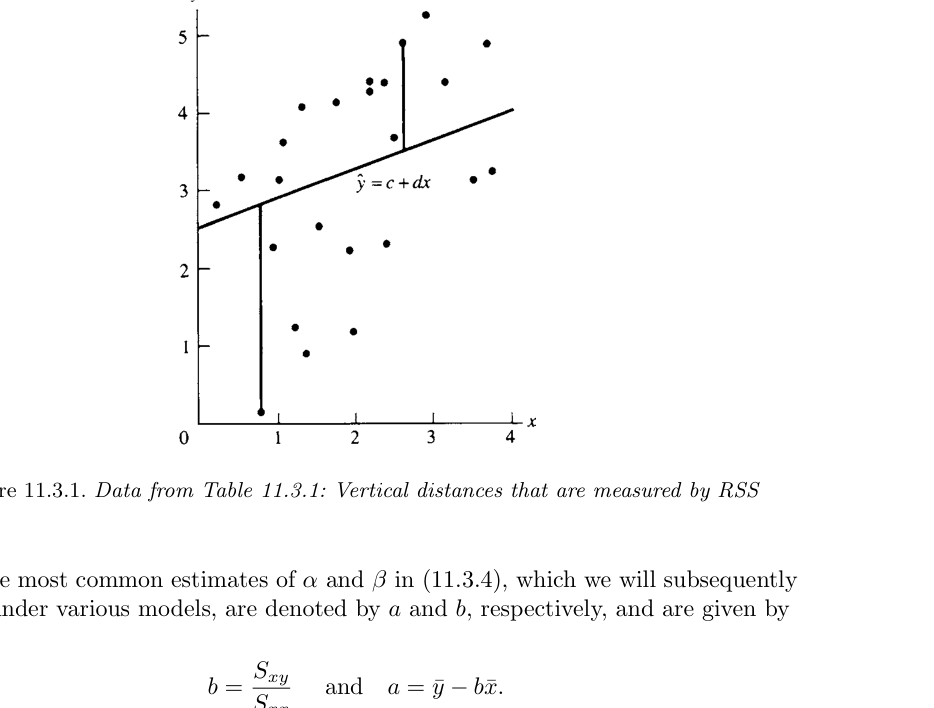
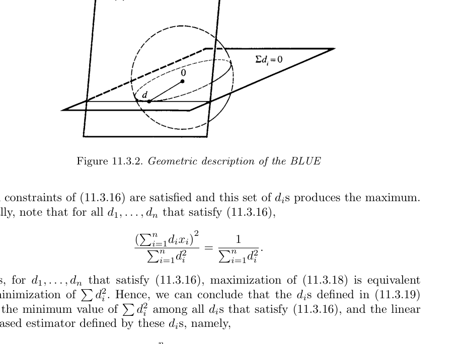
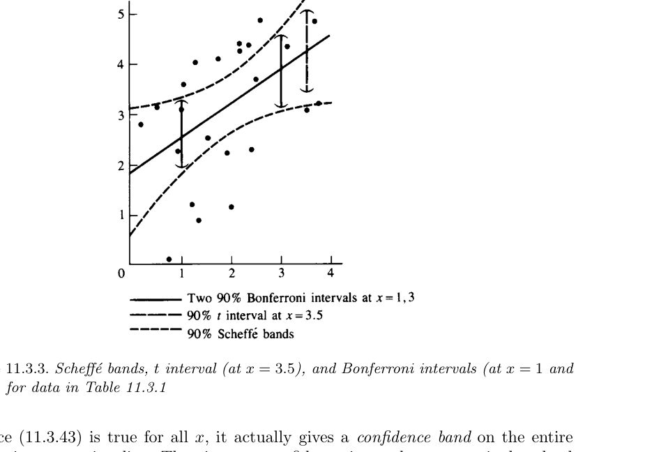

# 분산분석과 회귀 {#chapter11}

> “I’ve wasted time enough,” said Lestrade rising. “I believe in hard work and not in sitting by the fire spinning fine theories.”  
> — Inspector Lestrade, *The Adventure of the Noble Bachelor*

- 지금까지는 보통 하나의 확률변수를 하나의 pdf 또는 pmf로 모형화하고, 그 분포가 갖는 미지 모수를 추정하는 문제를 다루었다.
- 하지만 실제 통계자료에서는 반응변수가 단독으로 존재하지 않는 경우가 많다.
- 반응변수는 알려져 있거나, 통제 가능하거나, 관측 가능한 다른 변수와 함께 나타난다.
- 이 장에서는 그런 상황을 다루는 두 가지 핵심 방법을 공부한다.
  - **분산분석(analysis of variance, ANOVA)**
  - **회귀분석(regression analysis)**

- 두 방법은 모두 선형 구조를 기반으로 한다.
- ANOVA는 이름과 달리 “분산 자체”를 분석하기보다, 여러 집단 평균의 차이를 설명하는 **변동의 분해**에 초점을 둔다.
- 회귀분석은 한 변수의 평균이 다른 변수에 따라 어떻게 변하는지를 모형화한다.

## 도입 {#sec-11-1}

### ANOVA의 핵심 생각

- ANOVA의 기본 아이디어는 전체 변동을 여러 원천으로 나누는 것이다.
- 특히 한 요인(one factor)이 여러 수준 또는 처리(treatment)를 가질 때, 각 처리의 평균이 서로 다른지를 분석한다.
- 이 장에서는 가장 기본적인 **일원분산분석(oneway ANOVA)**을 다룬다.
- 고전적 ANOVA는 주로 다음 귀무가설을 검정하는 데 초점을 두었다.

$$
H_0:\theta_1=\theta_2=\cdots=\theta_k.
$$

- 하지만 실제 실험에서는 “모든 처리 평균이 정확히 같다”는 가설 자체가 별로 흥미롭지 않을 수 있다.
- 더 중요한 질문은 다음과 같다.
  - 어떤 처리가 더 큰 평균을 갖는가?
  - 특정 처리와 대조군의 차이는 얼마나 큰가?
  - 여러 처리 평균 사이의 의미 있는 비교는 무엇인가?
  - 평균 차이에 대한 신뢰구간은 어떻게 구성하는가?

### 회귀분석의 핵심 생각

- 회귀분석은 한 변수의 평균이 다른 변수에 따라 어떻게 변하는지를 설명한다.
- 단순선형회귀에서는 반응변수 $Y$의 평균이 관측 가능한 변수 $x$의 선형함수라고 가정한다.

$$
EY=\alpha+\beta x.
$$

- 이때 $EY$를 $x$의 함수로 나타내는 함수를 **모집단 회귀함수(population regression function)**라고 한다.
- 단순선형회귀의 목표는 다음과 같다.
  - 직선 관계를 자료에 맞춘다.
  - 절편 $\alpha$와 기울기 $\beta$를 추정한다.
  - 기울기가 0인지 검정한다.
  - 특정 $x_0$에서 평균 반응을 추정한다.
  - 새로운 관측값을 예측한다.
  - 회귀직선 전체에 대한 신뢰밴드를 구성한다.

## 일원분산분석 {#sec-11-2}

### 기본 모형

- 일원분산분석에서는 $k$개의 처리 또는 집단이 있다고 하자.
- 처리 $i$에서 $n_i$개의 관측값을 얻는다.
- 관측값을 $Y_{ij}$로 쓴다.

$$
Y_{ij}=\theta_i+\epsilon_{ij},
\qquad
i=1,\ldots,k,\quad j=1,\ldots,n_i.
\tag{11.2.1}
$$

- 여기서
  - $\theta_i$는 처리 $i$의 평균이다.
  - $\epsilon_{ij}$는 오차항이다.
  - $E\epsilon_{ij}=0$이면 $EY_{ij}=\theta_i$이다.

- 따라서 $\theta_i$는 treatment mean, 즉 처리평균이다.
- 각 처리에서 표본 수 $n_i$가 반드시 같을 필요는 없다.

### 예제: 독소와 물고기 간 손상 자료

- 어떤 송어 종에서 세 독소와 대조군이 간 손상에 미치는 영향을 비교하는 실험을 생각한다.
- 관측값은 희생된 물고기의 간 손상 정도이다.

| Toxin 1 | Toxin 2 | Toxin 3 | Control |
|---:|---:|---:|---:|
| 28 | 33 | 18 | 11 |
| 23 | 36 | 21 | 14 |
| 14 | 34 | 20 | 11 |
| 27 | 29 | 22 | 16 |
| 31 | 24 |  |  |
| 34 |  |  |  |

- 이 자료에서 처리 수준은 네 개이다.
- 각 처리의 평균을 비교하면 독소마다 평균 손상 정도가 다른지 평가할 수 있다.
- 하지만 중요한 점은 단순히 “모든 평균이 같은가”가 아니라, 어떤 독소가 얼마나 큰 효과를 갖는지 정량화하는 것이다.

### 과매개화 모형

- 같은 상황을 다음과 같이 쓸 수도 있다.

$$
Y_{ij}=\mu+\tau_i+\epsilon_{ij},
\qquad
i=1,\ldots,k,\quad j=1,\ldots,n_i.
\tag{11.2.2}
$$

- 여기서
  - $\mu$는 전체 평균 수준(grand mean)으로 해석된다.
  - $\tau_i$는 처리 $i$의 효과, 즉 전체 평균으로부터의 편차로 해석된다.

- 이 모형에서는

$$
EY_{ij}=\mu+\tau_i.
$$

- 하지만 이 모형은 제한이 없으면 식별 가능하지 않다.
- 예를 들어 $\mu$에 상수를 더하고 모든 $\tau_i$에서 같은 상수를 빼도 $\mu+\tau_i$는 변하지 않는다.

#### 정의: 식별 가능성

- 분포족 $\{f(x\mid\theta):\theta\in\Theta\}$에서 모수 $\theta$가 **식별 가능(identifiable)**하다는 것은 서로 다른 모수값이 서로 다른 pdf 또는 pmf를 만든다는 뜻이다.
- 즉,

$$
\theta\ne\theta'
\quad\Rightarrow\quad
f(x\mid\theta)\ne f(x\mid\theta')
$$

이어야 한다.

- 식별 가능성은 추정량의 성질이 아니라 모형의 성질이다.
- 모형이 식별 가능하지 않으면 같은 자료분포를 여러 모수값이 설명할 수 있으므로 추론이 어렵다.

### 식별 가능성 문제의 해결

- 과매개화 모형에서는 흔히 다음 제약을 둔다.

$$
\sum_{i=1}^{k}\tau_i=0.
$$

- 이 제약은 자유모수의 수를 $k+1$개에서 $k$개로 줄인다.
- 또한 $\tau_i$를 전체 평균으로부터의 편차로 해석할 수 있게 한다.
- 그러나 이 장에서는 해석이 더 직접적인 cell means model, 즉 식 (11.2.1)을 주로 사용한다.

## 모형 및 분포 가정 {#sec-11-2-1}

### 고전적 일원 ANOVA 가정

- 일원 ANOVA에서 관측값은

$$
Y_{ij}=\theta_i+\epsilon_{ij}
$$

를 따른다고 가정한다.

- 고전적 ANOVA 가정은 다음과 같다.

1. 평균과 분산 조건

$$
E\epsilon_{ij}=0,
\qquad
Var(\epsilon_{ij})=\sigma_i^2<\infty.
$$

- 서로 다른 오차항은 공분산이 0이다.

$$
Cov(\epsilon_{ij},\epsilon_{i'j'})=0
$$

단, 같은 관측값인 경우는 제외한다.

2. 정규 오차

$$
\epsilon_{ij}\ \text{are independent and normally distributed}.
$$

3. 등분산성

$$
\sigma_i^2=\sigma^2
\qquad
\text{for all } i.
$$

- 등분산성은 homoscedasticity라고도 한다.

### 가정의 의미

- 정규성 가정이 없으면 점추정은 가능할 수 있지만, 정확한 t 검정이나 F 검정, 신뢰구간을 만들기 어렵다.
- 표본 수가 충분하고 모집단이 심하게 비대칭이 아니면 중심극한정리에 의존할 수 있다.
- 등분산성은 ANOVA에서 특히 중요하다.
- 정규성 위반보다 등분산성 위반이 더 큰 문제를 만들 수 있다.
- 자료가 ANOVA 가정을 심하게 위반하면 보통 비선형 변환을 먼저 고려한다.
  - 제곱근 변환
  - 로그 변환
  - arcsine 변환
  - Box--Cox 변환

## 고전적 ANOVA 가설 {#sec-11-2-2}

### ANOVA 귀무가설

- 고전적 ANOVA 검정은 다음 가설을 다룬다.

$$
H_0:\theta_1=\theta_2=\cdots=\theta_k
$$

대

$$
H_1:\theta_i\ne\theta_j\ \text{for some } i,j.
\tag{11.2.3}
$$

- $H_1$은 모든 평균이 서로 다르다는 뜻이 아니다.
- 적어도 두 평균이 다르다는 뜻이다.

### 왜 이 가설은 항상 충분하지 않은가?

- 실제 실험자는 대개 모든 처리 평균이 정확히 같다고 믿지 않는다.
- 실험의 목적은 보통 다음과 같다.
  - 처리 효과의 크기를 추정한다.
  - 처리들을 순서화한다.
  - 대조군과 처리군을 비교한다.
  - 특정 조합의 평균 차이를 검토한다.

### 예제: 비료와 시금치의 아연 함량

- 다섯 가지 비료 처리가 시금치의 아연 함량에 미치는 영향을 조사한다고 하자.

| Treatment | Magnesium | Potassium | Zinc |
|---:|---:|---:|---:|
| 1 | 0 | 0 | 0 |
| 2 | 0 | 200 | 0 |
| 3 | 50 | 200 | 0 |
| 4 | 200 | 200 | 0 |
| 5 | 0 | 200 | 15 |

- 이 경우 실험자는 다섯 처리의 효과가 완전히 같다고 생각하지 않는다.
- 관심은 다음과 같은 구체적 비교에 있다.
  - 칼륨 추가 효과
  - 마그네슘 양 증가 효과
  - 아연 추가 효과
  - 대조군과 처리군 평균 차이

## 선형결합과 대비 {#sec-11-2-3}

### 정의: 선형결합과 대비

- $t=(t_1,\ldots,t_k)$가 모수 또는 통계량이고 $a=(a_1,\ldots,a_k)$가 알려진 상수라고 하자.
- 다음 형태를 **선형결합(linear combination)**이라고 한다.

$$
\sum_{i=1}^{k}a_it_i.
\tag{11.2.4}
$$

- 추가로 계수합이 0이면, 즉

$$
\sum_{i=1}^{k}a_i=0
$$

이면 이를 **대비(contrast)**라고 한다.

### 대비의 예

- 처리 1과 처리 2를 비교하려면

$$
a=(1,-1,0,\ldots,0)
$$

를 사용한다.
- 그러면 대비는

$$
\sum_{i=1}^{k}a_i\theta_i=\theta_1-\theta_2.
$$

- 처리 1을 처리 2와 3의 평균과 비교하려면

$$
a=\left(1,-\frac12,-\frac12,0,\ldots,0\right)
$$

를 사용한다.
- 이 대비는

$$
\theta_1-\frac12\theta_2-\frac12\theta_3
$$

이다.

### 정리: ANOVA 귀무가설과 대비

- 임의의 $\theta=(\theta_1,\ldots,\theta_k)$에 대해 다음은 동치이다.

$$
\theta_1=\theta_2=\cdots=\theta_k
$$

$$
\Longleftrightarrow
$$

$$
\sum_{i=1}^{k}a_i\theta_i=0
\quad
\text{for all } a \text{ such that } \sum_{i=1}^{k}a_i=0.
$$

#### 증명 아이디어

- 모든 $\theta_i$가 같은 값 $\theta$라면

$$
\sum_{i=1}^{k}a_i\theta_i
=
\theta\sum_{i=1}^{k}a_i
=
0.
$$

- 반대로 모든 대비가 0이면 다음 대비들을 생각한다.

$$
(1,-1,0,\ldots,0),
\quad
(0,1,-1,0,\ldots,0),
\quad \ldots,
\quad
(0,\ldots,0,1,-1).
$$

- 이 대비들이 모두 0이면

$$
\theta_1=\theta_2,\quad
\theta_2=\theta_3,\quad \ldots,\quad
\theta_{k-1}=\theta_k
$$

이므로 모든 평균이 같다.

## 평균의 선형결합에 대한 추론 {#sec-11-2-4}

### 처리별 표본평균

- ANOVA 가정 아래에서

$$
Y_{ij}\sim N(\theta_i,\sigma^2).
$$

- 처리 $i$의 표본평균은

$$
\bar Y_{i\cdot}
=
\frac1{n_i}\sum_{j=1}^{n_i}Y_{ij}
$$

이고,

$$
\bar Y_{i\cdot}\sim N\left(\theta_i,\frac{\sigma^2}{n_i}\right).
$$

- 점 표기법에서 $\cdot$은 해당 첨자에 대해 합을 취했다는 뜻이다.
- 전체 표본 수는

$$
N=\sum_{i=1}^{k}n_i.
$$

- 전체 평균 또는 grand mean은

$$
\bar{\bar Y}
=
\frac1N
\sum_{i=1}^{k}\sum_{j=1}^{n_i}Y_{ij}
=
\frac1N\sum_{i=1}^{k}n_i\bar Y_{i\cdot}.
$$

### 선형결합의 분포

- 임의의 상수 $a=(a_1,\ldots,a_k)$에 대해

$$
\sum_{i=1}^{k}a_i\bar Y_{i\cdot}
$$

는 정규분포를 따른다.

- 평균은

$$
E\left(\sum_{i=1}^{k}a_i\bar Y_{i\cdot}\right)
=
\sum_{i=1}^{k}a_i\theta_i.
$$

- 분산은

$$
Var\left(\sum_{i=1}^{k}a_i\bar Y_{i\cdot}\right)
=
\sigma^2\sum_{i=1}^{k}\frac{a_i^2}{n_i}.
$$

- 따라서 $\sigma^2$를 알고 있으면 표준정규 통계량을 만들 수 있다.

### pooled variance

- 일반적으로 $\sigma^2$는 알려져 있지 않다.
- 처리 $i$의 표본분산을

$$
S_i^2=
\frac1{n_i-1}
\sum_{j=1}^{n_i}
(Y_{ij}-\bar Y_{i\cdot})^2
$$

라고 하자.

- 모든 처리의 공통분산을 추정하기 위해 pooled estimator를 사용한다.

$$
S_p^2
=
\frac1{N-k}
\sum_{i=1}^{k}(n_i-1)S_i^2
=
\frac1{N-k}
\sum_{i=1}^{k}\sum_{j=1}^{n_i}
(Y_{ij}-\bar Y_{i\cdot})^2.
\tag{11.2.5}
$$

- ANOVA 가정 아래에서

$$
\frac{(N-k)S_p^2}{\sigma^2}
\sim
\chi^2_{N-k}.
$$

- 또한 $S_p^2$는 각 $\bar Y_{i\cdot}$와 독립이다.

### t 통계량

- 따라서 다음 통계량은 Student t 분포를 따른다.

$$
\frac{
\sum_{i=1}^{k}a_i\bar Y_{i\cdot}
-
\sum_{i=1}^{k}a_i\theta_i
}{
\sqrt{S_p^2\sum_{i=1}^{k}a_i^2/n_i}
}
\sim
t_{N-k}.
\tag{11.2.6}
$$

### 단일 선형결합 검정

- 다음 가설을 검정한다고 하자.

$$
H_0:\sum_{i=1}^{k}a_i\theta_i=0
$$

대

$$
H_1:\sum_{i=1}^{k}a_i\theta_i\ne0.
$$

- 유의수준 $\alpha$에서 기각역은

$$
\left|
\frac{
\sum_{i=1}^{k}a_i\bar Y_{i\cdot}
}{
\sqrt{S_p^2\sum_{i=1}^{k}a_i^2/n_i}
}
\right|
>
t_{N-k,\alpha/2}.
\tag{11.2.7}
$$

### 선형결합의 신뢰구간

- 식 (11.2.6)을 피벗으로 사용하면 다음 $100(1-\alpha)\%$ 신뢰구간을 얻는다.

$$
\sum_{i=1}^{k}a_i\bar Y_{i\cdot}
-
t_{N-k,\alpha/2}
\sqrt{S_p^2\sum_{i=1}^{k}\frac{a_i^2}{n_i}}
\le
\sum_{i=1}^{k}a_i\theta_i
$$

$$
\le
\sum_{i=1}^{k}a_i\bar Y_{i\cdot}
+
t_{N-k,\alpha/2}
\sqrt{S_p^2\sum_{i=1}^{k}\frac{a_i^2}{n_i}}.
\tag{11.2.8}
$$

### 예제: ANOVA 대비

- 처리 1과 처리 2를 비교하려면 $a=(1,-1,0,\ldots,0)$이다.
- 검정통계량은

$$
\frac{\bar Y_{1\cdot}-\bar Y_{2\cdot}}
{
\sqrt{S_p^2(1/n_1+1/n_2)}
}
$$

이다.

- 처리 1을 처리 2와 3의 평균과 비교하려면

$$
a=\left(1,-\frac12,-\frac12,0,\ldots,0\right)
$$

이고 검정통계량은

$$
\frac{
\bar Y_{1\cdot}
-\frac12\bar Y_{2\cdot}
-\frac12\bar Y_{3\cdot}
}{
\sqrt{
S_p^2
\left(
\frac1{n_1}
+
\frac1{4n_2}
+
\frac1{4n_3}
\right)
}
}.
$$

- 이런 대비들을 잘 선택하면 처리 평균들의 의미 있는 구조를 파악할 수 있다.
- 단, 여러 대비를 동시에 검토하면 전체 유의수준 관리가 필요하다.

## ANOVA F 검정 {#sec-11-2-5}

### Union--intersection 관점

- ANOVA 귀무가설은 모든 대비가 0이라는 가설과 동치이다.

$$
H_0:
\sum_{i=1}^{k}a_i\theta_i=0
\quad
\text{for all } a \text{ with } \sum a_i=0.
$$

- 대립가설은 어떤 대비 하나 이상이 0이 아니라는 것이다.

$$
H_1:
\sum_{i=1}^{k}a_i\theta_i\ne0
\quad
\text{for some } a.
$$

- 따라서 ANOVA F 검정은 모든 대비에 대한 t 검정을 동시에 고려하는 union--intersection test로 볼 수 있다.

### 대비 t 통계량의 최대화

- 대비 $a$에 대한 통계량을

$$
T_a
=
\left|
\frac{
\sum_{i=1}^{k}a_i\bar Y_{i\cdot}
-
\sum_{i=1}^{k}a_i\theta_i
}{
\sqrt{S_p^2\sum_{i=1}^{k}a_i^2/n_i}
}
\right|
\tag{11.2.9}
$$

라고 하자.

- 모든 대비 중 $T_a^2$를 최대화하면 ANOVA F 통계량이 나온다.

### 정리

- $T_a$가 식 (11.2.9)로 정의될 때

$$
\sup_{\sum a_i=0}T_a^2
=
\frac{
\sum_{i=1}^{k}n_i
\left[
(\bar Y_{i\cdot}-\bar{\bar Y})
-
(\theta_i-\bar\theta)
\right]^2
}{
S_p^2
},
\tag{11.2.12}
$$

여기서

$$
\bar\theta=
\frac1N\sum_{i=1}^{k}n_i\theta_i.
$$

- ANOVA 가정 아래에서

$$
\frac1{k-1}
\sup_{\sum a_i=0}T_a^2
\sim
F_{k-1,N-k}.
\tag{11.2.13}
$$

### ANOVA F 통계량

- 귀무가설 $H_0:\theta_1=\cdots=\theta_k$가 참이면 $\theta_i-\bar\theta=0$이다.
- 따라서 검정통계량은

$$
F
=
\frac{
\sum_{i=1}^{k}n_i(\bar Y_{i\cdot}-\bar{\bar Y})^2/(k-1)
}{
S_p^2
}.
$$

- 유의수준 $\alpha$에서 기각역은

$$
F>F_{k-1,N-k,\alpha}.
$$

- 분자는 처리 간 변동, 분모는 처리 내 변동을 나타낸다.
- 처리 간 변동이 처리 내 변동에 비해 충분히 크면 평균들이 모두 같다는 가설을 기각한다.

## 대비의 동시추정 {#sec-11-2-6}

### Bonferroni 방법

- $m$개의 신뢰구간을 동시에 만들고 전체 신뢰수준을 적어도 $1-\alpha$로 유지하려면 각 개별 구간을 $1-\alpha/m$ 수준으로 만들 수 있다.
- 이는 Bonferroni 부등식에 근거한다.
- ANOVA에서 모든 쌍별 차이는 총

$$
\frac{k(k-1)}2
$$

개이다.

- 모든 쌍별 차이에 대해 동시에 $1-\alpha$ 신뢰수준을 보장하려면 각 t 구간의 유의수준을 조정한다.

### Scheffé 방법

- Scheffé 방법은 모든 대비에 대해 동시에 유효한 신뢰구간을 제공한다.
- $A=\{a=(a_1,\ldots,a_k):\sum a_i=0\}$라고 하자.
- 다음 값을 정의한다.

$$
M=\sqrt{(k-1)F_{k-1,N-k,\alpha}}.
$$

- 그러면 다음 구간들이 모든 대비에 대해 동시에 $1-\alpha$ 신뢰수준을 갖는다.

$$
\sum_{i=1}^{k}a_i\bar Y_{i\cdot}
-
M\sqrt{S_p^2\sum_{i=1}^{k}\frac{a_i^2}{n_i}}
\le
\sum_{i=1}^{k}a_i\theta_i
$$

$$
\le
\sum_{i=1}^{k}a_i\bar Y_{i\cdot}
+
M\sqrt{S_p^2\sum_{i=1}^{k}\frac{a_i^2}{n_i}}.
$$

- Scheffé 방법의 장점:
  - 모든 대비를 동시에 다룰 수 있다.
  - 자료를 본 뒤 관심 대비를 선택해도 정당한 추론이 가능하다.
  - data snooping에 대해 상대적으로 안전하다.

- 단점:
  - 구간이 길다.
  - 단일 대비 t 구간보다 보수적이다.
  - 관심 대비가 적으면 Bonferroni 방법이 더 짧을 수 있다.

### Scheffé 구간이 더 넓은 이유

- 모든 $\nu,\alpha,k$에 대해 다음 부등식이 성립한다.

$$
t_{\nu,\alpha/2}
\le
\sqrt{(k-1)F_{k-1,\nu,\alpha}}.
$$

- 따라서 Scheffé 구간은 단일 대비 t 구간보다 항상 넓다.
- 이는 더 강한 동시추론을 보장하기 위해 지불하는 비용이다.

## 제곱합의 분해 {#sec-11-2-7}

### 정리: ANOVA 제곱합 항등식

- 임의의 수 $y_{ij}$에 대해 다음 항등식이 성립한다.

$$
\sum_{i=1}^{k}\sum_{j=1}^{n_i}
(y_{ij}-\bar{\bar y})^2
=
\sum_{i=1}^{k}n_i(\bar y_{i\cdot}-\bar{\bar y})^2
+
\sum_{i=1}^{k}\sum_{j=1}^{n_i}
(y_{ij}-\bar y_{i\cdot})^2.
\tag{11.2.15}
$$

- 왼쪽은 전체 변동이다.
- 오른쪽 첫 번째 항은 처리 간 변동이다.
- 오른쪽 두 번째 항은 처리 내 변동 또는 오차 변동이다.

### 용어

- Total sum of squares:

$$
SST=
\sum_{i=1}^{k}\sum_{j=1}^{n_i}
(y_{ij}-\bar{\bar y})^2.
$$

- Between-treatment sum of squares:

$$
SSB=
\sum_{i=1}^{k}n_i(\bar y_{i\cdot}-\bar{\bar y})^2.
$$

- Within-treatment sum of squares:

$$
SSW=
\sum_{i=1}^{k}\sum_{j=1}^{n_i}
(y_{ij}-\bar y_{i\cdot})^2.
$$

- 항등식은

$$
SST=SSB+SSW
$$

이다.

### 카이제곱 분해

- ANOVA 가정 아래에서

$$
\frac1{\sigma^2}
\sum_{i=1}^{k}\sum_{j=1}^{n_i}
(Y_{ij}-\bar Y_{i\cdot})^2
\sim
\chi^2_{N-k}.
\tag{11.2.16}
$$

- 귀무가설이 참이면

$$
\frac1{\sigma^2}
\sum_{i=1}^{k}n_i(\bar Y_{i\cdot}-\bar{\bar Y})^2
\sim
\chi^2_{k-1}.
\tag{11.2.17}
$$

- 따라서 F 통계량은 두 독립 카이제곱 확률변수의 비율로 이해된다.

### ANOVA 표

| Source of variation | Degrees of freedom | Sum of squares | Mean square | F statistic |
|---|---:|---:|---:|---:|
| Between treatment groups | $k-1$ | $SSB=\sum n_i(\bar y_i-\bar{\bar y})^2$ | $MSB=SSB/(k-1)$ | $F=MSB/MSW$ |
| Within treatment groups | $N-k$ | $SSW=\sum\sum(y_{ij}-\bar y_{i\cdot})^2$ | $MSW=SSW/(N-k)$ |  |
| Total | $N-1$ | $SST=\sum\sum(y_{ij}-\bar{\bar y})^2$ |  |  |

### 예제: 물고기 독소 자료의 ANOVA 표

| Source of variation | df | Sum of squares | Mean square | F |
|---|---:|---:|---:|---:|
| Treatments | 3 | 995.90 | 331.97 | 26.09 |
| Within | 15 | 190.83 | 12.72 |  |
| Total | 18 | 1186.73 |  |  |

- $F=26.09$는 매우 큰 값이다.
- 따라서 독소들이 서로 다른 효과를 낸다는 강한 증거가 있다.
- 다만 F 검정만으로는 어떤 독소가 어느 독소와 다른지 알려주지 않는다.
- 구체적인 비교는 대비와 동시추론 절차를 통해 수행해야 한다.

## 단순선형회귀 {#sec-11-3}

### 기본 모형

- 단순선형회귀에서는 관측값이 다음 관계를 따른다고 본다.

$$
Y_i=\alpha+\beta x_i+\epsilon_i.
\tag{11.3.1}
$$

- 여기서
  - $Y_i$는 반응변수이다.
  - $x_i$는 설명변수 또는 예측변수이다.
  - $\alpha$는 절편이다.
  - $\beta$는 기울기이다.
  - $\epsilon_i$는 오차항이다.

- $E\epsilon_i=0$이면

$$
EY_i=\alpha+\beta x_i.
\tag{11.3.2}
$$

- 조건부 평균으로 쓰면

$$
E(Y_i\mid x_i)=\alpha+\beta x_i.
\tag{11.3.3}
$$

### 용어 주의

- 전통적으로 $Y$를 dependent variable, $x$를 independent variable이라고 부르기도 한다.
- 하지만 이때 independent는 확률적 독립을 의미하지 않는다.
- 따라서 이 장에서는
  - $Y$: response variable
  - $x$: predictor variable
  라는 표현을 선호한다.

### 선형회귀에서 “선형”의 뜻

- 선형회귀는 모수에 대해 선형이라는 뜻이다.
- 다음은 선형회귀이다.

$$
E(Y_i\mid x_i)=\alpha+\beta x_i^2.
$$

$$
E(\log Y_i\mid x_i)=\alpha+\beta\frac1{x_i}.
$$

- 반면 다음은 모수에 대해 선형이 아니므로 선형회귀가 아니다.

$$
E(Y_i\mid x_i)=\alpha+\beta^2x_i.
$$

### Galton과 회귀의 역사

- regression이라는 말은 Galton의 키 연구에서 유래했다.
- 매우 키 큰 아버지의 아들은 평균적으로 아버지보다 작고, 매우 키 작은 아버지의 아들은 평균적으로 아버지보다 컸다.
- 이를 Galton은 “regression toward the mean”, 즉 평균으로의 회귀라고 불렀다.

### 예제: 포도 수확량 예측

- 포도나무의 berry cluster count를 사용하여 수확량을 예측한다고 하자.
- 자료는 다음과 같다.

| Year | Yield $(Y)$ | Cluster count $(x)$ |
|---:|---:|---:|
| 1971 | 5.6 | 116.37 |
| 1973 | 3.2 | 82.77 |
| 1974 | 4.5 | 110.68 |
| 1975 | 4.2 | 97.50 |
| 1976 | 5.2 | 115.88 |
| 1977 | 2.7 | 80.19 |
| 1978 | 4.8 | 125.24 |
| 1979 | 4.9 | 116.15 |
| 1980 | 4.7 | 117.36 |
| 1981 | 4.1 | 93.31 |
| 1982 | 4.4 | 107.46 |
| 1983 | 5.4 | 122.30 |

- 1972년 자료는 허리케인으로 수확이 파괴되어 빠져 있다.
- 산점도를 그리면 cluster count와 yield 사이에 강한 선형관계가 나타난다.

## 자료 요약량과 최소제곱 {#sec-11-3-1}

### 표본 요약량

- $n$쌍의 자료 $(x_1,y_1),\ldots,(x_n,y_n)$가 있다고 하자.
- 표본평균은

$$
\bar x=\frac1n\sum_{i=1}^{n}x_i,
\qquad
\bar y=\frac1n\sum_{i=1}^{n}y_i.
\tag{11.3.5}
$$

- 제곱합은

$$
S_{xx}=\sum_{i=1}^{n}(x_i-\bar x)^2,
\qquad
S_{yy}=\sum_{i=1}^{n}(y_i-\bar y)^2.
\tag{11.3.6}
$$

- 교차곱합은

$$
S_{xy}=\sum_{i=1}^{n}(x_i-\bar x)(y_i-\bar y).
\tag{11.3.7}
$$

- 회귀직선의 가장 흔한 추정량은

$$
b=\frac{S_{xy}}{S_{xx}},
\qquad
a=\bar y-b\bar x.
\tag{11.3.8}
$$

### 최소제곱 기준

- 임의의 직선 $y=c+dx$에 대해 residual sum of squares를 정의한다.

$$
RSS=\sum_{i=1}^{n}\{y_i-(c+dx_i)\}^2.
$$

- RSS는 각 자료점에서 직선까지의 수직거리 제곱의 합이다.
- 최소제곱추정량은 RSS를 최소화하는 $c,d$이다.

### 최소화 계산

- 고정된 $d$에 대해 RSS는

$$
\sum_{i=1}^{n}\{(y_i-dx_i)-c\}^2
$$

이다.
- 이 식을 $c$에 대해 최소화하면

$$
c=\frac1n\sum_{i=1}^{n}(y_i-dx_i)
=
\bar y-d\bar x.
\tag{11.3.9}
$$

- 이를 RSS에 대입하면

$$
\sum_{i=1}^{n}
\{(y_i-\bar y)-d(x_i-\bar x)\}^2
=
S_{yy}-2dS_{xy}+d^2S_{xx}.
$$

- $d$에 대해 미분하여 0으로 두면

$$
d=\frac{S_{xy}}{S_{xx}}.
\tag{11.3.10}
$$

- 따라서 최소제곱직선은

$$
\hat y=a+bx
$$

이고

$$
b=\frac{S_{xy}}{S_{xx}},
\qquad
a=\bar y-b\bar x.
$$

### 수직거리와 수평거리

- 일반적인 회귀에서는 $x$로 $y$를 예측하므로 수직거리 기준이 자연스럽다.
- 만약 수평거리를 기준으로 하면 다른 직선이 나온다.
- 이는 어떤 변수를 response로 보고 어떤 변수를 predictor로 보는지가 중요하다는 것을 보여준다.

## BLUE: 통계적 해석 {#sec-11-3-2}

### 일반 선형모형 가정

- 이번에는 $x_1,\ldots,x_n$은 알려진 고정값이고, $Y_1,\ldots,Y_n$은 확률변수라고 하자.
- 다음을 가정한다.

$$
EY_i=\alpha+\beta x_i,
\qquad i=1,\ldots,n,
\tag{11.3.11}
$$

$$
Var(Y_i)=\sigma^2.
\tag{11.3.12}
$$

- 동치로

$$
Y_i=\alpha+\beta x_i+\epsilon_i,
\tag{11.3.13}
$$

여기서

$$
E\epsilon_i=0,
\qquad
Var(\epsilon_i)=\sigma^2,
\tag{11.3.14}
$$

이고 오차들은 서로 상관이 없다고 가정한다.

### 선형추정량

- 선형추정량은 다음 형태의 추정량이다.

$$
\sum_{i=1}^{n}d_iY_i,
\tag{11.3.15}
$$

여기서 $d_i$는 알려진 고정상수이다.

### $\beta$의 선형 불편추정량 조건

- $\sum d_iY_i$가 $\beta$의 불편추정량이 되려면 모든 $\alpha,\beta$에 대해

$$
E\left(\sum_{i=1}^{n}d_iY_i\right)=\beta
$$

이어야 한다.

- 계산하면

$$
\sum_{i=1}^{n}d_i=0,
\qquad
\sum_{i=1}^{n}d_ix_i=1.
\tag{11.3.16}
$$

### BLUE의 결과

- 위 조건을 만족하면서 분산을 최소화하는 $d_i$는

$$
d_i=\frac{x_i-\bar x}{S_{xx}}.
\tag{11.3.19}
$$

- 따라서

$$
\hat\beta=b
=
\sum_{i=1}^{n}\frac{x_i-\bar x}{S_{xx}}Y_i
=
\frac{S_{xY}}{S_{xx}}
$$

는 $\beta$의 BLUE이다.

- 분산은

$$
Var(b)=\frac{\sigma^2}{S_{xx}}.
\tag{11.3.20}
$$

### 실험설계 관점

- $S_{xx}$가 클수록 $Var(b)$는 작아진다.
- 만약 $x_i$를 구간 $[e,f]$ 안에서 선택할 수 있고 $n$이 짝수라면, $S_{xx}$를 최대화하려면 절반은 $e$, 절반은 $f$에 둔다.
- 하지만 실제로는 이런 두 점 설계를 잘 사용하지 않는다.
- 이유는 다음과 같다.
  - 이 설계는 기울기 추정에는 효율적이다.
  - 그러나 회귀함수가 실제로 선형인지 확인할 수 없다.
  - 중간 지점의 자료가 없으므로 비선형성을 탐지하기 어렵다.

### Gauss--Markov 정리

- 최소제곱추정량이 BLUE라는 결과는 더 일반적인 선형모형에서도 성립한다.
- 이 일반 결과를 **Gauss--Markov Theorem**이라고 한다.

## 회귀모형과 분포 가정 {#sec-11-3-3}

### 조건부 정규모형

- 가장 흔한 단순선형회귀모형은 조건부 정규모형이다.
- $x_i$는 고정된 알려진 값이고 $Y_i$는 독립 확률변수라고 하자.

$$
Y_i\sim N(\alpha+\beta x_i,\sigma^2),
\qquad i=1,\ldots,n.
\tag{11.3.22}
$$

- 동치로

$$
Y_i=\alpha+\beta x_i+\epsilon_i,
\tag{11.3.23}
$$

여기서

$$
\epsilon_i\stackrel{iid}{\sim}N(0,\sigma^2).
$$

### 결합 pdf

- 독립성 때문에 $Y_1,\ldots,Y_n$의 결합 pdf는 주변 pdf의 곱이다.

$$
f(y\mid \alpha,\beta,\sigma^2)
=
\prod_{i=1}^{n}
\frac1{\sqrt{2\pi}\sigma}
\exp\left[
-\frac{(y_i-(\alpha+\beta x_i))^2}{2\sigma^2}
\right].
$$

- 정리하면

$$
f(y\mid \alpha,\beta,\sigma^2)
=
\frac1{(2\pi)^{n/2}\sigma^n}
\exp\left[
-\frac{\sum_{i=1}^{n}(y_i-\alpha-\beta x_i)^2}{2\sigma^2}
\right].
\tag{11.3.24}
$$

### 이변량 정규모형

- 어떤 상황에서는 $x_i$도 고정값이 아니라 확률변수 $X_i$의 관측값이다.
- 예를 들어 아버지의 키와 아들의 키 자료에서는 연구자가 아버지의 키를 미리 정하지 않는다.
- 이때 $(X_i,Y_i)$가 이변량 정규분포를 따른다고 가정할 수 있다.

$$
(X_i,Y_i)
\sim
\text{bivariate normal}
(\mu_X,\mu_Y,\sigma_X^2,\sigma_Y^2,\rho).
$$

- 이변량 정규분포에서는 조건부분포 $Y\mid X=x$가 정규분포이고, 조건부 평균은 선형이다.

$$
E(Y\mid x)
=
\mu_Y+\rho\frac{\sigma_Y}{\sigma_X}(x-\mu_X).
$$

- 이는

$$
E(Y\mid x)=\alpha+\beta x
$$

형태이며

$$
\beta=\rho\frac{\sigma_Y}{\sigma_X},
\qquad
\alpha=
\mu_Y-\rho\frac{\sigma_Y}{\sigma_X}\mu_X.
\tag{11.3.25}
$$

- 조건부분산은

$$
Var(Y\mid x)=\sigma_Y^2(1-\rho^2).
\tag{11.3.26}
$$

- 실제 단순회귀 추론은 대개 $X=x$에 조건을 건 조건부 정규모형과 동일하게 수행된다.

## 정규오차에서 추정과 검정 {#sec-11-3-4}

### MLE와 최소제곱

- 조건부 정규모형에서 로그가능도는

$$
\log L(\alpha,\beta,\sigma^2\mid x,y)
=
-\frac n2\log(2\pi)
-\frac n2\log\sigma^2
-
\frac{
\sum_{i=1}^{n}(y_i-\alpha-\beta x_i)^2
}{2\sigma^2}.
$$

- 고정된 $\sigma^2$에 대해 로그가능도를 최대화하는 것은 RSS를 최소화하는 것과 같다.
- 따라서 MLE는 최소제곱추정량과 같다.

$$
\hat\beta=b=\frac{S_{xy}}{S_{xx}},
\qquad
\hat\alpha=a=\bar y-\hat\beta\bar x.
$$

- $\sigma^2$의 MLE는

$$
\hat\sigma^2
=
\frac1n
\sum_{i=1}^{n}
(y_i-\hat\alpha-\hat\beta x_i)^2.
$$

- 하지만 이는 불편추정량이 아니다.
- 불편추정량은

$$
S^2
=
\frac1{n-2}
\sum_{i=1}^{n}
(y_i-\hat\alpha-\hat\beta x_i)^2.
\tag{11.3.29}
$$

### 잔차

- 잔차는

$$
\hat\epsilon_i
=
Y_i-\hat\alpha-\hat\beta x_i.
\tag{11.3.27}
$$

- $S^2$는 잔차제곱합을 자유도 $n-2$로 나눈 값이다.
- 자유도 $n-2$가 등장하는 이유는 $\alpha,\beta$ 두 모수를 추정했기 때문이다.

### 정리: 추정량의 분포

- 조건부 정규회귀모형 아래에서

$$
\hat\alpha
\sim
N\left(
\alpha,
\sigma^2\frac{\sum_{i=1}^{n}x_i^2}{nS_{xx}}
\right),
$$

$$
\hat\beta
\sim
N\left(
\beta,
\frac{\sigma^2}{S_{xx}}
\right).
$$

- 공분산은

$$
Cov(\hat\alpha,\hat\beta)
=
-\frac{\sigma^2\bar x}{S_{xx}}.
$$

- 또한 $(\hat\alpha,\hat\beta)$와 $S^2$는 독립이고,

$$
\frac{(n-2)S^2}{\sigma^2}
\sim
\chi^2_{n-2}.
$$

### t 피벗

- 위 결과로부터 다음 두 t 통계량이 나온다.

$$
\frac{
\hat\alpha-\alpha
}{
S\sqrt{\sum_{i=1}^{n}x_i^2/(nS_{xx})}
}
\sim
t_{n-2}.
\tag{11.3.32}
$$

$$
\frac{
\hat\beta-\beta
}{
S/\sqrt{S_{xx}}
}
\sim
t_{n-2}.
\tag{11.3.33}
$$

### 기울기 검정

- 보통 가장 관심 있는 모수는 $\beta$이다.
- $\beta$는 $x$가 한 단위 증가할 때 $E(Y\mid x)$가 얼마나 변하는지를 나타낸다.
- 특히

$$
H_0:\beta=0
\tag{11.3.34}
$$

은 $x$와 $Y$ 사이에 선형관계가 없다는 가설이다.

- 양측 검정은

$$
H_0:\beta=0
\quad\text{vs.}\quad
H_1:\beta\ne0
$$

이고, 기각역은

$$
\left|
\frac{\hat\beta}{S/\sqrt{S_{xx}}}
\right|
>
t_{n-2,\alpha/2}.
$$

- 동치로 F 통계량을 사용할 수 있다.

$$
\frac{\hat\beta^2}{S^2/S_{xx}}
>
F_{1,n-2,\alpha}.
\tag{11.3.35}
$$

### 회귀 ANOVA 표

| Source of variation | Degrees of freedom | Sum of squares | Mean square | F statistic |
|---|---:|---:|---:|---:|
| Regression | 1 | $S_{xy}^2/S_{xx}$ | $MS(Reg)$ | $F=MS(Reg)/MS(Resid)$ |
| Residual | $n-2$ | $RSS=\sum\hat\epsilon_i^2$ | $RSS/(n-2)$ |  |
| Total | $n-1$ | $SST=\sum(y_i-\bar y)^2$ |  |  |

### 예제: 포도 수확량 자료

| Source of variation | df | Sum of squares | Mean square | F |
|---|---:|---:|---:|---:|
| Regression | 1 | 6.66 | 6.66 | 50.23 |
| Residual | 10 | 1.33 | 0.133 |  |
| Total | 11 | 7.99 |  |  |

- 회귀 기울기에 대한 F 통계량이 매우 크므로, cluster count와 yield 사이에는 유의한 선형관계가 있다.

### 회귀 제곱합 분해

- 회귀에서도 ANOVA와 유사한 제곱합 분해가 성립한다.

$$
\sum_{i=1}^{n}(y_i-\bar y)^2
=
\sum_{i=1}^{n}(\hat y_i-\bar y)^2
+
\sum_{i=1}^{n}(y_i-\hat y_i)^2.
\tag{11.3.36}
$$

- 즉,

$$
SST=SSR+RSS.
$$

- 여기서
  - $SST$: 전체 제곱합
  - $SSR$: 회귀 제곱합
  - $RSS$: 잔차 제곱합

- 또한

$$
\sum_{i=1}^{n}(\hat y_i-\bar y)^2
=
\frac{S_{xy}^2}{S_{xx}}.
$$

### 결정계수

- 결정계수 $r^2$는 회귀직선이 전체 변동 중 어느 정도를 설명하는지 나타낸다.

$$
r^2
=
\frac{\text{Regression sum of squares}}
{\text{Total sum of squares}}
=
\frac{\sum_{i=1}^{n}(\hat y_i-\bar y)^2}
{\sum_{i=1}^{n}(y_i-\bar y)^2}
=
\frac{S_{xy}^2}{S_{xx}S_{yy}}.
$$

- $0\le r^2\le1$이다.
- $r^2=1$이면 모든 점이 회귀직선 위에 있다.
- $r^2$가 0에 가까우면 직선이 $Y$의 변동을 거의 설명하지 못한다.

### $\beta$의 신뢰구간과 일반 검정

- $\beta$의 $100(1-\alpha)\%$ 신뢰구간은

$$
\hat\beta
-
t_{n-2,\alpha/2}\frac{S}{\sqrt{S_{xx}}}
<
\beta
<
\hat\beta
+
t_{n-2,\alpha/2}\frac{S}{\sqrt{S_{xx}}}.
\tag{11.3.37}
$$

- 더 일반적으로

$$
H_0:\beta=\beta_0
\quad\text{vs.}\quad
H_1:\beta\ne\beta_0
$$

를 검정할 때 기각역은

$$
\left|
\frac{\hat\beta-\beta_0}{S/\sqrt{S_{xx}}}
\right|
>
t_{n-2,\alpha/2}.
\tag{11.3.38}
$$

## 특정 $x=x_0$에서의 추정과 예측 {#sec-11-3-5}

### 평균 반응의 추정

- 특정 예측변수 값 $x_0$에서 모집단 평균은

$$
E(Y\mid x_0)=\alpha+\beta x_0.
$$

- 자연스러운 추정량은

$$
\hat\alpha+\hat\beta x_0
$$

이다.

- 이 추정량은 불편이며 분산은

$$
Var(\hat\alpha+\hat\beta x_0)
=
\sigma^2
\left[
\frac1n+
\frac{(x_0-\bar x)^2}{S_{xx}}
\right].
$$

- 정규분포는

$$
\hat\alpha+\hat\beta x_0
\sim
N\left(
\alpha+\beta x_0,
\sigma^2
\left[
\frac1n+
\frac{(x_0-\bar x)^2}{S_{xx}}
\right]
\right).
\tag{11.3.39}
$$

### 평균 반응의 신뢰구간

- $100(1-\alpha)\%$ 신뢰구간은

$$
\hat\alpha+\hat\beta x_0
-
t_{n-2,\alpha/2}S
\sqrt{
\frac1n+
\frac{(x_0-\bar x)^2}{S_{xx}}
}
\le
\alpha+\beta x_0
$$

$$
\le
\hat\alpha+\hat\beta x_0
+
t_{n-2,\alpha/2}S
\sqrt{
\frac1n+
\frac{(x_0-\bar x)^2}{S_{xx}}
}.
\tag{11.3.40}
$$

- 구간 길이는 $x_0$가 $\bar x$에 가까울수록 짧다.
- 자료의 중심에서 평균 반응을 가장 정밀하게 추정할 수 있다.
- $x_0$가 관측된 $x$ 범위에서 멀어질수록 구간은 넓어진다.

### 예측구간

#### 정의

- 관측자료 $X$에 기반한 미관측 확률변수 $Y$의 $100(1-\alpha)\%$ 예측구간은 $[L(X),U(X)]$이고 다음을 만족한다.

$$
P_\theta(L(X)\le Y\le U(X))\ge1-\alpha
$$

for all $\theta$.

- 신뢰구간은 모수에 대한 구간이다.
- 예측구간은 아직 관측되지 않은 확률변수에 대한 구간이다.
- 확률변수는 모수보다 더 변동적이므로, 같은 수준의 예측구간은 신뢰구간보다 넓다.

### 새로운 관측값 $Y_0$의 예측

- $x=x_0$에서 새로운 관측값

$$
Y_0\sim N(\alpha+\beta x_0,\sigma^2)
$$

가 이전 자료와 독립이라고 하자.

- 다음 통계량은 t 분포를 따른다.

$$
T=
\frac{
Y_0-(\hat\alpha+\hat\beta x_0)
}{
S\sqrt{
1+\frac1n+\frac{(x_0-\bar x)^2}{S_{xx}}
}
}
\sim
t_{n-2}.
$$

- 따라서 예측구간은

$$
\hat\alpha+\hat\beta x_0
-
t_{n-2,\alpha/2}S
\sqrt{
1+\frac1n+\frac{(x_0-\bar x)^2}{S_{xx}}
}
<
Y_0
$$

$$
<
\hat\alpha+\hat\beta x_0
+
t_{n-2,\alpha/2}S
\sqrt{
1+\frac1n+\frac{(x_0-\bar x)^2}{S_{xx}}
}.
\tag{11.3.41}
$$

- 평균 반응 신뢰구간과 비교하면 예측구간에는 추가적인 $1$이 들어간다.
- 이 $1$은 새 관측값 자체의 오차분산 $\sigma^2$를 반영한다.

## 동시추정과 신뢰밴드 {#sec-11-3-6}

### 여러 $x_0$에서의 동시 신뢰구간

- 여러 점 $x_{01},\ldots,x_{0m}$에서 평균 반응을 동시에 추정하려면 전체 신뢰수준을 관리해야 한다.
- Bonferroni 방법을 사용하면 적어도 $1-\alpha$ 확률로 다음 구간들이 동시에 성립한다.

$$
\hat\alpha+\hat\beta x_{0i}
-
t_{n-2,\alpha/(2m)}S
\sqrt{
\frac1n+
\frac{(x_{0i}-\bar x)^2}{S_{xx}}
}
<
\alpha+\beta x_{0i}
$$

$$
<
\hat\alpha+\hat\beta x_{0i}
+
t_{n-2,\alpha/(2m)}S
\sqrt{
\frac1n+
\frac{(x_{0i}-\bar x)^2}{S_{xx}}
},
\quad i=1,\ldots,m.
\tag{11.3.42}
$$

### Scheffé 신뢰밴드

- 회귀모형은

$$
E(Y\mid x)=\alpha+\beta x
$$

가 모든 $x$에 대해 성립한다고 가정한다.
- 따라서 회귀직선 전체에 대한 동시 신뢰영역을 만들 수 있다.
- 이를 **신뢰밴드(confidence band)**라고 한다.

#### 정리

- 조건부 정규회귀모형 아래에서 적어도 $1-\alpha$ 확률로 다음이 모든 $x$에 대해 동시에 성립한다.

$$
\hat\alpha+\hat\beta x
-
M_\alpha S
\sqrt{
\frac1n+\frac{(x-\bar x)^2}{S_{xx}}
}
<
\alpha+\beta x
$$

$$
<
\hat\alpha+\hat\beta x
+
M_\alpha S
\sqrt{
\frac1n+\frac{(x-\bar x)^2}{S_{xx}}
},
\tag{11.3.43}
$$

여기서

$$
M_\alpha=\sqrt{2F_{2,n-2,\alpha}}.
$$

### 신뢰밴드의 해석

- 단일 신뢰구간은 특정 $x_0$에서 $\alpha+\beta x_0$를 덮는다.
- 신뢰밴드는 전체 회귀직선 $\alpha+\beta x$를 덮는다.
- 따라서 신뢰밴드는 단일 구간보다 넓다.
- 하지만 충분히 많은 $x$점에서 동시에 구간을 만들면 Bonferroni 구간보다 Scheffé 밴드가 더 유리할 수 있다.

### 외삽의 주의

- 신뢰밴드는 모형이 모든 $x$에서 선형이라는 가정에 의존한다.
- 관측된 $x$ 범위 밖에서의 추론은 외삽(extrapolation)이다.
- 관측된 범위 안에서는 선형성이 그럴듯할 수 있지만, 범위 밖에서 선형성이 유지된다는 보장은 없다.
- 따라서 회귀직선, 신뢰구간, 예측구간은 관측된 $x$ 범위 안에서 해석하는 것이 안전하다.
