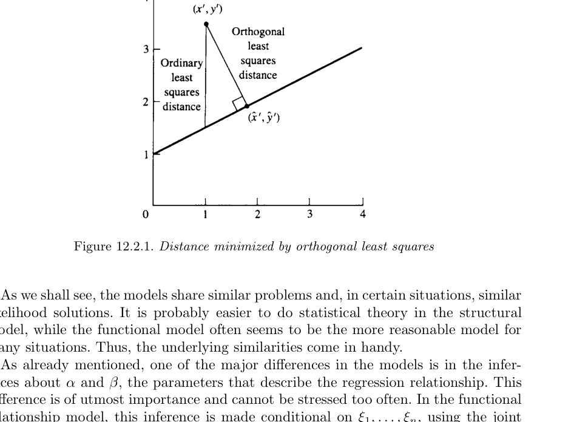
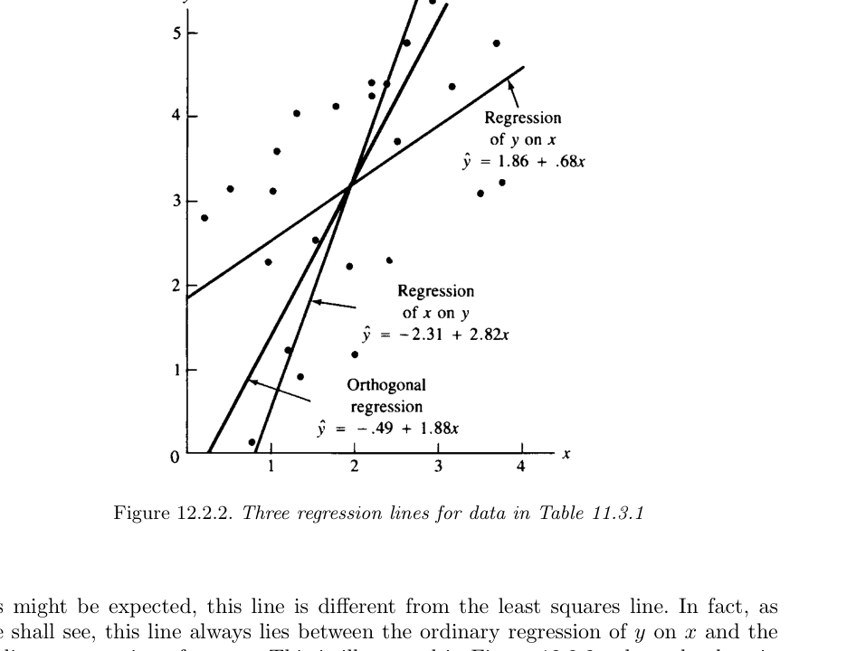
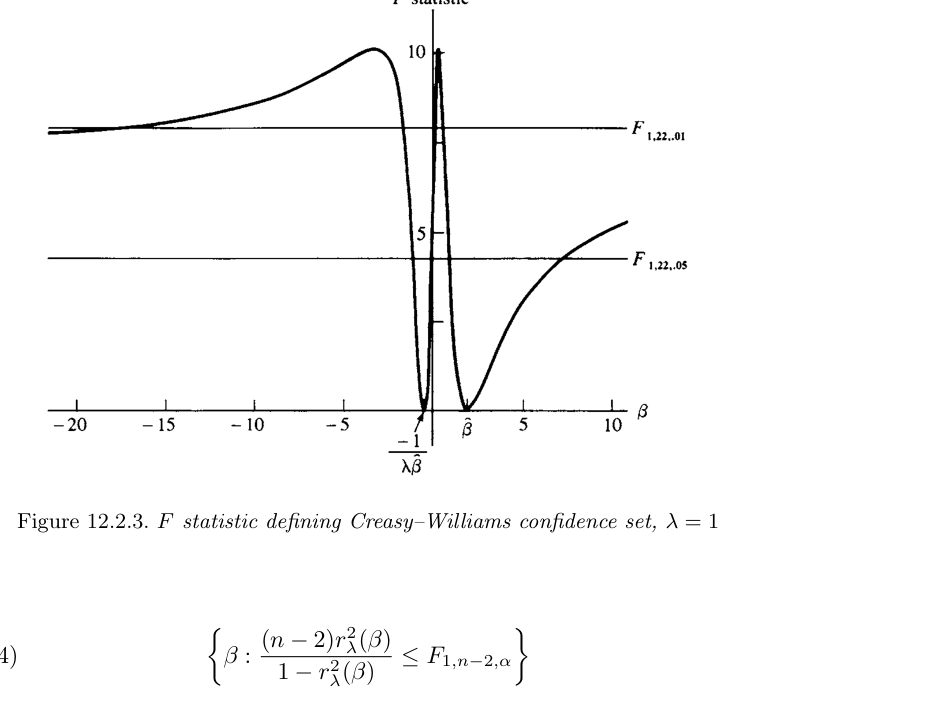
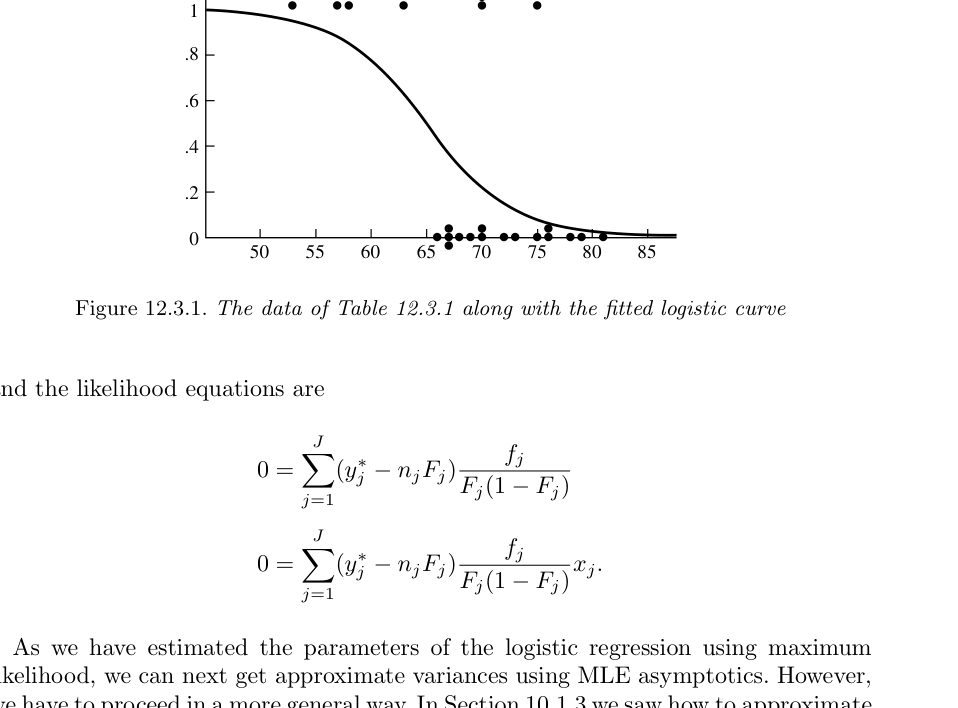
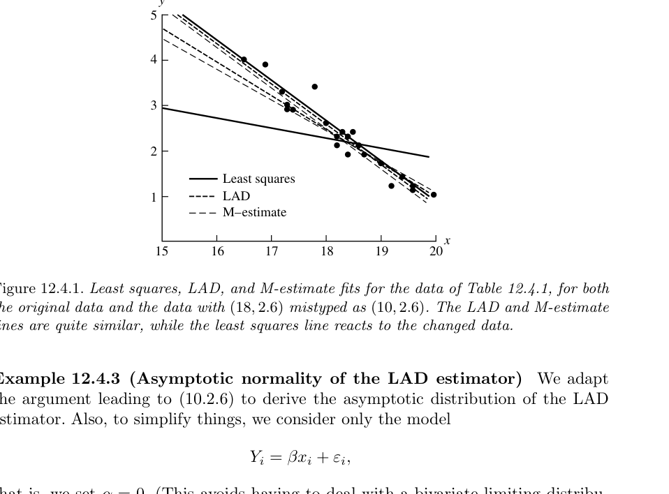

# 회귀모형 {#chapter12}

> “So startling would his results appear to the uninitiated that until they learned the processes by which he had arrived at them they might well consider him as a necromancer.”  
> — Dr. Watson, speaking about Sherlock Holmes, *A Study in Scarlet*

- 11장에서는 고전적 선형모형(classic linear models)을 다루었다.
- 특히 ANOVA와 단순선형회귀는 모두 정규오차를 갖는 선형모형에 기반한다.
- 12장에서는 이 선형모형을 실제 문제에 맞게 확장한다.
- 주요 확장은 세 가지이다.
  - **설명변수에도 오차가 있는 회귀(regression with errors in variables, EIV)**
  - **이항 반응변수를 다루는 로지스틱 회귀(logistic regression)**
  - **이상치와 모형 위반에 덜 민감한 로버스트 회귀(robust regression)**

## 도입 {#sec-12-1}

### 문제의식

- 11장의 단순선형회귀에서는 설명변수 $x_i$가 오차 없이 관측되는 고정값이라고 보았다.
- 하지만 실제 자료에서는 설명변수 자체도 측정오차를 가질 수 있다.
- 예를 들어 온도계, 기압계, 생물학적 측정 장비 등은 모두 측정오차를 포함한다.
- 이런 경우 단순선형회귀와는 전혀 다른 문제가 발생한다.

### 일반화된 선형모형 관점

- 11장의 선형회귀에서는

$$
E(Y_i\mid x_i)=\alpha+\beta x_i
$$

를 가정했다.
- 하지만 반응변수가 Bernoulli처럼 0과 1 사이의 평균만 가질 수 있는 경우, 평균을 직접 선형함수로 두면 문제가 생긴다.
- 예를 들어 $\alpha+\beta x$는 0보다 작거나 1보다 클 수 있지만 Bernoulli 평균은 확률이므로 반드시 $[0,1]$ 안에 있어야 한다.
- 이런 문제를 해결하기 위해 평균 자체가 아니라 평균의 변환, 특히 logit을 선형모형으로 둔다.
- 이것이 로지스틱 회귀의 기본 아이디어이다.

### 로버스트 회귀의 필요성

- 선형모형을 유지하더라도, 최소제곱 기준은 이상치에 매우 민감하다.
- 10장에서 평균 대신 중앙값, M-estimator 등을 고려했던 것처럼, 회귀에서도 최소제곱 대신 절댓값 손실 또는 Huber형 손실을 사용할 수 있다.
- 이 장의 후반부는 회귀에서의 로버스트 추정을 다룬다.

## 설명변수 오차 회귀 {#sec-12-2}

### EIV 모형의 기본 생각

- EIV는 **errors in variables**의 약자이다.
- measurement error model이라고도 한다.
- 일반 단순선형회귀에서는

$$
Y_i=\alpha+\beta x_i+\epsilon_i
\tag{12.2.1}
$$

에서 $x_i$를 오차 없이 알려진 값으로 본다.
- 그러나 EIV에서는 $x_i$ 자체를 직접 관측하지 못하고, 오차가 섞인 $X_i$를 관측한다.
- 일반적으로 관측쌍 $(X_i,Y_i)$의 평균이 다음 선형관계를 만족한다고 본다.

$$
EY_i=\alpha+\beta(EX_i).
\tag{12.2.2}
$$

- 다음과 같이 쓰면

$$
EY_i=\eta_i,
\qquad
EX_i=\xi_i,
$$

평균들 사이의 관계는

$$
\eta_i=\alpha+\beta\xi_i.
\tag{12.2.3}
$$

- $\xi_i$와 $\eta_i$는 직접 측정되지 않는 latent variables로 볼 수 있다.

### 측정오차 모형

- 관측쌍 $(X_i,Y_i)$가 독립이고 다음을 따른다고 하자.

$$
Y_i=\alpha+\beta\xi_i+\epsilon_i,
\qquad
\epsilon_i\sim N(0,\sigma_\epsilon^2),
$$

$$
X_i=\xi_i+\delta_i,
\qquad
\delta_i\sim N(0,\sigma_\delta^2).
\tag{12.2.4}
$$

- 여기서
  - $\xi_i$는 진짜 설명변수 값 또는 latent predictor이다.
  - $X_i$는 $\xi_i$를 오차와 함께 측정한 값이다.
  - $Y_i$도 선형관계 주변에서 오차를 갖는다.
  - $\epsilon_i$와 $\delta_i$는 서로 독립이라고 가정한다.

- 정규성은 흔히 사용되지만 반드시 필요한 것은 아니다.
- 다만 정규성을 가정하면 likelihood 분석이 가능해진다.
- 그러나 EIV 모형에서는 정규성 때문에 오히려 예기치 않은 어려움이 생기기도 한다.

### 예제: 기압 추정

- 1800년대 스코틀랜드 물리학자 J. D. Forbes는 물의 끓는점으로부터 고도를 추정하려 했다.
- 고도는 기압과 관련되어 있으며, 당시 기압계는 깨지기 쉬웠다.
- 따라서 끓는점으로부터 $\log(\text{pressure})$를 추정하는 것이 유용했다.
- 자료는 다음과 같다.

| Boiling point $(^\circ F)$ | $\log(\text{pressure})$ |
|---:|---:|
| 194.5 | 1.3179 |
| 197.9 | 1.3502 |
| 199.4 | 1.3646 |
| 200.9 | 1.3782 |
| 201.4 | 1.3806 |
| 203.6 | 1.4004 |
| 209.5 | 1.4547 |
| 210.7 | 1.4630 |
| 212.2 | 1.4780 |

- 끓는점과 기압 모두 측정오차를 가질 수 있으므로 EIV 모형이 자연스럽다.

## 함수적 관계와 구조적 관계 {#sec-12-2-1}

### 왜 두 관계를 구분하는가?

- EIV 모형에는 두 가지 해석이 있다.
  - **linear functional relationship model**
  - **linear structural relationship model**
- 이름은 혼란스럽지만, 중요한 차이는 $\xi_i$를 어떻게 다루는가이다.
- functional model에서는 $\xi_i$를 고정된 미지 모수로 본다.
- structural model에서는 $\xi_i$ 자체가 어떤 분포에서 나온 확률변수라고 본다.

### 선형 함수적 관계 모형

- 다음 모형을 생각한다.

$$
Y_i=\alpha+\beta\xi_i+\epsilon_i,
\qquad
\epsilon_i\sim N(0,\sigma_\epsilon^2),
$$

$$
X_i=\xi_i+\delta_i,
\qquad
\delta_i\sim N(0,\sigma_\delta^2).
\tag{12.2.5}
$$

- 여기서 $\xi_1,\ldots,\xi_n$은 고정된 미지 모수이다.
- $\epsilon_i$와 $\delta_i$는 독립이다.
- 주요 관심 모수는 $\alpha,\beta$이다.
- 추론은 $\xi_1,\ldots,\xi_n$에 조건을 둔 결합분포를 사용한다.

### 선형 구조적 관계 모형

- structural model에서는 위 모형에 추가로 $\xi_i$가 확률변수라고 가정한다.

$$
Y_i=\alpha+\beta\xi_i+\epsilon_i,
\qquad
\epsilon_i\sim N(0,\sigma_\epsilon^2),
$$

$$
X_i=\xi_i+\delta_i,
\qquad
\delta_i\sim N(0,\sigma_\delta^2),
$$

$$
\xi_i\stackrel{iid}{\sim}N(\xi,\sigma_\xi^2).
\tag{12.2.6}
$$

- $\epsilon_i$, $\delta_i$, $\xi_i$들은 서로 독립이라고 가정한다.
- 이 경우 추론은 $\xi_i$들을 적분하여 제거한 marginal distribution을 사용한다.

### 두 모형의 관계

- functional model은 structural model의 조건부 버전처럼 볼 수 있다.
- functional model에서 일치성을 갖는 추정량은 structural model에서도 보통 일치성을 갖는다.
- 하지만 structural model에서 일치적인 추정량이 functional model에서도 항상 일치적인 것은 아니다.
- structural model에서 모수가 식별 불가능하면 functional model에서도 식별 불가능하다.

## 최소제곱 해법 {#sec-12-2-2}

### 왜 보통 최소제곱이 부적절한가?

- 일반 단순선형회귀에서는 $x_i$가 정확히 관측되므로 수직거리(vertical distance)를 최소화하는 것이 자연스럽다.
- 하지만 EIV에서는 $x_i$에도 오차가 있으므로 수직거리만 고려하면 $x$축 방향의 오차를 무시하게 된다.
- 따라서 EIV에서는 직선까지의 수직거리가 아니라 직선에 수직인 거리, 즉 **직교거리(orthogonal distance)**를 고려하는 것이 자연스럽다.
- 이 방법을 **orthogonal least squares** 또는 **total least squares**라고 한다.

### 직선에 가장 가까운 점

- 한 관측점 $(x',y')$가 있고 직선이

$$
y=a+bx
$$

라고 하자.
- 이 점에서 직선에 내린 수선의 발을 $(\hat x,\hat y)$라고 하면

$$
\hat x=
\frac{by'+x'-ab}{1+b^2},
$$

$$
\hat y=
a+
\frac{b}{1+b^2}(by'+x'-ab).
\tag{12.2.7}
$$

### 직교거리 제곱합

- 관측자료 $(x_i,y_i)$에 대해 직교거리 제곱합은

$$
\sum_{i=1}^{n}
\left[
(x_i-\hat x_i)^2+
(y_i-\hat y_i)^2
\right].
$$

- 계산하면 이는 다음과 같다.

$$
\sum_{i=1}^{n}
\left[
(x_i-\hat x_i)^2+
(y_i-\hat y_i)^2
\right]
=
\frac1{1+b^2}
\sum_{i=1}^{n}
\{y_i-(a+bx_i)\}^2.
\tag{12.2.8}
$$

### 기울기 추정량

- 고정된 $b$에서 $a$를 최소화하면 이전 회귀와 같이

$$
a=\bar y-b\bar x
$$

이다.
- 따라서 $b$는 다음을 최소화한다.

$$
\frac1{1+b^2}
\sum_{i=1}^{n}
\{(y_i-\bar y)-b(x_i-\bar x)\}^2.
\tag{12.2.9}
$$

- 다음 표기법을 사용한다.

$$
S_{xx}=\sum_{i=1}^{n}(x_i-\bar x)^2,
\quad
S_{yy}=\sum_{i=1}^{n}(y_i-\bar y)^2,
$$

$$
S_{xy}=\sum_{i=1}^{n}(x_i-\bar x)(y_i-\bar y).
\tag{12.2.10}
$$

- 직교 최소제곱 직선은

$$
a=\bar y-b\bar x
$$

와

$$
b=
\frac{
-(S_{xx}-S_{yy})
+
\sqrt{(S_{xx}-S_{yy})^2+4S_{xy}^2}
}{
2S_{xy}
}
\tag{12.2.11}
$$

로 주어진다.

### 세 회귀직선 비교

- 직교 최소제곱선은 보통 최소제곱선과 다르다.
- 보통 최소제곱에서 $y$를 $x$에 회귀하면 수직거리를 최소화한다.
- $x$를 $y$에 회귀한 뒤 식을 $y$에 대해 풀면 또 다른 직선이 나온다.
- 직교 최소제곱선은 이 두 직선 사이에 위치한다.

- Table 11.3.1 자료에서는 다음 직선들이 비교된다.
  - $y$ on $x$ 회귀: $\hat y=1.86+0.68x$
  - $x$ on $y$ 회귀를 변환한 직선: $\hat y=-2.31+2.82x$
  - 직교 회귀: $\hat y=-0.49+1.88x$

## 최대가능도추정 {#sec-12-2-3}

### functional model의 likelihood

- 정규 functional relationship model에서

$$
Y_i\sim N(\alpha+\beta\xi_i,\sigma_\epsilon^2),
\qquad
X_i\sim N(\xi_i,\sigma_\delta^2)
$$

이고 서로 독립이라고 하자.
- 관측값을 $(x,y)=((x_1,y_1),\ldots,(x_n,y_n))$라고 하면 likelihood는

$$
L(\alpha,\beta,\xi_1,\ldots,\xi_n,\sigma_\delta^2,\sigma_\epsilon^2\mid x,y)
$$

$$
=
\frac1{(2\pi)^n}
\frac1{(\sigma_\delta^2\sigma_\epsilon^2)^{n/2}}
\exp\left[
-\frac{\sum_{i=1}^{n}(x_i-\xi_i)^2}{2\sigma_\delta^2}
\right]
\exp\left[
-\frac{\sum_{i=1}^{n}(y_i-(\alpha+\beta\xi_i))^2}{2\sigma_\epsilon^2}
\right].
\tag{12.2.12}
$$

### finite maximum이 없는 문제

- 이 likelihood는 finite maximum을 갖지 않는다.
- 예를 들어 $\xi_i=x_i$로 두고 $\sigma_\delta^2\to0$로 보내면 likelihood 값이 무한대로 간다.
- 따라서 제한 없이 MLE를 구할 수 없다.
- 이는 EIV 모형의 중요한 난점이다.

### 분산비를 알고 있다고 가정

- 흔한 해결책은 다음을 가정하는 것이다.

$$
\sigma_\delta^2=\lambda\sigma_\epsilon^2,
\qquad
\lambda>0\ \text{known}.
$$

- 즉, 두 오차분산의 비율은 알고 있다고 본다.
- 이 가정은 비교적 약하면서도 모형을 잘 작동하게 만든다.

### 제한된 likelihood

- 위 가정 아래 likelihood는 다음과 같이 쓸 수 있다.

$$
L(\alpha,\beta,\xi_1,\ldots,\xi_n,\sigma_\delta^2\mid x,y)
=
\frac1{(2\pi)^n}
\frac{\lambda^{n/2}}{(\sigma_\delta^2)^n}
$$

$$
\times
\exp\left[
-\frac{
\sum_{i=1}^{n}
\{(x_i-\xi_i)^2+\lambda(y_i-(\alpha+\beta\xi_i))^2\}
}{2\sigma_\delta^2}
\right].
\tag{12.2.13}
$$

### $\xi_i$에 대한 최대화

- $\alpha,\beta,\sigma_\delta^2$가 고정되었을 때 $\xi_i$를 최대화하려면

$$
\sum_{i=1}^{n}
\{(x_i-\xi_i)^2+\lambda(y_i-(\alpha+\beta\xi_i))^2\}
$$

를 최소화하면 된다.
- 각 $i$에 대해 최소점은

$$
\xi_i^*
=
\frac{x_i+\lambda\beta(y_i-\alpha)}{1+\lambda\beta^2}.
$$

- 대입하면

$$
\sum_{i=1}^{n}
\{(x_i-\xi_i^*)^2+\lambda(y_i-(\alpha+\beta\xi_i^*))^2\}
=
\frac{\lambda}{1+\lambda\beta^2}
\sum_{i=1}^{n}
\{y_i-(\alpha+\beta x_i)\}^2.
$$

### $\alpha,\beta$의 MLE

- 변환을

$$
\alpha^*=\sqrt\lambda\,\alpha,
\qquad
\beta^*=\sqrt\lambda\,\beta,
\qquad
y_i^*=\sqrt\lambda\,y_i
\tag{12.2.15}
$$

라고 두면 직교 최소제곱 문제와 동일한 형태가 된다.
- 따라서

$$
\hat\alpha=\bar y-\hat\beta\bar x
$$

이고

$$
\hat\beta
=
\frac{
-(S_{xx}-\lambda S_{yy})
+
\sqrt{(S_{xx}-\lambda S_{yy})^2+4\lambda S_{xy}^2}
}{
2\lambda S_{xy}
}.
\tag{12.2.16}
$$

- $\lambda=1$이면 직교 최소제곱 해와 같다.
- $\lambda\to0$이면 보통 최소제곱의 $y$ on $x$ 기울기 $S_{xy}/S_{xx}$로 수렴한다.
- $\lambda\to\infty$이면 $x$ on $y$ 회귀를 뒤집은 기울기 $S_{yy}/S_{xy}$로 수렴한다.

### $\sigma_\delta^2$의 MLE

- $\hat\alpha,\hat\beta$를 대입한 뒤 $\sigma_\delta^2$에 대해 최대화하면

$$
\hat\sigma_\delta^2
=
\frac1{2n}
\frac{\lambda}{1+\lambda\hat\beta^2}
\sum_{i=1}^{n}
\{y_i-(\hat\alpha+\hat\beta x_i)\}^2.
\tag{12.2.18}
$$

- $\hat\sigma_\epsilon^2=\hat\sigma_\delta^2/\lambda$이다.
- 주의할 점:
  - $\hat\alpha$와 $\hat\beta$는 일치추정량이다.
  - 하지만 functional model에서 $\hat\sigma_\delta^2$는 일치추정량이 아니며, 극한적으로 $\sigma_\delta^2/2$로 수렴한다.

### structural model의 marginal distribution

- structural model에서 $\xi_i$를 적분하면 $(X_i,Y_i)$는 이변량 정규분포를 따른다.

$$
(X_i,Y_i)
\sim
\text{bivariate normal}
\left(
\xi,\,
\alpha+\beta\xi,\,
\sigma_\delta^2+\sigma_\xi^2,\,
\sigma_\epsilon^2+\beta^2\sigma_\xi^2,\,
\beta\sigma_\xi^2
\right).
\tag{12.2.19}
$$

- likelihood 방정식은 표본평균, 표본분산, 표본공분산을 모집단 대응량과 맞추는 형태로 나온다.

$$
\bar y=\hat\alpha+\hat\beta\hat\xi,
\qquad
\bar x=\hat\xi,
$$

$$
\frac1nS_{yy}=\hat\sigma_\epsilon^2+\hat\beta^2\hat\sigma_\xi^2,
$$

$$
\frac1nS_{xx}=\hat\sigma_\delta^2+\hat\sigma_\xi^2,
$$

$$
\frac1nS_{xy}=\hat\beta\hat\sigma_\xi^2.
\tag{12.2.20}
$$

- 방정식은 5개인데 미지수가 6개이므로 제한이 없으면 식별 가능하지 않다.
- 여기서도

$$
\sigma_\delta^2=\lambda\sigma_\epsilon^2
$$

를 가정하면 모형이 식별 가능해진다.

### structural model의 분산 추정량

- $\sigma_\delta^2=\lambda\sigma_\epsilon^2$ 아래에서 $\hat\alpha,\hat\beta$는 functional model과 같은 식 (12.2.16)을 갖는다.
- 그러나 분산 추정량은 다르다.

$$
\hat\sigma_\delta^2
=
\frac1n\left(
S_{xx}-\frac{S_{xy}}{\hat\beta}
\right),
$$

$$
\hat\sigma_\epsilon^2
=
\frac{\hat\sigma_\delta^2}{\lambda}
=
\frac1n(S_{yy}-\hat\beta S_{xy}),
$$

$$
\hat\sigma_\xi^2
=
\frac1n\frac{S_{xy}}{\hat\beta}.
\tag{12.2.21}
$$

- structural model에서는 이 분산 추정량들이 일치추정량이다.

## 신뢰집합 {#sec-12-2-4}

### 왜 EIV 신뢰구간은 어렵나?

- EIV 모형에서 $\beta$의 신뢰집합 구성은 매우 어렵다.
- 근사 likelihood 방법을 사용하여 유한 길이의 근사구간을 만들 수는 있다.
- 그러나 모든 모수값에서 명목 신뢰수준을 유지하는 유한 길이 구간은 존재하기 어렵다.
- Gleser와 Hwang의 결과에 따르면, 항상 finite length인 slope 구간추정량은 confidence coefficient가 0이 될 수 있다.

### 정보량을 결정하는 모수

- 다음 비율을 생각한다.

$$
\tau^2=\frac{\sigma_\xi^2}{\sigma_\delta^2}.
$$

- $\tau^2$는 자료가 slope $\beta$를 얼마나 잘 결정할 수 있는지를 나타낸다.
- $\tau^2\to0$이면 latent predictor $\xi_i$들의 변동이 거의 없어진다.
- 그러면 사실상 직선을 고유하게 맞출 정보가 사라진다.

### 근사 신뢰구간

- $\hat\beta$의 근사분산 추정량을 $\hat\sigma_\beta^2$라고 하면 CLT와 Slutsky 정리에 의해 다음이 근사 신뢰구간이다.

$$
\hat\beta
-
z_{\alpha/2}\frac{\hat\sigma_\beta}{\sqrt n}
\le
\beta
\le
\hat\beta
+
z_{\alpha/2}\frac{\hat\sigma_\beta}{\sqrt n}.
$$

- Gleser의 수정형은 다음과 같다.

$$
\hat\beta
-
t_{n-2,\alpha/2}
\frac{\hat\sigma_\beta}{\sqrt{n-2}}
\le
\beta
\le
\hat\beta
+
t_{n-2,\alpha/2}
\frac{\hat\sigma_\beta}{\sqrt{n-2}}.
\tag{12.2.22}
$$

- 이는 근사적으로는 좋을 수 있지만 finite length이므로 모든 모수값에서 정확한 coverage를 보장하지 못한다.

### Creasy--Williams 신뢰집합

- 정확한 신뢰집합은 infinite length를 가질 수밖에 없다.
- Creasy--Williams 신뢰집합은 다음 성질에 기반한다.

$$
Cov(\beta\lambda Y_i+X_i,\;Y_i-\beta X_i)=0.
$$

- 표본상관계수 $r_\lambda(\beta)$를 다음처럼 정의한다.

$$
r_\lambda(\beta)
=
\frac{
\beta\lambda S_{yy}
+
(1-\beta^2\lambda)S_{xy}
-
\beta S_{xx}
}{
\sqrt{
(\beta^2\lambda^2S_{yy}+2\beta\lambda S_{xy}+S_{xx})
(S_{yy}-2\beta S_{xy}+\beta^2S_{xx})
}
}.
\tag{12.2.23}
$$

- 그러면

$$
\frac{\sqrt{n-2}\,r_\lambda(\beta)}
{\sqrt{1-r_\lambda^2(\beta)}}
\sim
t_{n-2}.
$$

- 따라서 다음 집합은 $1-\alpha$ 신뢰집합이다.

$$
\left\{
\beta:
\frac{(n-2)r_\lambda^2(\beta)}
{1-r_\lambda^2(\beta)}
\le
F_{1,n-2,\alpha}
\right\}.
\tag{12.2.24}
$$

### Creasy--Williams 집합의 특징

- 이 신뢰집합은 다음 형태 중 하나가 될 수 있다.
  - 두 개의 유한한 서로소 구간
  - 하나의 유한 구간과 두 개의 무한 구간
  - 전체 실수선
- 또한 모든 $\beta$에 대해

$$
-r_\lambda(\beta)
=
r_\lambda\left(-\frac1{\lambda\beta}\right)
$$

이므로, $\beta$가 집합에 있으면 $-1/(\lambda\beta)$도 집합에 있다.
- 따라서 이 집합만으로는 slope의 부호를 확정하지 못한다.
- 이는 EIV에서 slope 추론이 일반 회귀보다 훨씬 어렵다는 것을 보여준다.

## 로지스틱 회귀 {#sec-12-3}

### GLM의 세 구성요소

- 일반화 선형모형(GLM)은 세 요소로 구성된다.

1. **Random component**
   - 반응변수 $Y_1,\ldots,Y_n$이다.
   - 서로 독립이며, 같은 exponential family에 속하는 분포를 가진다.
   - 예: normal, binomial, Poisson 등.

2. **Systematic component**
   - 예측변수의 함수이며 모수에 대해 선형이다.
   - 이 장에서는 주로 $\alpha+\beta x_i$를 사용한다.

3. **Link function**
   - 평균 $\mu_i=EY_i$와 systematic component를 연결한다.

$$
g(\mu_i)=\alpha+\beta x_i.
$$

### 로지스틱 회귀 모형

- 반응변수가 Bernoulli라고 하자.

$$
Y_i\sim Bernoulli(\pi_i),
\qquad
E(Y_i)=\pi_i=P(Y_i=1).
$$

- 로지스틱 회귀에서는 성공확률의 log-odds가 $x_i$의 선형함수라고 가정한다.

$$
\log\left(\frac{\pi_i}{1-\pi_i}\right)
=
\alpha+\beta x_i.
\tag{12.3.1}
$$

- 왼쪽은 logit 또는 log-odds이다.
- Bernoulli 분포의 자연모수가 logit이므로, logistic regression은 canonical link를 사용하는 GLM이다.

### 확률 함수 형태

- 식 (12.3.1)을 풀면

$$
\pi_i=
\frac{e^{\alpha+\beta x_i}}
{1+e^{\alpha+\beta x_i}}.
$$

- 일반적으로

$$
\pi(x)
=
\frac{e^{\alpha+\beta x}}
{1+e^{\alpha+\beta x}}.
\tag{12.3.2}
$$

- 항상

$$
0<\pi(x)<1
$$

이므로 확률모형으로 적절하다.

### 로지스틱 함수의 기울기

- 미분하면

$$
\frac{d\pi(x)}{dx}
=
\beta\pi(x)\{1-\pi(x)\}.
\tag{12.3.3}
$$

- $\pi(x)\{1-\pi(x)\}>0$이므로
  - $\beta>0$이면 $\pi(x)$는 증가한다.
  - $\beta<0$이면 $\pi(x)$는 감소한다.
  - $\beta=0$이면 $\pi(x)$는 상수이다.

- 또한

$$
\pi\left(-\frac{\alpha}{\beta}\right)=\frac12.
$$

### $\alpha$와 $\beta$의 해석

- $x=0$일 때

$$
\alpha=\log\left(\frac{\pi(0)}{1-\pi(0)}\right)
$$

이다.
- 따라서 $\alpha$는 $x=0$에서의 log-odds이다.
- $x$가 한 단위 증가할 때 log-odds 변화량은

$$
\beta.
$$

- 실제 odds ratio는

$$
e^\beta
=
\frac{\pi(x+1)/(1-\pi(x+1))}
{\pi(x)/(1-\pi(x))}.
\tag{12.3.4}
$$

- 따라서 $e^\beta$는 $x$가 한 단위 증가할 때 odds가 몇 배가 되는지를 나타낸다.

$$
\frac{\pi(x+1)}{1-\pi(x+1)}
=
e^\beta
\frac{\pi(x)}{1-\pi(x)}.
\tag{12.3.5}
$$

### 다른 link 함수

- 로지스틱 회귀는 $\pi(x)=F(\alpha+\beta x)$에서 $F$가 logistic cdf인 경우이다.
- $F$가 표준정규 cdf이면 probit regression이다.
- Gumbel cdf를 사용하면 log-log link가 나온다.

## 로지스틱 회귀의 추정 {#sec-12-3-2}

### 왜 최소제곱이 아닌가?

- 선형회귀에서는 $Y_i$가 $\alpha+\beta x_i$와 직접 연결되어 있어서 RSS를 최소화할 수 있었다.
- 로지스틱 회귀에서는

$$
E(Y_i)=\pi_i
$$

이고

$$
\log\left(\frac{\pi_i}{1-\pi_i}\right)=\alpha+\beta x_i
$$

이다.
- 즉 $Y_i$와 $\alpha+\beta x_i$가 직접 선형으로 연결되지 않는다.
- 따라서 표준적인 추정법은 최대가능도추정이다.

### 일반 Bernoulli GLM likelihood

- $Y_i\sim Bernoulli(\pi_i)$이고

$$
\pi(x_i)=F(\alpha+\beta x_i)
$$

라고 하자.
- $F_i=F(\alpha+\beta x_i)$라고 쓰면 likelihood는

$$
L(\alpha,\beta\mid y)
=
\prod_{i=1}^{n}
F_i^{y_i}(1-F_i)^{1-y_i}.
$$

- 로그가능도는

$$
\log L(\alpha,\beta\mid y)
=
\sum_{i=1}^{n}
\left[
\log(1-F_i)
+
y_i\log\left(\frac{F_i}{1-F_i}\right)
\right].
$$

### likelihood equation

- $f(w)=dF(w)/dw$이고 $f_i=f(\alpha+\beta x_i)$라고 하자.
- 그러면

$$
\frac{\partial}{\partial\alpha}
\log L(\alpha,\beta\mid y)
=
\sum_{i=1}^{n}
(y_i-F_i)
\frac{f_i}{F_i(1-F_i)}.
\tag{12.3.7}
$$

- 그리고

$$
\frac{\partial}{\partial\beta}
\log L(\alpha,\beta\mid y)
=
\sum_{i=1}^{n}
(y_i-F_i)
\frac{f_i}{F_i(1-F_i)}
x_i.
\tag{12.3.8}
$$

- logistic regression에서는

$$
\frac{f_i}{F_i(1-F_i)}=1
$$

이므로 방정식이 단순해진다.

### logistic likelihood equation

- logistic model에서는 MLE가 다음 연립방정식의 해이다.

$$
\sum_{i=1}^{n}(y_i-\pi_i)=0,
$$

$$
\sum_{i=1}^{n}(y_i-\pi_i)x_i=0.
$$

- 이 방정식은 $\alpha,\beta$에 대해 비선형이다.
- 따라서 수치적으로 풀어야 한다.
- 보통 Newton--Raphson 또는 iteratively reweighted least squares를 사용한다.

### MLE가 존재하지 않는 경우

- logistic/probit 회귀의 로그가능도는 엄격한 concave 함수이므로, likelihood equation에 해가 있으면 그 해는 유일한 MLE이다.
- 하지만 극단적인 자료에서는 해가 존재하지 않을 수 있다.
- 이때 likelihood의 최대는 $\alpha,\beta$가 무한대로 가는 극한에서 얻어진다.
- 이는 logistic model이 $0<\pi(x)<1$을 가정하기 때문이다.
- 어떤 자료에서는 확률 0 또는 1이 극한적으로 맞아야 likelihood가 최대가 된다.

### 예제: Challenger O-ring 자료

- 우주왕복선 O-ring failure는 온도와 관련된 유명한 자료이다.
- 발사 시 온도와 O-ring failure 여부가 다음과 같이 주어졌다.

| Flight no. | 14 | 9 | 23 | 10 | 1 | 5 | 13 | 15 | 4 | 3 | 8 | 17 |
|---:|---:|---:|---:|---:|---:|---:|---:|---:|---:|---:|---:|---:|
| Failure | 1 | 1 | 1 | 1 | 0 | 0 | 0 | 0 | 0 | 0 | 0 | 0 |
| Temp. | 53 | 57 | 58 | 63 | 66 | 67 | 67 | 67 | 68 | 69 | 70 | 70 |

| Flight no. | 2 | 11 | 6 | 7 | 16 | 21 | 19 | 22 | 12 | 20 | 18 |
|---:|---:|---:|---:|---:|---:|---:|---:|---:|---:|---:|---:|
| Failure | 1 | 1 | 0 | 0 | 0 | 1 | 0 | 0 | 0 | 0 | 0 |
| Temp. | 70 | 70 | 72 | 73 | 75 | 75 | 76 | 76 | 78 | 79 | 81 |

- logistic regression을 적합하면

$$
\hat\alpha=15.043,
\qquad
\hat\beta=-0.232.
$$

- $\hat\beta<0$이므로 온도가 낮을수록 O-ring failure 확률이 커진다.
- Challenger 발사 당시 온도는 $31^\circ F$였고, 이 온도에서 failure 확률의 MLE는 약 0.9996이다.

### 같은 $x$에서 여러 Bernoulli 관측이 있는 경우

- $J$개의 서로 다른 predictor 값 $x_1,\ldots,x_J$가 있다고 하자.
- $x_j$에서 $n_j$번의 Bernoulli 시행이 관측되고, 성공횟수를 $Y_j^*$라고 하자.
- 그러면

$$
Y_j^*\sim Binomial(n_j,\pi(x_j)).
$$

- likelihood는

$$
L(\alpha,\beta\mid y^*)
=
\prod_{j=1}^{J}
F_j^{y_j^*}(1-F_j)^{n_j-y_j^*}.
$$

- likelihood equation은

$$
0=
\sum_{j=1}^{J}
(y_j^*-n_jF_j)
\frac{f_j}{F_j(1-F_j)},
$$

$$
0=
\sum_{j=1}^{J}
(y_j^*-n_jF_j)
\frac{f_j}{F_j(1-F_j)}
x_j.
$$

### 정보행렬

- 두 모수 $\alpha,\beta$에 대해 정보행렬은

$$
I(\theta_1,\theta_2)
=
\begin{pmatrix}
-\dfrac{\partial^2}{\partial\theta_1^2}\log L
&
-\dfrac{\partial^2}{\partial\theta_1\partial\theta_2}\log L
\\[6pt]
-\dfrac{\partial^2}{\partial\theta_1\partial\theta_2}\log L
&
-\dfrac{\partial^2}{\partial\theta_2^2}\log L
\end{pmatrix}.
\tag{12.3.9}
$$

- logistic regression에서는

$$
I(\alpha,\beta)
=
\begin{pmatrix}
\sum_{j=1}^{J}n_jF_j(1-F_j)
&
\sum_{j=1}^{J}x_jn_jF_j(1-F_j)
\\[6pt]
\sum_{j=1}^{J}x_jn_jF_j(1-F_j)
&
\sum_{j=1}^{J}x_j^2n_jF_j(1-F_j)
\end{pmatrix}.
\tag{12.3.10}
$$

- $F_j$에 MLE를 대입한 뒤 정보행렬의 역행렬을 사용하면 $\hat\alpha,\hat\beta$의 근사분산을 얻는다.
- $\hat\beta$의 표준오차는 역정보행렬의 $(2,2)$ 원소의 제곱근이다.

### 예제: Challenger 자료 계속

- Challenger 자료에서 estimated information matrix는

$$
I(\hat\alpha,\hat\beta)
=
\begin{pmatrix}
3.15 & 214.75\\
214.75 & 14728.5
\end{pmatrix}
$$

이고 역행렬은

$$
I(\hat\alpha,\hat\beta)^{-1}
=
\begin{pmatrix}
54.44 & -0.80\\
-0.80 & 0.012
\end{pmatrix}.
$$

- 따라서 $\hat\beta$의 근사 표준오차는

$$
se(\hat\beta)=\sqrt{0.012}.
$$

- 95% 근사 신뢰구간은

$$
\beta
\in
-0.232\pm1.96\sqrt{0.012}
$$

즉,

$$
-0.447\le \beta\le -0.017.
$$

- 이 구간은 $\beta<0$이라는 결론을 지지한다.

### $\beta=0$ 검정

- logistic regression에서도 가장 흔한 가설은

$$
H_0:\beta=0
$$

이다.
- 이는 성공확률이 predictor와 관련이 없다는 뜻이다.
- Wald 검정통계량은

$$
Z=\frac{\hat\beta}{se(\hat\beta)}
$$

이고, 큰 표본에서 표준정규분포로 근사된다.
- 또는 log likelihood ratio test를 사용할 수 있다.

$$
-2\log\lambda(y^*)
=
2\left[
\log L(\hat\alpha,\hat\beta\mid y^*)
-
\log L(\hat\alpha_0,0\mid y^*)
\right].
$$

- 귀무가설 아래에서 이는 근사적으로

$$
\chi^2_1
$$

분포를 따른다.

## 로버스트 회귀 {#sec-12-4}

### 최소제곱과 LAD의 대응

- 하나의 위치모수 $m$을 추정할 때 평균과 중앙값은 다음 최적화 문제로 해석된다.

$$
\text{mean:}\quad
\min_m
\sum_{i=1}^{n}(x_i-m)^2,
$$

$$
\text{median:}\quad
\min_m
\sum_{i=1}^{n}|x_i-m|.
$$

- 회귀에서도 같은 대응이 있다.
- 최소제곱 회귀는

$$
\min_{a,b}
\sum_{i=1}^{n}
[y_i-(a+bx_i)]^2
$$

를 푼다.
- least absolute deviation, LAD 회귀는

$$
\min_{a,b}
\sum_{i=1}^{n}
|y_i-(a+bx_i)|
$$

를 푼다.
- 따라서 least squares는 평균의 회귀판이고, LAD는 중앙값의 회귀판으로 볼 수 있다.

### 예제: 최소제곱 추정량의 로버스트성

- 모형

$$
Y_i=\alpha+\beta x_i+\epsilon_i
$$

에서 $\epsilon_i$들이 서로 상관이 없고

$$
E\epsilon_i=0,
\qquad
Var(\epsilon_i)=\sigma^2
$$

라고 하자.
- 최소제곱 기울기 추정량은 BLUE이며

$$
Var(b)=
\frac{\sigma^2}
{\sum_{i=1}^{n}(x_i-\bar x)^2}.
$$

- 작은 오염을 생각하자.

$$
Var(\epsilon_i)
=
\begin{cases}
\sigma^2, & \text{with probability }1-\delta,\\
\tau^2, & \text{with probability }\delta.
\end{cases}
$$

- 그러면

$$
Var(b)
=
\frac{(1-\delta)\sigma^2+\delta\tau^2}
{\sum_{i=1}^{n}(x_i-\bar x)^2}.
$$

- 작은 오염에서는 성능이 크게 나빠지지 않을 수 있다.
- 하지만 Cauchy와 같은 heavy-tailed 오염이나 catastrophic outlier가 있으면 최소제곱은 심하게 흔들릴 수 있다.

### 예제: catastrophic observation

- McPherson의 potoroo 자료에서 CO2와 O2의 회귀를 생각한다.
- 원자료 23개에서는 다음 두 직선이 매우 비슷하다.

$$
\text{least squares:}\quad y=18.67-0.89x,
$$

$$
\text{LAD:}\quad y=18.59-0.89x.
$$

- 하지만 Animal 15의 O2 값 18이 10으로 잘못 입력되었다고 하자.
- 그러면

$$
\text{least squares:}\quad y=6.41-0.23x,
$$

$$
\text{LAD:}\quad y=15.95-0.75x.
$$

- 최소제곱선은 크게 흔들리지만 LAD는 상대적으로 덜 흔들린다.
- 이는 LAD가 이상치에 더 resistant하다는 것을 보여준다.

### LAD의 점근정규성

- 단순화를 위해 절편이 없는 모형을 생각하자.

$$
Y_i=\beta x_i+\epsilon_i.
$$

- LAD 추정량은 다음을 최소화한다.

$$
\sum_{i=1}^{n}|y_i-\beta x_i|.
\tag{12.4.1}
$$

- M-estimator 관점에서

$$
\rho(u)=|u|,
\qquad
\psi(u)=\rho'(u)
$$

로 볼 수 있다.
- 적절한 조건 아래에서

$$
\sqrt n(\hat\beta_L-\beta)
\Rightarrow
N\left(
0,
\frac1{4f(0)^2\sigma_x^2}
\right),
\tag{12.4.5}
$$

여기서

$$
\sigma_x^2=
\lim_{n\to\infty}\frac1n\sum_{i=1}^{n}x_i^2
$$

이고 $f(0)$은 오차분포의 밀도함수 값이다.

### LAD와 최소제곱의 효율

- 절편 없는 최소제곱 추정량은

$$
\hat\beta
=
\frac{\sum_{i=1}^{n}x_iy_i}
{\sum_{i=1}^{n}x_i^2}
$$

이고

$$
\sqrt n(\hat\beta-\beta)
\Rightarrow
N\left(0,\frac1{\sigma_x^2}\right)
$$

와 같은 형태를 갖는다.
- LAD와 최소제곱의 asymptotic relative efficiency는

$$
ARE(\hat\beta_L,\hat\beta)=4f(0)^2.
$$

- 정규오차에서는 LAD가 최소제곱에 비해 약 64% 효율에 그친다.
- 따라서 LAD는 매우 robust하지만 정규모형이 맞을 때 효율 손실이 크다.

### 회귀 M-estimator

- 평균과 중앙값 사이의 절충으로 Huber형 M-estimator를 만들 수 있다.
- 회귀에서는 다음 $\rho$ 함수를 사용한다.

$$
\rho_i(\alpha,\beta)
=
\begin{cases}
\dfrac12(y_i-\alpha-\beta x_i)^2,
&
|y_i-\alpha-\beta x_i|\le k,\\[6pt]
k|y_i-\alpha-\beta x_i|-\dfrac12k^2,
&
|y_i-\alpha-\beta x_i|>k.
\end{cases}
\tag{12.4.6}
$$

- 작은 잔차에는 제곱손실을 사용한다.
- 큰 잔차에는 절댓값에 가까운 선형손실을 사용한다.
- 따라서 정상적인 자료에서는 최소제곱처럼 효율적이고, 큰 이상치에는 덜 민감하다.

### 예제: 회귀 M-estimator

- potoroo 자료에서 $k=1.5\sigma$를 사용한 M-estimator를 적합하면 다음 결과가 나온다.

$$
\text{original data:}\quad y=18.5-0.89x,
$$

$$
\text{mistyped data:}\quad y=14.67-0.68x.
$$

- M-estimator는 최소제곱보다 훨씬 안정적이고, LAD와 비슷한 방향으로 동작한다.
- 하지만 LAD보다 효율이 좋은 경우가 많다.

### 예제: 회귀 M-estimator의 ARE 시뮬레이션

- 모형은

$$
Y_i=\alpha+\beta x_i+\epsilon_i,
\qquad i=1,\ldots,5
$$

이고

$$
x=(-2,-1,0,1,2),
\qquad
\alpha=0,
\qquad
\beta=1.
$$

- 오차분포를 normal, logistic, double exponential로 바꿔가며 least squares, LAD, M-estimator의 분산을 비교한다.
- $k=1.5$인 M-estimator의 ARE는 다음과 같다.

| Comparison | Normal | Logistic | Double exponential |
|---|---:|---:|---:|
| vs. least squares | 0.98 | 1.03 | 1.07 |
| vs. LAD | 1.39 | 1.27 | 1.14 |

- M-estimator는 세 분포 모두에서 least squares와 비슷한 성능을 보인다.
- 동시에 LAD보다 일관되게 더 좋은 효율을 보인다.
- 즉 M-estimator는 robustness와 efficiency 사이의 좋은 절충안이다.
