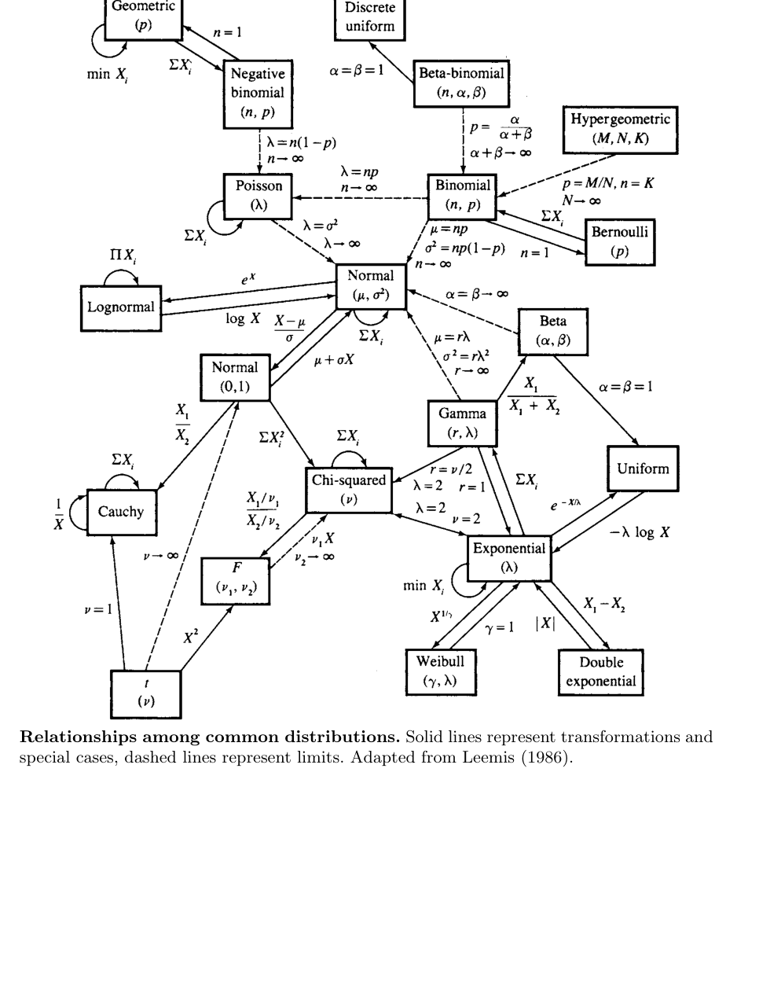

# Appendix {#appendix-computer-algebra}

- 이 부록은 두 부분으로 구성된다.
  - **Computer Algebra**: Mathematica 같은 컴퓨터 대수 시스템을 이용해 통계 계산을 보조하는 방법
  - **Table of Common Distributions**: 본문에서 자주 사용한 확률분포들의 pmf/pdf, 평균, 분산, mgf, 관계 요약

- 컴퓨터 대수 시스템은 통계학을 이해하는 데 반드시 필요한 도구는 아니다.
- 그러나 반복적이고 지루한 계산, 복잡한 미분·적분, 합, 시뮬레이션, 변수변환 계산을 빠르게 확인하는 데 매우 유용하다.
- 특히 다음 상황에서 도움이 된다.
  - 복잡한 비율의 2차 미분 계산
  - 변수변환의 야코비안 계산
  - 다중적분 계산
  - mgf의 도함수 계산
  - 극한분포 확인
  - closed form이 있는지 탐색
  - 계산 결과를 수치적으로 검산

- 이 부록의 예시는 Mathematica를 기준으로 되어 있다.
- Maple 등 다른 컴퓨터 대수 시스템으로도 비슷한 계산을 할 수 있다.
- 목적은 특정 소프트웨어 문법을 완전히 가르치는 것이 아니라, 통계 계산에서 컴퓨터 대수 시스템을 어떻게 활용할 수 있는지 보여주는 것이다.

## A.1: 무순서 표본추출 계산 {#sec-a1}

### 예제: 복원추출에서 무순서 결과 열거

- Chapter 1의 Example 1.2.20에서는 집합

$$
\{2,4,9,12\}
$$

에서 복원추출할 때 가능한 무순서 결과를 열거한다.
- 표본의 순서를 고려하지 않으면 각 표본은 네 숫자가 각각 몇 번 나왔는지로 표현된다.
- 예를 들어 크기 $n$의 표본에서 네 원소의 등장 횟수를

$$
(w_1,w_2,w_3,w_4)
$$

라고 쓰면

$$
w_1+w_2+w_3+w_4=n
$$

을 만족해야 한다.

### 조합 수

- $m$개의 범주에서 $n$개를 복원추출하고 순서를 무시하면 가능한 구성 수는

$$
\binom{n+m-1}{n}
$$

이다.
- 여기서는 $n=4$, $m=4$이므로

$$
\binom{7}{4}=35
$$

개의 무순서 결과가 있다.

### Mathematica 코드의 구조

- 먼저 Combinatorica 패키지를 불러온다.

```mathematica
Needs["DiscreteMath`Combinatorica`"]
```

- 관측 가능한 값들의 집합을 정의한다.

```mathematica
x = {2, 4, 9, 12};
n = Length[x];
ncomp = NumberOfCompositions[n, n]
```

- 출력값은

```mathematica
35
```

이다.

### 표본 구성, 평균, 가중치

- 가능한 구성을 모두 열거한다.

```mathematica
w = Compositions[n, n];
```

- 각 구성의 multinomial weight는

$$
\frac{n!}{w_1!w_2!\cdots w_m!}\frac{1}{m^n}
$$

이다.

- 코드로는 다음과 같다.

```mathematica
wt = n!/(Apply[Times, Factorial /@ w, 1]*n^n);
avg = w . x/n;
Sort[Transpose[{avg, wt}]]
```

### 결과 해석

- 출력은 각 표본평균 값과 그 확률가중치를 정렬하여 보여준다.
- 예를 들어 평균이 같은 서로 다른 구성이 있을 수 있다.
- 부록의 설명처럼 평균값 8을 갖는 결과가 두 개 있으며, 히스토그램을 만들려면 이 두 가중치를 합쳐야 한다.

$$
\left\{8,\frac{3}{128}\right\},
\qquad
\left\{8,\frac{3}{64}\right\}
$$

- 따라서 평균 8의 전체 가중치는

$$
\frac{3}{128}+\frac{3}{64}
=
\frac{9}{128}.
$$

### 학습 포인트

- 순서 있는 표본공간은 $4^4=256$개이다.
- 무순서 구성은 35개뿐이지만 각 구성의 확률은 동일하지 않다.
- 무순서 표본을 사용할 때는 multinomial coefficient가 반드시 필요하다.
- 컴퓨터 대수 시스템은 가능한 구성을 빠짐없이 열거하고 확률가중치를 자동 계산하는 데 유용하다.

## A.2: 일변량 변수변환 {#sec-a2}

### 예제: 변수변환 계산

- Exercise 2.1(a)는 표준적인 일변량 변수변환 문제이다.
- 밀도함수가

$$
f(x)=42x^5(1-x)
$$

이고 변환이

$$
Y=X^3
$$

라고 하자.

### 역변환

- $y=x^3$을 $x$에 대해 풀면

$$
x=y^{1/3}
$$

이다.
- Mathematica에서는 다음처럼 계산한다.

```mathematica
f[x_] := 42*(x^5)*(1 - x)
sol = Solve[y == x^3, x]
```

- 복소근까지 모두 출력될 수 있지만, 확률변수 $X$가 $0<x<1$에 있으면 실제로 사용할 근은

$$
x=y^{1/3}
$$

이다.

### 야코비안

- 일변량 변수변환에서 필요한 항은

$$
\left|\frac{dx}{dy}\right|
$$

이다.
- 여기서는

$$
\frac{dx}{dy}
=
\frac{1}{3y^{2/3}}.
$$

- Mathematica 계산은 다음과 같다.

```mathematica
D[x /. sol[[1]], y]
```

### 변환된 밀도

- 변수변환 공식은

$$
f_Y(y)=f_X(x(y))
\left|\frac{dx}{dy}\right|.
$$

- 따라서

$$
f_Y(y)
=
42(y^{1/3})^5(1-y^{1/3})
\frac{1}{3y^{2/3}}
$$

이다.

- 정리하면

$$
f_Y(y)
=
14y(1-y^{1/3}),
\qquad 0<y<1.
$$

- Mathematica 출력도

```mathematica
14(1 - y^(1/3))y
```

와 같은 형태가 된다.

### 학습 포인트

- 컴퓨터 대수 시스템은 역변환과 도함수 계산을 빠르게 해준다.
- 그러나 어떤 근이 실제 확률변수의 지지집합에 해당하는지는 사람이 판단해야 한다.
- 복소근이나 지지집합 밖의 해를 그대로 사용하면 잘못된 밀도를 얻을 수 있다.

## A.3: 이변량 변수변환 {#sec-a3}

### 예제: 정규변수의 합과 베타변수의 곱

- 이 예제는 이변량 변수변환을 Mathematica로 계산하는 방법을 보여준다.
- 핵심 단계는 다음과 같다.
  - 원래 결합밀도 정의
  - 변환식 설정
  - 역변환 계산
  - 야코비안 행렬식 계산
  - 주변화 적분

### 정규변수의 합과 차

- $X,Y$가 서로 독립인 표준정규라고 하자.

$$
f(x,y)=\frac{1}{2\pi}e^{-x^2/2}e^{-y^2/2}.
$$

- 변환은

$$
U=X+Y,
\qquad
V=X-Y.
$$

- Mathematica 코드는 다음 구조이다.

```mathematica
f[x_, y_] := (1/(2*Pi))*E^(-x^2/2)*E^(-y^2/2)
So := Solve[{u == x + y, v == x - y}, {x, y}]
g := f[x /. So, y /. So]*
     Abs[Det[Outer[D, First[{x, y} /. So], {u, v}]]]
Simplify[g]
```

### 결합밀도 결과

- 역변환은

$$
x=\frac{u+v}{2},
\qquad
y=\frac{u-v}{2}.
$$

- 야코비안의 절댓값은

$$
\left|J\right|=\frac12.
$$

- 결과 결합밀도는

$$
g(u,v)
=
\frac{1}{4\pi}
\exp\left(-\frac{u^2}{4}-\frac{v^2}{4}\right).
$$

- 이는 다음 곱으로 분해된다.

$$
g(u,v)
=
\left[
\frac{1}{\sqrt{4\pi}}e^{-u^2/4}
\right]
\left[
\frac{1}{\sqrt{4\pi}}e^{-v^2/4}
\right].
$$

- 따라서

$$
U\sim N(0,2),
\qquad
V\sim N(0,2),
$$

이고 $U,V$는 독립이다.

### 주변밀도 계산 주의

- 부록의 코드는 $v$를 $0$부터 $\infty$까지 적분하는 형태를 보여준다.
- 전체 주변밀도를 얻으려면 보통 $v$의 전체 지지집합을 확인해야 한다.
- 이처럼 컴퓨터 대수 결과는 항상 지지집합과 함께 해석해야 한다.

### 베타변수의 곱

- 다음 두 확률변수가 독립이라고 하자.

$$
X\sim Beta(a,b),
\qquad
Y\sim Beta(a+b,c).
$$

- 변환은

$$
U=XY,
\qquad
V=X.
$$

- 역변환은

$$
x=v,
\qquad
y=\frac{u}{v}.
$$

- 야코비안 절댓값은

$$
\left|J\right|=\frac1{|v|}.
$$

- Mathematica는 beta density를 불러와 결합밀도를 만든 뒤, 변환공식과 적분을 적용한다.

```mathematica
Needs["Statistics`ContinuousDistributions`"]
Clear[f, g, u, v, x, y, a, b, c]

f[x_, y_] := PDF[BetaDistribution[a, b], x]*
             PDF[BetaDistribution[a + b, c], y]

So := Solve[{u == x*y, v == x}, {x, y}]
g[u_, v_] = f[x /. So, y /. So]*
            Abs[Det[Outer[D, First[{x, y} /. So], {u, v}]]]

Integrate[g[u, v], {v, 0, 1}]
```

### 결과의 의미

- 이 계산은 Chapter 4의 결과, 즉 특정 독립 베타변수의 곱이 다시 베타분포와 연결되는 성질을 확인한다.
- 단, Mathematica는 조건문 `If(...)` 형태로 매우 복잡한 출력을 줄 수 있다.
- 중요한 것은 적분 조건이 만족되는 범위에서 결과가 beta density로 정리된다는 점이다.
- 이 예는 컴퓨터 대수가 계산을 대신해 주더라도, 최종 결과의 통계적 의미와 조건은 사용자가 해석해야 함을 보여준다.

## A.4: 정규확률 계산 {#sec-a4}

### 예제: 원 안의 표준정규확률

- Exercise 4.14(a)의 계산은 다음 확률을 구하는 문제로 볼 수 있다.
- $X,Y$가 독립 표준정규일 때

$$
P(X^2+Y^2\le1)
$$

을 계산한다.

### 직접 이중적분

- 결합밀도는

$$
f(x,y)=\frac1{2\pi}
\exp\left(-\frac{x^2}{2}-\frac{y^2}{2}\right).
$$

- 원 $x^2+y^2\le1$ 안에서 적분하면 된다.
- $x$를 $-1$부터 $1$까지 두면

$$
-\sqrt{1-x^2}\le y\le \sqrt{1-x^2}.
$$

- Mathematica 코드는 다음과 같다.

```mathematica
Needs["Statistics`ContinuousDistributions`"]
Clear[f, g, x, y]

f[x_, y_] = PDF[NormalDistribution[0, 1], x]*
            PDF[NormalDistribution[0, 1], y]

g[x_] = Sqrt[1 - x^2]

Integrate[f[x, y], {x, -1, 1}, {y, -g[x], g[x]}]
N[%]
```

### Erf 함수

- 직접 적분하면 Mathematica는 closed form 대신 erf 함수를 포함한 표현을 줄 수 있다.
- erf 함수는 다음과 같이 정의된다.

$$
\operatorname{erf}(z)
=
\frac{2}{\sqrt\pi}
\int_0^z e^{-t^2}\,dt.
$$

- 수치값은

$$
0.393469
$$

이다.

### 카이제곱분포를 이용한 계산

- 더 간단한 방법은

$$
X^2+Y^2\sim\chi^2_2
$$

임을 이용하는 것이다.
- 따라서

$$
P(X^2+Y^2\le1)
=
P(\chi^2_2\le1).
$$

- $\chi^2_2$는 평균 2인 지수분포와 같으므로

$$
P(\chi^2_2\le1)
=
1-e^{-1/2}.
$$

- 부록의 출력은

$$
\frac12(2-2/\sqrt e)
=
1-e^{-1/2}
$$

이다.

### 학습 포인트

- 직접 적분은 가능하지만 복잡한 특수함수를 낳을 수 있다.
- 분포의 구조를 이용하면 더 단순한 해석과 closed form을 얻을 수 있다.
- 컴퓨터 대수 시스템은 답을 주지만, 통계적 지식은 더 좋은 계산 경로를 선택하게 해준다.

## A.5: 합의 밀도와 mgf 계산 {#sec-a5}

### 예제: 독립확률변수 합의 밀도

- 두 독립 확률변수의 합 $Z=X+Y$의 밀도는 convolution으로 계산한다.

$$
f_Z(z)
=
\int_{-\infty}^{\infty}
f_X(y)f_Y(z-y)\,dy.
$$

- 부록은 세 경우를 보여준다.
  - normal + normal
  - Cauchy + Cauchy
  - Student's $t$ + Student's $t$

### 정규분포의 합

- 표준정규밀도를

$$
f(x)=\frac1{\sqrt{2\pi}}e^{-x^2/2}
$$

라고 하면

$$
f_Z(z)
=
\int_{-\infty}^{\infty}
f(y)f(z-y)\,dy.
$$

- 결과는

$$
Z\sim N(0,2)
$$

이므로

$$
f_Z(z)
=
\frac1{\sqrt{4\pi}}e^{-z^2/4}.
$$

- Mathematica 출력은 조건부 형태로 나올 수 있다.
- 이는 복소수 영역까지 고려하기 때문에 `Re[z]` 같은 조건이 나타나는 것이다.

### 코시분포의 합

- 표준 코시밀도는

$$
f(x)=\frac1{\pi(1+x^2)}.
$$

- convolution 결과가

$$
\frac{2}{\pi(4+z^2)}
$$

형태로 나온다.
- 이는 location 0, scale 2인 Cauchy 밀도이다.

$$
Z\sim Cauchy(0,2).
$$

- Mathematica 출력에는 복소수 단위 $I$가 포함될 수 있다.

$$
\frac{2}{\pi(-2I+z)(2I+z)}
=
\frac{2}{\pi(4+z^2)}.
$$

- 복소수 표현을 실수형 밀도로 정리하려면 $I^2=-1$을 사용한다.

### Student's $t$ 합

- 자유도 5인 두 Student's $t$ 확률변수의 합 밀도를 계산하면 closed form이 나타난다.

$$
\frac{400\sqrt5(8400+120z^2+z^4)}
{3\pi(20+z^2)^5}.
$$

- 부록에서는 경험적으로 자유도 합이 짝수이면 closed form이 존재하는 경우가 있고, 그렇지 않으면 수치적분이 필요할 수 있다고 설명한다.
- 이는 컴퓨터 대수 시스템이 이론적 패턴을 발견하는 탐색 도구가 될 수 있음을 보여준다.

### 예제: 12개 균등분포 합의 네 번째 모멘트

- Exercise 5.51은 12개 독립 uniform$(0,1)$ 확률변수 합의 중심화된 네 번째 모멘트를 구하는 문제이다.
- 직접 밀도를 구하면 piecewise 형태가 복잡하다.
- mgf를 사용하면 훨씬 단순하다.

### uniform$(0,1)$의 mgf

- $X\sim Uniform(0,1)$이면

$$
M_X(t)
=
E(e^{tX})
=
\int_0^1 e^{tx}\,dx
=
\frac{e^t-1}{t}.
$$

- 독립합

$$
S=\sum_{i=1}^{12}X_i
$$

의 mgf는

$$
M_S(t)
=
\left(\frac{e^t-1}{t}\right)^{12}.
$$

### 중심화된 합의 네 번째 모멘트

- $S-6$의 mgf는

$$
M_{S-6}(t)
=
e^{-6t}
\left(\frac{e^t-1}{t}\right)^{12}.
$$

- 네 번째 모멘트는 네 번째 도함수의 $t=0$ 값이다.

$$
E[(S-6)^4]
=
M_{S-6}^{(4)}(0).
$$

- 단순히 $t=0$을 대입하면 $0/0$ 형태가 나오므로 limit을 사용해야 한다.

```mathematica
g[t_] = D[Exp[-6*t]*Msum[t], {t, 4}];
Limit[g[t], t -> 0]
```

- 결과는

$$
E[(S-6)^4]=\frac{29}{10}.
$$

## A.6: 감마 평균 추정의 ARE {#sec-a6}

### 예제: 감마 평균에 대한 ARE 계산

- Chapter 10의 Example 10.1.18에서 MLE와 적률추정량의 asymptotic relative efficiency를 비교했다.
- 이 부록은 그 계산을 Mathematica로 수행하는 방법을 보여준다.

### 감마분포 설정

- 평균을 $m$, scale을 $b$로 두면 감마분포의 shape은

$$
\frac{m}{b}
$$

이다.
- 밀도는

$$
f(x\mid m,b)
=
\text{GammaDistribution}\left(\frac{m}{b},b\right)
$$

로 설정한다.

```mathematica
Needs["Statistics`ContinuousDistributions`"]
Clear[m, b, x]

f[x_, m_, b_] = PDF[GammaDistribution[m/b, b], x];
loglike2[m_, b_, x_] = D[Log[f[x, m, b]], {m, 2}];
```

### 정보량과 점근분산

- Fisher information은 보통

$$
I(m)
=
-E\left[
\frac{\partial^2}{\partial m^2}
\log f(X\mid m,b)
\right]
$$

이다.
- 따라서 MLE의 점근분산은

$$
\frac1{I(m)}
$$

이다.
- Mathematica 코드:

```mathematica
var[m_, b_] := 1/(-Integrate[loglike2[m, b, x]*f[x, m, b],
{x, 0, Infinity}])
```

### ARE 계산

- 여러 평균값에 대해 MLE 분산과 적률추정량 분산을 비교한다.

```mathematica
mu = {1, 2, 3, 4, 6, 8, 10};
beta = 5;
mlevar = Table[var[mu[[i]], beta], {i, 1, 7}];
momvar = Table[mu[[i]]*beta, {i, 1, 7}];
ARE = momvar/mlevar
```

- 출력 예시는 다음과 같다.

$$
\{5.25348,\;2.91014,\;2.18173,\;1.83958,\;1.52085,\;1.37349,\;1.28987\}.
$$

- 이는 평균이 커질수록 ARE가 1에 가까워지는 경향을 보여준다.
- 컴퓨터 대수 시스템은 복잡한 second derivative와 적분을 자동화하여 이론 계산과 그래프 작성을 도와준다.

## A.7: 카이제곱 mgf의 극한 {#sec-a7}

### 예제: 카이제곱분포의 표준화 극한

- Exercise 9.30(b)는 카이제곱분포의 표준화 극한분포를 mgf로 확인하는 문제이다.
- 먼저 $X_n\sim\chi^2_n$이면 mgf는

$$
M_{X_n}(t)
=
(1-2t)^{-n/2},
\qquad t<\frac12.
$$

- 관심 있는 표준화 변수는

$$
Z_n=
\frac{X_n-n}{\sqrt{2n}}.
$$

- 이 변수의 mgf는

$$
M_{Z_n}(t)
=
E\left[
\exp\left\{
t\frac{X_n-n}{\sqrt{2n}}
\right\}
\right].
$$

- 정리하면

$$
M_{Z_n}(t)
=
\exp\left(-\frac{nt}{\sqrt{2n}}\right)
M_{X_n}\left(\frac{t}{\sqrt{2n}}\right).
$$

- Mathematica 코드는 다음과 같다.

```mathematica
M[t_] = (1 - 2*t)^(-n/2);
Limit[Exp[-n*t/Sqrt[2*n]]*M[t/Sqrt[2*n]], n -> Infinity]
```

- 결과는

$$
e^{t^2/2}
$$

이다.
- 이는 표준정규분포 $N(0,1)$의 mgf이다.
- 따라서

$$
\frac{\chi^2_n-n}{\sqrt{2n}}
\Rightarrow
N(0,1).
$$

## A.8 공통 이산분포표 {#sec-a8}

### Bernoulli$(p)$

- pmf:

$$
P(X=x\mid p)=p^x(1-p)^{1-x},
\qquad x=0,1,\quad 0\le p\le1.
$$

- 평균과 분산:

$$
EX=p,
\qquad
Var(X)=p(1-p).
$$

- mgf:

$$
M_X(t)=(1-p)+pe^t.
$$

### Binomial$(n,p)$

- pmf:

$$
P(X=x\mid n,p)
=
\binom{n}{x}p^x(1-p)^{n-x},
\qquad x=0,1,\ldots,n.
$$

- 평균과 분산:

$$
EX=np,
\qquad
Var(X)=np(1-p).
$$

- mgf:

$$
M_X(t)=\{pe^t+(1-p)\}^n.
$$

- 참고:
  - 이항정리와 직접 연결된다.
  - 다항분포는 이항분포의 다변량 버전이다.

### Discrete uniform

- pmf:

$$
P(X=x\mid N)=\frac1N,
\qquad x=1,2,\ldots,N.
$$

- 평균과 분산:

$$
EX=\frac{N+1}{2},
\qquad
Var(X)=\frac{(N+1)(N-1)}{12}.
$$

- mgf:

$$
M_X(t)=\frac1N\sum_{i=1}^{N}e^{it}.
$$

> 주의: 위 표기에서 합의 인덱스는 보통 $e^{ti}$로 쓰는 것이 자연스럽다. 원표의 요지는 가능한 값들에 대한 지수항의 평균이다.

### Geometric$(p)$

- pmf:

$$
P(X=x\mid p)=p(1-p)^{x-1},
\qquad x=1,2,\ldots.
$$

- 평균과 분산:

$$
EX=\frac1p,
\qquad
Var(X)=\frac{1-p}{p^2}.
$$

- mgf:

$$
M_X(t)
=
\frac{pe^t}{1-(1-p)e^t},
\qquad
t<-\log(1-p).
$$

- 참고:
  - $Y=X-1$은 negative binomial$(1,p)$이다.
  - 기하분포는 무기억성을 갖는다.

$$
P(X>s\mid X>t)=P(X>s-t).
$$

### Hypergeometric$(N,M,K)$

- pmf:

$$
P(X=x\mid N,M,K)
=
\frac{
\binom{M}{x}
\binom{N-M}{K-x}
}{
\binom{N}{K}
}.
$$

- 가능한 범위:

$$
x=0,1,\ldots,K,
\qquad
M-(N-K)\le x\le M.
$$

- 평균과 분산:

$$
EX=\frac{KM}{N},
$$

$$
Var(X)
=
\frac{KM}{N}
\frac{(N-M)(N-K)}{N(N-1)}.
$$

- 참고:
  - $K$가 $M,N$에 비해 충분히 작으면 $x=0,1,\ldots,K$ 범위가 자연스럽다.

### Negative binomial$(r,p)$

- pmf:

$$
P(X=x\mid r,p)
=
\binom{r+x-1}{x}p^r(1-p)^x,
\qquad x=0,1,\ldots.
$$

- 평균과 분산:

$$
EX=\frac{r(1-p)}p,
\qquad
Var(X)=\frac{r(1-p)}{p^2}.
$$

- mgf:

$$
M_X(t)
=
\left(
\frac{p}{1-(1-p)e^t}
\right)^r,
\qquad
t<-\log(1-p).
$$

- 참고:
  - 다른 표기로 $Y=X+r$를 사용하면 $Y$는 $r$번째 성공이 나오는 시행 번호이다.
  - 음이항분포는 감마-포아송 혼합으로 유도될 수 있다.

### Poisson$(\lambda)$

- pmf:

$$
P(X=x\mid\lambda)
=
\frac{e^{-\lambda}\lambda^x}{x!},
\qquad x=0,1,\ldots,\quad 0\le\lambda<\infty.
$$

- 평균과 분산:

$$
EX=\lambda,
\qquad
Var(X)=\lambda.
$$

- mgf:

$$
M_X(t)=e^{\lambda(e^t-1)}.
$$

## A.9 공통 연속분포표 {#sec-a9}

### Beta$(\alpha,\beta)$

- pdf:

$$
f(x\mid\alpha,\beta)
=
\frac1{B(\alpha,\beta)}
x^{\alpha-1}(1-x)^{\beta-1},
\qquad 0\le x\le1,\quad \alpha,\beta>0.
$$

- 평균과 분산:

$$
EX=\frac{\alpha}{\alpha+\beta},
$$

$$
Var(X)
=
\frac{\alpha\beta}
{(\alpha+\beta)^2(\alpha+\beta+1)}.
$$

- mgf:

$$
M_X(t)
=
1+
\sum_{k=1}^{\infty}
\left[
\prod_{r=0}^{k-1}
\frac{\alpha+r}{\alpha+\beta+r}
\right]
\frac{t^k}{k!}.
$$

- 참고:

$$
B(\alpha,\beta)=
\frac{\Gamma(\alpha)\Gamma(\beta)}
{\Gamma(\alpha+\beta)}.
$$

### Cauchy$(\theta,\sigma)$

- pdf:

$$
f(x\mid\theta,\sigma)
=
\frac1{\pi\sigma}
\frac1{
1+\left(\frac{x-\theta}{\sigma}\right)^2
},
\qquad -\infty<x<\infty.
$$

- 모수 범위:

$$
-\infty<\theta<\infty,
\qquad
\sigma>0.
$$

- 평균과 분산:
  - 존재하지 않는다.

- mgf:
  - 존재하지 않는다.

- 참고:
  - 자유도 1인 Student's $t$ 분포의 특수한 경우이다.
  - 독립 표준정규 $X,Y$에 대해 $X/Y$는 Cauchy이다.

### Chi-squared$(p)$

- pdf:

$$
f(x\mid p)
=
\frac1{\Gamma(p/2)2^{p/2}}
x^{p/2-1}e^{-x/2},
\qquad 0\le x<\infty.
$$

- 평균과 분산:

$$
EX=p,
\qquad
Var(X)=2p.
$$

- mgf:

$$
M_X(t)=
\left(\frac1{1-2t}\right)^{p/2},
\qquad t<\frac12.
$$

- 참고:
  - 감마분포의 특수한 경우이다.

### Double exponential$(\mu,\sigma)$

- pdf:

$$
f(x\mid\mu,\sigma)
=
\frac1{2\sigma}
e^{-|x-\mu|/\sigma},
\qquad -\infty<x<\infty.
$$

- 평균과 분산:

$$
EX=\mu,
\qquad
Var(X)=2\sigma^2.
$$

- mgf:

$$
M_X(t)
=
\frac{e^{\mu t}}{1-(\sigma t)^2},
\qquad |t|<\frac1\sigma.
$$

- 참고:
  - Laplace distribution이라고도 한다.

### Exponential$(\beta)$

- pdf:

$$
f(x\mid\beta)
=
\frac1\beta e^{-x/\beta},
\qquad 0\le x<\infty,\quad \beta>0.
$$

- 평균과 분산:

$$
EX=\beta,
\qquad
Var(X)=\beta^2.
$$

- mgf:

$$
M_X(t)=\frac1{1-\beta t},
\qquad t<\frac1\beta.
$$

- 참고:
  - 감마분포의 특수한 경우이다.
  - 무기억성을 갖는다.
  - 여러 변환을 통해 Weibull, Rayleigh, Gumbel 등이 얻어진다.

### F$(\nu_1,\nu_2)$

- pdf:

$$
f(x\mid\nu_1,\nu_2)
=
\frac{
\Gamma\left(\frac{\nu_1+\nu_2}{2}\right)
}{
\Gamma(\nu_1/2)\Gamma(\nu_2/2)
}
\left(\frac{\nu_1}{\nu_2}\right)^{\nu_1/2}
\frac{x^{(\nu_1-2)/2}}
{
\left(1+\frac{\nu_1}{\nu_2}x\right)^{(\nu_1+\nu_2)/2}
},
\quad x\ge0.
$$

- 평균:

$$
EX=\frac{\nu_2}{\nu_2-2},
\qquad \nu_2>2.
$$

- 분산:

$$
Var(X)
=
2\left(\frac{\nu_2}{\nu_2-2}\right)^2
\frac{\nu_1+\nu_2-2}{\nu_1(\nu_2-4)},
\qquad \nu_2>4.
$$

- mgf:
  - 존재하지 않는다.

- moments:

$$
EX^n
=
\frac{
\Gamma\left(\frac{\nu_1+2n}{2}\right)
\Gamma\left(\frac{\nu_2-2n}{2}\right)
}{
\Gamma(\nu_1/2)\Gamma(\nu_2/2)
}
\left(\frac{\nu_2}{\nu_1}\right)^n,
\qquad n<\frac{\nu_2}{2}.
$$

- 참고:

$$
F_{\nu_1,\nu_2}
=
\frac{\chi^2_{\nu_1}/\nu_1}{\chi^2_{\nu_2}/\nu_2}
$$

이고,

$$
F_{1,\nu}=t_\nu^2.
$$

### Gamma$(\alpha,\beta)$

- pdf:

$$
f(x\mid\alpha,\beta)
=
\frac1{\Gamma(\alpha)\beta^\alpha}
x^{\alpha-1}e^{-x/\beta},
\qquad x\ge0,\quad \alpha,\beta>0.
$$

- 평균과 분산:

$$
EX=\alpha\beta,
\qquad
Var(X)=\alpha\beta^2.
$$

- mgf:

$$
M_X(t)
=
\left(\frac1{1-\beta t}\right)^\alpha,
\qquad t<\frac1\beta.
$$

- 참고:
  - $\alpha=1$이면 exponential.
  - $\alpha=p/2,\beta=2$이면 chi-squared.
  - $Y=1/X$는 inverted gamma와 관련된다.
  - Poisson 분포와도 꼬리확률 관계가 있다.

### Logistic$(\mu,\beta)$

- pdf:

$$
f(x\mid\mu,\beta)
=
\frac1\beta
\frac{
e^{-(x-\mu)/\beta}
}{
[1+e^{-(x-\mu)/\beta}]^2
},
\qquad -\infty<x<\infty.
$$

- 평균과 분산:

$$
EX=\mu,
\qquad
Var(X)=\frac{\pi^2\beta^2}{3}.
$$

- mgf:

$$
M_X(t)
=
e^{\mu t}\Gamma(1-\beta t)\Gamma(1+\beta t),
\qquad |t|<\frac1\beta.
$$

- cdf:

$$
F(x\mid\mu,\beta)
=
\frac1{1+e^{-(x-\mu)/\beta}}.
$$

### Lognormal$(\mu,\sigma^2)$

- pdf:

$$
f(x\mid\mu,\sigma^2)
=
\frac1{\sqrt{2\pi}\sigma}
\frac1x
e^{-(\log x-\mu)^2/(2\sigma^2)},
\qquad x\ge0.
$$

- 평균과 분산:

$$
EX=e^{\mu+\sigma^2/2},
$$

$$
Var(X)=e^{2(\mu+\sigma^2)}-e^{2\mu+\sigma^2}.
$$

- moments:

$$
EX^n=e^{n\mu+n^2\sigma^2/2}.
$$

- mgf:
  - 존재하지 않는다.

### Normal$(\mu,\sigma^2)$

- pdf:

$$
f(x\mid\mu,\sigma^2)
=
\frac1{\sqrt{2\pi}\sigma}
e^{-(x-\mu)^2/(2\sigma^2)},
\qquad -\infty<x<\infty.
$$

- 평균과 분산:

$$
EX=\mu,
\qquad
Var(X)=\sigma^2.
$$

- mgf:

$$
M_X(t)=e^{\mu t+\sigma^2t^2/2}.
$$

- 참고:
  - Gaussian distribution이라고도 한다.

### Pareto$(\alpha,\beta)$

- pdf:

$$
f(x\mid\alpha,\beta)
=
\frac{\beta\alpha^\beta}{x^{\beta+1}},
\qquad \alpha<x<\infty.
$$

- 평균:

$$
EX=\frac{\beta\alpha}{\beta-1},
\qquad \beta>1.
$$

- 분산:

$$
Var(X)=
\frac{\beta\alpha^2}{(\beta-1)^2(\beta-2)},
\qquad \beta>2.
$$

- mgf:
  - 존재하지 않는다.

### Student's $t_\nu$

- pdf:

$$
f(x\mid\nu)
=
\frac{\Gamma((\nu+1)/2)}
{\Gamma(\nu/2)\sqrt{\nu\pi}}
\frac1{
\left(1+x^2/\nu\right)^{(\nu+1)/2}
},
\qquad -\infty<x<\infty.
$$

- 평균과 분산:

$$
EX=0,\qquad \nu>1,
$$

$$
Var(X)=\frac{\nu}{\nu-2},
\qquad \nu>2.
$$

- mgf:
  - 존재하지 않는다.

- moments:
  - $n<\nu$이고 $n$이 짝수이면

$$
EX^n
=
\frac{
\Gamma((n+1)/2)\Gamma((\nu-n)/2)
}{
\sqrt\pi\,\Gamma(\nu/2)
}
\nu^{n/2}.
$$

  - $n<\nu$이고 $n$이 홀수이면

$$
EX^n=0.
$$

- 참고:

$$
F_{1,\nu}=t_\nu^2.
$$

### Uniform$(a,b)$

- pdf:

$$
f(x\mid a,b)=\frac1{b-a},
\qquad a\le x\le b.
$$

- 평균과 분산:

$$
EX=\frac{a+b}{2},
\qquad
Var(X)=\frac{(b-a)^2}{12}.
$$

- mgf:

$$
M_X(t)
=
\frac{e^{bt}-e^{at}}{(b-a)t}.
$$

- 참고:
  - $a=0$, $b=1$이면 Beta$(1,1)$의 특수한 경우이다.

### Weibull$(\gamma,\beta)$

- pdf:

$$
f(x\mid\gamma,\beta)
=
\frac{\gamma}{\beta}
x^{\gamma-1}e^{-x^\gamma/\beta},
\qquad x\ge0,\quad \gamma,\beta>0.
$$

- 평균:

$$
EX=
\beta^{1/\gamma}
\Gamma\left(1+\frac1\gamma\right).
$$

- 분산:

$$
Var(X)
=
\beta^{2/\gamma}
\left[
\Gamma\left(1+\frac2\gamma\right)
-
\Gamma^2\left(1+\frac1\gamma\right)
\right].
$$

- moments:

$$
EX^n=
\beta^{n/\gamma}
\Gamma\left(1+\frac n\gamma\right).
$$

- 참고:
  - $\gamma=1$이면 exponential.
  - mgf는 $\gamma\ge1$에서 존재하지만 일반적으로 형태가 간단하지 않다.

## A.10 공통분포 사이의 관계 {#sec-a10}

- 아래 그림은 주요 분포들 사이의 관계를 요약한다.
- 실선은 변환 또는 특수한 경우를 나타낸다.
- 점선은 극한관계를 나타낸다.
- 예를 들어 다음 관계들을 그림에서 확인할 수 있다.
  - Bernoulli는 Binomial의 $n=1$ 특수한 경우이다.
  - Binomial은 적절한 극한에서 Poisson으로 수렴한다.
  - Gamma의 특수한 경우로 Exponential과 Chi-squared가 나온다.
  - $F_{1,\nu}=t_\nu^2$이다.
  - 독립 표준정규의 비율은 Cauchy이다.
  - Uniform$(0,1)$은 Beta$(1,1)$이다.
  - Exponential 변환으로 Weibull, Double exponential, Gumbel 관련 분포를 얻을 수 있다.
  - Normal의 합은 Normal이다.
  - Normal 제곱합은 Chi-squared이다.



