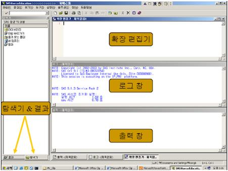
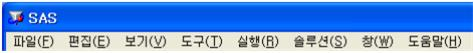
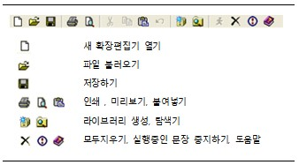

# SAS 개요 {#chapter1}

## SAS System

 ※ SAS(Statistical Analysis System, Strategic Application System) :1966 North Carolina 주립대학.  
    - 통계분석부터 품질관리, 데이터마이닝 등의 방대한 정보 처리 기능을 제공하는 프로그램  
    - 금융권, 제조업 분야 등에서 가장 많이 사용되는 통계패키지  
    - 현재 Ver. 9.4 까지 출시  

### SAS 프로그램의 구성  

```
DATA Step   ▷   PROC Step  
```

SAS 프로그램은 크게 두 가지 단계로 실행된다.
   
1. DATA Step  
   1) 데이터의 입력  
   2) 데이터의 오류 판단, 수정 및 변형  
   3) 데이터의 추출 및 여러 데이터의 병합 등  

<br>

2. PROC(procedure) Step  
   1) 데이터 셋 내의 데이터를 다루거나 분석하는 기능  
   2) 데이터의 출력, 정렬, 요약 등  
   3) 기술통계, 그래프, 여러 분석 기법을 이용한 통계분석 등을 수행  
   
### SAS System의 장점  

1) 데이터의 입력과 편집이 수월하며 프로그램의 변경 또한 융통적이다.  
2) 간단한 기술통계(Descriptive Statistic)부터 다변량 통계방법까지 현재 공인되어 있는 거의 모든 통계분석을 포괄하고 있으며, 보고서 작성뿐만 아니라 그래픽도 가능하다.  
3) PC에서 일반관리업무를 위한 소프트웨어로 많이 사용되고 있는 여러 프로그램의 형식으로 저장된 데이터를 이용할 수 있다.  

### SAS System의 단점  
1) 비싸다!!! 아주 많이...  
2) 프로그램이 쉽지 않다.  

<br>

## SAS 화면  

### SAS 화면구성  

  

 - 확장편집기(program window, pgm) : program command 입력  
 - 출력윈도우(output window) : 실행결과, 출력하거나 파일로 저장  
 - 로그윈도우(log window) : SAS 실행과정의 여러 가지 정보제공, 에러메시지  
 - 탐색기 결과 : 라이브러리 및 결과물 표시  
 
### 메뉴  

  

 - 파일 : 새로운 데이터 파일을 작성하거나 기존의 파일을 불러오고 저장.  
 - 편집 : 데이터 파일을 복사 편집하는 등의 작업.  
 - 보기 : 화면상의 윈도우를 표시하는 기능.  
 - 도구 : 테이블 및 레포트 등의 편집기 기능.  
 - 실행 : SAS 프로그램을 실행.  
 - 솔루션 : 통계 분석 및 레포트 작성기능.  
 - 창 : 윈도우 창간 전환.  
 - 도움말 : SAS의 도움말 정보.  
 
### 도구모음  

  


<!---------------END ----------------------->