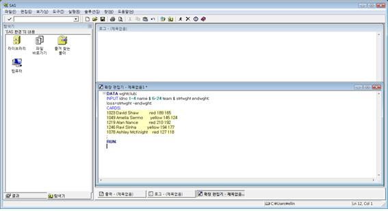
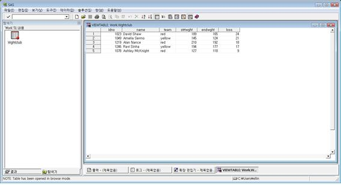
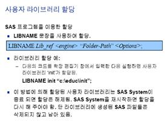
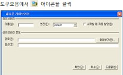

# SAS의 기본 형식 {#chapter2}

## INPUT문  

```{}
DATA wghtclub;
INPUT idno 1-4 name $ 6-24 team $ strtwght endwght;
loss=strtwght - endwght;
CARDS;
1023 David Shaw         red 189 165
1049 Amelia Serrno      yellow 145 124
1219 Alan Nance         red 210 192
1246 Ravi Sinha         yellow 194 177
1078 Ashley McKnight    red 127 118
;
RUN;
```

  

▶ SAS에서 Data Step을 실행할시 시작은 [DATA 데이터셋명;]이고 끝은 [RUN;]이다.  

▶ SAS에서 이름을 부여할 수 있는 것은 DATA 다음에 쓰여지는 데이터셋명과 INPUT 다음에 지정하는 변수명, PROC Step에서 지정하는 output명 등이 있다. 이름부여는 영문자와 숫자를 이용하여 지정가능하며 숫자가 이름의 처음에 나올 수는 없다.  

▶ SAS는 대소문자를 가리지 않으며, 명령문의 끝은 반드시 ‘ ; ’을 붙여야 한다.  

▶ SAS에서 주석처리는 ‘/* 주석 */’로 하거나  

한줄 처리는 ‘* 주석’ 방식을 이용한다.  
  
▶ 변수는 문자변수와 숫자변수로 나누어진다. 문자변수는 관찰값이 문자로 인식되는 경우 사용하며 변수명 뒤에 ‘$’을 붙여 숫자변수와 구분한다.  

숫자인 경우에도 변수명 뒤에 ‘$’을 표시하면 숫자로 인식하지 않고 문자로 인식을 한다. 

▶ [INPUT] 뒤에는 변수와 관련된 정보를 표기한다.  

▶ [CARDS;] 뒤에는 각각의 변수가 가지는 관측값들을 표기한다.  

 * 위의 프로그램에서 데이터셋명은 wghtclub이고, 변수는 idno, name, team, strtwght, endwght 이다. 이중 name과 team은 ‘$’이 붙었기 때문에 문자 변수로 인식을 하고 나머지 변수들은 숫자 변수로 인식을 한다.  

 - 변수 idno는 1-4칼럼, 변수 name은 6-24칼럼에 해당하는 값들을 불러들인다. 칼럼을 지정하지 않은 변수들은 관찰값이 시작하는 지점부터 공백이 나오는 지점까지 하나의 값으로 인식을 하게 된다.   

 - 불러들이는 변수를 이용해 새로운 변수를 만들 시에는 CARDS;문 앞에 만들어주면 된다. 위의 프로그램에서 loss라는 변수는 strtwght - endwght 값으로 만들어진다.  
 
<br>

※ 관찰값 읽기 1 - INPUT문

 • 변수를 사용할 때 변수명은 영문자와 숫자를 사용하며 문자변수인 경우에는 변수명 뒤에 $를 사용한다.  

 • 관찰값을 변수에 대응시킬 때 칼럼위치를 지정하여 사용하는 경우에 해당 변수명 다음에 자료에 해당하는 칼럼 번호를 써주면 된다.  

 • 하나의 관찰값 내에서 빈 공백을 포함하지 않고 관찰값과 관찰값 사이는 공백으로 분리가 되어 있으면 칼럼번호를 굳이 지정할 필요는 없다.  

```{}
INPUT vriable_name [$] [칼럼시작번호[-칼럼 끝번호]]  
      [vriable_name [$] [칼럼시작번호[-칼럼 끝번호]][…]]  ;
```

<<결과>>

  

▶ DATA Step으로 생성된 데이터셋은 항상 라이브러리(library)에 저장된다. 기본적으로 ‘work'라는 라이브러리에 저장되며 임시저장소의 역할을 한다. 따라서 프로그램을 종료하면 생성된 데이터셋은 모두 사라지게 된다. 데이터셋을 저장하려면 사용자정의 라이브러리를 생성시키면 된다.  

▶ 생성시킨 데이터셋은 왼쪽창의 ‘탐색기’에서 ‘라이브러리’를 들어가면 ‘work'라는 폴더 안에 저장되어 있다. 데이터셋을 클릭하면 위의 그림과 같은 결과창을 볼 수 있다.  

▶ 명령문의 실행은 [F8]키를 누르거나 을 누르면 된다.  

▶ 기본적으로 문자는 왼쪽 정렬 숫자는 오른쪽 정렬로 되어 있어 변수의 특성을 간단하게 확인 할 수 있다.  

※ 라이브러리란?  
    라이브러리는 SAS에서 작업한 파일의 저장소를 의미한다.  
    사용자가 라이브러리를 지정하지 않으면 시스템 라이브러리 ‘WORK' 로 저장된다.  
   - 시스템 라이브러리 : SASHELP, SASUSER, MAPS, WORK  
   - 사용자 라이브러리 : 사용자가 임의로 할당하는 라이브러리  
   
※ 라이브러리 할당하기.  

|명령문을 이용하는 방법|메뉴를 이용하는 방법|
|:---:|:---:|
|| <br> 이름 : 생성할 라이브러리 이름을 지정 <br> 경로 : 생성되는 파일이 저장될 장소를 지정해줌|  

 - 라이브러리로 지정한 폴더에 지정된 데이터셋이 저장된다.  
 - 라이브러리 지정을 하지 않으면 시스템 폴더인 'WORK'에 저장되고 SAS를 재실행 시킬 경우 데이터는 지워진다.  
 
```
data 라이브러리명.dataset name;  
```

<br>

## PROC PRINT　형식  

```{}
PROC PRINT DATA=wghtclub;
     TITLE 'Health Club DATA';
RUN;
```

▶ PROC PRINT는 SAS DATASET이 형성된 후에 DATASET의 전체 혹은 일부의 변수와 관찰값을 출력하는 PROCEDURE이다. wghtclub DATASET을 PRINT하면 변수를 지정하지 않았으므로 DATASET 전체가 보여지게 된다. 또한 wghtclub DATASET이 바로 직전에 수행된 데이터셋이므로 data=wghtclub를 지정하지 않아도 무방하다.  

▶ TITLE문은 프로그램 수행 후에 나타난 결과를 보다 구별을 쉽게 하기 위해 결과에 제목을 붙이는 기능을 하는 것으로 원하는 내용을 ‘   ’ 사이에 써주면 된다. 제목의 위치는 각 페이지 상단에 위치하며, TITLE문은 첫줄에 출력되고, TITLE2문는 두 번째 줄에 출력된다.  


                               Health Club DATA

      Obs    idno    name               team      strtwght    endwght    loss

       1     1023    David Shaw         red          189        165       24
       2     1049    Amelia Serrno      yellow       145        124       21
       3     1219    Alan Nance         red          210        192       18
       4     1246    Ravi Sinha         yellow       194        177       17
       5     1078    Ashley McKnight    red          127        118        9


▶ TITLE문에 의해서 첫 줄에 HEALTH CLUB DATA라는 제목이 출력된다.  

▶ PRINT를 하면 자동으로 관찰값 번호를 의미하는 OBS가 제일 먼저 나오고 그 다음에는 VAR에 지정된 순서대로 인쇄된다. VAR을 지정하지 않았으면 INPUT된 순서에 따라 인쇄된다.  

```{}
PROC PRINT DATA=wghtclub;
var name loss;
RUN;
```

▶ VAR 옵션에 변수를 적어주면 아래와 같이 표기한 변수에 대한 결과만 보여준다.


                            Health Club DATA

                     OBS    name               loss

                      1     David Shaw          24
                      2     Amelia Serrno       21
                      3     Alan Nance          18
                      4     Ravi Sinha          17
                      5     Ashley McKnight      9  
                      


※ PROC　PRINT 형식 1  

 • SAS DATASET의 전체 혹은 일부의 변수와 관찰값을 보여주는 PROCEDURE이다.  

```{}
PROC PRINT DATA = dataname;
  [VAR vriable_names ; ]
 RUN;   
```

<br>

## PROC TABULATE 형식  

```{}
PROC TABULATE DATA=wghtclub;
    CLASS team; 
    VAR strtwght endwght loss;
    TABLE team, mean*(strtwght endwght loss);
    TITLE 'Mean Starting Weight, Ending, and Weight Loss';
RUN;
```

▶ PROC TABULATE는 각 변수들의 내용을 여러 가지 기술통계량으로 계층구조의 보고서 형식으로 도표화 시키는 PROCEDURE이다. 여기서 사용될 수 있는 통계량은 N, NAMES, MEAN, STD, MIN, MAX, RNGE, SUM, VAR, USS, CSS, STDERR, CV, T, PRT, SUMWGT, PCTN, PCTSUM 등이 있다.  

▶ CLASS문은 분류하고자 하는 변수들을 지정하며 문자 변수나 숫자변수 모두 가능하나 이산적 값을 가지는 변수가 적합하다. 연속변수인 경우에는 이산변수로 바꾸어서 사용한다. 예제에서 team변수는 문자변수로 ‘red' 또는 ‘yellow'의 값만 가지는 이산변수이다.   

▶ VAR문은 기술통계량을 구하고자 하는 변수들을 기술하며, 위에서는 strtwght, endwght, loss 변수들의 기초통계량을 구하도록 하였다.  

▶ TABLE문은 3차원까지 가능하며 각 차원은 컴마로 구분되어 왼쪽은 페이지를 지정하고, 가운데는 행, 오른쪽은 열을 가리킨다. 즉, 3차원으로 도표화 할 경우 가장 왼쪽에 사용된 변수의 값들에 의해 page가 구분되고, 가운데 변수들에 의해 사용된 순서에 따라 행이 지정되고, 오른쪽에 사용된 변수들에 의해 열이 결정되며 각종 기초통계량을 사용할 수 있다. 같은 열이나 행에서 변수순서에 따라 세분화 시킬 경우 변수와 변수사이에 *를 해주면 된다.  
2차원으로 구성할 경우 가장 왼쪽 변수와 컴마를 제외하고 가운데 변수들부터 사용하면 된다. 위에서 보면 컴마가 1개이므로 가장 왼쪽을 제외시키고 2차원으로 team변수는 행, strtwght, endwght, loss변수는 열을 구성하게 되며 세 변수에 대하여 team별로 평균값을 구하였다.  


※ Mean Starting Weight, Ending, and Weight Loss  
    
|||Mean||
|:---|:---:|:---:|:---:|
||strtwght|endwght|loss|
|team||||
|red|175.33|158.33|17.00|
|yellow|169.50|150.50|19.00|  

▶ 앞의 프로그램 중 TABLE 문에서 team, name*(strtwght endwght loss)라고 하였으므로 출력결과는 행방향으로는 team변수의 값으로 구분이 되고, 열은 먼저 평균값으로 지정하였으므로 맨 위에 MEAN으로 지정된 후 strtwght, endwght, loss변수의 관찰값들 평균값이 team 별로 나뉘어서 구해진 것을 볼 수 있다.  

※ PROC TABULATE 형식  

 • 각종 기술 통계량을 보고서 형태로 도표화 시키는데 유용한 PROCEDURE이다.  
 • CLASS문에 사용되는 분류변수는 이산형의 값을 가지는 문자 또는 숫자변수 모두 가능하며, 연속형 값을 가지는 변수인 경우에는 이산형 변수로 바꾸어 주어야 한다.  

```{}
 PROC TABULTE DATA = dataname ;
 [ CLASS 분류변수명 ; ]
 [ VAR vriable_names ;   ]
   TABLE [variable_name,][variable_name OR 기초 통계량
          [*variable_name or 기초통계량 …],] [variable_name or 기초통계량
          [*variable_name or 기초통계량 …]];
 RUN;
```

<br>

## OPTION문 형식  

```{}
OPTIONS LS=72 nonumber nodate;
TITLE;
DATA wghtclub;
     INPUT idno 1-4 name $ 6-24 team $ strtwght endwght;
     loss=strtwght-endwght;
     CARDS;
1023 David Shaw        red     189 165
1049 Amelia Serrno      yellow  145 124
1219 Alan Nance        red    210 192
                   …
1329 Larry Goss          yellow    188 174
;
```

▶ OPTION문은 출력 결과의 SIZE 조절 및 문단모양, 출력 시간 등 여러 가지 출력양식을 지정한다.  
   • LINE 길이를 지정할 경우 : LS=숫자  
      PAGE 길이를 지정할 경우 : PS=숫자  
      
   • 출력결과는 디폴트로 가운데 정렬이 되어 출력  
      NOCENTER : 왼쪽을 기준으로 정렬  
      NODATE : 결과에 출력날짜 및 시간이 나타나지 않음  
      NONUMBER : PAGE번호가 찍히지 않음  

<br>

## TITLE문 형식  

```{}
PROC PRINT DATA=wghtclub;
    TITLE 'Fitness Center Weight Club';
RUN;
```

▶ wghtclub DATASET에 있는 모든 변수들이 출력한다.  
   TITLE은 Fitness Center Weight Club으로 지정하였으므로 출력되는 결과 맨 상단에 제목으로 찍히게 된다.  
   
※ TITLE문 형식  

 • TITLE문은 결과에 제목을 인쇄하는 경우에 사용되며 내용은 ‘  ’사이에 쓰면 된다.  

 • 제목의 위치는 TITLE다음에 숫자를 써줌으로써 해당 라인을 지정한다.  

 • TITLE이 한 번 지정되면 다음 TITLE문이 나타나기 전까지 적용되므로 이를 해제하고자 할 경우에는 TITLE;을 써주면 된다.  

 • 하나의 출력물에 대해 여러 개의 TITLE을 사용할 때 TITLE 다음의 번호를 동일하게 하여 내용을 지정하는 경우 가장 나중에 선언된 내용으로 출력된다.  

 • 제목 안에 ‘ 이 포함될 경우에는 내용을 “  ” 사이에 쓰면 된다.  

  TITLE   ‘내용’ ;		← ‘ ’안의 내용이 철 줄에 인쇄된다.  
  TITLE5  ‘내용’ ;		← ‘ ’안의 내용이 5번째 줄에 인쇄된다.  
  TITLE ;			← 바로 전에 지정했던 제목을 해제하는 경우  
  TITLE  “'가 포함된 내용” ;	← “ ”안의 내용이 첫줄에 인쇄된다.  
  


                        Fitness Center Weight Club

    OBS    idno    name               team      strtwght    endwght    loss

     1     1023    David Shaw         red          189        165       24
     2     1049    Amelia Serrno      yellow       145        124       21
     3     1219    Alan Nance         red          210        192       18
     4     1246    Ravi Sinha         yellow       194        177       17
     5     1078    Ashley McKnight    red          127        118        9

▶ PROC PRINT에서 VAR을 지정하지 않았으므로 wghtclub이라는 SAS DATASET에 있는 모든 변수들이 출력된다.  