# 자료의 기술 {#chapter2}

* 수집한 자료를 정리하여 표나 그림으로 나타내면 자료가 가진 개략적인
분포의 특성을 쉽게 파악할 수 있음
* 수집한 자료를 정리, 표현, 요약, 해석할 수 있는 기본적인 통계량을
기술통계량(descriptive statistic)이라 함
* 일반적으로 자료를 일일이 열거하기보다는 몇 가지 수식적인 통계량으로
자료를 요약해 나타내는 것이 더 효과적
* 특히 둘 이상의 집단의 자료가 있을 때 각 집단의 특성을 적절한
기술통계량으로 요약하여 설명하면 여러 집단을 비교하기 쉬움

## 자료의 종류

### 범주형 자료

* 숫자로 표현될 수 없는 자료를 집단화하여 나타낸 자료를 범주형 자료
(categorical data) 또는 질적 자료(qualitative data)라 하고 명목형 자료
(nominal data)와 순서형 자료(ordinal data)로 구분함
* 명목형 자료
  - 분류만 하여 값을 부여한 자료
  - 분석의 편의상 숫자로 값을 부여 - 예를 들어 성별 자료에서 남자는 1, 여자는 0
으로 부여하여 구분
  - 예) 종교, 혈액형 등
* 순서형 자료
  - 범주형 자료로 생성된 값이 순위(order)의 개념을 갖는 자료
  - 예) 대, 중, 소 등으로 순서 관계를 나타내는 자료, 평점, 선호도, 학점, 학력 등

### 측정형 자료

* 각 관측 대상이 되는 자료에 측정 단위를 이용한 측정값이 부여되고 숫자의
크기가 의미를 갖는 자료를 측정형 자료(measurement data) 또는 양적 자료
(quantitative data)라 함. 자료 자체가 수를 나타내어 수치적 자료(numerical
data)라고도 함
* 측정형 자료는 0 또는 양의 정수를 가지는 셀수있는(countable) 이산형 자료
(descrete data)와 기준 및 단위에 의해 실수로 측정되는 연속형 자료
(continuous data)로 구분
* 이산형 자료
  - 소수점 이하로는 사용이 불가능
  - 0을 포함한 양의 정수로 표현 되는 자료
  - 예) 가족 구성원 수, 가구의 자동자 보유 대수 등
* 연속형 자료
  - 일정구간 안에 있는 숫자로 측정되고 연속성을 띄며 무한개의 값을 가질 수 있는
자료
  - 실수상에서 임의의 값을 가짐
  - 예) 키, 몸무게, 혈압, 월급, 온도 등

## 위치의 측도

* 자료를 도수분포표(frequency table)나 히스토그램(histogram)과 같은 도표를
이용하여 정리하면 자료들이 어느 위치에 가장 많이 모여 있는지 또는
전체적으로 어떠한 형태로 분포가 이루어져 있는지를 한 눈에 알아 볼 수 있음
* 관찰된 자료들이 어느 위치에 집중되어 있는가를 나타내주는 측도를 위치
(location) 측도라 하며 이를 자료의 대표값이라고 함.
* 위치 측도에는 평균, 중앙값, 최빈값, 사분위수, 백분위수 등이 있음

### 평균

* 흔히 산술평균으로 알려진 평균(mean)은 자료 전체를 합한 값을 합한 자료의
수로 나누어 구함
* 평균을 구하는 과정은 주어진 자료가 모집단이나 표본이나 같지만 모집단의
평균은 그리스 문자 $\mu$로 나타내며 표본의 평균은 $\bar{x}$로 표현함

> 분포에 있어서 평균은 자료의 합을 자료의 전체 개수로 나눈 것이다. 이것은 관찰값이 모두
동일한 **가중값**(1/자료개수)을 가진다는 의미이다.

* N개로 구성된 모집단의 첫 번째 관찰값을 $x_1$이라 하고, 두 번째를 $x_2, \ldots, N$
번째를 $x_N$이라 할 때 모집단의 평균인 모평균($\mu$; population mean)을 구하는
공식은 다음과 같음

$$
\mu=\frac{x_1+\cdots+x_N}{N}=\frac{1}{N}\sum_{i=1}^N x_i, \,\,\, N: 모집단의 크기
$$

* $N$개로 구성된 모집단에서 $n$개의 표본을 뽑았을 때 표본의 첫 번째 관찰값을 $x_1$
이라 하고, 두 번째를 $x_2, \ldots, n$번째를 $x_n$이라 할 때 표본의 평균인 표본평균($\bar{x}$ ;
sample mean)을 구하는 공식은 다음과 같음

$$
\bar{x}=\frac{x_1+\cdots+x_N}{n}=\frac{1}{n}\sum_{i=1}^N x_i, \,\,\, n: 모집단의 크기
$$

### 중앙값

-   중앙값(median)이란 자료를 크기의 순서로 나열해 놓았을 때 위치적으로
    중앙에 있는 값을 의미

-   자료의 개수를 $n$이라 할 때 크기 순서대로 나열된 관찰값을
    순서통계량(order statistic)이라 하며,
    $x_{(1)}, x_{(2)}, \ldots, x_{(n)}$으로 표기

    -   여기서 $x_{(1)}$은 자료의 최소값(minimum value)이고, $x_{(n)}$은
        자료의 최대값(maximum value)을 의미

>
$x_{(1)}, x_{(2)}, \ldots, x_{(n)}$이라 하면,
$$\text{표본중앙값 : } \tilde{x}= \begin{cases}
 x_{((n+1)/2)}, \hskip5pt n\text{이 홀수일 경우} \\
 \\
 \frac{x_{(n/2)}+x_{(n/2+1)}}{2}, \hskip5pt n\text{이 짝수일 경우}
 \end{cases}$$

-   $n$이 홀수일 때 - 관찰값의 개수가 홀수일 때는 크기 순서대로 나열했을
    때, 바로 중앙에 있는 값이 중앙값이 됨\

  -   예) 3, 5, 8, 10, 11 : 중앙값 = 8

-   $n$이 짝수일 때 - 관찰값의 개수가 짝수일 때는 크기 순서대로 나열하여
    중앙에 있는 두 개의 관찰값의 평균이 중앙값이 됨

  -   예) 3, 3, 4, 5, 7, 8 : 중앙값 = 4.5

-   자료를 수직선상에 표시할 때, 다른 관찰값과 동떨어져 있는 관찰값을
    특이값(outlier)이라고 하고 특이값에 따라 크게 달라지지 않는
    통계량을\
    \"로버스트(robust)하다\"라고 함

-   중앙값은 로버스트하며 평균은 특이값에 민감하게 변화하는 특징이 있음.
    즉, 평균은 로버스트 하지 않음

### 최빈값

-   발생 빈도(frequency)에 대한 대표값으로 가장 빈도가 높은 관찰값을
    최빈값(mode)이라 하며, 도수분포표에서 빈도가 제일 큰 계급(class)을
    최빈계급이라고 함

> 자료 중에서 발생하는 도수가 가장 많은 값을 최빈값이라
    한다.

-   최빈값은 쉽게 구할 수 있는 장점이 있으나 대표값으로는 부적절

-   모든 관측값들의 도수가 같다면 최빈값이 존재하지 않고, 가장 큰 도수를
    가지는 값이 여러 개 있을 경우에는 최빈값이 여러개로 나타남

### 평균, 중앙값, 최빈값 비교

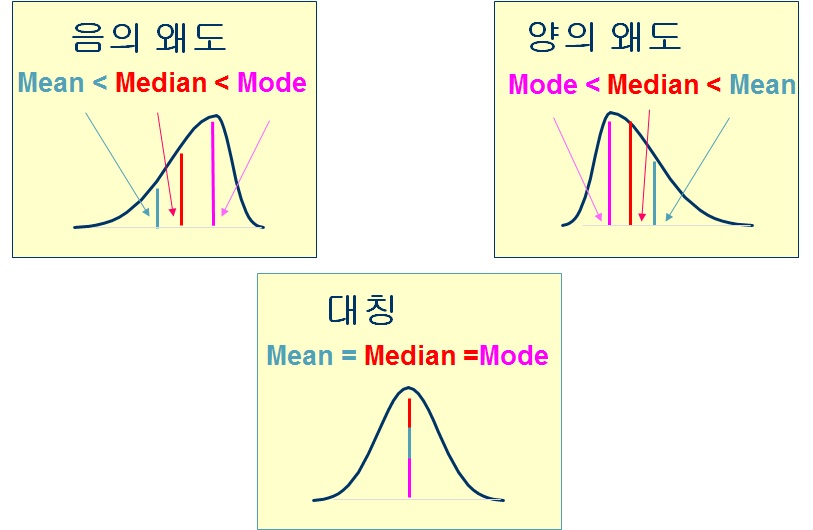{width="90%"}

### 백분위수

> 크기순으로 배열한 자료를 100등분하는 수를
백분위수(percentile)라고 하며, 제 100$p$백분위수($0 \le p \le 1$)란
자료를 크기순으로 배열하였을 때 100$p \%$의 관찰값이 그 값보다 작거나
같고 100($1-p$)$\%$의 관찰값이 그 값보다 크거나 같게 되는 값이다.

-   중앙값은 $50\%$의 관찰값이 그 값보다 작거나 같고 $50\%$의 관찰값이
    그 값보다 크거나 같으므로 제 $50$백분위수임

-   제 $100p$ 백분위수

    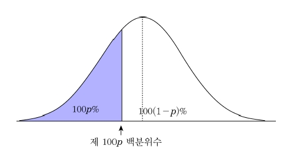{width="80%"}

### 사분위수

-   자료의 관찰값을 작은 값부터 크기순으로 배열했을 때 전체 관찰값을
    4등분하는 위치의 값을 사분위수(quartile)라고 함

-   값을 쉽게 구할 수 있다는 장점이 있으나 대표값으로는 부적절

-   $Q_1$을 제1사분위수(first quartile; 25th percentile) 또는
    하사분위수(lower quartile), $Q_2$를 제2사분위수(second quartile;
    50th percentile) 또는 중앙값, $Q_3$를 제3사분위수(third quartile;
    75th percentile) 또는 상사분위수(upper quartile)라 함

-   사분위수(또는 백분위수) 계산 방법

    1.  관찰값을 작은 순서로 배열한다.

    2.  관찰값의 개수($n$)에 $p, \hskip5pt 0\le p \le 1$를 곱한다.

    3.  만약 $n\times p$가 정수이면, $n\times p$번째로 작은 관찰값과
        $n\times p+1$ 번째로 작은 관찰값의 평균을 제
        100$\times p$백분위수로 한다.

    4.  만약 $n\times p$가 정수가 아니면, $n\times p$에서 정수부분에 1을
        더한 값 $m$을 구한 후, $m$번째 작은 관찰값을 제
        100$\times p$백분위수로 한다.

-   사분위수

    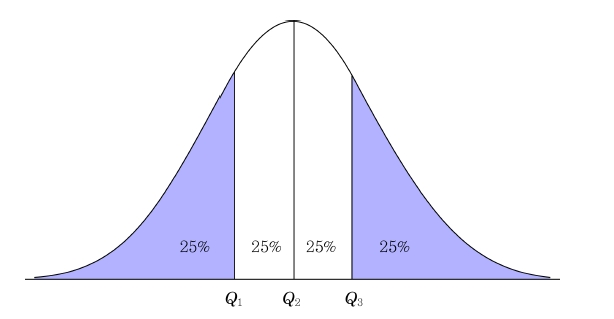{width="80%"}

- 다음 자료는 A군의 우유를 생산하는 60가구의 젖소 보유 수이다. 이 자료를
이용하여 평균, 중앙값, 사분위수를 구하라.

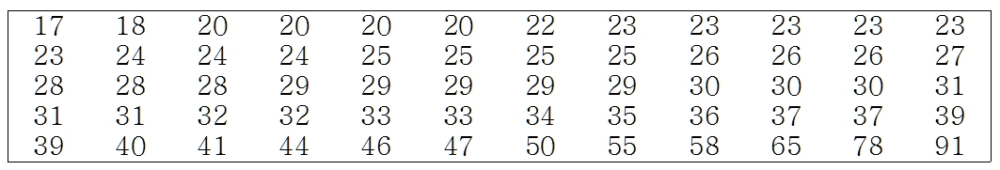{width="100%"}

-   (풀이)

    -   평균 : $\bar{x} = \frac{17+18+\cdots +78+91}{60}=32.767$

    -   중앙값 : 관찰값의 수가 60(짝수)이므로 중앙값은 30번째
        관찰값(29)과 31번째 관찰값(29)의 평균인 29

    -   사분위수:\
        $Q_1 = 24+0.25(24-24)=24$\
        $Q_2 = 29$\
        $Q_3 = 36+0.75(37-36)=36.75$

## 산포의 측도

### 분산과 표준편차

> 분포에 있어서 **분산**은 자료의 변동(variation)의 평균이다.
여기서 변동이란 관찰값과 평균과의 차의 제곱을 말한다. 분산은 관찰값이
평균으로부터 떨어져 있는 정도를 의미한다.

-   만약 모집단의 관찰값이 $x_1, \ldots, x_N$이라면, 모분산($\sigma^2$;
    population variance)과 모표준편차($\sigma$; population standard
    deviation)는 다음과 같음

* 모분산과 모표준편차 모분산 :
$\sigma^2 = \frac{1}{N}\sum_{i=1}^N (x_i -\mu )^2$\
* 모표준편차 : $\sigma=\sqrt{\sigma^2}$

-   만약 모집단의 관찰값이 $x_1, \ldots, x_n$이라면, 표본분산($s^2$;
    sample variance)과 표본표준편차($s$; sample standard deviation)는
    다음과 같음

- 표본분산과 표본표준편차 표본분산 :
$s^2 = \frac{1}{n-1}\sum_{i=1}^n (x_i - \bar{x} )^2$\
- 표본표준편차 : $s=\sqrt{s^2}$

-   분산과 표준편차는 표본평균을 중심으로 각 자료들이 얼마나 떨어져
    있는가를 하나의 값으로 표시

-   표본분산식에서 $(x_i - \bar{x})$를 편차라고 하며, 편차합
    $\sum_{i=1}^n (x_i - \bar{x})$는 항상 0임

-   표본분산에서 사용되는 $n-1$은 분산의 추정에 관련된 값으로
    자유도(degrees of freedom)라 함. 이는 변동을 계산하는데 이용되는
    독립된 정보의 수를 의미

-   표본분산은 편차를 제곱한 값을 사용하기 때문에 표본분산의 단위는
    자료의 단위를 제곱한 것과 같음. 따라서 자료와 같은 단위를 갖는
    산포도를 나타내는 것으로 표본표준편차를 사용함

> $n$개의 관찰값을 $x_1, \ldots x_n$이라 하고 표본평균을
$\bar{x}$라 하면,
$$s^2 = \frac{1}{n-1}\sum_{i=1}^n (x_i - \bar{x} )^2 = \frac{1}{n-1}\left[ \sum_{i=1}^n x_i^2 - \frac{(\sum_{i=1}^n x_i)^2}{n}\right]$$

-   증명 $$\begin{aligned}
    \sum_{i=1}^n (x_i - \bar{x})^2&=\sum_{i=1}^n (x_i^2 -2\bar{x}x_i +\bar{x}^2)=\sum_{i=1}^n x_i^2 - 2\bar{x}\sum_{i=1}^n x_i +\sum_{i=1}^n \bar{x}^2\\
    &=\sum_{i=1}^n x_i^2 -2n\bar{x}^2+n\bar{x}^2 =\sum_{i=1}^n x_i^2 - n\bar{x}^2=\sum_{i=1}^n x_i^2 - \frac{(\sum_{i=1}^n x_i)^2}{n}\end{aligned}$$

> $n$개의 관찰값을 $x_1, \ldots x_n$이라 하고 $c$를 $0$이
아닌 상수라고 하자.
-   $y_1=x_1+c, y_2=x_2+c, \ldots, y_n=x_n+c$ 이면 $s_y^2=s_x^2$
-   $y_1=cx_1, \ldots, y_n=cx_n$ 이면
    $s_y^2=c^2s_x^2, \hskip5pt s_y=|c|s_x$

-   첫 번째 정리는 상수 $c$가 각각의 자료에 더해진다고(혹은 빼진다고)
    해도 분산에는 변화가 없다는 것을 의미. $c$를 더하거나 빼는 것은
    자료의 위치를 이동시킬 뿐 각 자료의 값들 간의 거리는 변하지 않기
    때문에 분산에는 변화가 없음

-   두 번째 정리는 각 $x_i$에 $c$를 곱할 경우 $s^2$에 $c^2$을 곱하는
    것과 같음을 의미

### 범위와 사분위간 범위

> 범위 = $x_{(n)} - x_{(1)}$

> 사분위간 범위($IQR$): $IQR = Q_3 - Q_1$

-   범위나 사분위간 범위는 두 관찰값의 차이만을 이용하기 때문에 많은
    정보가 손실됨

-   범위는 특이값이 존재하는 자료의 경우 상대적으로 큰 값을 가지므로
    매우 불안정한 산포도가 됨

-   사분위간 범위는 범위와는 달리 특이값의 존재에 영향을 받지 않음

- 다음 자료는 A군의 우유를 생산하는 60가구의 젖소 보유 수이다. 이 자료를
이용하여 표본분산, 표본표준편차, 범위, 사분위간 범위를 구하라.

{width="100%"}

-   (풀이)

    -   평균 : $\bar{x} = \frac{17+18+\cdots +78+91}{60}=32.767$

    -   표본분산 :
        $s^2=\frac{\sum_{i=1}^{60} (x_i-32.767)^2}{60-1}=\frac{(17-32.767)^2+ \cdots +(91-32.767)^2}{59}=191.199$

    -   표본표준편차 : $s=\sqrt{191.199}=13.827$

    -   범위 : $range=x_{(n)} -x_{(1)}=91-17=74$

    -   사분위간 범위 : $IQR=Q_3 - Q_1 = 36.75 -24 =12.75$

### 변동계수

-   같은 평균을 갖는 여러 종류의 자료가 있을 경우 각 자료들의 표준편차를
    이용하면 산포도의 비교가 용이함. 그러나 서로 다른 평균과 표준편차를
    갖는 자료들의 산포도를 비교하기는 쉽지 않음

-   이러한 경우 평균과 표준편차를 동시에 고려한 상대적 변동을 나타내는
    변동계수(coefficient of variation)를 사용하는 것이 유용함

-   일반적으로 표준편차를 절대산포측도, 변동계수를 상대산포측도라 함

-   변동계수는 측정단위와 무관하며, 측정단위나 평균이 다른 자료들 간의
    비교에 유용한 측도임

> 표본변동계수 : $CV = \frac{s}{\bar{x}}\times 100\%$

* 다음 두 자료의 변동 계수를 구하라.\
자료 1 : 30 45 30\
자료 2 : 50 110 50

-   (풀이)

    -   자료 1 : 표본평균=35, 표본표준편차=8.66, 표본변동계수=24.74%

    -   자료 2 : 표본평균=70, 표본표준편차=34.64, 표본변동계수=49.49%

    -   자료 1과 자료 2는 평균이 2배나 차이가 나서 산포도를 비교하는
        것이 쉽지 않으나, 변동계수를 통해 자료 2가 자료 1에 비해
        상대적으로 넓게 퍼져있음을 알 수 있음

* 다음의 두 가지 투자 정보를 가지고 있다면 어디에 투자를 하겠는가?

                       기업 1   기업 2   기업 3
  ------------------- -------- -------- --------
      평균수익률        10%      14%      15%
   수익률의 표준편차     7%       4%       7%

-   (풀이)

    -   세 기업의 평균수익률과 표준편차를 이용하여 변동계수를
        계산함으로써 상대적인 투자 위험률을 알 수 있음

    -   
                               기업 1   기업 2   기업 3
          ------------------- -------- -------- --------
              평균수익률        10%      14%      15%
           수익률의 변동계수   70.00%   28.57%   46.67%

    -   기업 1의 변동계수가 가장 크므로 세 기업중 투자위험이 가장 크며,
        평균수익률이 가장 작기때문에 투자 대상에 제외. 기업 2는 기업 3에
        비해 평균수익률이 크게 작지 않고 상대적인 투자 위험률도 낮기
        때문에 기업 2에 투자하는 것이 적절함

### 왜도와 첨도

-   왜도(skewness)란 자료의 대칭정도를 나타내는 측도로써 자료의 분포가
    기울어 진 방향과 정도를 나타냄. 즉, 분포가 좌우 대칭인가 아니면
    한쪽으로 얼마나 치우쳐 졌는가를 나타냄

-   첨도(kurtosis)는 자료의 중앙 집중도를 나타냄. 즉, 분포의 뾰족한
    정도와 꼬리부분의 두터운 정도를 나타내는 척도임. 자료가 중앙에 많이
    모여 있으면 분포는 뾰족해 지고, 자료가 퍼져 있으면 분포가 평평해 짐

> 표본왜도계수 :
$S_k = \frac{\frac{1}{n}\sum_{i=1}^n (x_i-\bar{x})^3}{s^3}$\
표본첨도계수 :
$K_u = \frac{\frac{1}{n}\sum_{i=1}^n (x_i-\bar{x})^4}{s^4}-3$

-   좌우대칭인 분포이면 왜도는 0

-   오른쪽으로 긴 꼬리를 가진 분포이면 왜도는 0보다 크며, 왼쪽으로 긴
    꼬리를 가진 분포이면 왜도는 0보다 작음

-   첨도계수가 양이면 정규분포의 밀도함수보다 중앙에 밀도가 더 높음을
    의미. 즉, 분포의 중심이 정규분포보다 높고, 꼬리부분이 얇고 짧음

-   첨도계수가 음이면 정규분포보다 중심이 낮고 꼬리부분이 두터움

-   왜도와 첨도

    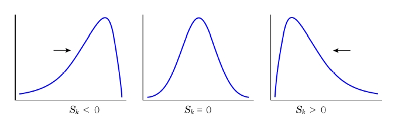{width="80%"}

    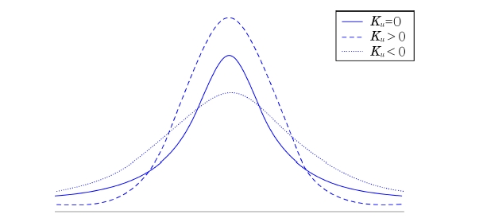{width="70%"}

* 다음 자료는 A군의 우유를 생산하는 60가구의 젖소 보유 수이다. 이 자료를
이용하여 표본변동계수, 왜도, 첨도를 구하라.

{width="100%"}

-   (풀이)

    -   표본변동계수 :
        $CV=\frac{s}{\bar{x}}\times 100\%=\frac{13.827}{32.767}\times 100\%=42.20\%$

    -   왜도 :
        $S_k = \frac{\frac{1}{60}\sum_{i=1}^{60} (x_i-32.767)^3}{13.827^3}=2.118$

    -   첨도 :
        $K_u = \frac{\frac{1}{60}\sum_{i=1}^{60} (x_i-32.767)^4}{13.827^4}=8.174$

## 자료의 시각적 해석

### 도수분포표

-   이산형 자료의 경우, 변수가 취할 수 있는 각 관찰값이 나타내는 빈도를
    도수(frequency)라고 하며, 이 도수를 전체 자료의 수 $n$으로 나눈 것을
    상대도수(relative frequency)라 함

-   연속형 자료의 경우, 관찰값들이 정확하게 같은 값이 존재하지 않기
    때문에 적절한 계급(class)으로 나누어 이산형 자료처럼 간주하여 도수
    및 상대도수를 구함

-   실제 관찰값에 대한 관찰값이나 규칙에 의해 나눈 계급구간, 도수 및
    상대도수를 표현한 표를 도수분포표(frequency table)라 함

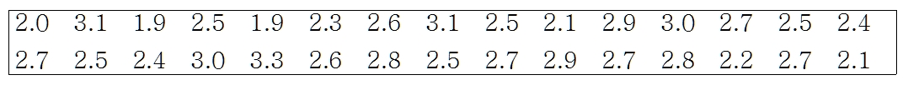{width="100%"}

-   스터지의 규칙(Sturges' law)에 따라 선택된 계급의 수는
    $k \ge log_2n$를 만족해야 함. 여기서 $k$는 계급의 수이고 $n$은
    관찰값들의 총 수를 나타냄

-   표 2-1의 자료에서 $n=30$이므로 $log_230=4.9$. 따라서 계급의 수는 5개
    이상이어야 함

-   계급구간의 길이는 동일한 크기로 설정하는 것이 좋음

-   표 2-1 자료의 범위는 (3.3-1.9)=1.4이므로 계급구간의 길이는
    (1.4/5)=0.28로 쉽게 선택이 가능하며, 여기서는 0.3으로 사용함

-   통계학과 신입생 30명의 학점에 대한 도수분포표

-   
       계급   계급구간    도수   상대도수
      ------ ----------- ------ ----------
        1     1.85-2.15    5      0.167
        2     2.15-2.45    4      0.133
        3     2.45-2.75    12     0.400
        4     2.75-3.05    6      0.200
        5     3.05-3.35    3      0.100

### 히스토그램

-   관찰값들을 동일한 구간에 대한 도수분포표로 만든 경우에는 각 구간에
    대한 히스토그램을 그릴 수 있음

-   히스토그램은 각 구간의 상대도수를 구간의 길이로 나눈 값을 기둥의
    높이로 하거나 도수 혹은 상대도수를 직접 기둥의 높이로 표현

-   상대도수를 구간의 길이로 나눈 값을 밀도라 하고 상대도수의 합은
    1이므로 히스토그램에서 기둥면적의 합은 1이 됨

-   히스토그램의 목적은 자료의 분포에 대한 정보를 시각적으로 빠르게
    보여주는 것임

-   도수를 직접 기둥의 높이로 하는 그래프를 도수 히스토그램(frequency
    histogram)이라고 하고 상대도수를 기둥의 높이로 하는 그래프를
    상대도수 히스토그램(relative frequency histogram)이라고 함

-   통계학과 신입생의 학점에 대한 상대도수 히스토그램

    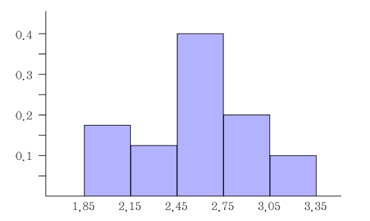{width="80%"}

### 줄기-잎 그림

-   줄기-잎 그림(stem-leaf plot)은 자료를 재배열할 필요 없이 줄기 부분과
    잎 부분을 구분하여 시각적으로 표현하는 방법

-   관찰값의 자리 수 중 적당한 부분을 줄기로 선택한 후, 줄기로 사용한
    관찰값의 나머지 자리를 잎으로 정의하여 적어 나가는 방법

-   줄기-잎 그림은 히스토그램처럼 자료를 시각적으로 볼 수 있게 표현할 수
    있을 뿐만 아니라 각 자료의 실제 관찰된 값을 유지하기 때문에 표와
    그림의 장점을 모두 가짐

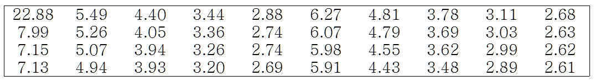{width="100%"}

-   줄기-잎 그림으로 표현하기 위해 줄기와 잎 두 부분으로 관찰값을
    나누어야 함

-   첫 번째 방법으로 소수점을 기준으로 관찰값들을 나눌 수 있음. 소수점을
    기준으로 왼편은 줄기 부분이 되고 오른 편은 잎 부분이 됨

-   두 번째 방법은 소수점 첫째자리와 둘째자리를 기준으로 나눌 수 있음

-   관찰값 7.15에 대한 줄기-잎 그림을 표현하는 방법

    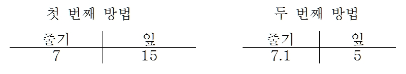{width="90%"}

-   줄기와 잎의 선택은 자료의 특성에 의존하여 나눌 수 있음

줄기-잎 그림 작성요령

1.  열에 순서대로 줄기 값을 나열한다.

2.  줄기의 값 오른쪽에 수직선을 긋는다

3.  각 관찰값에 대해 적절한 줄기에 대응하는 행에 관찰값들의 잎 부분을
    기록한다.

4.  각 줄기의 행의 가장 작은 값 부터 큰 값 까지 잎을 배열한다.

5.  만약 각 줄기의 잎의 수가 너무 크다면 줄기를 두 부분으로 나눈다.

-   40개 정육점의 하루 쇠고기 판매량 자료의 줄기-잎 그림

    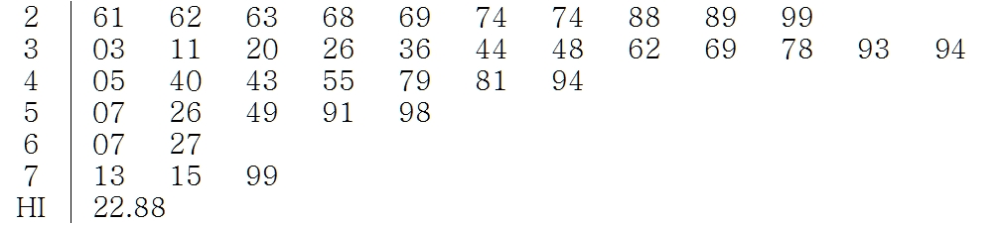{width="90%"}

-   줄기-잎 그림은 히스토그램의 특징을 지니면서 실제 관찰값을 확인 할 수
    있다는 장점이 있음

-   줄기-잎 그림은 도표를 한 눈에 볼 수 있게 적절한 줄기 개수를 결정하는
    것이 중요함

### 상자 그림

-   상자 그림(box plot)은 5가지 요약 통계량을 이용하여 표현

-   5가지 요약 통계량은 최소값, 제1사분위수, 중앙값, 제3사분위수,
    최대값을 의미

    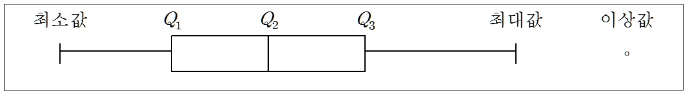{width="90%"}

-   먼저 제1사분위수와 제3사분위수를 이용하여 상자를 만듦. 이 때 상자의
    길이는 사분위간 범위($IQR$)가 되고 상자 가운데 중앙값을 선(수염;
    whisker)으로 나누어 표시

-   상자 양 끝에서 선으로 최소값과 최대값까지 표시하여 중앙의 상자를
    완성. 이때 최소값과 최대값은 특이값(이상값)을 제외하여 구함.
    특이값은 사분위간 범위의 1.5배를 제1사분위수($Q_1$)에서 뺀 값과
    제3사분위수($Q_3$)에서 더한 값의 범위(울타리; fence)에 포함되지 않는
    관찰값을 의미함

-   40개 정육점의 하루 쇠고기 판매량 자료의 상자 그림

    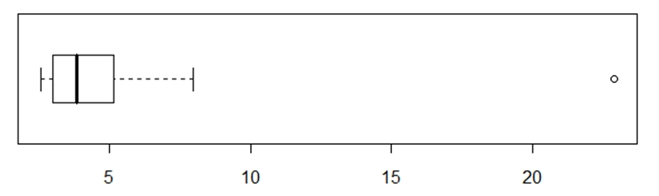{width="90%"}

-   40개 정육점의 하루 쇠고기 판매량 자료의 $Q_1=3.00$, 중앙값은 3.86,
    $Q_3=5.21$. $IQR=5.21-3=2.21$이므로 위 울타리는
    $3.21+1.5\times 2.21=8.53$이고 아래 울타리는
    $3.00-1.5\times 2.21=-0.315$가 됨

-   울타리 안에 포함되지 않는 관찰값 22.88은 특이값으로 판정되며
    최소값은 2.61 최대값은 7.99임

<!-------------------------------------->